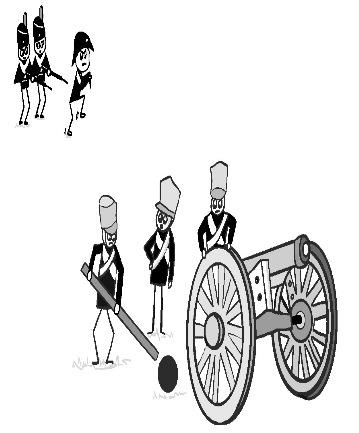
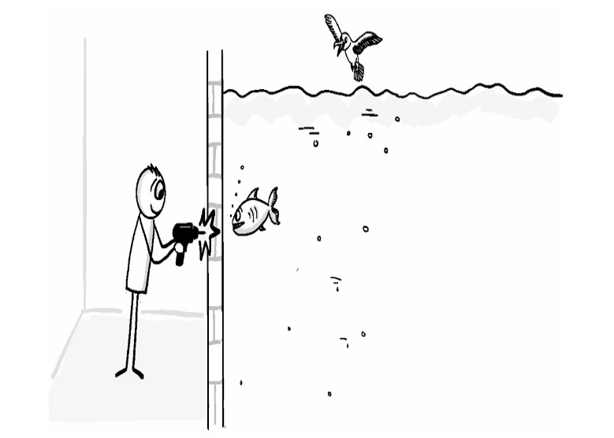
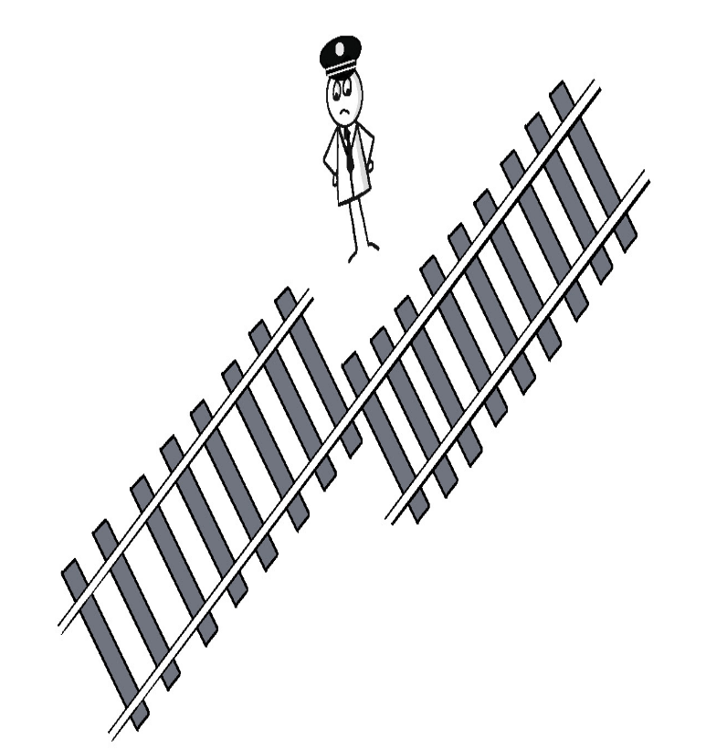
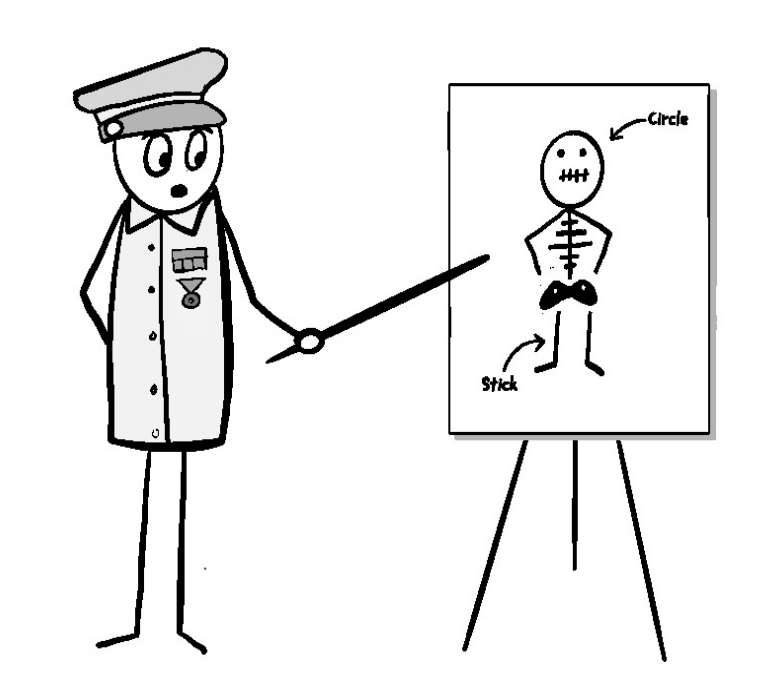
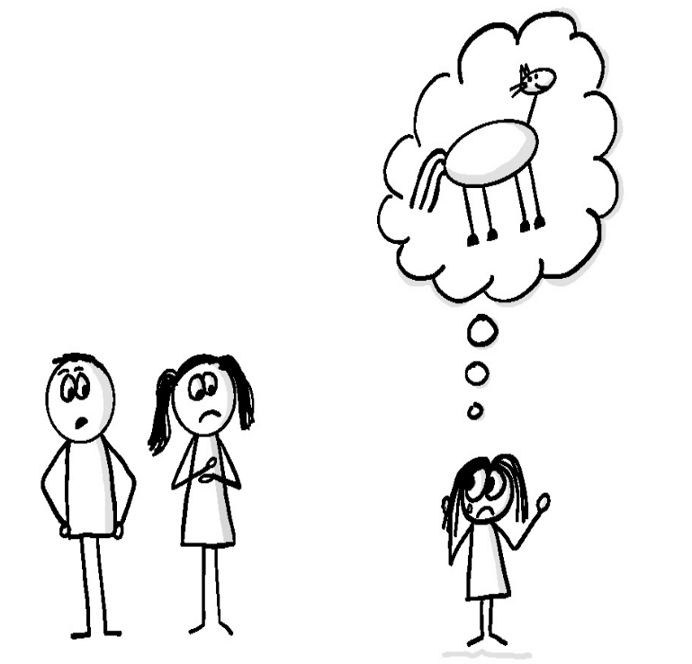
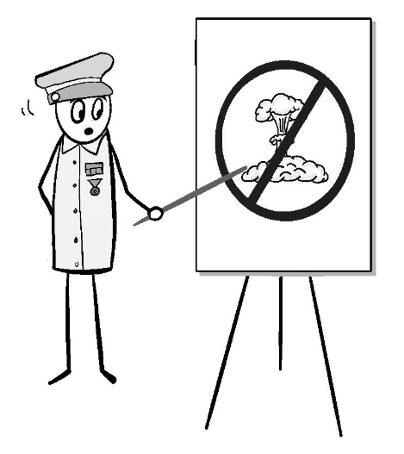
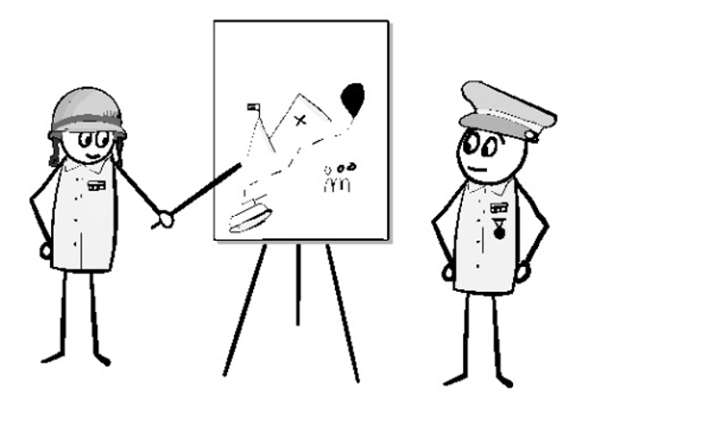
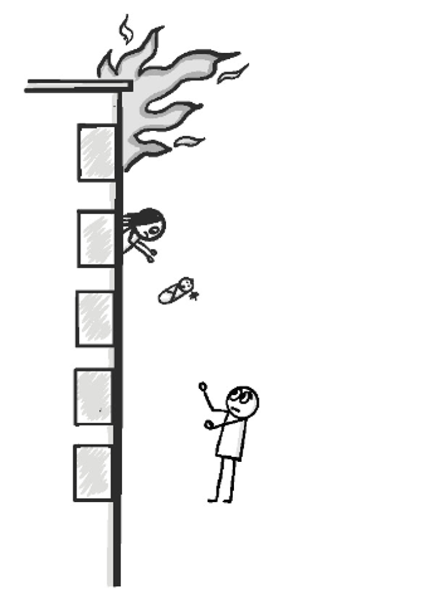
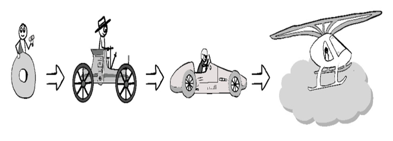

_Превосходство в принятии решений: лучшие решения --- те, которые были приняты 
и_   
_реализованы быстрее, чем противник успеет среагировать, или, в_   
_небоевой ситуации, в темпе, который позволяет сформировать ситуацию или_   
_среагировать на изменения и выполнить миссию_

_Американский объединенный комитет начальников штабов, Совместная концепция 
2020_

Руководить людьми непросто. Хороший лидер должен быть и руководителем, который  
поможет понять, что нужно сделать, и надежной опорой, которая поможет достичь   
успеха как отдельному человеку, так и команде.  
Есть много способов, с помощью которых менеджеры решают проблему лидерства.   
Некоторые стараются вмешиваться как можно меньше, позволяя команде   
самоорганизоваться, и участвуют только в предоставлении обратной связи и   
рекомендаций. Однако большинство управленцев придерживаются более традиционного 
командно-контрольного подхода, определяя роль каждого участника команды и   
контролируя, насколько точно работа выполняется по отношению к стандартам.   
Оба подхода работают достаточно хорошо, когда система поставок предсказуема,   
поскольку так значительно проще в конечном итоге выявить и устранить любые   
проблемы. Когда системы поставок становятся более динамичными и хаотичными,   
эти подходы начинают давать сбой. То, что работало в первую минуту, может резко 
перестать работать уже в следующую, в результате чего менеджеры и люди,   
предпочитающие традиционные методы управления, чувствуют, что теряют контроль,  
или, что еще хуже, настраиваются на неудачу.  
Найти эффективный метод управления, который был бы устойчив к высокой динамике  
и который позволял бы командам учиться и адаптироваться значительно быстрее,   
чем в традиционных управленческих способах, возможно, тем более что такой метод 
используется уже на протяжении сотен лет. Он сфокусирован на намерениях и   
желаемом результате, нежели на проделанной работе и том, как она сделана.  
Этот подход называется децентрализованное командование. Он возник в сфере,   
которая у большинства ассоциируется с нисходящим подходом в армии, и является   
неотъемлемым компонентом для того, чтобы превзойти своего противника в   
цикле НОРД’а Джона Бойда, о котором говорилось   
в Главе 2, <<Как Мы Принимаем Решения.>>

## Происхождение децентрализованного командования

Рисунок 3.1 <<Наполеон никогда не победит нашу превосходящую армию!>>  
Непредсказуемость на поле боя давно является проблемой для армейских командиров.
Хаос войны может не только запросто усложнить или нарушить коммуникацию войск   
с командованием, но и способность командира понять происходящие события на   
достаточном уровне для принятия решений о действиях военных.  
Технологические усовершенствования мало чем помогли. Даже с изобретением   
беспроводных радиостанций и беспилотников время, необходимое для обработки   
и передачи комплексной ситуативной информации с одной стороны, получения,   
восприятия и рассмотрения с другой, а затем принятие решения и его кодификация  
в соответствующие подробные действия, передача ответа и понимание, реализация   
решения --- это слишком долго. Существует слишком много нюансов для передачи   
информации, поэтому даже если бы ее удалось передать, ее количество, скорее   
всего, перегрузило бы центральное командование.  
Все эти трения создают облако неопределенности, которое ставит под угрозу весь  
цикл принятия решений, делая командиров неспособными идти нога в ногу с   
событиями, не позволяя подчиненным, находящимся ближе к действиям, взять на   
себя инициативу и использовать оперативные возможности, доступные им.  
Некоторые военные лидеры, например, Александр Невский и монголы, нашли способы  
преодолеть и использовать хаос как преимущество. В результате они неоднократно  
господствовали на полях сражений, используя быстрые и непредсказуемые изменения,
как оружие победы против превосходящих сил противника.  
Учитывая то, что побеждают в сражениях не физическим уничтожением боевых единиц 
противника, а также зная об описанных выше хитростях, большинство военных   
организаций придерживались традиционных способов организации, жесткой вертикали.
Лишь в XIX веке, после после жестокого поражения прусской армии войсками   
Наполеона, были предприняты серьезные действия по кодификации техник, которые   
использовали Александр Невский и другие военные лидеры. 
 
## Обучение эффективному руководству трудным путем  
В период Наполеоновских войн прусская армия считалась одной из мощнейших в   
Европе. Она была опытнее, больше по численности и имела лучшую оснащенность,   
по сравнению с другими соперниками. Тем не менее прусские войска неоднократно   
проигрывали на поле боя против значительно меньшей и децентрализованной армии   
Наполеона. В сражениях при Йене и Ауэрштедте в 1806 году прусская армия   
превосходила по численности французскую практически в два раза, однако все   
равно была повержена.  
Стало ясно, что традиционная централизованная структура командования и негибкое 
планирование планирование прусских войск негативно влияло на их способность   
эффективно развертывать и руководить войсками на поле боя. От солдат ожидалось, 
что они будут лишь выполнять то, что им было приказано, не проявляя инициативу. 
Но поскольку условия на полях сражения быстро менялись, и у солдат не было   
возможности эффективно передавать точную информацию командирам, чтобы они могли 
понять ситуацию и скорректировать приказы, пруссаков постоянно обходили, и они  
не могли воспользоваться преимуществом в численности.   
Нисходящий подход также полностью пренебрегал навыками и опытом, которые имели  
прусские войска. Это еще больше уменьшало потенциальную эффективность и   
увеличивало время для принятия важных решений в Пруссии.  
Со временем Наполеон осознал, что его успех был обусловлен тактическим   
мастерством, а не свободой, которую имела его армия на поле боя. В результате   
он поддался соблазну традиционного централизованного командования, когда он   
сражался на ледяных полях сражения в России, где от него отвернулась удача.   
Это не осталось незамеченным пруссаками. Признавая, что значительным фактором   
первых успехов Наполеона являлась передача полномочий офицерам непосредственно  
на поле боя, позволявшая быстро адаптироваться к изменяющимся условиям,   
начальник Генерального штаба прусской армии Давид Шарнхорст отметил, что   
Наполеон создал комиссию по реформам, чтобы пересмотреть процесс принятия   
решений по всей цепочке командования. Будущий автор книги <<О войне>> Карл фон  
Клаузевиц участвовал в работе комиссии и ввел понятие <<тумана войны>>, чтобы   
описать, как меняющиеся условия и неполная информация могут повлиять на   
принятие решений.  
Шарнхорст и комиссия решили, что наилучший способ движения вперед --- это 
обучение штабных офицеров действовать решительно и независимо в пылу сражения. 
Вскоре они разработали методы и военные школы, чтобы обучить профессиональный   
офицерский корпус, отобранный исключительно по заслугам. Позднее Гельмут фон   
Мольтке, занявший пост начальника, на основе работы комиссии создал   
основополагающую часть доктрины Auftragstaktik, которую мы называем   
децентрализованное командование.  

## Управление через непредсказуемость  
Лучший способ понять идею децентрализованного командования, а также важность и  
взаимодействие между ее компонентами --- это понять, чем подход к   
непредсказуемости в этом способе отличается от всех остальных.   
Для того чтобы это сделать, давайте начнем с представления потенциальных   
источников непредсказуемости в изначальной системе и того, как другие методы   
пытаются с ними бороться. Такими потенциальными источниками являются пробелы   
в знаниях и неосведомленность, несоответствие и неправильная оценка порядка и   
сложности системы.

## Слабые стороны знаний и осведомленности  

Рисунок 3.2  
Билл еще не знал, что его проект по переделке скоро примет новый оборот.

Не все участники системы поставок, скорее всего, всегда обладают всеми  
соответствующими знаниями и осведомленностью, необходимыми для принятия   
наилучшего решения. Иногда им может не хватать соответствующих навыков и опыта, 
или они могут быть не в курсе некоторых ключевых аспектов динамики и   
взаимозависимости внутри экосистемы, чтобы определить и адекватно разрешить   
ситуацию, в которой они оказались.

Как и большинство централизованных командных структур, большинство подходов к   
управлению пытаются решить эту проблему, пытаясь отделить обязанности по   
принятию решений от обязанностей по выполнению большинства функций.  
от обязанностей по выполнению большинства действий, необходимых для выполнения  
решения. Быть на вершине командной иерархии и равняться на менеджеров других   
функций, предполагается, что менеджеры должны иметь достаточную пропускную   
способность, чтобы понять, что происходит в экосистеме. Это позволяет относиться
к персоналу, как к любому инструменту или материалу, каждый из которых обладает 
известными возможностями и способностями, которые могут применяться менеджерами 
для выполнения определенных задач с использованием утвержденных методов.  
Проблема таких подходов заключается в том, что они в значительной степени   
зависят от менеджеров поддержания достаточной ситуационной осведомленности для  
каждого, при этом отделяя от непосредственного наблюдения за многими деталями,  
которые, вероятно, будут раскрыты которые могут улучшить будущие решения.   
Поскольку экосистемы становятся все более крупными и сложными, способность   
улавливать и оставаться достаточно осведомленным обо всех аспектах  
необходимых для принятия эффективных решений, становится все труднее. Разделение
работы на основе навыков часто усугубляет ситуацию, приводя к фрагментации   
работы между более специализированными командами. В результате, работа, а   
зачастую и вознаграждение и структура вознаграждения и признания за ее   
выполнение, отделяются от цели. Мало того, что это затрудняет достижение   
результата это не только усложняет достижение результата, но и лишает стимула   
делиться информацией, которая может не иметь прямого отношения к работе   
функции, которая ее обнаруживает, но обеспечивает критическое понимание,   
необходимое для достижения целевого результата. Наконец, такие подходы не   
учитывают тот факт, что пользователи и клиенты также являются важными   
участниками экосистемы. Неудача так же вероятна, если пользователи и клиенты   
не знают достаточно о том, как использовать ваши услуги или как они будут   
соответствовать их ожиданиям. Для них решение, которое непростое в   
использовании или кажется неактуальным, может быть хуже, чем отсутствие   
решения вообще.

## Несоответствия

Рисунок 3.3. Несоответствия

Второй источник непредсказуемости вызван несоответствиями. Люди могут  
неправильно понять задачу, которую необходимо выполнить, неправильно оценить,   
что могут сделать другие, неправильно расставить приоритеты или просто забыть   
о задаче полностью или частично. Это может быть вызвано чем угодно от потери или
медленного общения до отсутствия доверия или обязательств.  
Несогласованность действий --- распространенный недуг, настолько 
распространенный, что я потратил много времени на изучение того, как информация 
движется по организации, как с ней ознакомляются и чтобы я помог найти и 
устранить их источники. Это особенно полезно, когда несосытыковки носят 
свойственный  характер или сконцентрированы в определенной части экосистемы. 
Традиционное управление признает проблему и ожидает, что менеджеры будут 
использовать детальные задания и оценки, чтобы найти несоответствия, когда они 
возникают. Этот подход страдает от тех же ограничений, которые создают пробелы 
в знаниях и пробелы в осведомленности. Он также мало что делает для защиты от 
другого   
типа несоответствия --- упущения результата, которого пытается достичь клиент.  
Персонал сосредотачивается на выполнении задач в соответствии со стандартами,   
которые от них требуют, а не на том, приведет ли эта работа к желаемому   
результату. Это оставляет поиски и корректировки на менеджеров,   
многие из которых, будут заняты руководством людьми, из-за этого они могут   
легко упустить из виду или неправильно оценить детали того, что необходимо.   
Кроме того, находясь на расстоянии одного или нескольких шагов от деятельности, 
менеджеры, скорее всего, будут с трудом определять, какие корректировки курса   
необходимы для обеспечения того, что требуется.  

## Неправильная оценка сложности экосистемы
Третий источник непредсказуемости связан с неправильной оценкой динамики

домена вашей действующей экосистема. Как мы рассмотрим в главе 5, "Риск", не все
экосистемы упорядочены и предсказуемы.  
Это создает проблему для традиционных методов управления, которые рассчитаны на 
то, что менеджеры или нанятые ими эксперты смогут определить по происходящему,  
какие действия необходимо предпринять.  
Чем более неупорядоченной является экосистема, тем больше вероятность того, что 
причинно-следственные связи не могут быть определены, в лучшем случае,   
постфактум. Ожидание упорядоченности в вашей система поставок, когда ее нет,   
приводит к неправильной оценке ситуации и в конечном счете, к принятию неверных 
решений. Еще хуже то, что этот же эффект неупорядоченности может также   
затруднить понимание того, почему решение было неправильным, чем затруднит
формирование выводов о том, почему данное решение неправильно.

## Анатомия децентрализованного командования

Рисунок 3.4. “...и это то место, где вы найдете цель нашей миссии.>>  
Клаузевиц и Мольтке собрались вместе и подробно расписали каждую форму   
непредсказуемости. Они знали, что они настолько сроднились с войной, что,   
в лучшем случае, только самое начало военной операции могло было бы быть   
предсказано хоть с какой-то точностью. Однако, они также нашли существующие   
способы минимизировать любые последствия. Некоторые из них, такие как штатные   
поездки и военные игры (также будут затронуты далее в этой главе), прямо   
принадлежат некоторым аспектам. Другие всецело избегают проблем путем   
фундаментальной реструктуризации того, как отдаются приказы.   
Ключом ко всему является осознание того, что независимо от того, было ли   
задание одиночной миссией или общей стратегией победы над врагом, исход задания 
должен оставаться стабильным на всем протяжении. По мнению Мольтке, это значит, 
что цель любого руководителя --- рассказать и объяснить цель перед любым 
заданием   
с подчиненным. Руководитель не должен указывать подчиненным, как конкретно   
выполнять задачи или уточнять какие при этом использовать методы, вместо этого  
необходимо убедиться, что они понимают, как добиться общей цели, и как миссия   
или кампания должны способствовать ее достижению.  
Сосредоточив внимание на общем исходе, а не на конкретных методах, подчиненные  
вольны выбирать наиболее оптимальные варианты и максимально разумные решения в  
любых ситуациях, с которыми они сталкиваются, что сделает лучше его достижение. 
Такой подход принципиально отличается от того, к которому привыкло большинство. 
В обычных организациях результат, который преследуют подчиненные, значит гораздо
меньше, чем делегация задач менеджером.  Децентрализация командования имеет ряд 
важных компонентов, которые должны быть вместе, для того, чтобы это работало.   
Это такие вещи как: замысел командира, брифинги, сплоченность и постоянное   
совершенствование.  
Как мы выяснили, для того, чтобы понять для чего нужен каждый компонент, и как  
они работают вместе, вы должны провести параллель, что многие компоненты имеют  
общие понятия, которые являются основными для Lean и Agile. Эти параллели не  
случайны. Однако, стоит заметить, что многие неудачи на этапе внедрения Lean   
или Agile случаются у организаций только с реализации какой-то части   
компонентов.

## Замысел командира 
Замысел командира --- это то место, где начинается путь составления общей цели. 
Наряду с брифингами, это способ, которым командир или менеджер предоставляет   
подчиненным четко определенную цель, которая формирует опорную точку для   
принятия решения на протяжении любого задания. Это необходимо больше, чем   
простое объяснение подчиненным общей цели. Руководство должно быть уверено,  
что их подчиненные в полной мере понимают, что означают все нюансы, так чтобы   
при любой неудачи они могли бы изменить подход и адаптироваться, чтобы прийти   
к общему результату. На самом деле это гораздо сложнее, чем может показаться.   
Даже когда уровень доверия между руководителями и подчиненными достаточно   
высокий, их взгляды сильно совпадают, остается все еще много мест, где тонкие,  
но важные детали могут быть утеряны. Это серьезная задача, к которой я часто   
призывают всех членов команды, если это возможно, сначала проверьте, достаточно 
ли понятны задачи, запросы или обязанности перед началом работы. Я называю это  
прохождением <<теста пони>>.  

Рисунок 3.5  
<<Если вы хотите иметь пони, это не значит, что он обязан стоять у вас   
в спальне!>>.  
<<Тест пони>> - это быстрая проверка на здравомыслие. Он предназначен для того, 
чтобы выявить, если какая-то важная информация о предназначении рабочего модуля 
упущена или неясна. Название произошло от конкретного управляющего, который,   
как заметил один менеджер, вел себя как ребенок, требующий пони. Этот   
управляющий был известен тем, что регулярно не мог назвать никаких причин,   
кроме <<потому что я так хочу>>, почему были заданы определенные требования, и  
отказывался серьезно относиться к любым последствиям. После одной конкретной   
катастрофы, компания решила, что каждый, кто хочет сделать запрос должен иметь  
значимую цель или причину для этого, рассмотреть все расходы и последствия и   
убедиться, что это не станет бесконечной головной болью. Тест простой и задает  
следующие вопросы:

*   Какой итоговый результат? Чем это отличается от текущей ситуации? 
    Это текущая проблема или необходимо все взвесить, или это будущая 
    проблема или возможность?
*   Существуют ли сроки, в течение которых потребность нужно исполнить? Если это
    так, то почему и что произойдет, если их просрочить?
*   Существуют ли какие-либо приоритеты, о которых нам следует знать, как в 
    рамках предоставления потребности, так и в большем масштабе других 
    обязанностей? Если да, то какие они, и как мы разрешаем конфликты?
*   Существуют ли какие-то ограничения, которые мы должны соблюдать?

  
Что хорошего в тесте пони, так это то, что он работает одинаково хорошо, как для
новых запросов, так и для руководства сортировкой и инцидентами. К примеру,   
один обыкновенный не четко заданный запрос, который задевает DevOps команду -   
это значение <<аптайм>>. Все хотят высокого аптайма, но мало кто удосуживается  
сформулировать, что же это такое на самом деле, почему им это надо, когда им   
это надо, какова относительная ценность различных условий безотказной работы   
или что произойдет, когда они этого не получат. Любой, кто запускал сервисы   
знает, что когда речь идет об аптайме, не всегда, условия или службы равны.   
Никого не волнует, если сервис не работает, когда он никому не нужен, но все   
злятся, когда он падает в ответственный момент. Знание и понимание таких   
нюансов может помочь персоналу принимать более взвешенные решения о том, как   
подходить к проблеме. Столкнувшись с нехваткой времени и ограничением по   
ресурсам, они могут потратить больше времени на разработку и тестирование   
надежности или избыточность в одной области по сравнению с другой или начать   
сортировку более важный данных проблем целостности за место перезагрузки   
сервиса. Поскольку сервисы становятся все более сложными, менеджеры должны   
тратить больше времени, чтобы убедиться, что все нюансы были затронуты и   
поняты всеми.

Понимание желаемого результата имеет решающее значение перед установлением   
целей и мер по достижению результата. Это особенно актуально для сферы   
обслуживания. Поскольку каждая сервисная среда отличается от другой, я   
использую прошлые ошибки радиовещания в качестве примера того, как время   
безотказной работы и доступность могут иметь разное значение в разных условиях. 
Противоречивые определения могут привести к тому, что многие затраты и усилия   
окажутся напрасными. Например, никого не волнует, транслируют ли камеры игровое 
поле на стадионе, если там не происходит ничего интересного. Однако люди   
приходят в ярость, когда происходит что-то интересное, а трансляция недоступна. 
Именно это произошло 17 ноября 1968 года. "Окленд Рэйдерс" играли со своим   
тогдашним соперником "Нью-Йорк Джетс" в матче Американской футбольной лиги.   
Когда до конца игры оставалось чуть больше минуты, "Джетс" выигрывали со счетом 
32-29. Игра затянулась из-за штрафов и грозила вторгнуться в прайм-тайм   
программы телеканала NBC, который транслировал игру. NBC, видя потенциальный   
конфликт и полагая, что у "Рейдерс" не было шансов вернуться, решил прервать   
игру незадолго до конца, чтобы транслировать детский фильм "Хайди".   
Мало кто из NBC знал, что они только что прервали трансляцию одного из самых   
захватывающих возвращений в спорте. Рейдерам удалось забить два тачдауна и   
победить со счетом 43-32. Фанаты были в ярости, и вскоре после этой неудачной   
трансляции Национальная футбольная лига внесла пункт в свои телевизионные   
контракты, который гарантировал, что все будущие игры будут транслироваться   
в полном объеме.  
Для того чтобы намерение руководителя было понято и реализовано, Мольтке   
и другие разработали средство для его передачи, которое отвечает на те же   
вопросы, что и наш пони тест. Это называется брифинг. Как вы увидите далее,   
его можно в значительной степени подстроить под наши потребности. 
 
## Обобщение 
Для того чтобы подчиненные могли свободно определять, как они собираются достичь
намеченного результата, приказы должны быть меньше похожи на инструкции, о   
которых думает большинство людей, а больше напоминать описание того, что   
означает желаемый результат и почему он должен быть достигнут. Это описание   
должно быть сбалансированным, чтобы направлять подчиненных к намеченному   
результату, но не настолько подробным и предписывающим, чтобы препятствовать   
творчеству и инициативе, которые могут понадобиться для его достижения.  
Вместо того чтобы называть их "приказами", которые у большинства ассоциируются  
со списком того, что делать, их часто называют "директивами". Для того чтобы   
эффективно отразить стратегическое намерение, директивы руководителя, как   
правило, следуют определенной схеме, состоящей из четырех или пяти коротких   
элементов, описанных в следующих разделах.  

## Анализ ситуации 
Анализ ситуации - это краткое описание текущего положения дел. Он необходим,  
чтобы внести ясность в происходящее, и определить план дальнейших действий.  
В ИТ-среде такой обзор может звучать так: "Наш бизнес стремится увеличить число 
клиентов, постоянно увеличивая нагрузку на наши системы. Сейчас мы находимся на 
той стадии, когда в периоды высокой нагрузки производительность сервиса,   
определяемая разумной отзывчивостью без тайм-аутов и ошибок, угрожает упасть   
ниже того уровня, на который рассчитывают клиенты".  
Анализ ситуации - это своего рода отправная точка. Если подчиненные еще не   
знакомы с ситуацией, вполне вероятно, что им потребуется получить дополнительную
информацию, прежде чем пытаться предложить решение, направленное на достижение  
целевого результата.  

## Постановка желаемого результата или общая цель миссии  
На следующем этапе руководитель или менеджер раскрывает основную цель, которая  
должна быть достигнута, и поясняет что за этим стоит. Это не какое-то   
абстрактное представление, а что-то, что определяет осмысленную цель и что   
позволяет предпринять краткосрочные действия для ее достижения. Оно часто   
включает ответы на вопросы "Кто?", "Что?", <<Когда?>>, <<Где?>> и <<Почему?>>, 
но избегает уточнения <<Как?>>. Это и есть информация, необходимая для ответа на
первый вопрос <<теста пони>>.   
Если придерживаться предыдущего примера, то это может звучать так:   
"Нам необходимо обеспечить производительность производственных услуг,   
соответствующую ожиданиям клиентов. Это необходимо сделать для того,   
чтобы сохранить их доверие, а также для того, чтобы мы могли завоевать   
большую долю рынка".

## Приоритеты выполнения
Где бы мы ни находились --- на поле боя или в офисе, --- редко бывает так, что 
мы предоставляем каждый аспект услуги в одиночку, в вакууме. Нам неизбежно
приходится координировать свои действия с другими людьми и обращаться к ним за
помощью. Лидеру необходимо помочь подчиненному осознать темы и приоритеты
деятельности таких групп. Лидер может предложить обратиться к определенным
группам или отдельным людям, чтобы помочь подчиненному принять ключевые решения
для наилучшего достижения запланированного конечного результата.

В нашем примере лидер может заявить: <<Нам нужно, чтобы ваша команда разработала
наиболее целесообразный и эффективный способ, который позволит нам без проблем
достичь этой цели. Маркетинг хочет организовать кампанию, которая, в случае
успеха, может привести к значительному увеличению нашей клиентской базы. Они
планируют нацелиться на компании среднего уровня, которым могут быть полезны
определенные аспекты наших услуг. Джейн из отдела маркетинга может поработать с
вами над деталями и передать их своей команде, если им понадобится внести
какие-либо коррективы на основе вашей работы. Мы также находимся в середине
процесса продления контракта с нашим самым важным клиентом, который выразил
обеспокоенность по поводу нашей способности к масштабированию. Джо из отдела
продаж готов чтобы помочь. Если не считать триажной поддержки, это самый
приоритетный пункт технического отдела. CEO и совет директоров поддерживают
инвестирование, но им необходимо понять, что это может повлечь за собой и как
это может отразиться на наших капитальных затратах и способности выполнять
другие проекты>>.

## Антицели и Ограничения

Рисунок 3.6 <<Нет, мы не можем начать реальную катастрофу для проверки наших
DR-процессов!>>

Редко бывает, что миссия или деятельность не имеет границ или ограничений.
Иногда они обусловлены предстоящими событиями, о которых подчиненные могут быть
не полностью осведомлены, или ограничениями во времени или ресурсах, которые
необходимо учитывать при принятии будущих решений. Аналогично, антицели --- это
явные пункты, которые не могут быть разрешены. Это помогает уточнить рамки
доступных действий.

Чтобы завершить наш пример, давайте посмотрим, какие ограничения установил наш
<<командир>>: <<Мы знаем, что некоторые клиенты находятся в критической точке
своего делового цикла, когда в течение следующего месяца они особенно
чувствительны к любым перерывам в доступности наших услуг. Серьезные перебои
могут не только привести к потере клиентов, но и нанести серьезный ущерб нашей
репутации. Это может вынудить нас уйти с этого рынка и сократить наши планы
роста. Ваша команда должна искать пути минимизации воздействия на клиентов. Мы
также знаем, что команда бизнес-аналитики работает над улучшением аналитики
в режиме реального времени, что может включать в себя некоторые из тех же
систем, на которые вы, возможно, решите обратить внимание. Они должны быть в
курсе любых потенциальных изменений в своей области. И наконец, любые улучшения
абсолютно не могут каким-либо образом повлиять на безопасность нашего
производства>>. 

На протяжении всего инструктажа подчиненный должен задавать вопросы, оспаривать
детали и указывать на любую потенциально ошибочную информацию. Это делается не
для того, чтобы оспорить возможности или авторитет руководителя, а для того,
чтобы помочь прояснить ситуацию и убедиться, что подчиненный полностью понимает
и имеет все необходимое, чтобы не потерять ориентацию на результат. Как мы все
знаем, все, что может быть неправильно понято, часто так и будет.

## Обратный брифинг

Рисунок 3.7 <<Нет, мы не можем начать реальную катастрофу для проверки наших 
DR-процессов!>>

Руководителю или командиру никогда не достаточно краткой информации, чтобы быть
уверенным в том, что подчиненные полностью понимают и имеют то, что им
необходимо для реализации замысла директивы командира. Именно поэтому от
подчиненных ожидается, что после брифинга по директиве они проведут так
называемый обратный брифинг.

Цель такого брифинга не в том, чтобы предоставить типичный подробный план. Это
возможность для подчиненных получить ответы на все важные вопросы, которые у них
могут возникнуть в связи с директивой, а также продемонстрировать, что они
понимают ее основной замысел, свою роль в ее достижении и связь между своей
миссией и миссией других людей, которые могут быть вовлечены в процесс. Таким
образом, он действует как быстрая проверка для устранения любой двусмысленности
или недопонимания.

Обратный брифинг также служит проверкой, помогающей лидеру получить
дополнительную ясность в отношении последствий его собственных директив.
Находясь ближе к деталям, подчиненные имеют более детальное представление о
потенциальных рисках и потребностях, которые могут поставить под угрозу успех
миссии. Не исключено, что эти детали могут привести к изменению или полной
отмене директивы.

Обратные брифинги также позволяют подчиненным, находящимся в разных рабочих
зонах, сравнить записи и обеспечить согласованность действий в рамках
организации. Это может еще больше улучшить понимание ситуации и точность
принятия решений.

Обратные брифинги проводятся относительно скоро после принятия первоначальной
директивы. Для небольших и хорошо понятных директив они могут проводиться
параллельно с брифингом. Однако я считаю, что очень полезно дать подчиненным
время подумать над директивой, провести краткую проверку некоторых важных
аспектов и составить примерную схему подхода. Для задач, выполняемых одним
человеком или командой, это может быть как несколько часов, так и несколько
дней. Такое исследование обычно проводится как всплеск в рамках недельного
цикла. Для более крупных инициатив, а также в тех случаях, когда у подчиненных
есть свои собственные команды и сотрудники, скорее всего, потребуется больше
времени для того, чтобы команды могли пройти инструктаж и скоординироваться друг
с другом для проведения содержательного обратного инструктажа.

В нашем предыдущем примере подчиненный может вернуться с информацией о недавнем
снижении производительности, которая указывает на потенциальные узкие места в
базе данных и структурах данных. Работа в этой области может быть особенно
рискованной. Изменения схемы данных также могут повлиять на работу, выполняемую
командой БА, а также могут оказать непредвиденное влияние на потенциальные
усилия по интеграции с внешним инструментом, которые уже обсуждались.
Подчиненный также может вернуться с данными, показывающими, что увеличение
нагрузки не было результатом дополнительных клиентов, а из-за необъяснимых
изменений в том, как один конкретный клиент пользуется услугой.

--------------------------------------------------------------
## Einheit: Сила взаимного доверия

Рисунок 3.8 <<Доверие делает нас сильнее>>

Чтобы хорошо работать, командованию миссии нужно нечто большее, чем просто
рассуждения о результатах и намерениях любой деятельности. Также должен быть
определенный уровень взаимного доверия между лидером и подчиненными. Лидер
должен быть уверен, что подчиненные поймут и выполнят желаемое, в то время как
подчиненные должны верить, что их поддержат при осуществлении их инициативы. Без
этого поток информации и общая осведомленность пойдут на убыль в тот самый
момент, когда они больше всего необходимы: когда условия приводят к принятию
решений и планы пошли наперекосяк. Даже намек на потерю поддержки или навлекание
на себя вины может привести к тому, что люди станут скрывать важные, но
потенциально смущающие детали, почувствуют, что им мешают задавать необходимые
уточняющие вопросы, и почувствуют, что не могут или не желают обратиться за
помощью.

Пруссаки заметили, что доверие и приверженность общему делу были главным 
фактором, повышавшим сплоченность и боеспособность армии Наполеона. Ранние 
реформы Шарнхорста помогли привести в действие ряд ключевых факторов, которые 
Мольтке позже сделал частью структуры командования миссиями в прусской армии. 
Она стала известна как Einheit, что в переводе с немецкого примерно означает 
“единство”.
Несмотря на то, что термин Einheit является иностранным для людей, не говорящих
по-немецки, он является полезным способом описания динамики, которая создает 
сплоченность команды. Мало того, что у него гораздо меньше багажа, чем у часто 
употребляемого слова “доверие”, оно также выражает два других важных фактора 
доверия, которые так часто упускаются из виду. Одна из них --- это идея 
формирования общей приверженности достижению цели. Другой --- это личная 
проницательность, взаимопонимание и взаимопонимание, которые члены команды 
испытывают друг к другу.

Общая приверженность цели означает, что никому не нужно беспокоиться о том, что 
какая-то скрытая повестка дня или скрытые мотивы могут помешать достижению 
заявленного результата. Каждый может быть уверен, что заявленные целевые 
результаты являются главной целью, которая имеет значение, и ни один 
руководитель или подчиненный не собирается действовать таким образом, 
чтобы подорвать усилия по их достижению.
Знакомство и обмен опытом между членами команды --- еще одна важная часть 
Einheit, которая также может значительно помочь в согласовании действий. 
Чем больше вы знаете сильные и слабые стороны друг друга, способы общения 
друг с другом и то, как каждый из вас будет обдумывать проблемы, подходить к ним
и решать их, тем более слаженно вы сможете работать вместе для достижения цели.

Хорошее знакомство с членами команды может помочь заполнить любые пробелы в 
ситуационной осведомленности, необходимые для принятия правильного решения. 
Например, вы могли бы подойти к обсуждению темы по-другому, если знаете, что это
поможет вашему товарищу по команде или менеджеру лучше понять ее. Вы могли бы 
обратиться за помощью или укрепить свои знания к кому-то, кто силен в области, 
в которой вы слабее. Возможно, вы даже захотите поделиться своими собственными 
знаниями в области, с которой другие незнакомы. Все это может помочь вам и 
вашей команде работать более эффективно.

Люди, которые работали в сплоченной команде, знают, что нет лучшего способа 
создать дополнительный уровень общего контекста, чем тратить время на создание 
общего опыта, а вместе с ним и доверия внутри команд и между ними. Мольтке 
думал, что его войска осознают важность общего контекста и доверяют самим себе. 
Оттуда он показал им, что этот уровень взаимопонимания придает их собственной 
интуиции дополнительный уровень точности, на который они затем могут положиться.
Это означает, что они могли бы снизить уровень путаницы и несоосности, которые 
в противном случае могли бы привести к неточным и противоречивые выводы. 
Поскольку все принимали участие, это “посещение и наблюдение” обеспечило 
гораздо более высокий уровень ситуационной осведомленности во всей организации.

Регулярное взаимодействие и взаимное доверие имели дополнительное преимущество, 
способствуя развитию неявной коммуникации между членами команды. Подумайте о 
члене семьи или о ком-то, с кем вы были близки долгое время. Если вы знаете их 
достаточно долго, вы часто можете получить четкое представление о состоянии 
ситуации по немногим большему, чем язык тела или тон их голоса, даже без того, 
чтобы вам прямо рассказали о ее деталях. Неявное общение и взаимный опыт могут 
обеспечить быстрое и точное распространение информации. Тонкий различия, от тона
голоса до незначительного изменения в том, как кто-то ведет себя, могут 
передавать большие объемы информации очень быстро и точно.

Прусские командиры проводили много времени в полевых условиях, тесно сотрудничая
со своими подчиненными, изучая нюансы и возможности друг друга в рамках 
коллективного подразделения по мере взаимодействия в окружающей среде.  
Интуитивное понимание, приобретенное сотрудниками, дало им возможность 
действовать быстро и в унисон, практически не вступая в дискуссии.

Это неявное знание значительно улучшает ситуационную осведомленность. Это также 
повышает адекватность реагирования на обостряющиеся ситуации. Она была настолько
 эффективной , что после объединения Германии в 1871 году была интегрирована в 
 более широкую немецкую военную систему.

По-немецки такое осознание называется Fingerspitzengefühl, что означает 
<<ощущение кончиком пальца>>. Концептуально это похоже на английские поговорки 
типа <<держать руку на пульсе>>.

Как выяснил Джон Бойд в своих интервью с бывшими немецкими офицерами, 
Фингерспиценгефюль был в центре успехов немецких вооруженных сил во время 
Второй мировой войны. Это позволяло солдатам и офицерам быстро устанавливать 
важные и значимые взаимосвязи между разрозненными фрагментами информации по мере
их поступления. Их общий опыт помог им интуитивно понять, как реагировать, даже
когда полученная информация была неполной. Офицеры смогли создать мысленную 
карту поля боя, что позволило им постоянно оставаться сориентированными и 
реагировать быстро и решительно.

Многие, кто изучал Toyota, вероятно, также сталкивались с подобными дискуссиями 
о важности формирования интуитивных знаний и доверия внутри организации. 
Некоторые в Toyota сравнивают это с тем, как когда-то практиковались самураи, 
пока их длинные мечи не стали продолжением их рук. Таким же образом отдельные 
сотрудники организации могут устанавливать одинаковые связи, чтобы работать как 
единое целое.

--------------------------------------------------------------
## Создание Einheit в DevOps 
Как ИТ-руководитель, я трачу много времени и усилий на то, чтобы укоренить
чувство einheit во всей организации. Я считаю, что это начинается с того, что я
провожу время с командами, когда они выполняют свою повседневную работу. Я
наблюдаю за тем, как происходит общение между между членами команды и как они
делятся новыми идеями и открытиями. Я смотрю на то, как информация течет между
командами и организацией в целом, чтобы увидеть, где она теряется теряется,
искажается или просто замедляется. Это все места, где einheit скорее всего,
отсутствует.

Я рекомендую командам регулярно устраивать командные обеды и прогулки. Я 
также использую регулярные точки
синхронизации, которые обсуждаются в Главе 14 <<Циклы и точки синхронизации>>. Я
считаю, что количество внимания и ценность уделяется ретроспективам и
стратегическим обзорам как членами команды, так и менеджеры могут определить,
насколько сильно будет развиваться einheit команды. Когда ретроспективы и 
стратегические
обзоры воспринимаются серьезно и рассматриваются как ценность, приверженность
команды будет расти. Люди обращают внимание, когда когда есть целевые инвестиции
в помощь команде в ее совершенствовании.

Роль мастера очереди, как обсуждается в Главе 13, "Мастер очереди", также может
помочь создать ощущение <<единства>>, особенно когда те, кто выполняет эту роль
осознают, что они здесь для того, чтобы искать закономерности и помогать
направлять команду к успеху. Сама роль обычно открывает глаза,
позволяя людям сделать шаг назад и посмотреть на динамику в команде. В паре с
ретроспективами, она может стать мощным мотиватором для поощрения
сотрудничества.

Einheit может создаваться как между командами, так и между географически
распределенными членами команды. Когда я сталкиваюсь с проблемами координации в
таких ситуациях, я ищу возможности поощрять членов команды проводить
качественное время лицом к лицу со своими коллегами в их собственном окружении.
Это помогает людям понять друг друга и установить взаимопонимание, которое
создает атмосферу единства. При правильном подходе я убеждаюсь, что когда люди
действительно узнают друг друга, любые затраты с лихвой окупаются за счет
снижения организационных трений и ошибок.

Последний аспект, от которого я пытаюсь избавить организацию, --- это идея о
том, что должен быть кто-то кто виноват в ошибке или негативном событии. Этого
всегда трудно добиться. У большинства людей есть естественная тенденция искать
вину в чьих-то и одновременно избегать вины в своих действиях. Негативные
события как правило, вызваны потерей ситуационной осведомленности, и если кого и
<<винить>>, то систему, которая позволила этому произойти, а не людей в ней.
Негативные события редко происходят потому, что кто-то хотел, чтобы они
произошли. Найти причину неудачи, узнать, почему это произошло, и найти способ
предотвращения повторения этого события, при этом не возлагая вину на человека 
или людей, которые были в этом замешаны, --- все
это поможет улучшить доверие в коллективе.

## Постоянное совершенствование

Рисунок 3.9 Постоянное совершенствование.

Наличие автономии для адаптации к непредсказуемости работает только при наличии 
культуры, которая готова и способна открывать и внедрять новые знания и
подходы для лучшего достижения целевого результата. Такой тип культуры
удивительно редко встречается, и не потому, что люди не хотят улучшению своих
способностей и знаний. Одна из причин, рассматривается в Главе 7, "Обучение",
кроется в том, как многие из нас подходят к процессу обучения, предполагая, что
обучение идет сверху вниз и что существует одна абсолютная истина для всего и
что она не меняется. Другая причина кроется в том, насколько люди чувствуют себя
неспособными объективно оспаривать принятые нормы и убеждения в погоне за
целевым результатом.

Оспаривание статуса-кво, будь то попытка подтвердить предположения или поиск
решений, которые лучше или эффективнее, чем существующие излюбленные подходы,
никогда не бывает легким. Во-первых, статус-кво привычен и общепризнан как
<<достаточно хороший>> для выполнения работы. В отличие от новых подходов,
излюбленные подходы нуждаются в небольшом обосновании для использования. Это
справедливо даже тогда, когда известно, что привычное предположение или метод
имеют существенные недостатки, которые подрывают их пригодность.

Необходимость оправдывать любые новые исследования или идеи --- это то, где
энтузиазм к обучению и совершенствованию так часто дает сбой. Пробовать что-то
новое, инновационное или нетрадиционное --- рискованно, особенно если в
организации существует низкая терпимость к ошибкам. Неудача и в лучшие времена
не приносит удовольствия, но она может быть разрушительной, если она ставит под
угрозу вашу работу. Помимо негативного влияния на желание кого-лиюо
экспериментировать, нетерпимость к ошибкам также может заставить людей скрывать
важную информацию, которая необходима для ситуативного осознания ситуации и ее
улучшения. Это верно даже в тех случаях, когда организация пропагандирует
постоянное совершенствование. Без явного прикрытия и поддержки со стороны
руководства мало кто чувствует себя достаточно безопасно на своих двоих, чтобы
рисковать быть обвиненным или, что еще хуже, быть виновным в каком-либо промахе.

Существует множество примеров такой тенденции <<играть в безопасность>> во всей
ИТ-сфере, будь то отставание и дисфункция в совершенствовании методов 
планирования и управления проектом, о проблематичных
вскрытиях, структурированных для того, чтобы возложить вину на человека или
команду, или о том, как новые технологии и методы с трудом внедряются и
эффективно используются. Один из примеров, который регулярно упускается из виду,
но особенно актуален для DevOps --- это путь к модернизации установки
программного обеспечения и управления конфигурацией.

Несмотря на то, что ручная установка и настройка программного обеспечения
отнимает много людей и чревато ошибками, ИТ-команды уже давно считают это
совершенно нормальным. В те времена, когда было всего несколько систем, которые 
нужно было
установить и настроить, вряд ли стоило тратить время на создание надежной,
контролируемой ревизиями автоматизированной системы обеспечения, которая могла
бы авторитетно сообщать о текущем состоянии узла конфигурации. 
Но даже когда количество установок и сложность конфигурации
увеличились, что оправдывает развертывание таких
инструментов и вспомогательных процессов, многие ИТ-команды по-прежнему не хотят
их использовать, несмотря на их реальные преимущества. Когда это
все же происходит, инициатива обычно осуществляется под руководством,
как правило. либо с поставщиком, который может взять вину на себя,
либо с внутренним спонсором, который который готов взять на себя политический
риск.

Джон Бойд, Гельмут фон Мольтке и другие поняли, что неустанное оспаривание
обоснованности наших предположений и подходов, необходимых для постоянного
совершенствования, имеет решающее значение для успеха. В своей работе 1976 года
"Разрушение и созидание[^1]" Бойд заявил, что для того, чтобы формировать и
быть сформированными нашей изменяющейся окружающей средой, мы должны постоянно
разрушать и создавать заново ментальные модели, которые мы разрабатываем, чтобы
понять и справиться с ней. Только благодаря постоянному обучению и
совершенствованию мы можем приспособиться к этим изменениям, чтобы "улучшить
нашу способность к независимым действиям".[^2]

[^1]: <<Destruction_and_creation>>, Джон Бойд,
http://pogoarchives.org/m/dni/john_boyd_compendium/destruction_and_creation.pdf

[^2]: Бойд, Джон, "Разрушение и созидание", стр. 1

Мольтке также понимал, что наказание за один случай неверного суждения погубит
все попытки поощрить инициативу. Он проявлял известную терпимость к ошибкам. Он
считал, что до тех пор, пока намерения командира признаются и понимаются,
ошибки, допущенные при достижении цели, должны быть приняты и рассматриваться
как повод для обучения и совершенствования. Он инструктировал вышестоящих
офицеров воздерживаться от наказания или жесткой критики ошибок, а вместо этого
хвалить инициативу и исправлять войска таким образом, чтобы они учились.

И Бойд, и Мольтке также знали, что обучение и совершенствование требуют быстрой
и регулярной обратной связи для того, чтобы улучшить понимание экосистемы и
создать общий объем знаний, который можно использовать в будущем. Наиболее 
ценная обратная связь часто приходит от раскрытия того, что пошло не
так, и любая вина или упрек только подтолкнет людей к сокрытию этой ценной
информации.

Со временем появились две техники, позволяющие улучшить экспериментирование и
рефлексию, которые возникли на основе идей Бойда и Мольтке. Они были широко 
приняты рядом
западных вооруженных сил и имеют аналоги как в бережливом производстве, таких 
как в Lean производстве, так и в Agile-методологиях,
таких как Scrum. В армии они называются <<штабными поездками>> и <<обзорами 
после действий>>. Цель каждого из них важна для ИТ-организаций, так как она 
часто теряется в их ИТ-эквивалентах.

## Поездки сотрудников
Как и большинство военных командиров, Мольтке заставлял свои войска регулярно
тренироваться. Отличие Мольтке заключалось в том, что он был менее заинтересован
в критике того, насколько хорошо войска маршируют в строю или насколько точно
они выполняют приказы. Он был больше заинтересован в том, чтобы заставить их
думать о том, как использовать свои возможности для успешной навигации в
динамичной экосистеме. Он делал это с помощью соревновательных военных игр.
Самой инновационной из них были его штабные выезды. 

Штабная поездка начиналась с того, что Мольтке отправлял избранных офицеров в
район, где могло произойти важное военное событие, например, сражение или
крупное развертывание. Используя новейшие топографические карты и данные военной
разведки, он создавал гипотетические сценарии и ситуации "что если", которые
должны были проработать его офицеры. Чтобы придать им реальность, иногда поездки
сочетались с практическими маневрами с участием войск и вооружения.

Эти поездки проверяли способность сотрудников воспринимать информацию об
окружающей обстановке и выстраивать действия исходя из этого контекста.
Непредсказуемость и изменчивость военных действий означали, что офицерам
приходилось думать на ходу и импровизировать. Они узнали, что успех сопутствует
не той команде, которая выполняет приказ в точном соответствии с предписаниями,
а той, которая достигла желаемого результата.
Это также суть искусства учиться думать.

Участие не закончилось после окончания акции. После тяжелого дня в поле, Мольтке
садился со своими солдатами и настаивал на том, чтобы они проанализировали день,
проанализировали произошедшее и нашли способы использовать то, чему они 
научились. Это сочетание
стратегии, практики и анализа в реальной обстановке помогало его офицерам
лучше думать о том, как лучше достичь результата.

Хаос-инженерия превратилась в одну из форм ИТ-эквивалента штабной прогулки.
Активно создавая реальные сценарии неудач, которые техническому персоналу
приходится преодолевать в своем коде и вспомогательных системах, они начинают
мыслить шире идеализированного <<счастливого пути>>. Со своими командами я 
обычно
иду гораздо дальше, <<разыгрывая>> сценарии, чтобы заставить всю команду вместе
рационально подумать над различными проблемами. Такая военная игра может быть
либо бумажным упражнением, либо, что предпочтительнее, включать в себя реальные
действия, предпринимаемые в условиях военной игры. В других случаях это может
быть просто прохождение через прошлое событие, но в контексте текущей или
будущей конфигурации экосистемы, или каком-то гипотетическом сценарии, по
которому могут развиваться условия бизнеса или рынка. Я использую такие
возможности, как планирование новых инициатив, стратегические обзоры и аудиты,
которые естественным образом собирают команду вместе, чтобы минимизировать сбои
и отвлекающие факторы.

Большинство команд поначалу скептически относятся к ценности таких мероприятий,
упуская из виду, что основное внимание уделяется не тому, как, а тому, почему
они будут действовать определенным образом в конкретном сценарии. Часто люди с
удивлением обнаруживают, что их предположения ошибочны, или что может быть
гораздо более простое или элегантное решение. Все учатся на этом пути, и это
отличный способ побудить людей задуматься о том, как оттачивать и
совершенствовать свои навыки.

## Послеоперационные обзоры
Анализ и размышления были перенесены непосредственно на поле боя во время Второй
мировой войны, во время которой был разработан анализ последующих
действий, или дебрифинг. Непосредственно после действий, выжившие были собраны
вместе с технической информацией связанной с событием. Цель обзора заключается в
том, чтобы помочь командам размышлять и постоянно учиться на своем опыте. Важно
отметить, что ранги намеренно откладываются в сторону, чтобы обеспечить
откровенное обсуждение. 

Американские военные обнаружили ряд преимуществ послебоевого анализа. Во-первых,
они позволили командам работать вместе, чтобы лучше понять и извлечь уроки из
действий. Каждый человек несет в себе частичку того, что произошло,
из своего личного опыта, но редко у кого была полная картина.
Возможность проанализировать и осмыслить происходящее помогло командам понять
смысл произошедшего и сделать опыт осмысленным. Они обнаружили, что это повышает
боеготовность подразделения и укрепляет сплоченность. Это также способствовало
расширению знаний военнослужащих, помогая в будущих действиях.

В ИТ ретроспективы должны играть очень похожую роль, что и анализ результатов
работы. Они должны поощрять открытое и откровенное обсуждение, помогая команде
размышлять и учиться.

## Организационные последствия командования миссией
Подход Командования Миссии значительно отличается от того, к чему люди привыкли.
Он требует как более независимого, так и более
целостного мышления от сотрудников, что создает большую общую ответственность за
целевые результаты, а также более глубокого осознания взаимозависимости
и необходимости согласованности между командами на уровне отдельных 
исполнителей.
При правильном подходе это в значительной степени помогает командам
минимизировать источники трений при принятии решений, которые делают эффективную
работу в непредсказуемой экосистеме. 

Мольтке сделал получение такого осознания гораздо более явным. Он требовал,
чтобы каждый подчиненный должен быть обучен эффективному функционированию на
двух уровнях командования выше его назначения. Это не означает, что они должны
были обладать множеством дополнительных навыков и сертификатов, чтобы быть в
состоянии выполнять свою работу. Это непрактично. Цель состояла в том, чтобы
привить им навыки, позволяющие думать о более широкой картине системы, в которой
они работают. 

Практики Lean называют это <<системным мышлением>>. Некоторые ИТ-специалисты,
особенно те, кто давно работает в этой отрасли, помнят, когда существовала
необходимость глубокого понимания динамики и взаимодействий между сложными
экосистемами ИТ. В те времена такое умение иногда называли 
<<системной инженерией>>.

Такое системное мышление становится все более важным в мире предоставления
услуг, где компоненты услуг и потребители услуг могут быть как многочисленными,
так и разнообразными. Убедившись, что замысел и все необходимые ограничения ясны
и понятны, при этом гарантируя, что в потоке информации о текущих условиях не
будет виноватых, то команды могут принимать необходимые решения и улучшения для
достижения целевых результатов.

## Подведение итогов
Команды, которым сообщают желаемый результат, гораздо эффективнее тех, которым
говорят, какие действия они должны выполнить, поскольку это позволяет командам
быстро и самостоятельно адаптироваться к ранее неизвестным или меняющимся
условиям. Брифинги и обратные брифинги --- это механизмы, которые возникли в
прусской армии и были позже адаптированы в гражданском мире. Они могут помочь
лидерам и сотрудникам согласовать намеченные результаты, любые ограничения на
выполнение, которые необходимо соблюдать, а также ресурсы и поддержку, которые
могут понадобиться команде при их достижении. 

Для того чтобы эта система работала, необходимо взаимное доверие внутри команды
и между командой и руководством. Члены команды также должны поощряться к тесно
сотрудничать друг с другом, чтобы уменьшить трудности в общении и улучшить общую
понимание ситуации. Если все сделано правильно, устанавливается единство,
позволяющее команде работать слаженно, как единое целое, с минимальными
перекосами и конфликтами.

