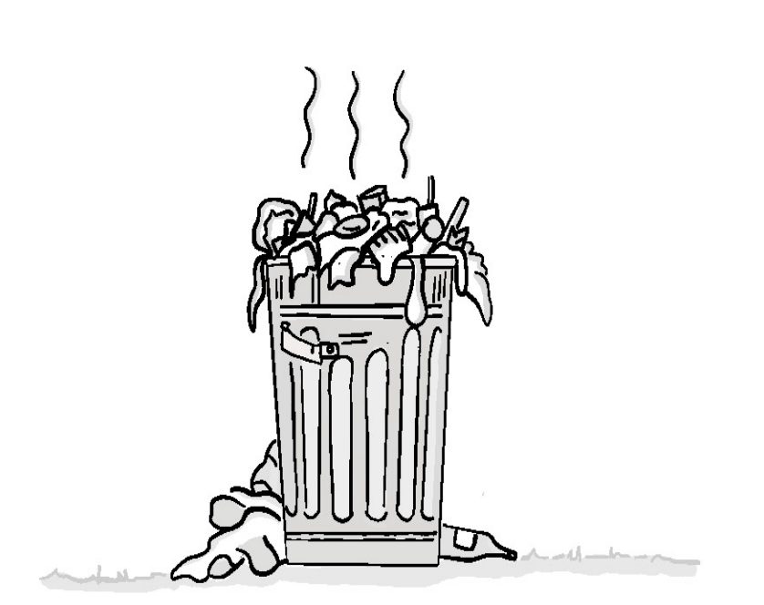
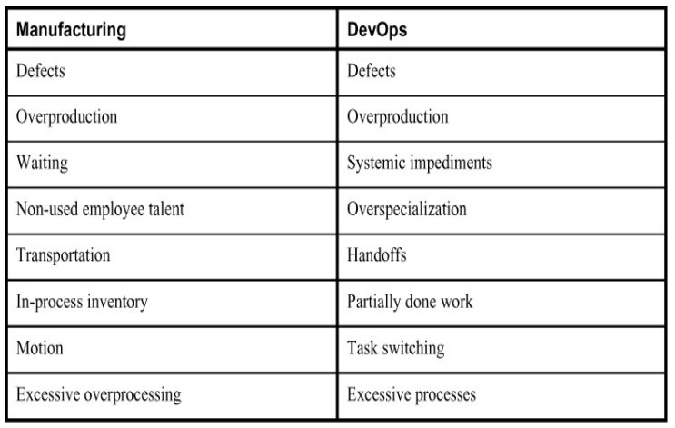
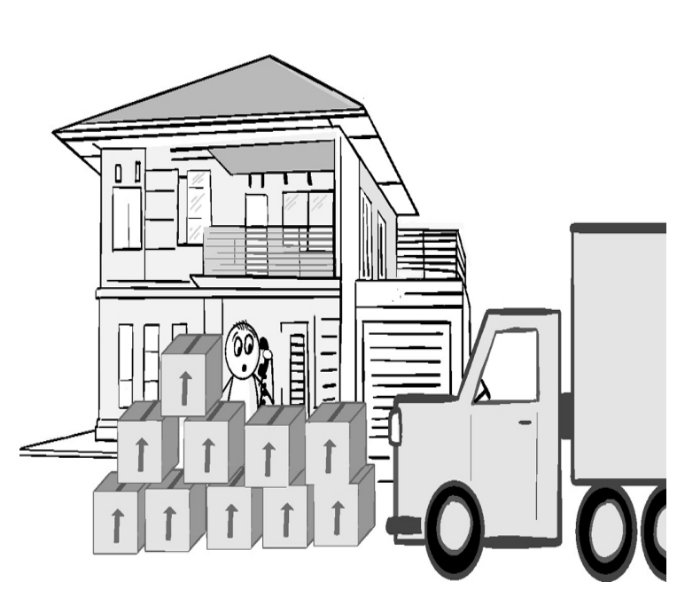

> _В организациях естественным образом происходят только три вещи: трение,
> путаница и неэффективная работа. Все остальное требует лидерства._
>
> --- Питер Дракер

Когда речь заходит о предоставлении услуг, большинство из нас приравнивает
трение к тем элементами, которые препятствуют скорости и пропускной способности
нашей доставки. Именно это заставляет многих из нас автоматизировать сборку и
развертывание, приобретать облачные сервисы и внедрять различные
Agile-практики. Однако столь узкое представление о трении может привести нас к
неоптимизации или, что еще хуже, к упущению всего остального, что стоит на пути
на пути к достижению желаемых результатов.

Для Джона Бойда и Гельмута фон Мольтке, о которых говорилось в двух предыдущих
главах, трение - это то, что ухудшает нашу ситуационную осведомленность и
препятствует обучению. Теория энергетической маневренности (ЭМ) Бойда
доказывала, что даже если вы быстрее и способнее, чем ваш противник, вы все
равно можете потерпеть неудачу, если не будете достаточно адаптироваться к
изменяющимся условиям или эффективно включать обучение на протяжении всего
пути.

Бережливое производство заводит трение еще дальше. В сфере предоставления
продуктов и услуг специалисты по бережливому производству отмечают, что вы
можете преуспеть в поставке и все же потерпеть неудачу, если вы менее
эффективны, чем конкуренты, в оказании помощи вашему клиенту в достижении
желаемого результата. Чтобы избежать этого, члены команды в бережливых
организациях знают, что необходимо прямо искать и пытаться устранить все, что
мешает или не добавляет напрямую ценности, которую может воспринять клиент, и
объявляют это _упущениями_.

Для Тайити Оно, которому приписывают создание производственной системы Toyota,
упущения имеют три формы: чистые отходы (_muda_), перегруженность (_muri_) и
нерегулярность (_mura_).

Сила этого подхода в том, что он заставляет нас открыто ставить под сомнение
все, что мы делаем, под углом зрения того, как это способствует достижению
целевого результата. Идея быстрого устранения трения и упущений напоминает нам,
что важно не то, насколько быстро вы можете двигаться, а то, насколько далеко
вы можете продвинуться к целевому результату. Такой иной взгляд на доставку
заставляет нас бросить вызов статус-кво, заставляя нас постоянно
экспериментировать, учиться и совершенствоваться, чтобы чтобы лучше достигать
этих результатов.

## Understanding Ohno's Forms of Waste

**Figure 4.1**\
Ohno's wastes

Lean and the idea of targeting waste came out of the US government's "Training
Within Industry" (TWI) program,[^1] which was designed to improve productivity
of war production efforts and overcome labor scarcity during World War II. One
of its most valuable components, Job Methods (JM), specifically targeted waste
reduction through continuous improvement.

[^1]: https://www.lean.org/search/documents/105.pdf

Workers using JM were encouraged to constantly look for ways to improve the
methods used to perform their work by thinking about why they were necessary
and how they contributed to the intent behind the work. Were there unnecessary
steps or details that could be eliminated? Could steps be rearranged or
simplified to reduce mistakes or the time needed to complete a job? Workers who
came up with improvements were celebrated and encouraged to share them widely.

There ideas were brought to Japan by US Army General Douglas MacArthur, the
Supreme Commander for the Allied Powers in Japan after Japan's defeat in World
War II. He was in charge of reconstruction after the war, and was eager to

find ways to speed it up to improve the living conditions of the Japanese
citizenry. One of the approach's early adopters was Taiichi Ohno, a Toyota
plant manager and later vice president of Toyota, who needed a way to help his
struggling company compete against more resource-rich competitors like GM.

Ohno pushed these ideas to everyone across the company, from the worker on the
assembly line to the executives at the top. To get everyone willing to pitch in
to find ways to continually improve, he had to encourage them to change the way
they viewed their jobs. Rather than just following instructions, they needed to
continuously and critically examine everything that went into delivery.
Anything that either got in the way of delivery or otherwise did not directly
contribute to meeting the customer's needs needed to be viewed as a form of
waste that needed to be eliminated.

Ohno and the Toyota teams found that waste can take many forms. Being familiar
with these types and their effects can help with identifying and minimizing
their presence in your own ecosystems.

### Friction vs. Waste

> At this point you might be thinking "Hey, I thought this chapter was about
> friction! Why is he talking about some Japanese guy's definition of waste?" In
> short, waste is a form of friction. The extensive body of knowledge from Lean
> has many lessons that apply to IT. I believe it is worthwhile to introduce
> many of its concepts in the original language to both minimize confusion and
> to allow you, the reader, to be able to investigate other Lean literature
> further. However, like a lot of Lean terms, the term "waste" is easy to
> misunderstand, misapply, or view as irrelevant in the IT context. Most people
> think of waste as a useless but mostly harmless byproduct of some process. It
> might not be desirable to have, but unless you know it is causing real
> problems, it is viewed as being safe to ignore. This is especially true in IT,
> where waste is neither physical nor usually visible. Friction, however, is
> seen as a real thing in IT. Whether it is in the form of poorly written
> requirements, buggy code, poor tools, not enough deployment environments, or
> slow processes, friction hinders our ability to progress and successfully
> deliver. Friction is also viewed less as a personal affront than waste. I know
> that I am far more open to finding an easier, more "frictionless" way of doing
> something than finding a "less wasteful" way.
>
> Finally, labelling something as friction more clearly describes its impact to
> our knowledge-driven decision-making industry. Anything that makes us slower
> to reaching a solution, whether it is working on useless tasks, having to redo
> a task, or waiting for a slow  process to complete, is friction. If it is
> helpful to you as you progress through this chapter, please feel free to
> replace the word "waste" with "friction" in your mind.

## Муда (Отходы)

**Рисунок 4.2**\
Муда так же плох, как и выглядит.

Muda - это японское слово, означающее упущения, а также бесполезность, праздность
и тщетность. По определению, это деятельность, за которую клиент не готов
платить. Вопреки распространенному мнению, цель не в том, чтобы выяснить, как
сделать что-то дешевле. Скорее, это выявление и устранение всего, что не вносит
ощутимого вклада в достижение желаемого результата.

Поиск Муды - это нечто большее, чем просто поиск бесполезных вещей, которые
нужно устранить. Муда может помочь нам выявить места, где была потеряна
ситуационная осведомленность, где неправильно понимали результаты клиентов или
даже где обучение было затруднено. Он также помогает нам лучше понять основной
замысел всех тех вещей, которые, как нам говорят, мы должны делать для того,
чтобы соответствовать любым юридическим, нормативным или внутренним требованиям,
которые не обеспечивают прямой ощутимой ценности для клиента. Для Оно эти
требования также были формой Муды. Хотя их трудно устранить, это не значит, что
мы не можем каким-то образом минимизировать или упростить любые трения, которые
они могут создать, и при этом выполнить их предназначение.

Шигео Шинго, один из создателей производственной системы Toyota, определил семь
видов упущений в производстве. Со временем к ним добавился восьмой
(неиспользуемые таланты сотрудников), создав полезный список, который команды
могут использовать в своих усилиях по искоренению упущений. Чтобы направить нас в
нашем путешествии, я создал полезный аналог в мире DevOps, который представлен в
таблице 4.1.

**Таблица 4.1**\
Семь видов упущений в производстве и соответствующие им термины в DevOps

Это может показаться очевидным списком того, чего не следует делать. Но
необходимо что-то большее, чем просто утверждение: "Я не буду этого делать".
Важно понять, почему они происходят, а также как они ухудшают наше принятие
решений.

Это поможет вам понять силу многих механизмов, от Workflow и Queue Master до
Service Engineering Leads и точек синхронизации, на которые я очень
сильно полагаюсь как для того, чтобы сделать очевидным возникновение проблем, 
так и для того, чтобы помочь командам устранить их.

Чтобы лучше понять эти виды упущений, давайте рассмотрим каждый из них.

### Упущение 1: Дефекты

 **Figure 4.3**\
Даже незначительные дефекты могут быть смертельно опасны.

Независимо от того, являются ли это баги или недостатки в сервисе, никому не
нужно говорить, что дефекты - это очевидные потери. Это сбой, который мешает
продукту или услуге работать так, как нужно клиенту.

Никто не только намеренно не создает дефектов, но и не любит, когда об этом
знают. Трения, которые они создают, могут замедлить доставку самым неловким и
неожиданным образом. Поскольку о большинстве команд судят по тому, насколько
быстро они могут выполнить работу, это сочетание означает, что дефекты часто
недооцениваются, скрываются или обозначаются как <<особенности>>.

Позволяя дефекту разрастаться, вы только усугубляете ситуацию. Дефекты,
обнаруженные вскоре после их создания, гораздо легче устранить. У человека,
создавшего дефект, гораздо больше шансов иметь достаточный контекст, чтобы
знать, где он находится. С течением времени контекст теряется, воспоминания
тускнеют, а другие изменения могут еще больше затмить первопричину и тем самым
затруднить ее поиск. Как только дефект попадает в производство, затраты растут
астрономически. Это не только значительно затрудняет сортировку и устранение
неполадок, но и теперь, вероятно, повлияло на клиентов.

С дефектным кодом также трудно работать. Это делает соблюдение сроков гораздо
более непредсказуемым. Дефекты не только нуждаются в исправлении, но и
позволяют легко непреднамеренно создавать дополнительные. Мало кому нравится
работать в таких опасно непредсказуемых условиях. Даже знание того, что в
какой-либо области есть <<гнилой>> код, может невероятно затруднить привлечение и
удержание хорошего персонала для работы над ним, что значительно затрудняет
эффективную доставку.

Лучший способ предотвратить возникновение дефектов - это понять их причины. Как
описано в главе 5 <<Риск>>, дефекты являются результатом недостаточной
ситуационной осведомленности о вашей экосистеме доставки. Чтобы
продемонстрировать это, вот список наиболее распространенных причин дефектов:

- Неправильно понятые требования.
- Ошибки и плохо сформулированные инструкции.
- Потерянный или недостаточный контекст в проблемном пространстве.
- Непоследовательный или плохо структурированный и/или управляемый код,
  конфигурация и/или данные.
- Отсутствие или труднодоступность управления зависимостями.
- Плохо отслеживаемое или понятное управление средой сборки и/или запуска.
- Недетерминированные/ненадежные/неповторяемые функции установки и отката.
- Использование неподходящего или незнакомого инструмента или языка.
- Опечатки.

Каждый из них --- пример утраченного осознания. Некоторые из них, например,
неправильно понятые требования или потерянный контекст, очевидны. Однако даже
более тонкие причины, такие как опечатки или несоответствия инструментария/
языка, которые на первый взгляд кажутся незначительными, могут вызвать вполне
реальные и часто трудноразличимые проблемы.

Бережливое производство решает эту проблему, пытаясь <<исключить ошибки>> в
линии доставки. Он использует методы, предназначенные для достижения этой цели
двумя способами.

Один из подходов заключается в проектировании системы таким образом, чтобы было
невозможно допустить определенные ошибки. Производители регулярно делают это с
помощью инструментов и деталей, создавая форму, которую можно собрать только
одним правильным способом. Примером может служить асимметричная форма разъема
HDMI. В IT это можно сделать, создав инструменты, которые предотвращают
случайное выполнение опасных команд или недопустимых конфигураций. Я более
подробно расскажу о некоторых стратегиях для этого в главе 10 <<Автоматизация>>.

Другой способ заключается в создании механизмов, которые в первую очередь
значительно облегчают выявление ошибок и потенциально опасных условий.
Бережливые производители используют множество методов, чтобы немедленно
привлечь внимание ко всему ненормальному или неуместному.

Одним из примеров является использование четкой маркировки, такой как цветовая
кодировка или символы. Цвета и символы - отличные способы быстрого
предоставления большого объема информации с минимальными накладными расходами.
Бережливые производители используют разные цвета для определенных деталей,
лотков, тележек и даже мест размещения инструментов.

Этот простой метод очень полезен и знаком любому пользователю тяжелой среды
разработки IDE (integrated development environment - интегрированная среда
разработки). Я также активно использую его с интерфейсами управления цветовым
кодированием и окнами терминалов между средами, цветовым кодированием кабелей и
разъемов центра обработки данных, а также цветовым кодированием между
различными типами сигналов тревоги и графиков. Я даже работал с командами,
чтобы <<раскрасить>> инструменты, фреймворки и языки в соответствии с типами
задач, для которых они больше всего подходят. Иногда этот <<цветовой код>>
представляет собой использование различных символов или маркировок, таких как
узоры в виде полос, на случай, если кто-то страдает дальтонизмом. Использование
таких механизмов кодирования побуждает людей использовать наиболее подходящий
вариант для работы и побуждает их спрашивать, а при необходимости и обсуждать,
почему определенный инструмент или технология не подходят для определенного
типа работы.

Другим примером механизма выявления ошибок является то, что в бережливом
производстве называется <<остановить линию>>. На бережливом производстве по всей
сборочной линии будут установлены кабели Andon, которые активируют
сигнализацию, предупреждающую всех о дефекте. Если дефект не устраняется
немедленно, сборочная линия останавливается. Это позволяет выявить место, где
был обнаружен дефект, что помогает найти источник дефекта и предотвращает
продвижение неисправного изделия дальше по конвейеру, где дефект может быть
скрыт или может создать дополнительные неисправности.

В ИТ такие механизмы внедрить сложнее. Мы можем останавливать сборки и
конвейеры доставки при возникновении сбоя и делаем это. Однако проблемы не
всегда очевидны в самый разгар, когда трудно сделать шаг назад и увидеть целое.
Вот почему я рекомендую иметь как Мастера очереди, как описано в главе 13
<<Мастер очереди>>, который может помочь непосредственно находить проблемы, так и
ведущего специалиста по сервисному проектированию, как описано в главе 9
<<Зрелость предоставления услуг и ведущий специалист по сервисному
проектированию>>, который может помочь более крупной команде развивайте
зрелость, чтобы более эффективно видеть самих себя.

Переход к такой защите от ошибок делает среду безопасной для работы команд и
побуждает команды рассматривать дефекты как сбой системы, который необходимо
устранить, чтобы помочь всем, а не как свою личную неудачу, которую они могут
захотеть скрыть от других.

### Упущение 2: Избыточное производство

**Рисунок 4.4**\
"Но я заказывал только одну!"

У вас может быть слишком много хороших вещей, особенно если они редко, а то и
вообще никогда не используются. 

Избыточное производство возникает, когда производится
что-то, на что нет покупателя. 

Для производителей такой избыток приводит к
накоплению запасов, которые необходимо хранить, уценивать или выбрасывать.
Очевидно, что это плохой вариант. Не только вам придется решать, что лучше -
заплатить за хранение или выбросить. Ресурсы, использованные для создания,
остаются связанными с чем-то, что не обеспечивает никакой ценности.

Избыточное производство в IT вызвано теми же причинами, что и в обычном
производстве, а именно ориентацией на выпуск продукции. 

Перепроизводство в IT скрывается в виде неиспользуемых или ненужных функций,
избыточного кода, и нежелательной деятельности, которая не приносит ощутимой
пользы. Люди могут утверждать, что клиентам нужны неиспользуемые функции, но
никогда не проверяют, так ли это на самом деле и как это влияет на общий
результат. Внутренние процессы и инструменты могут выглядеть полезными, но их
результаты могут игнорироваться или больше не приносить никакой пользы. 

Многие IT-специалисты упускают из виду, что все это избыточное производство не
только расточительно, но и вносит много лишнего трения в процесс доставки.
Избыточные функции и код могут не использоваться, но они должны быть
интегрированы, протестированы, развернуты. Если этого не сделать, они могут
превратиться в опасные мины, которые могут непреднамеренно уничтожить компанию,
как это случилось с Knight Capital (как подробно описано в главе 10,
"Автоматизация"). 

Избыток кода и функций также затуманивает наше общее понимание
нашей экосистемы. Они значительно усложняют поиск проблем, понимание того, какой
код используется, а какой нет, как его используют клиенты, и определить лучшее
место для внесения изменений и добавления функций и возможностей, которые
действительно нужны клиентам.

Чтобы противостоять перепроизводству, я всегда стараюсь сделать очевидной
итогувую стоимость для организации. Я отслеживаю дополнительные расходы на
поддержку и обслуживание, затраты на инфраструктуру, а также увеличение и
изменчивость сроков поставки и дефектов, к которым это приводит. Я также
стараюсь фиксировать фактические модели использования, чтобы было легче выявить
функции, которые используются редко, если они вообще используются. Это позволяет
техническим командам провести основанное на фактах обсуждение с бизнесом, чтобы
убедиться, что то, что делается, соответствует в интересах организации и ее
клиентов.

#### Неверные цифры

> Любой, кто работал в телекоммуникационной компании, знает, что голосовая связь,
> голосовые услуги по-прежнему считаются ключевыми в отрасли. И это несмотря на
> бурный рост сетей с коммутацией пакетов и услуг на базе Интернета. 
>
> Один из таких провайдеров стремился консолидировать и модернизировать свои
> устаревшие голосовые продуктов. В течение многих лет они создали и приобрели
> множество продуктов, которые обслуживали разнообразные потребительские и
> бизнес-потребности. Но со временем эти системы становились все более
> нестабильными и дорогими в управлении. Многие из этих систем также были
> несовместимы с новыми оптоволоконными линиями. Несмотря на эту явно растущую
> проблему, мало кто из заинтересованных сторон мог прийти к согласию относительно
> наилучшего способа ее решения.
>
> Маркетинг и отдел продаж опасались, что любая потеря функций будет не только
> плохо выглядеть, но и рисковать потерей клиентов. В результате они потребовали,
> чтобы любое новое решение включало в себя все 200 существующих функций,
> имеющихся во всех существующих на данный момент системах.
>
> Это поставило команды разработчиков в затруднительное положение. На рынке просто
> не было системы, которая содержала бы все эти функции. Единственный способ - это
> решение, которое могло бы вместить все эти функции. Для него потребовалось бы
> либо интегрировать несколько коммерческих решений вместе с пользовательским
> кодом, либо создавать все с нуля своими силами. Любой из этих подходов был бы
> дорогостоящим и занял бы годы реализации. Поскольку маркетинг, продажи и
> поддержка решительно отвергали все, что не имело функционального паритета в
> первый день, не было возможности легко внедрить решение. 
>
> Команды боролись с этой проблемой квартал за кварталом и мало что могли
> показать. Компания становилась все более обеспокоенной, поскольку риск сбоев в
> работе системы увеличивался, а решения все еще не было. 
>
> Эта, казалось бы, непреодолимая проблема на самом деле имела довольно простое
> решение. Клиентам на самом деле не нужны были все функции. Им нужны были
> определенные функции. Некоторые функции были предназначены для давно устаревших
> потребностей или для тех,которые можно было решить другим способом. Кроме того,
> не каждый клиент или рынок был одинаково ценен для компании. Если функция должна
> была быть создана в убыток клиенту, необходимо было согласовать причину. 
>
> Помня обо всем этом, одна команда решила проанализировать, какие функции на
> самом деле используются клиентами, а также доход от каждой из них. Они
> обнаружили, что есть примерно шесть функций, которые активно используются и еще
> семь, которые редко используются клиентами, которые достаточно важными для
> компании, чтобы имело смысл их включить. Все эти функции были настолько
> распространены, что были включены в большинство решений доступных на рынке.
> Подавляющее большинство из оставшихся 180 функций либо никогда не
> использовались, либо не использовались в течение последних пяти лет. 
>
> Данные были настолько очевидны, что три другие команды согласились. Вскоре после
> этого было разработано решение со всеми необходимыми функциями. Затем оно было
> распространено на пробу коллегам. Вскоре после этого мы перевели остальных, а
> затем отключили все устаревшие системы.

### Упущение 3: Системные помехи и ожидание

**Рисунок 4.5**\
"Пожалуйста, подождите следующего свободного представителя..."

Даже несмотря на всё внимание, которое на протяжении многих лет уделяется новым
инструментам и процессам, разработанным для снижения трения при доставке, мы всё
ещё боремся за выполнение задач. Во многом это вызвано широким спектром
системных помех, которые ИТ-команды накладывают на себя либо по привычке, либо
из-за недостатка общения и понимания. Каждое из них неизбежно снижает нашу
способность принимать эффективные решения.

Хотя наиболее очевидные препятствия сосредоточены вокруг операционных областей,
многие из них существуют на протяжении всего жизненного цикла предоставления
услуг. К распространённым формам относятся досадные "узкие места",
несоответствия и жёсткие блокираторы, которые не позволяют вам добиться
какого-либо прогресса до тех пор, пока они не будут устранены. Они приводят к
задержкам поставок, переделкам, несбывшимся ожиданиям клиентов и разочарованию,
которое может привести к росту напряжённости в организации.

#### Выявление системных помех

Первым шагом на пути к устранению этой формы потерь является выявление причин
системных препятствий. Часто причина вырастает из предыдущей проблемы или цели,
которая больше не актуальна. В других случаях проблемы с коммуникацией и
несоответствием в целях или понимаемых целевых результатов создают разногласия,
которые препятствуют прогрессу. Выявление этих причин и связанных с ними
издержек для организации может помочь привлечь внимание к препятствию и в
конечном итоге устранить его.

Чтобы помочь вам на этом пути, вот список некоторых наиболее распространённых
системных помех:

-   **Проблемы коммуникации:** Расстояние, физическое или организационное,
    ограничивает своевременное высокоскоростное общение лицом к лицу. Вместо
    этого мы вынуждены полагаться на более потерянные, не синхронизированные
    механизмы коммуникации, такие как электронная почта и документы, которые
    теряют контекст и могут быть неверно истолкованы, что снижает нашу
    осведомленность о ситуации и межличностное взаимодействие. нашу ситуационную
    осведомленность и межорганизационное согласование. Как вы узнаете в главе 6,
    "Ситуационная осведомленность", растущая глобализация ИТ также может
    привести к появлению языкового и культурного барьера, которые могут привести
    к дальнейшим проблемам и породить недоверие.
-   **Плохо настроенная рабочая среда:** В нашем всё более виртуальном мире
    многие организации упускают из виду ценность хорошо продуманной общей
    рабочей среды. Это место, где члены команды могут встречаться для совместной
    работы с минимальными внешними помехами. Она также выступает в качестве
    хранилища информации и синхронизации, создавая полезную структуру для сбора
    и обмена информацией, а также для выявления и исправления неверных
    интерпретаций. Без общей рабочей среды, будь то из-за ограниченного
    пространства, географического распределения или глобального события, такого
    как кризис здравоохранения, обмен информацией становится более неформальным
    и неравномерным. Без согласованных усилий по внедрению инструментов,
    улучшающих обмен информацией, совместную работу и разрешение конфликтов,
    информация может быть потеряна, а доверие может быть утрачено.
-   **Плохое управление средой:** Гигиена среды, от всех компонентов,
    составляющих сервис, до программного обеспечения, операционных систем,
    уровней исправления, конфигураций, физических и/или виртуальных уровней
    среды кодирования, тестирования и эксплуатации, очень важно отслеживать и
    поддерживать. Любое отсутствие гигиены создает потенциальные вариации, в
    которых может быть потеряна ситуационная осведомленность, что снижает
    эффективность принятия решений.
-   **Плохое управление кодом:** Плохо написанный, комментированный,
    отслеживаемый или обновляемый код делает работу с ним медленной и чреватой
    ошибками. Поддержка инструментов разработки и их использование, от
    инструментов и структур хранилищ кода до инструментов сборки и тестирования
    и генерируемых ими артефактов, также важны для здоровья кода. Любой, кто
    работал вместе с большим количеством ветвей кода и редко проверяемым кодом,
    знает, насколько болезненными являются слияние и интеграция. Эта боль
    вызвана тем, что было внесено так много разрозненных изменений, что ни один
    человек не имеет полного контекста кода. Пробелы в осведомленности, которые
    возникают в команде, трудно устранить, а также они отвлекают от целевых
    результатов, которые вы пытаетесь достичь.
-   **Чрезмерная тесная связь:** Компоненты, системы и сервисы могут стать
    настолько взаимозависимыми друг от друга, что любое изменение в одной из них
    оказывает значительное и немедленное влияние на другую. Сильная связь
    заставляет рассматривать затронутые компоненты как единое целое. Это снижает
    гибкость, заставляя рассматривать любые изменения в одной части как
    изменения во всех. Это многократно увеличивает усилия, необходимые для
    доставки, управления и устранения неполадок. Это также может увеличить время
    простоя, необходимое для внесения изменений, поскольку затронутые части
    нельзя поменять местами или изменить по отдельности, а также уменьшить
    количество доступных вариантов для легкого масштабирования этих областей.
-   **Конкурирующие цели:** Организации могут попасть в ловушку, когда
    отдельные сотрудники или команды имеют разные или даже противоречащие друг
    другу цели. Это может привести к разногласиям, соперничеству и блокировке,
    которые препятствуют прогрессу. Конкурирующие цели не только мешают бизнесу
    и создают непробиваемый туман, скрывающий стратегические намерения
    организации, они могут разделять и сильно деморализовать сотрудников.

> **Заполненные разногласием облака** Я нетерпелив по своей природе, и излишнее
> ожидание чего-либо особенно меня раздражает. Однако, я не настолько нетерпелив,
> что готов торопить события, если это означает больше работы и разногласий
> впоследствии. Размещение сервисов в облаке – это, вероятно, то место, где этот
> баланс выходит на передний план.
>
> Многие организации переходят к использованию облака, чтобы обойти 
> внутренние помехи. Общим катализатором являются все разногласия, 
> связанные с ожиданием установки и предоставления нового оборудования и 
> программного обеспечения. Это может сделать мгновенную установку 
> экземпляра AWS или Azure весьма заманчивым, особенно когда 
> альтернативный вариант может занять недели или месяцы.
>
> Я часто вижу, как организации, занимающиеся ИТ-операциями, 
> упускают из виду проблему, которую разработчики и другие сотрудники 
> организации пытаются решить. Вместо этого, они сосредотачиваются на 
> технологии облачных вычислений. Многие пытаются построить "внутренние 
> облака" или внедряют еще один длительный процесс инициализации для 
> использования внешнего провайдера. Одна компания, в которой я работал, 
> даже пошла настолько далеко, что настаивала на том, чтобы каждая 
> предоставляемая услуга должна была проходить через недельный процесс 
> проектирования для каждой новой виртуальной машины или контейнера, 
> чтобы "убедиться, что все было задокументировано и утверждено".
>
> Процесс – едва ли не единственный источник разногласия. Вторая 
> распространенная ошибка, связанная с разногласием, возникает, когда 
> команды не справляются с управлением конфигурациями облачных 
> сервисов.
>
> Облачные консоли становятся полными одноразовых решений, в то 
> время как инструменты конфигурирования и инструменты оркестровки, 
> такие как Puppet, Docker, Kubernetes и Terraform, либо вообще не 
> используются, либо настолько переполнены неотслеживаемыми 
> одноразовыми решениями, что становится сложно узнать, что находится в 
> производстве или как это воспроизвести.
>
> Третья ошибка заключается в том, что облачные сервисы настолько 
> тесно связаны друг с другом, что теряется значительная часть гибкости, 
> которую в противном случае мог бы обеспечить переход на облачные 
> сервисы. Это вынуждает команды вместе разбирать, обновлять и снова 
> поднимать такие сервисы в скоординированном режиме, требующем 
> больших затрат ресурсов.

### Упущение 4: Чрезмерная специализация

**Рисунок 4.6**\
Билл несовсем правильно понял тот момент, когда ему сказали, что его
специализация позволит занять ему высокие посты.

Когда вы сталкиваетесь с достаточно глубокими и сложными проблемами, наличие
специализированных знаний и опыта может быть очень полезным. Кроме того,
процесс становления <<полезным>> человеком в решении определенных типов проблем
может даже повысить самооценку. Приобретение таких навыков требует времени и
практики, а более сложные или редкие наборы навыков часто сопровождаются и
повышенной оплатой. Это побуждает людей к становлению специалистом более узкого
профиля.

Так что же здесь может быть не так?

Проблема начинается с того, как используются специалисты. Если их навыки
являются редкими или дорогими, многие компании стремятся обеспечить
максимальную эффективность своих инвестиций. Они уделяют самое пристальное
внимание таким специалистам и предоставляют им всю работу, требующую данного
опыта. Это создает проблемы, которые в конечном итоге ухудшают ситуационную
осведомленность и ослабляют организационное доверие и обучение.

Одной из таких проблем является риск отрыва работы от общего контекста.
Специалисты проводят так много времени, работая над задачами, которые
соответствуют исключительно их специализации, что часто остаются в стороне от
того, что происходит в более крупной экосистеме, а вместе с ней и от общей цели
работы. Аналогичным образом, работники, находящиеся за пределами таких
специальностей, не имеют достаточного представления того, что сделал специалист
и почему. Это уменьшает чувство сопричастности для всех участников жизненного
цикла, создавая благодатную почву для перекладывания ответственности и
обвинений.

Другая проблема заключается в том, что личность работника и его ценность часто
ассоциируются с типом его навыка, а не с его способностью помочь компании
достичь целевых результатов. Специализация работника --- это валюта, и чем реже
она встречается, тем больше стоит работник. Это лишает специалистов стимула
делиться своими знаниями с другими, тем самым опасаясь поставить под угрозу
свою ценность.

Важно отметить, что крупные организации наиболее подвержены проблеме
специализации. Причин тому множество:

- **Наём, ориентированный на навыки:**\
  Специализацию гораздо легче определить как потребность и нанять на должность,
  поэтому у менеджеров легко возникает соблазн организовать команды по
  определенным признакам специализации. Узкоспециализированная работа должна
  передаваться из одного подразделения в другое, чтобы быть завершенной. Подходы
  к найму, при которых кандидаты проходят специальные тесты, соответствующие
  узкому диапазону допустимых решений, часто смещены в сторону аналогично
  мыслящих людей. Это делает команды более восприимчивыми к <<туннельному
  зрению>> и политики <<не здесь придумано>>.
- **Отсутствие сопричастности и недостаточное понимание работы:**\
  При недостаточном понимании работы и отсутствии сопричастности к более крупной
  экосистеме осведомленность и отзывчивость часто еще больше фрагментируются.
  Работа легко теряет значимый приоритет. Команды оптимизируют свою работу на
  основе того, что им наиболее выгодно, даже если это происходит за счет
  недооптимизации более крупной организации. По мере блокирования работы и
  возникновения междисциплинарных проблем неизбежно возникает соблазн
  перекладывания вины и обвинений.
 - **Борьба с процессом устаревания:**\
  Быстрые изменения в технологиях или стратегиях могут привести к устареванию
  специализированных навыков. Действующие специалисты, которые видят, что работа
  переходит из их области компетенции в иную область, могут попытаться
  затормозить или сорвать перемены, препятствуя возможности
  организации к адаптации.
 - **Отсутствие личной вовлеченности и заинтересованности:**\
  Разделение обязанностей создает жесткую и менее стимулирующую рабочую среду.
  Отсутствие ощущения совместного участия в решении поставленных задач может
  ограничить творческий потенциал и внедрение новых технологий и решений.
  Ограниченное понимание руководством этих основополагающих факторов может еще
  больше замедлить деятельность организации.

Лучший решением для организации служит постоянный поиск возможностей для
минимизации потребности в специализации. Один из таких способов --- избегать
слишком сложных решений, требующих глубокой специализации. Другой способ ---
ротация ролей, а также поиск творческих путей для регулярной помощи членам
команды в обучении друг друга.

Там, где специализированная работа неизбежна, есть способы перестроить роли
специалистов и команды, чтобы минимизировать влияние возможных недостатков.
Лучше всего внедрить специалистов в качестве профильных экспертов в команды,
которые владеют всем жизненным циклом. Эта модель схожа с подходом Spotify
<<отряды и гильдии>>. Вместо того чтобы выполнять всю работу самостоятельно,
специалисты могут консультировать и обучать других, чтобы обеспечить правильное
выполнение действий. Это не только повышает гибкость за счет увеличения размера
и надлежащей квалификации персонала, но и создает привлекательный стимул для
сотрудников постоянно приобретать новые навыки. Специалисты могут продолжать
оттачивать свои навыки, погружаясь в более глубокие проблемы и обмениваясь
опытом с другими экспертами в более широкой группе по интересам. Более широкий
круг общения помогает людям стать экспертами, обладающими глубокими
специальными знаниями как минимум в одной области, а также имеющими широкую
компетенцию во многих других областях.

> **Дисфункция чрезмерной специализации**
> Я часто сталкиваюсь с компаниями, которые слишком полагаются на специалистов
> при выполнении определенной деятельности, создавая всевозможные препятствия,
> которые мешают другим командам выполнять свою работу. Три наиболее
> распространенные группы - это администраторы баз данных (DBA), сетевые
> инженеры и специалисты по информационной безопасности.
>
> Быть таким специалистом или иметь таких специалистов в команде разработчиков
> не обязательно плохо. Я часто рекомендую их присутствие. Когда они являются
> частью разнообразной и квалифицированной команды, они могут помочь в принятии
> более оптимальных техническиx решений. Они могут также обучить других
> кодировать и выполнять задачи по обслуживанию, используя лучшие подходы, а
> также могут решать те сложные проблемы, которые в противном случае могут
> ограничить вашу способность в удовлетворение потребностей клиентов.
>
> Однако сами специалисты нуждаются в регулярных задачах и вызовах, чтобы они
> могли оставаться заинтересованными и расти вместе с командой. Когда этого
> не происходит, они часто ставят свою ценность для команды в зависимость от
> того, какую работу они могут выполнить в одиночку. Это неизбежно заставляет
> их вести себя слишком навязчиво по отношению к своей рабочей области, до
> такой степени, что это становится единственной точкой отказа.
>
> У меня была подобная проблема в одной компании с администраторами DBA и
> сетевыми инженерами. Там существовала политика, согласно которой для всех
> работ с базой данных требовался администратор, а со стороны сети большая часть
> доступа контролировалась списками контроля доступа (ACL), которые должны были
> быть подписаны, а затем выполнены сетевым инженером.  Обе политики делали
> изменения и установку очень медленно. Хотя администраторам баз данных и
> сетевым инженерам нравилось чувство уважения и ощущение важности к себе,
> давление на них было велико, а работа была утомительной и неинтересной.
>
> Поэтому я изменил всю структуру, начав с DBA.
>
> Я сел c некоторыми из лучших DBA в компании. Они были чрезвычайно талантливы,
> и, возможно, одними из лучших, с кем я когда-либо работал. Я очень хотел
> устранить все <<узкие места>>. Но я также ценил их знания и хотел, чтобы
> чтобы они понимали, что им бросают вызов и при это они совершенствуются.
>
> Я предложил им придумать инструменты и другие методы, которые позволят другим
> людям выполнять простые задачи с минимальным риском. Наряду с этим мы создали
> систему баллов, которая позволяла инженерам, показавшим, что они могут
> ответственно выполнять эти задачи, получать больше привилегий для выполнения
> других, более рискованных задач. А те, которые не справлялись, теряли баллы,
> а вместе с ними и свои привилегии.
>
> Затем я создал подразделение Database Engineering (DBE), которое должно было
> отвечать за будущие архитектурные решения баз данных, исследовать новые
> перспективные технологии и стратегии оптимизации данных, а также работать с
> разработчиками над улучшением практики кодирования и структуры данных. Как и в
> случае с инженерами, для DBA была разработана система баллов. Те, кто создавал
> и совершенствовал инструменты и методики, позволяющие выполнять работу,
> получали возможность стать DBE и развивать свою сферу интересов. А те, кому
> это было неинтересно, продолжали работать над административными задачами баз
> данных, но они могли оказаться на месте тех самых инженеров, которые тормозили
> рабочий процесс.
>
> Этот подход оказался чрезвычайно популярным, и за короткое время почти все
> <<узкие места>> исчезли. Мы также добились выигрыша в том, что наши лучшие DBE
> теперь решали некоторые новейшие технологические проблемы, что позволило нам
> обогнать многих наших конкурентов.
>
> Я использовал аналогичный подход и в сетевой инженерии. Вскоре команда нашла
> способы отказаться от сетевых ACL и заменить их технологиями, которые в
> конечном итоге составили основу программно-определяемых сетей (SDN). Это
> позволило командам разработчиков повысить гибкость, обеспечив при этом
> безопасность и производительность сетей.

### Waste 5: Handoffs

**Figure 4.7**\
Handoffs

Handoffs are a fact of life. Not everyone can always do everything all the
time. Sometimes it may even be prudent, or a legal requirement, to
intentionally separate responsibilities across teams.

Handoffs, however, introduce two challenges. The first is that people and teams
do not always share the same set of priorities. When priorities differ, work
can easily become trapped along a handoff chain. Whether a team is waiting for
another team to complete a piece of work they need or a partially completed
item is waiting to be picked up and completed, the delay it causes appears the
same from the customer's perspective.

The second challenge is that handoff and integration points become
opportunities for information and context to be lost. The resulting flawed
assumptions can lead to errors and rework, as well as complicate the
troubleshooting of any problems that cross the handoff or integration boundary.

The most common form of handoffs are those between specialist roles and domain
experts brought in to complete an activity. I have personally seen
back-and-forth loops between DBAs and engineers or developers and testers that
drag on for days or weeks.

Another common challenge is caused by the overly tight coupling between
components as well as nonsensical splitting of responsibilities across teams.
Ironically, such splitting is often done under the belief that more teams with
fewer responsibilities will automatically result in faster delivery regardless
of how tasks are divided up. This usually leads to dividing tasks at the very
bottlenecks that lead to excessive handoffs.

### The Serial Loopback

> At one company such responsibility divisions led to a long handoff chain that
> ultimately became debilitating to the company. The service had been broken up
> across 20 different Agile teams under the belief that together they could
> deliver everything in one or two 2-week sprints. Unfortunately, the way that
> they were divided left 14 teams with tight library and other dependencies that
> needed to be first delivered by another team before they could confidently
> complete their own tasks. In a number of cases these dependencies were
> cumulative, with a team dependent upon a library from another team that was
> dependent upon another element from yet another team and so on. This
> ultimately serialized the very deliveries they were  trying to speed up, in
> some cases increasing delivery times by upwards of six months.
>
> What was worse, if a bug or other problem was found midway through the chain,
> the process would effectively have to loop back to the team responsible for
> fixing it and traverse the chain from that point again.
>
> **Figure 4.8**\ The serial loopback

It is important to understand where handoffs exist within your ecosystem.
Workflow boards like those discussed in Chapter 12, "Workflow," in conjunction
with the Queue Master discussed in Chapter 13, "Queue Master," can help you
spot excessive handoffs. I also encourage teams to identify and discuss
handoffs at retrospectives and Strategic Review sessions.

Encouraging staff to find ways to reduce handoffs wherever possible improves
organizational responsiveness and flexibility. It also can improve situational
awareness, as well as reduce errors and misunderstandings that result in
wasteful rework.

### Waste 6: Partially Done Work

**Figure 4.9**\
Partially done work

In Lean, partially done work is called "work in progress" (WIP). WIP is
anything that has had work done on it but is not deployed and providing value
to the customer.

Partially done work, or WIP, is a common scourge of IT delivery organizations.
It can appear everywhere across the delivery cycle, from modified code that has
not been checked in, through unbuilt/unintegrated code, untested packages,
unreleased software, released but turned off code, to partially completed
operations tickets.

There are a lot of problems with partially done work. It is easy to focus on
how it can create a lag in gaining value from the work, or how not checking in
a big batch of code delays potentially useful feedback. Both are meaningful.
But perhaps the worst problem with WIP is that it tends to create _more_ work
for people who believe what they are doing is making them more efficient.

Think through a time when you were juggling multiple pieces of work. Each time
you cycled to the next item you had to put in some effort to regain context.
Where did you leave it? In what direction were you trying to take the activity?

Did something change while you were not attending the task that altered the
dynamics enough that you have to course correct or even throw away what you
have?

Another issue with temporarily losing context is that it creates an opening for
mistakes. Dynamics can change in ways that you might not notice until it is too
late. We can also misremember what was going on or what we were doing in ways
that introduce unintentional defects or rework.

The best way to tackle partially done work is by making it and its effects
visible. Workflow boards that show the amount of work in progress are one good
form. This is also where Queue Masters are extremely helpful. They can spot not
just when WIP is happening, but also some of the patterns that might be causing
it.

This can help teams find ways to work together to break their bad habits

One such common bad habit is our next waste: task switching.

### Упущение 7: Переключение между задачами

**Figure 4.10**\
Task switching

Независимо от того, занимаетесь ли вы созданием, тестированием или
эксплуатацией сервисов, работа в сфере информационных технологий требует
глубокой концентрации и создания контекста. Прерывания опасны и для того, и для
другого. Тем не менее, стремясь к максимальной производительности, мы охотно
принимаем частое переключение задач как нормальное явление, будь то прерванный
поиск неисправностей или внезапное перераспределения приоритетов в работе.

Легко поддаться переключению задач, и оно часто идет рука об руку с частично
выполненной работой. Некоторые любят острые ощущения, когда они мчатся
наперегонки, чтобы стать героем в перестрелке с аварийной ситуацией. Другие
считают, что, занимаясь несколькими делами одновременно, они становятся более
незаменимыми для организации. Часто организация особенно плохо расставляет
приоритеты и отслеживает работу, и каждая задача становится возможностью для
кого-то усиленно лоббировать необходимость ее немедленного выполнения.

Переключение между задачами не просто отвлекает, оно разрывает контекст, что
замедляет наш прогресс и снижает эффективность, поскольку частично выполненная
работа накапливается в очереди. Переключение между задачами также снижает нашу
осведомленность о ситуации, нашу способность выявлять закономерности и, в
конечном счете, способность учиться и совершенствоваться. Мы не только теряем
контроль над происходящим, но и рискуем потерять связь с результатами, которых
нам необходимо достичь. В лучшем случае это может привести к тому, что более
приоритетные задачи откладываются или игнорируются. В худшем случае - наша
способность принимать разумные решения.

Многие ИТ-команды, особенно те, в которых много операционной поддержки,
смиряются с повсеместным переключением задач. Легко поверить, что это просто
такая природа работы, но, как мы продемонстрируем позже на примере роли Роль
мастера очереди, реструктуризация того, как работа попадает в команду, может
значительно сократить количество срывов. Будучи точкой входа для работы, мастер
очереди также может видеть всю экосистему, замечать закономерности и в конечном
итоге помогать команде учиться.

Методы визуализации рабочего процесса также могут помочь выявить переключение
задач, включая затянувшиеся задачи и накопление незавершенной работы. Также
важно активно искать и сокращать количество источников переключения задач. Как
уже говорилось в главе 13 "Мастер очереди", я призываю мастеров очередей помочь
команде изучить способы реструктуризации длительных задач, требующих большого
количества людей, а также работу, которая, кажется, течет по кругу между
командами или требует большого количества хождения туда-сюда.

### Waste 8: Excessive Processes

**Figure 4.11**\
"Why do I have to fill out all these forms to replace my keyboard?"

Processes can be helpful. They standardize the shape and direction of work to
ensure a reliably repeatable outcome. If deployed and maintained properly,
processes can reduce errors and rework. They also are good ways of capturing
knowledge that can enhance the capabilities of the team.

However, you can have too much of a good thing. For IT, having and following
the processes can become more important than the customer outcome, sometimes to
the point where it is even declared as the objective that the customer is
looking for. This is true even when the processes themselves do not seem to do
much to improve delivery or service effectiveness.

Some of the worst process waste is done under the banner of "industry best
practice," even when it is clear that the process is hindering the business.
Over time, this divergence in purpose can reduce an organization's ability to
respond in a timely and flexible way to the demands placed upon it. Learning
and improvement seem to slow to the point where there is nothing significant
that directly correlates to improved effectiveness and progress toward customer
needs. Tensions and stress rise from increased frustration, workloads, and\
rework.

Excessive processes tend to develop one or more of the following attributes:

-   **Inflexibility:** IT lives in an ever more dynamic ecosystem. Customer and
    business needs can shift at an even faster rate than technology. The
    combination of condition changes means processes need to be continually
    reviewed, altered, and sometimes even eliminated in order to stay aligned.
    Inability or resistance to adapt processes reduces their efficacy and
    creates waste.
    
-   **Excessively prescriptive:** A useful process is typically a repeatable
    pattern that helps us understand the situation and navigate toward a
    successful outcome.

    However, excessively prescriptive processes can be so detailed that they
    become a mindless straightjacket that actively prevents people from
    adjusting to changing conditions. Such processes should be reviewed to
    determine whether the process is a workaround hiding a larger problem.

-   **Demonstrate little to no discernible customer value:** Some processes are
    put in place with the best of intentions. However, due to either habit or\
    misunderstanding of the actual need, they struggle to provide any
    appreciable value. These processes are typically poorly constructed or are
    ill fitting for their deployed environment. Sometimes they have been taken
    verbatim from another environment or official list of "best practices." For
    instance, one company required physical signatures for certain change
    procedures. There were no legal or regulatory requirements for the
    procedure, and later I found that the only reason it was there was because
    the process had been copied from a company that did have such requirements.

    Such processes should be reviewed to determine what problem they are trying
    to solve and whether the problem exists and needs solving in the target\
    environment. If it does, the process should be altered to make the intended
    desired value far more apparent. If it doesn't, the process should be
    thrown out.
    
    It is far safer to have no process than to shoehorn in one that is not fit
    for purpose.

-   **Execution-knowledge mismatch:** Sometimes a process ends up being
    executed by people who either do not understand the underlying reasons for
    it or lack the knowledge, awareness, or skills required for executing it.
    IT organizations are often filled with such processes, and they don't just
    occur at the junior support technician level. In fact, in my experience
    they are most common where a process requires sign-off by senior
    management, like change board approvals and official governance processes.
    The lack of sufficiently shared situational awareness degrades the
    approver's ability to effectively execute their intended procedural duties.
    It can be caused by ineffective internal communication flows as well as
    poorly structured information.

    When mismatches happen, it is imperative to quickly find out how they have
    developed so they can be rectified. Is there a more appropriate way of
    achieving the intent behind the process? Perhaps the process can be
    executed at a level where the right situational awareness exists, or the
    quality and flow of information can be improved such that the approver can
    effectively perform his or her duties.

-   **Regularly broken or circumvented:** Sometimes processes seem to be
    regularly broken or circumvented. One very common one is breaking a
    purchase into a lot of small transactions in order to work around a very
    slow process for anything over a particular value. Another is reusing old
    code or systems to avoid having to spend lots of time porting to some
    substandard"official" technology.

These are all symptoms that a bigger problem exists. Rather than resorting to
strict enforcement, the process needs to be reviewed to see why it is not
followed.

It is possible that the process is overly cumbersome, doesn't match actual
conditions, or that its value is not understood by those who should be using
it.

Occasionally, much like the fact that certain statutes require that some
financial transactions use fax technology, the process is simply no longer
needed.

Each of these symptoms is a good indicator that you have excessive processes.
It is important to review processes regularly, whether or not there are obvious
signs of problems. I usually encourage teams to look at whether any processes
appear problematic or questionable at regular cycle sync points like
retrospectives and strategic reviews, as discussed in Chapter 14, "Cycles and
Sync Points."

Good processes need to clearly contribute to the larger objectives, the ones
that the customer cares about. Processes that do not do that in the most
effective way need to be changed or removed entirely.

## 無理(Muri) (Перегрузка)

**Рисунок 4.12**\
<<Наверняка в релизе найдется место для еще одного пакета!>>

Не каждая форма проблемм трений является <<чистым расточительством.>> Одна из
форм обозначается в Основе как _Muri_, или перегрузка.

Научное управление и учет затрат долгое время обучало менеджеров рассматривать
вводимые ресурсы как нереализованные затраты, которые необходимо полностью
использовать во имя эффективности для управления затратами. Люди с таким складом
ума верят, что любые потери это <<расточительство.>>

Такая перегрузка всегда плоха, и она может принимать разные формы. Большинство
людей заботятся о перегруженных системах и машинах, зная, что их надежность
снижается с каждым небольшим превышением разумного. Однако есть две часто
упускаемые из виду формы перегрузки, которые могут подорвать нашу способность
предоставлять услуги и принимать эффективные решения: _переработка людей_ и
_перегруженные релизы_.

### Переработка людей

Переработка людей --- чрезвычайно распространенное явление. Мало того, что
менеджеры часто уговаривают своих сотрудников выкладываться по полной, так и
многие амбициозные люди или те, кто нервничает из-за возможности потери работы,
тоже хотят, чтобы было видно, что они делают все возможное. Но такое поведение
на самом деле довольно рискованно. Конечно, существуют проблемы, связанные с
тем, что это может привести к эмоциональному выгоранию и оставить мало времени
для компенсации любых возникающих проблем. Однако гораздо более насущной
проблемой является то, каким образом это наносит ущерб процессу принятия
решений.

Когда люди испытывают стресс или иным образом перегружены, они бессознательно
сосредоточивают свое внимание только на наиболее важных аспектах ближайшей
задачи. Эта вынужденная близорукость предохраняет человека от приближающейся
подавленности, но это обходится ему значительной ценой.

Меньшая осведомленность значительно затрудняет восприятие важных фактов или
меняющихся условий во всей экосистеме, ограничивая способность людей учиться и
приспосабливаться. Исследования показывают, что перегруженные люди менее
продуктивны и совершают больше ошибок.[^2] Переутомление также может привести к
тому, что пострадавшие пропустят важные моменты принятия решений.

[^2]: https://www.uclan.ac.uk/news/tired-and-overworked-employees-pose-huge-risk-to-business-data

Еще один факт, который многие упускают из виду, заключается в том, что даже один
перегруженный член команды может повлиять на принятие решений всей командой.
Перегруженный работой член команды, скорее всего, будет чувствовать себя слишком
занятым, чтобы поделиться той информацией, которой он располагает, что ослабит
осведомленность окружающих. Они также более склонны пропускать дедлайны и важные
точки синхронизации и, как правило, гораздо менее склонны <<тратить время> на
анализ ситуации или помощь в обучении себе и другим. Они не сделают шаг назад, чтобы
увидеть картину в целом и найти лучший подход.

Я все время сталкиваюсь с перегруженными людьми. Хуже всего то, что обычно это
те, кого организация меньше всего может позволить себе потерять.

Итак, как вы решаете переработку в вашей команде?

Начинаем с того, что перегруженные люди должны посещать точки синхронизации,
особенно ретроспективы и стратегические обзоры. Они попытаются отказаться, и
тогда менеджеры и команды могут вмешаться, иногда даже используя обзорную сессию
как способ выяснить, как перераспределить или иным образом уменьшить рабочую
нагрузку. Также полезно переводить этих людей в другие области, которые являются
новыми или отличающимися от них в рамках работы команды. Их проницательность,
как правило, будет ценной, и это даст им время сделать шаг назад и самим
осознать, какой ущерб они причинили себе и другим, пытаясь помочь команде
добиться успеха.

### Overloading Releases

Having occasional big releases consisting of lots of changes bundled together
can seem like a good thing. It gives developers more time to work on meatier\
problems and gives testers more time to test. Operations people like the fact
that there will be fewer release interrupts to worry about, while for customers
a surge in new features can make a new release seem compelling.

So why are big releases a bad thing?

Rather perversely, many who favor the big release approach over having more
frequent smaller ones usually end up increasing the very risk and delivery
friction that many claim they are attempting to avoid. For starters, having
fewer releases doesn't necessarily equate to less risk. In fact, bundling many
changes means a thicket of new and different interactions. This creates a thick
fog that obscures everyone's situational awareness. Which of the many changes
might be the root cause of a new problem? It could be one or the interaction of
many. If developers haven't fully thought out how each change might interact
with others or, worse, if changes were made by several different teams, it
could make troubleshooting and fault resolution far more difficult and time
consuming.

Having fewer releases doesn't really help reduce delivery friction, either.
Giving developers longer to work on features can encourage long-lived branches
and fewer check-ins. This reduces transparency and can result in a painful
integration problem down the road. It also lets developers off the hook from
thinking defensively about changes and how they might interact in the ecosystem
if they go live before they are complete.

Longer release cycles do not help testing, either. Shorter cycles require
really understanding what is of high value to test. They also create an
incentive to invest in improving test cycle times, allowing the organization to
get more feedback more frequently. Longer cycles encourage generic testing with
poorer focus and longer feedback cycles. This results in a poorer understanding
of the health of the code, and often results in releases going live with lots
of known bugs.

The same goes for governance processes. Those used to working with large
releases often fool themselves into believing that the only way any
organization can have robust governance is to require many checkpoints full of
reviews and detailed documentation in order to spot and mitigate potential
risk. However, having necessarily heavy governance processes can actually make
it more difficult to manage risk. Nobody likes having to justify everything
they do, and the documentation process can be tedious and feel wasteful for
everyone involved. When change tracking is limited and governance boards are
run by managers who are not deeply technical or into the detailed minutiae,
many smaller changes are simply missed or obfuscated in the name of expediency.

There is also a time penalty. Change happens in more than software. People,
usage patterns, business requirements, and regulatory requirements can all
change, sometimes unexpectedly. More time means more opportunity for these
changes to affect the operating environment of the service. A release that
reflects the earlier conditions from when the project was started may be
unsuited for current needs. Holding onto changes longer also delays customers
and the business benefiting from their value, if their value isn't eroded away
by changing conditions.

What to do?

All of these types of Muri can be avoided by looking at how work flows through
each part of your system. As discussed in Chapter 12, "Workflow," visualizing
workflow through effective use of Kanban boards and Queue Master rotations can
go a long way to help spot problematic bottlenecks, including long wait times,
deep queues, and lots of work in progress.

Another useful measure is to look at code repository structures and statistics,
as well as build, test, and deployment statistics. Does work get trapped on
long-lived branches? Are certain tasks always handled by a tiny minority of the
team? Are there long integration and test cycles with complex conflicts and
seemingly intractable long-lived bugs? Do deployments touch a lot of different
areas? Is it expected that there will be unstable periods after a production
release?

Understanding flow and Muri can help us create a sustainable balance that
promotes the very awareness and learning needed to make better decisions and
achieve our target outcomes.

## Mura (Колебания и Нерегулярность)

**Figure 4.13**\
*"*Ну, это не очень весело!"

_Mura_ в переводе с японского означает неровность, неравномерность или
отсутствие однородности. Для производства неожиданные изменения в спросе
клиентов, неконтролируемая изменчивость в продукции, енадежное оборудование и
плохое обучение могут вызвать неравномерность или колебания, которые могут
привести к организационному стрессу, проблемам с качеством, недовольным
клиентам и отходам.

ИТ также страдает от различных форм колебаний и нерегулярности, от внезапных
всплесков спроса до необъяснимой загрузки и дрейфа конфигурации, который мешает
функции предоставления услуг и производительности. Это стало еще более
серьезной проблемой, поскольку ИТ-услуги становятся все более ориентированными
на спрос. Мало того, что стеки услуг стали намного сложнее, что потенциально
может привести к перепадам в доставке и колебаниям рабочей нагрузки, они также
стали общими, что означает, что проблемы, которые раньше были локальными,
например, неправильная конфигурация или отказ экземпляра, могут иметь
повсеместный эффект. Кроме того, при совместном использовании пользовательское
восприятие и модели использования могут соединяться уникальным образом. Это
может привести к резким колебаниям нагрузки, которые могут произойти
практически без предупреждения. Это может вызвать большие, сложные проблемы,
которые могут вывести из строя сервис, и их сложно устранить.

Самая большая ошибка, которую совершают люди, заключается в том, что они
считают _Mura_ неизбежной. Это не так. _Mura_ сама по себе вызвана недостатком
ситуационной осведомленности, взаимодействующей с точками трения в экосистеме.
Эта неизвестность может быть вызвана чем угодно - от спроса извне до нарушений
в самой самой экосистемы. Неожиданное колебание или нерегулярность приводит к
возникновению заметной проблемы только тогда, когда она задевает одну или
несколько точек трения, с которыми она сталкивается на своем пути.

Другим интересным аспектом _Mura_ является то, что то, как мы реагируем на
проблему, может сильно повлиять на серьезность выхода из вариации. Фактически,
это одно из наиболее распространенных мест, где наша инстинктивная реакция на
проблему может вызвать дальнейший каскад неравномерностей и трений, которые
могут усугубить ущерб.

Как мы увидим, лучшим способом устранения _Mura_ является агрессивный поиск и
устранение пробелов в ситуационной осведомленности везде, где это возможно, при
одновременном моделировании.

Чтобы лучше понять, давайте подробнее рассмотрим две наиболее распространенные
модели: _неожиданная изменчивость спроса_ и _неуправляемая изменчивость_.

### Unexpected Demand Variability

We are all familiar with the concept of fluctuating demand. Demand inevitably
ebbs and flows throughout the day, week, or even year. Most variability is only
noticed when a bottleneck, such as a store checkout queue or a traffic backup,
creates some sort of noticeable delay or failure. Such variability, while\
unpleasant, is tolerable when it follows predictable patterns that we can make
adjustments for in advance to ease the pain.

It is a very different story when demand shifts unexpectedly. Whether it is a
lack of toilet paper or a suddenly overloaded web service, customer frustration
builds to the breaking point as suppliers scramble to respond and adjust.

For IT, demand-triggered variability is often a sign that the delivery arm has
somehow become disconnected from the customer and their target outcomes. This
loss in awareness makes it difficult to foresee even gradual changes until

they cause a real problem. Crisis then ensues when the organization's response
hits friction that makes it difficult to adjust sufficiently to deal with the
situation.

These sorts of awareness gaps tend to have two common causes.

First, in some instances, Sales, Marketing, Product, and Support teams that do
have regular contact with the customer want to reduce potential distractions
and have more control over managing delivery team priorities by acting as a
proxy between customer and delivery. While the reasoning can be sound, it often
leads to information delays and context gaps. The end result is the delivery
team seeing a stream of jobs that lack much of the important context of the
actual outcome desired or the obstacles in the customer's way in reaching it.
Not only do they have no easy means to build an understanding, they have no way
of catching any mismatches that develop. This leaves a system full of awareness
gaps and friction points where variability will thrive.

Second, awareness gaps more commonly form around the fragmentation of
organizational silos. Looking at the ecosystem from their fragmented
perspective, neither the business nor the delivery sides can be fully aware of
the customer or of the dynamics that drive behavior in their environment. This
is never a great spot to be in, but really becomes a serious issue when one or
both sides fully _believe_ they have the true picture and that any
misalignments are just noise or the other side's fault. The problem gets
compounded by a lack of understanding of the health of the delivery side or its
ability to handle demand shifts.

In both cases, when the crisis hits, a cascade of problems erupts. Teams can
become overwhelmed (_Muri_) or defensively fragment along functional lines
(_Muda_) to avoid blame. The stress slows everything down, mistakes increase,
and the organization's ability to deliver becomes severely disrupted.

Even in the most minor cases the team will not completely recover. Previously
promised work will be missed or suffer quality issues. Unless actively
countered, trust will further erode while the facts of what happened are hidden
or obscured for fear of blame. This further degrades situational awareness and
puts severe limits on organizational learning and improvement. The stress of
the event can also leave people stressed and create bad feelings across teams,
adding further delivery friction.

This may sound bad, but the problem rarely ends there. The awareness gap that
caused the initial crisis often makes us misread what happened as a pure
resourcing issue. Our instinctual response pushes us to make further\
inappropriate decisions that only exacerbate the actual problem. The C-suite is
particularly vulnerable to this. In most cases the reality on the ground has
been

obfuscated by the streams of cheery reports C-suite members receive and heavily
managed interactions they have with their subordinates, meaning that often they
too have lost their situational awareness.

Let's take a look at what happens and why we often make things go from bad to
worse.

### The Bullwhip Effect

**Figure 4.14**\
"Snap!"

A variability-triggered crisis can seem very scary. When first reactions prove
to be insufficient and everything appears to be sliding further into chaos, it
is tempting to overreact and throw resources at the problem. This can be in the
form of more infrastructure, more people, additional project time, extra
features, or even more teams and software.

On the surface, this response makes sense. More servers, software, and hands
available to throw at a problem may feel like insurance, even if it increases
costs and complexity. But the extra padding does little to solve the
underlying problems. Awareness is, at best, no better. In fact, the extra
resources may simultaneously _increase_ friction and _degrade_ awareness. This
can further compound the original problem and provide the necessary fuel to
create a _bullwhip effect_.

The bullwhip effect is a classic supply chain friction problem. It begins with
a sudden unexpected shift in demand. This shift can start from a steady state
or, as happened during the COVID-19 pandemic, be preceded by an abrupt demand

drop that forces production to be dramatically reduced to a lower baseline. As
you will see, the problem is not that there has been a demand shift but how
much friction an organization needs to overcome to spot and adequately adjust
to it.

In IT these shifts typically take the form of load spikes and feature demand.
IT teams respond by frantically trying to increase supply. For capacity, it
might be panic buying and setting up new capacity or stealing it from other
areas. For code, it could be hiring lots of developers or outsourcing large
swaths of development.

As demand hits the supply chain, the bulge hits friction points on the delivery
side, creating a ripple effect of stress and delay. The more time and focus
that growing capacity takes, the more the pressure to complete will build. Such
stress inevitably will compel those in the supply chain to act without spending
sufficient time investigating what is driving the demand, how long it might
last, or the repercussions of their actions on other elements of the ecosystem.

This is where the real damage kicks in.

Once the situation has become stabilized, delivery friction now makes it\
expensive and painful to change direction and bring things back to normal. This
forces the organization into an untenable situation. If you ordered new
resources (servers, people, software, etc.) you still need to take delivery
even though they may be of little use. If you stole resources from somewhere
else, you need to find a way of dealing with those ramifications. If you
temporarily outsourced much of your development, you will need to figure out
how to cost-effectively understand the state of the code and how best to manage
and support it moving forward.

The worst part of all of this is that there may be so much built-in friction
that reversing any decisions made or mitigating the damage they might cause is
often difficult or impossible. Budgets and project schedules are often blown,\
sometimes in ways that incur high ongoing costs, with little to show for it.

Another damaging element of the bullwhip effect is that, despite creating a
whole new set of issues, the underlying problem that created the initial
cascade remains unsolved. Until those friction and awareness gaps are
addressed, there is nothing to stop this cycle from repeating over and over,
wasting ever more precious resources as customers continue to feel neglected
and underserved.

### Unmanaged Variability

Not all variability is sudden or demand driven. It can just as easily live in
our services and the wider environment. It might be caused by a slightly
different

configuration over here, subtle differences in understanding over there,
customers with divergent usage patterns or needs, or even aberrations caused by
differences in the ordering of events. These quietly build like so many layers
of paint and grime on a wall, obfuscating the real state of the ecosystem in
ways that make it increasingly less predictable and reproducible.

Rising complexity in technology stacks, along with the growing adoption of
virtualization and containers, has only increased the number of opportunities
for variability. Everything from varying hardware components in computers,
differences in compiler-generated byte code and software patch version, to
unseen resource contention that varies the sequence and timing of operations
can cause subtle yet important variations in behavior. Even differences in
client endpoints and the way they access services can have a noticeable effect.

Increasing the number of moving parts only adds to the risk.

The growth and fragmentation of organizations hasn't helped matters.

Organizational silos can create drift in interpretations and implementation
details. It only takes one misunderstanding between individuals or teams to
create havoc that can easily disrupt the service.

Despite this growing complexity, many in IT seem to approach these challenges
optimistically unaware. Those who do concern themselves with unmanaged
variability often mistakenly believe that it can be fixed simply by forcing
everyone to follow prescriptive processes.

### The Snowflake

**Figure 4.15**\
Snowflakes are all unique and fragile in their own special way.

As children we are told that every snowflake is different. This makes its
fragile beauty special because it is both one of a kind and ephemeral. Few
would suggest that these are qualities that we want in our IT services. Yet,
the ways in which many organizations build and manage environments make
snowflakes in IT frighteningly common.

In 2012 Martin Fowler wrote a blog post that coined the term "snowflake
server."[^3] Snowflakes are server and software configurations that have
organically grown and changed over time to the point where it is nearly
impossible to exactly duplicate them. They can happen anywhere, from server and
data configurations to external environment factors such as hidden resource
contention in virtualized or containerized environments.

[^3]: https://martinfowler.com/bliki/SnowflakeServer.html

More often than not this drift happens through special "one-off" tweaks, such
as manual modifications to fix a problem and get things working. Other times
the drift is caused by poor packaging and patching that leaves installation and
update detritus scattered about. With the "job done," people often forget about
the details of what or how it was done. As one-offs build, it becomes harder
and harder to figure out everything that makes them different from what we
think they should be. They become increasingly unpredictable and dangerous,
sometimes to the point of paralyzing improvement and putting the business at
risk.

Those who are faced with having to reproduce unknown one-off configurations
often try to overcome the problem by simply imaging the disks of the deployed
instances bit by bit. But as Fowler notes, such hacks not only perpetuate the
buildup of cruft, they also do nothing to ensure consistent and understandable
behavior.

### Minimizing Mura

The best way to minimize mura is to look at tackling its root causes. That
doesn't mean trying to avoid shifts and change. Ecosystem change is
unavoidable.

However, we can do something about minimizing problematic friction.

The first and most important thing to do is eliminate any avoidable gaps in
situational awareness throughout your environment wherever possible.

Regardless of whether we are a junior staff member or the CEO, we all
unintentionally do things that can create false assumptions, communication
breaks, and misunderstanding.

The following are some questions that you and the rest of your team might want
to consider asking yourselves in an effort to minimize mura:

-   Do organizational silos exist and, if so, are they necessary? If they do
    and they are somehow unavoidable, can software and infrastructural
    dependencies that cross team boundaries be minimized? Can work be
    restructured to improve transparency and communication across
    organizational boundaries in a way that improves situational awareness,
    collaboration, and trust?
-   Have you eliminated all knowledge "single points of failure"? These are
    places where only a small number of people know an element within your
    environment. This could be code, configuration, how to deploy, how to use,
    how to troubleshoot, or anything else that is important within the service
    lifecycle. The best way to test this is to see how well tasks can be
    rotated among people in the team. If only a small fraction can do the work,
    they should pass on their skills so that others can do it as well as they
    can.
-   Does every API have an owner? If so, do the owners ensure that API
    compatibility and coupling best practices are in place to allow for changes
    to be made by one team with minimal impact to others?
-   Have similar things been done at the data level, where every piece of data
    has an owner, and the data quality, rate of change, and importance are
    understood?

Have dependencies been minimized wherever possible so that they can be easily
managed?

-   Are there ways that you can authoritatively know what is out in your
    environment, including how everything is configured?
-   Can everything be easily reproduced exactly without resorting to imaging?
-   Can software be deployed and configured atomically?
-   Are differences between deployments and versions captured, known, and
    understood?
-   Do you avoid uncontrolled one-offs? The best way to test this is to check
    that every release and patch is fully version controlled, all changes made
    by scripts are fully transparent, logged, and auditable, and if shell
    access cannot be eliminated, that write and execute privileges are both
    minimal and fully logged and auditable.

Minimizing variation wherever possible does help. Unfortunately, eliminating
all of it is nearly impossible. Your services may depend upon shared
infrastructure and services that you neither control nor have full transparency
into. You may be dependent upon technologies and data that you do not have
direct access to examine, or your customers may be unwilling to reveal enough
about what they are doing and why to help you forecast patterns ahead of time.
You may even have legacy "snowflake" servers, software, and processes. One
thing you can do is design your environment to be resilient to chaos. I refer
to this as the "Defend against the Madman" approach.

The way this model works is simple. If your service has an element that lacks
sufficient transparency, imagine that it is in the hands of a madman and try to
figure out the worst damage that that element can do, and how it might do it,
to the parts of your service that you know. If it is a cloud service, imagine
someone taking resources away randomly or loading things down where clock ticks
become distorted. How would you track its effect and engineer against it? What
sorts of user activity could be dangerous, how could you spot that activity,
and what could you do to manage the situation? If the component or service
lives in a snowflake configuration, imagine a malicious and crazed person
running through

the halls and in the data center with an ax. What could that person destroy
that would be difficult, painful, or just plain impossible to replace or
recover from? Is there a server or disk array that is really important and
difficult to replicate? Are there particular people who have knowledge or
skills that no one else possesses?

As equipment goes offline, what are users experiencing with the service? How
can you make any friction visible, and what can you do to mitigate it?

All of this probably sounds improbable, but it does the job of breaking the
overly optimistic happy-path approach that seems to pervade the IT industry. If
you take it seriously, you begin to approach challenges defensively, thinking
through failure modes and how variability might strike. This also moves us
closer to reducing the level of variability that we, and ultimately our
customers, are exposed to.

This concept is hardly new in our industry. It goes to the root of much of the
thinking behind test-driven development (TDD), where you write the tests first
that capture the various use cases that your code might eventually be exposed
to before you write your code. This helps with thinking through the problem set
before you code rather than being colored by the way you put it together after
the fact.

#### Netflix and Their Variability Monkeys

> **Figure 4.16**\
>  Are your services resilient against the Simian Army?
>
> Anyone who has been dependent upon a supplier for critical infrastructure or
> services has probably experienced at some point problems with service
> predictability and reliability. Some of the more famous ones, such as the
> datacenter power outages at 365 Main in 2007, the severed undersea cables off
> of Egypt in December 2009, and some of the larger AWS outages, caused major
> disruptions for thousands of businesses and millions of people.
>
> As services become ever more complex, chances are that variability will get
> worse. Anyone who has built infrastructure at massive scale can tell you, the
> more moving parts that you have, the higher the probability that something
> will fail. Urs Hölzle, VP of Technical Infrastructure at Google, once gave a
> metric that if you have a cluster of 10,000 servers, each consisting of
> components with a rated Mean Time Between Failure (MTBF) of 10,000 days, you
> can expect at least one failure a day.[^4] When you combine outsourcing and
> scale, the chances of having a failure that you have little control over can
> become extremely high.
>
> [^4]: The Datacenter as a Computer: An Introduction to the Design of
> Warehouse-Scale Machines (p. 77), Luiz Andre Barroso and Urs Hölzle, 2009
>
> Fortunately, few of us work at a scale with mission-critical services where
> such failures are severe enough to be fatal to a business. That said, with the
> growth in adoption of cloud services stacks, this problem is becoming more and
> more prevalent to enterprises. Netflix is an extreme example of a company that
> has taken such concerns into account and come up with a novel solution for
> dealing with them.
>
> Not long after Netflix began to offer video streaming services, they looked to
> leverage external infrastructure providers to allow them to more rapidly and
> elastically scale. At the time, demand for streaming services was unclear. In
> such conditions investment in lots of expensive infrastructure could prove
> fatal to the business.
>
> However, outsourcing core services can also be dangerous. Outsource providers
> may not sufficiently understand your business or may provide services that do
> not quite meet customer expectations. Netflix decided to depend heavily upon
> Amazon's AWS cloud services. This exposed large parts of Netflix's streaming
> business to the risk of service delivery shortfalls from AWS.
>
> Rather than optimistically expect stability and reliability, Netflix took a
> different path. Their early work with AWS made them realize that there would
> be a lot of instability. They saw that AWS's co-tenancy model was not set up
> to provide the level of predictability or reliability Netflix's complex
> workload required. Such variability meant Netflix could not rely on having
> sufficient integrity for every process.
>
> Instead, Netflix decided to build their services to expect and accommodate
> failure at any level. To this end, they built a series of tools they called
> the Simian Army that roam over their services, randomly killing and degrading
> servers and applications to ensure failure. They feel that if they are not
> constantly testing their ability to succeed despite failure, then it is not
> likely to work in the event of an unexpected outage when it matters most.
>
> Unlike most companies who try to do this in protected test environments,
> Netflix runs these tools in production. That way, they remove all the
> uncertainty that simulation creates, and firmly ensconce in the minds of
> engineers that their code will be put to the test in circumstances that matter
> and that they will have to pay attention > to. Engineers have to build far
> more defensively, understand what will happen when things go wrong, and put in
> safeguards to recover. By dealing with the variation as a given, it stops
> being an issue, resulting in far more robust and resilient services.

## See the Whole

**Figure 4.17**\
"I think that dolphin over there wants us to dive in and play!"

As you might imagine, it is rare for most sources of friction in the service
ecosystem to neatly fit in one category or have one simple root cause. Often,
they layer on top of one another, creating a tangled mess of dysfunction.

For this reason, Lean embraces examining the whole value stream from the time
an order is received until a solution is delivered to address it. Leaders are
encouraged to walk the floor ("go to the Gemba") to look at the end-to-end flow
with their own eyes. They do this not to tell people on the floor how to do
their

jobs, but to help find the impediments that reduce awareness within the
workspace as well as across the line.

To improve awareness and reduce bottlenecks, the structure of work in Lean
organizations tends to be more fluid, with fewer sharply defined roles. In Lean
Manufacturing, people are encouraged to work together to make adjustments to
the structures of their work stations and their way of working to improve flow
and reduce errors. Information can flow naturally, allowing workers flexibility
and awareness that helps shape meaningful continuity between their work and the
end product.

Lean organizations also reach out to customers and suppliers in order to
understand and work together toward achieving the desired outcome. When Toyota
decided to enter the US minivan market, they had their design team drive around
the US in a minivan to understand the needs and desires of the market.

Similarly, they drove European luxury cars in Europe and the US before
embarking on Lexus. Toyota also regularly works with suppliers to help them
understand and adopt Lean practices, knowing that their improvements will help
both Toyota and their customers in the end.

## Summary

Focusing only on improvements that increase delivery speed and throughput does
little to ensure you and your team deliver effectively. Friction "wastes" in
your delivery ecosystem can damage responsiveness and increase team workload
all while reducing your ability to deliver the outcomes that your customers
expect and your organization needs to be successful.

As you will see in the next chapter, gaps in your situational awareness caused
by friction and your inability to understand your delivery ecosystem also have
a significant impact on delivery and service operational risk in ways that
reduce the efficacy of traditional IT risk management mechanisms.
