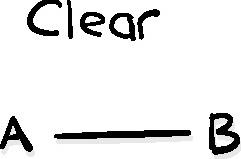

# 5 Риск

Ничто никогда не будет предпринято, если сначала не будут преодолены все
возможные возражения.

Сэмюэл Джонсон.

Мысли о рисках вызывают в воображении чувство опасности личной или
организационной. В то время как некоторые люди находят флирт с опасностью
возбуждающим, в конечном итоге все хотят избежать ее последствий. Для IT риск —
это вероятность того, что продукт или услуга не будут доставлены нужным людям в
нужное время достаточно безопасным и надежным способом, который позволит им
успешно достичь намеченных результатов. Поскольку IT встроены в критически
важные части нашей повседневной жизни, предотвращение сбоев в IT становится все
более важным. Оценка рисков нужна, чтобы поставщик, клиент и их персонал были
уверены в том, как выявляются, оцениваются и смягчаются любые вероятные и
недопустимо опасные ошибки.

К сожалению, управлять IT-рисками стало сложнее. Раньше программное обеспечение
было проще и работало локально, сейчас IT-решения, скорее всего, будут состоять
из большого количества взаимозависимых компонентов. Каждый сервис, который сам
полагается на глобальные цепочки поставок, чтобы доставить свою часть пазла.
Также сервисы часто предоставляется нескольким организациям. Такая сложность
ломает многиеметоды традиционного управления рисками. Наличие такого количества
поставщиков в цепочке доставки затрудняет, если вообще ни делает невозможным,
для организаций понимание всего стека технологий, чтобы полагаться на
стандартные процедуры выявления и контроля рисков. Как наглядно показали взломы
SolarWinds в 2020 году (см. врезку), достаточно одной ошибки в звене цепочки,
чтобы затронуть все остальные.

Эксплойт Solar Winds Sunburst.

Нарушения безопасности, известные под общим названием взломы SolarWinds, были
вызваны серией уязвимостей в цепочке поставок IT. Хакерам удалось
скомпрометировать систему сборки, принадлежащую компании SolarWinds, что
позволило им установить вредоносное ПО в обновления, распространяемые среди
клиентов программного обеспечения SolarWinds для мониторинга сети Orion. Это
позволило хакерам получить удаленный доступ к широкому кругу жертв, включая
правительство США.

В это же время злоумышленники также воспользовались уязвимостями в Microsoft,
получив доступ ко всем действительным именам пользователей и паролям в каждой
взломанной системе Microsoft. Это позволило им получить доступ к учетным данным,
необходимым для получения привилегий любого пользователя, включая учетные записи
клиентов Office 365. Нарушение было настолько глубоким, что на момент написания
неясно, будут ли когда-либо полностью поняты его масштабы, не говоря уже об
устранении всего ущерба.

Современные IT-решения требуют наилучшего способа оценки и управления рисками.
Вместо того, чтобы продолжать полагаться на использование процессов соблюдения
требований для выявления потенциальных опасностей и последующего снижения их
рисков, нам нужно взглянуть на то, что мы знаем о доставке наших данных и в
целом экосистеме, в которой мы работаем. Насколько хорошо мы видим элементы,
составляющие экосистему, а также предсказуемость и упорядоченность ее работы.

В этой главе мы исследуем, как порядок и предсказуемость влияют на риски и
процессы принятия решений. Мы также рассмотрим ряд методов, которые помогут
снизить риски, связанные с неизвестными и непонятными уязвимостями в вашей
экосистеме.

## Cynefin и принятие решений

Мы знаем, что уловия, в которых мы находимся, могут различаться. Чем сложнее и
динамичнее наша среда, тем больше контекста и ситуационной осведомленности нам
нужно, чтобы уверенно принимать в ней эффективные решения. Однако сложность и
динамичность не обязательно означает наличие большего или более серьезного
риска. Например, закройщик мяса на мясокомбинате работает в гораздо менее
сложных условиях, чем трейдер, торгующий фьючерсами, однако большинство
согласится с тем, что закройщик мяса сталкивается с более высоким риском травмы
или смерти из-за неправильного решения на рабочем месте.

Разница заключается в способах управления рисками. Хотя риски для мясорубки
более серьезные, их число невелико и хорошо известно. Большинство рисков для
мясорубки можно снизить с помощью процедур, предусмотренных сценарием, которые
можно тщательно контролировать, например, убедиться, что режущие инструменты
острые и в хорошем рабочем состоянии, использовать такие инструменты только
определенным образом и избегать скользких поверхностей.

Торговец овощами, с другой стороны, сталкивается с широким спектром причин, по
которым, казалось бы, разумные решения могут оказаться недействительными: от
плохой погоды и нашествий вредителей до неожиданных небывалых урожаев и
политических событий, которые резко меняют динамику спроса и предложения на
рынке. Для продавцов овощей запрограммированный набор процедур вряд ли поможет
выявить риски, не говоря уже о том, чтобы управлять ими. Вместо этого им
приходится постоянно искать самую актуальную, релевантную и контекстуальную
информацию и соответствующим образом корректировать свои позиции в пределах
допустимого риска.

Эта взаимосвязь между контекстуальной динамикой и актуальностью подхода стала
очевидной для Дэвида Сноудена, когда он работал над проблемой управления
информацией и организационной стратегией. На основе своей работы он разработал
схему, используемую для содействия принятию решений, под названием Cynefin.

Его схема представляет собой инструмент комплексного мышления, призванный помочь
людям почувствовать ситуационный контекст, в котором они находятся, чтобы
принимать более эффективные решения[^1]. Сноуден продолжал работать и
настраивать схему, которая превратилась в очень полезное руководство, помогающее
людям распознавать динамику области, в которой они работают, и понять, почему
подход, хорошо работавший в одном контексте, может с треском провалиться в
другом[^2].

[^1]: David J. Snowden and Mary E. Boone, "A Leader’s Framework for Decision
    Making," Harvard Business Review, November 2007 <a name="David J.
    Snowden">https://hbr.org/2007/11/a-leaders-framework-for-decision-making</a>

[^2]: The Cynefin Framework, <a name="David J.
    Snowden">https://thecynefin.co</a>

**Рисунок 5.1**

Фреймворк Cynefin

Фреймворк Cynefin состоит из пяти контекстуальных областей: область четких
контекстов, cложная контекстуальная область, комплексная область, хаотичная и
смешанная. Каждый домен определяется характером связи между причиной и
следствием, при этом четкие и сложные домены представляют собой две формы
упорядоченных систем, а сложные и хаотические домены являются формами
неупорядоченных систем.

Некоторые среды с большей вероятностью принадлежат определенной контекстуальной
области, чем другие, но любые изменения могут повысить или понизить сложность,
которая переместит среду в другую область. Это часто не только нарушает
существующее управление рисками, но и может создавать трудности при передаче
данных и ухудшать ситуационную осведомленность.

Изучение того, как распознавать области, в которых находится ваша организация в
данный момент времени, может помочь вам найти наилучший подход к управлению
любым риском. Это также может быть полезным для улучшения моделей поведения,
которые отвечают за принятие решений.

Давайте взглянем на каждую область, чтобы лучше понять различия между ними.

### Упорядоченные системы

Упорядоченные системы — это такие системы, в которых конкретный ввод данных или
конкретное действие непосредственно приведет к одному и тому же результату. Эта
четкая и очевидная взаимосвязь между причиной и следствием сохраняется
независимо от того, требуется ли для ее наблюдения особый опыт. Таким образом,
система может быть разобрана и собрана обратно простым способом, как машина.

Как вы увидите, именно уровень знаний, необходимый для того, чтобы увидеть
причинно-следственную связь и принять эффективное решение, разделяет очевидные и
комплексные контекстуальные области. Различие между этими областями также играет
значительную роль в том, как наилучшим образом управлять рисками в каждой из
них.

#### Четкие контексты: «Лучшая область для практики»

**Рисунок 5.2**

Область четких контекстов — простая и очевидная

Четкие контексты --- это те, в которых проблема хорошо понята, а решение
очевидно, что обеспечивает идеальную ситуационную осведомленность. Сноуден
называет их <<общеизвестными>>[^3]. Решение проблемы не требует реальных знаний,
просто способности уловить проблему, классифицировать ее и реагировать в
соответствии с установленной практикой для категории проблемы. Поскольку
проблема уже известна, все решение проблеммы может быть задукоментировано, чтобы
кто-то мог следовать шаг за шагом, либо в виде автоматизированного инструмента,
который может быть активирован в соответствующее время.

[^3]: Там же, стр. 3

Предыдущий сценарий мясокомбината является хорошим примером упорядоченной
системы, работающей в четкой контекстуальной области. В то время как опытный
мясник может работать быстрее и с меньшей вероятностью получить травму, чем
новичок, это небольшое, еле заметное отличие в разделке туш того же типа,
которые не могут быть написаны по сценарию.

Четкие контексты хорошо подходят для моделей управления, основанных на
Тейлористских методах, представленных в главе 2 <<Как мы принимаем решения>>.
Работа может быть определена и спланирована заблаговременно с помощью
инструкций, идущих сверху вниз, с подробным описанием. К управлению рисками
можно применить данный подход, обеспечив, что работники строго придерживаются
инструкций, в которых четко проверяется наличие известных потенциальных
опасностей, таких как состояние инструментов и поверхностей, как в примере с
упаковкой мяса. Четкие контексты являются желаемой областью служб и функций
поддержки уровня 1 в традиционном управлении сервисами, поскольку инструкции
могут быть размещены в документациях, которые могут быть изучены и которым может
следовать самый младший технический специалист.

Есть два типа проблем, которые могут погрузить четкую контекстуальную среду в
хаос, из которого трудно выбраться. Первая опасность заключается в том, что при
таком большом количестве бездумных действий и руководств с пунктами идущими
сверху вниз, легко изменяются условия, которые приводят к образованию пробелов в
осознании. Поскольку люди, работающие в таких условиях, настолько привыкли
следовать заведенному порядку, они часто пропускают признаки надвигающейся
опасности до тех пор, пока не становится слишком поздно реагировать. Это не
только плохо сказывается на результатах, но и приводит к сбоям и хаосу, которые
могут привести к резкому падению доверия работников к менеджеру проета, что еще
больше ухудшает осведомленность команды.

Рисунок 5.3

Даже если домен чист, вам все равно нужно его увидеть.

Существует также вторая опасность, люди, работающие в экосистеме, настолько
привязываются к своему прошлому опыту, обучению и успехам, что становятся
слепыми к новым способам мышления, обучения и самосовершенствования. Прошлые
правила становятся неизменными в их сознании, даже когда вокруг них
накапливаются доказательства их непригодности. Устоявшиеся фирмы, которые
когда-то были успешными, и крупные бюрократические структуры часто попадают в
эту ловушку, уступая успех более динамичным компаниям.

#### Сложно-контекстуальная область: Область экспертов

**Рисунок 5.4**

Некоторые проблемы настолько сложны, что для их решения нужен эксперт.

Сложная контекстуальная область --- это область квалифицированного эксперта. В
отличие от области четких контекстов, существует достаточно <<известных
неизвестных>>, чтобы менеджмент больше не мог полагаться исключительно на
многократно используемые сценарии, которым может следовать неквалифицированный
работник для решения проблемы. Вместо этого требуется определенный уровень
знаний в предметной области, чтобы как проанализировать происходящее, так и
выбрать подходящий эффективный набор действий. Типичными примерами такого опыта
являются автомеханик, специалист по ремонту электроники или специалист по
поддержке IT-систем. Конечно, все они были обучены сопоставлять симптомы с
известными решениями, которые они могут уверенно выполнять.

Вместо того чтобы тратить время на написание сценариев и внедрение методов,
менеджеры разбивают область оказания услуг по навыкам и количеству персонала. А
затем распределяют задачи в соответствии с предполагаемым спросом. В результате
управление рисками обычно осуществляется с помощью top-down change-gate
процессов. Это процессы, которые разделяют сферу оказания услуг на отдельные
этапы проектирования, разработки, тестирования и выпуска, каждый из которых
выделяется способом управления изменениями в конце каждого этапа, в котором
могут быть проанализированы условия для выявления потенциальных проблем,
требующих решения.

Несмотря на кажущуюся простоту, существует ряд проблем, которые традиционные
сложные процессы управления рисками в контекстуальной области, как правило, с
трудом поддаются адекватному решению. Одна из них заключается в чрезмерной
зависимости от узконаправленных квалифицированных специалистов. Поскольку они,
как правило, оправдывают свою важность только тем, насколько хорошо они
выполняют свою специальность. Их узкая направленность часто фрагментирует
организационную ситуационную осведомленность по функциональным или
специализированным направлениям.

Организации, которые полагаются на квалифицированных специалистов, также зависят
от них в плане внедрения инноваций и улучшений. Это может быть проблематично,
когда специалисты, чья ценность в узкой специальности, чувствуют угрозу из-за
любых изменений, которые могут снизить их важность. Они могут упускать из виду
или отвергать новые концепции, которые им неизвестны или которые, по их мнению,
ставят под угрозу их ценность.

Аналогичным образом, конкурирующие специалисты также могут участвовать в
бесконечных дебатах и <<аналитическом параличе>>, которые создают трудноразрешимые
разногласия при принятии решений. Это может помешать организации решить проблему
и двигаться вперед.

### Неупорядоченные системы

Неупорядоченные системы --- это те, в которых причинно-следственная связь может
быть определена только в самом начале, или вообще может быть не установлена,
даже когда система стабильна. Ограничения и поведения компонентов развиваются с
течением времени благодаря взаимодействию. В таких системах никакой анализ не
поможет предсказать системное поведение, что делает невозможным деконструкцию и
повторную сборку как упорядоченной системы.

Поскольку причинно-следственная связь не очевидна сразу, данные системы --- это
также системы, в которых далеко не просто использовать элементы управления
подходящие к упорядоченным для менеджмента рисков. Это делает переход в
неупорядоченную системную область особенно опасным для организаций, которые
полагаются на четко и сложно контекстные подходы к управлению рисками.
Исчезновение взаимосвязи между причиной и следствием может привести к тому, что
организации полностью упустят критически важные опасности или, что еще хуже, не
смогут справиться с ними, когда они возникнут.

#### Комплексная область: <<Область возникновения>>

**Рисунок 5.5**

Комплексная область

Когда в экосистеме существуют неизвестные факторы, из-за которых одно и то же
действие приводит к разным результатам, скорее всего, вы попали в комплексный
контекст. В комплексной области окружающая среда находится в постоянном движении,
скрывая причинно-следственные связи в массе, казалось бы, беспорядочно
движущихся фрагментов. Мало того, что непонятно существует ли правильный ответ
на проблему, так и трудно найти правильные вопросы для постановки. Решения
становятся очевидными только после того, как они обнаружены или появятся в
результате постоянных экспериментов.

Эта необходимость постоянно исследовать и тестировать динамику экосистемы, чтобы
решать проблемы и принимать эффективные решения в ней, отражает многие элементы
цикла OODA Бойда, рассмотренного в главе 2 <<Как мы принимаем решения>>. Это
позволяет тем, кто занимается IT, находить способы учиться с помощью серии
экспериментов, чтобы наблюдать, как системные элементы влияют на поведение
системы в целом. Это увеличивает объем понимания, облегчая выявление изменений и
возникающих закономерностей, которые затем могут быть использованы для повышения
эффективности принятия решений.

Полагаться на эксперименты, а не на контроль процесса и мнение экспертов, может
показаться рискованным для тех, кто привык к упорядоченным системам. Риск больше
нельзя <<контролировать>> с помощью нисходящих процессов. Не только это, но и
необходимость постоянного экспериментирования требует, чтобы рабочая среда была
как терпимой к сбоям, так и безопасной при их возникновении. Неудача сама по
себе не может рассматриваться как неприемлемая опасность, а также как недостаток
в системе управления рисками.

Однако существует ряд вещей, которые люди упускают из виду при управлении
рисками в экосистеме с комплексно областью. Первое заключается в том, что
терпимость к неудаче --- это не разрешение экспериментировать способами,
создающими неприемлемый уровень риска. Никто не добьется успеха, опрометчиво
внося экспериментальные изменения, которые негативно скажутся на клиентах, в
критически важные производственные сервисы. Необходимо обладать достаточной
ситуационной осведомленностью, чтобы помочь людям снизить любые чрезмерные
риски, которые в противном случае могут сделать небезопасным провал
эксперимента.

Это подводит нас ко второй проблеме. Несмотря на то, что система
неупорядоченная, по-прежнему важно постоянно прилагать усилия для создания
порядка и прозрачности там, где это возможно. Хорошие управление системами
компоновки, системами управления пакетов и системами развертывания чрезвычайно
ценны для снижения ошибок в экосистеме, которые могут сильно осложнить получение
ситуационной осведомленности.

Снова и снова я сталкиваюсь с организациями, которые запускают код в реальном
времени и вручную меняют конфигурации, не утруждая себя фиксацией изменений,
чтобы команда могла понять и легко воссоздать изменения в будущем, когда это
понадобится. Это не только создает хрупкие системы (snowflake), но и говорит о
том,  любое разрушительное событие (будь то сбой диска, случайное
удаление/перезапись или атака шифрования с помощью программы вымогателя) может
стать неустранимым.

То же самое относится к serverless архитектурам. В них недостаточно внимания
уделяется пониманию и мепингу их архитектуры и событий. Я видел всевозможные
перемещения и искажения данных, возникающие из-за неожиданных потоков событий.
Аналогичным образом, я видел организации, у которых было так много
переключателей производственной конфигурации и комбинаций A / B тестирования,
оставшихся в рабочем состоянии, что ни одно действие клиента не было
окончательно известно или повторяемо. Это делало устранение неполадок и
управление зависимостями практически невозможными.

Еще одна область, вызывающая озабоченность, связана с организациями, которые
сохраняют разделение рабочих мест и команд. Прежде всего, для того, чтобы
эксперименты работали хорошо, все должны стремиться к одним и тем же общим
результатам. Это помогает не только поддерживать межорганизационную
согласованность, но и свести к минимуму количество случаев, когда необходимо
опровергать неверную гипотезу.

Четкое разбиение по командам усложняют это. Обе проблемы излишне фрагментируют
ситуационную осведомленность и приводят к постановке локализованных целей,
которые могут легко стать конфликтовать друг с другом. Это может не только
затруднить поиск решений, но и погрузить организацию в еще более неупорядоченную
контекстуальную область --- хаотичную.

#### Хаотичная область: <<Область быстрого реагирования>>

**Рисунок 5.6**

Область хаоса, где все кажется вышедшим из-под контроля

Проблемы в области хаоса, как правило, напоминают сорвавшийся с места грузовой
поезд, полный взрывчатки, охваченный пламенем. Окружающая среда перестает
функционировать с каким-либо подобием стабильности, что делает сдерживание хаоса
и установление порядка первоочередной задачей. Это область <<непонятного>>, где
все катастрофически рушится без явных намеков на решение или первопричину.
Проектные группы должны максимально страться, чтобы их область разработки не
стала хаотической.

В хаосе невозможно определить взаимосвязи между причиной и следствием, потому
что динамика постоянно меняется без какой-либо закономерности. Ситуационная
осведомленность теряется, а вместе с ней и способность принимать решения, кроме
самых элементарных. Такие кризисы требуют решительных действий для немедленной
сортировки и решения наиболее насущных проблем. Чтобы благополучно выбраться из
царства хаоса, требует следующее:

• Определите и защитите наиболее важные участки, находящиеся в критической
опасности, но которые можно спасти.

• Как можно быстрее определите зоны стабильности и кризиса.

• Максимизируйте поток информации везде, где это возможно, чтобы повысить
осведомленность о ситуации и отслеживать ее.

• Установите эффективные линии связи с членами команды, чтобы уменьшить путаницу
и помочь распределить ресурсы для сдерживания угроз.

• Постарайтесь стабилизировать ситуацию и перевести ее из состояния хаоса в
состояние комплексной области.

Все это должно быть сделано, не давая людям впасть в панику.

Случайное попадание в область хаоса иногда может быть полезным для организаций,
которые закостенели и нуждаются в встряске. Этот опыт дает возможность порвать
со старыми концепциями, которые больше не соответствуют поставленным целям, и
стимулировать инновации, а также новые способы работы. На самом деле,
трансформационные лидеры нередко ввергают организацию в хаос, чтобы ускорить
принятие необходимых изменений.

Однако область хаоса --- это не та область, в которой организации могут
позволить себе оставаться в течение какого-либо периода времени. Это чрезвычайно
напряженная ситуация, и отсутствие стабильности часто отпугивает как разумных
клиентов, так и персонал. Попасть в данную область настолько опасно, что такие
военные стратеги, как Сунь-цзы и Бойд, намеренно дестабилизировали противника,
заставляя динамику поля боя меняться быстрее, чем может выдержать процесс
принятия решений. Это часто называют “захват противника в петлю принятия
решений”.

Некоторые люди преуспевают в данной области благодаря приливу адреналина и
чувству героизма, которые могут возникнуть при стремительном преодолении
кризиса. Эти люди идут на многое, чтобы добиться этого, иногда доходя до того,
что сознательно или подсознательно создают те самые условия, которые сами
толкают организацию в хаос. Они часто жаждут культового обожания, которое чтобы
почувствовать себя героем. Данных людей можно сравнить с диктаторами или
поджигателями - пожарными.

#### Диктаторы и поджигатели - пожарные

**Рисунок 5.7**

Диктатор

Вы когда-нибудь задумывались, почему есть некоторые люди, которые, кажутся,
довольными или даже наслаждающимися окружающей средой, которая находится в
хаосе? Возможно, вы даже зашли дальше, задаваясь вопросом, как такие диктаторы,
как Сталин, Мао, Саддам Хусейн и Кимы Северной Кореи, смогли сохранить власть,
несмотря на регулярные чистки в своих рядах, способами, которые, казалось бы,
ослабляют возможности их нации. Такие диктаторы, похоже, намеренно непрекращают
тот самый хаос, который разрушает то, что они должны защищать.

Некоторые стремятся разрушить личную неуверенность, в то время как другие хотят
испытать то наслождение от самолюбования, который они получают, играя героя.
Часто именно действия, которые совершаются на пути к признанию и вознаграждению
либо в текущей организации, либо в прошлой, заставляют людей обоих типов
действовать так, чтобы сеять организационный хаос. Важно распознавать таких
людей и ограничивать структуры, на которые они влияют.

Диктаторы --- более опасная из этих двух групп. Вместо того чтобы помогать
организации в достижении результатов, они постоянно ищут способы
дестабилизировать других. Иногда целями являются потенциальные соперники,
которых они хотят принизить, чтобы получить преимущество над ними. В других
случаях цель состоит просто в том, чтобы их собственное пространство выглядела
сравнительно лучше, чем у других. Некоторые особо садистичные личности просто
хотят ощутить чувство власти и контроля, которое обычно недосягаемо, даже за
счет более крупной области влияния. Тот факт, что нестабильность, которую они
вызывают, может дорого обойтись организации, не имеет значения для них, пока они
достигают своих целей.

Вопреки распространенному мнению, таким людям не обязательно занимать высокое
положение в организации или обладать особенно широкими полномочиями. На самом
деле, самые грозные из них находятся в ключевых точках и выполняют сторожевые
функции в экосистеме. Я сталкивался этими людьми на таких масштабных должностях,
как управление финансами и поставками, юриспруденция, инженер проекта,
управление проектами и программами и даже системное администрирование. Это дает
им безграничное влияние, выходящее далеко за рамки возложенных на них
обязанностей, тем самым позволяя им ставить под угрозу общие цели бизнеса и
желаемые результаты клиентов.

Распространенные признаки диктаторства включают угрозы замедлить, остановить
работу, а также навязывание альтернативного решения под предлогом защиты
компании от невидимого или воображаемого риска. Один из примеров, который я
видел, --- это принуждение к использованию определенной технологии или
архитектуры. Человек утверждал, что это <<единственный проверенный и приемлемый
вариант>>, даже когда он явно не подходит для поставленной задачи. Такое
поведение может заставить управляющего умолять или делать неоптимальный выбор,
чтобы избежать срыва сроков или плохого внешнего вида.

Другим распространенным примером потенциального диктатора является разработчик
или технический персонал, который отказывается делиться с другими членами
команды тонкостями управления конкретной подсистемой. Их скрытые знания снижают
осведомленность о ситуации и, следовательно, общие способности всей организации
к принятию решений. Сразу непонятно намеренно или нет, они используют свои
знания, чтобы держать других членов организации в заложниках.

Важно исследовать первопричину такого поведения. Некоторые, кого соблазняет
диктаторское поведение, ищут контроля, будь то для того, чтобы использовать его
над членами команды, или для того, чтобы контролировать саму работу и то, как
она распределяется по приоритетам. Однако иногда такое поведение вызвано
организациями, которые регулярно разрушают доверие к себе. В таких случаях
потенциальный диктатор может опасаться, что члены команды <<все испортят>> и
останутся безнаказанными, или что их перестанут ценить и они потеряют работу.

В то время как диктаторы на руководящих должностях могут использовать кризисы
для проведения необходимых изменений, другие диктаторы используют кризисы для
подавления этого, чтобы восстановить свой контроль. Они могут присваивать
ресурсы и убивать жизнеспособные альтернативы под предлогом защиты от
предполагаемых организационных угроз. Это эффективное средство для устранения
конкурентов и подавления идей, которые они считают опасными, до того, как будет
доказано, что эти идеи являются жизнеспособными и безопасными альтернативами.