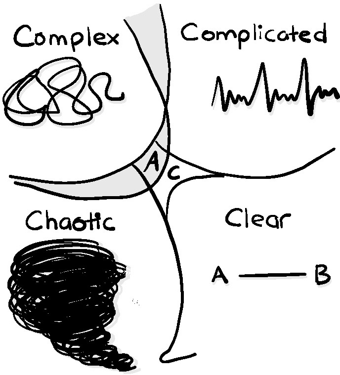
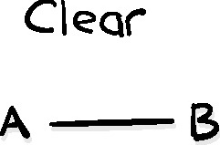
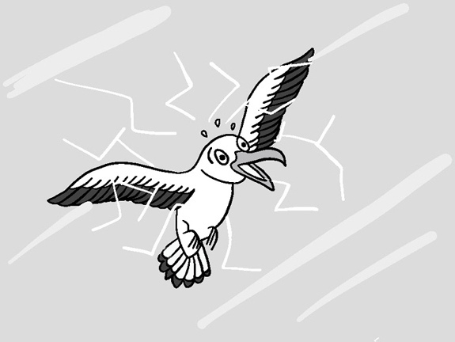
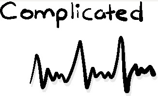
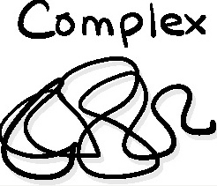
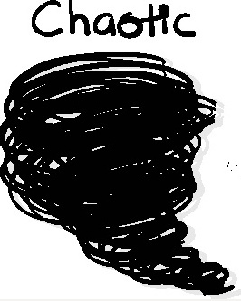
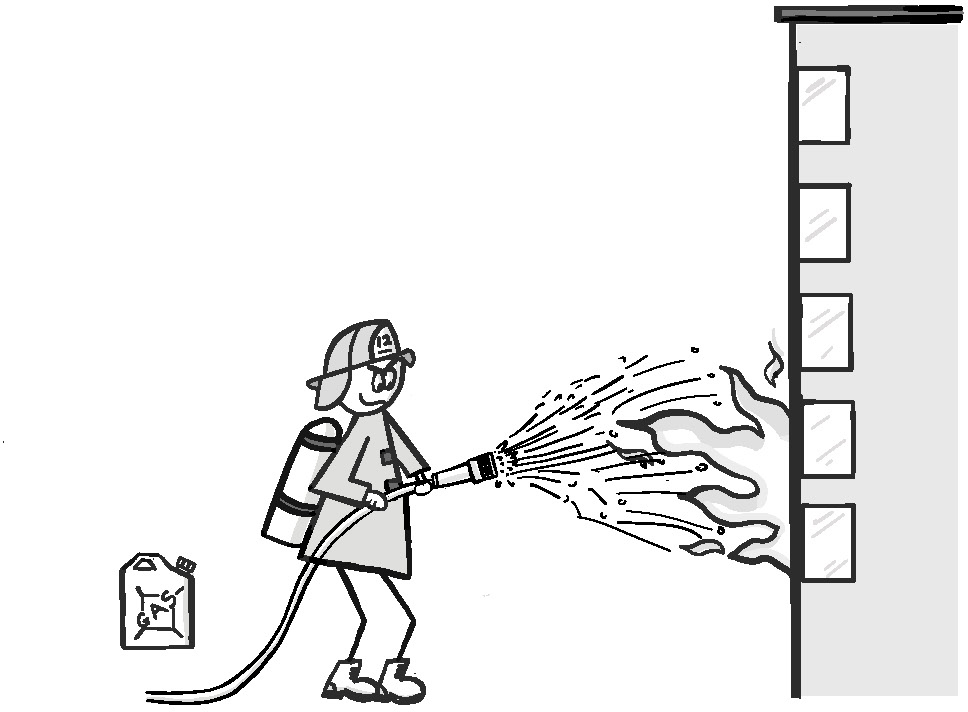
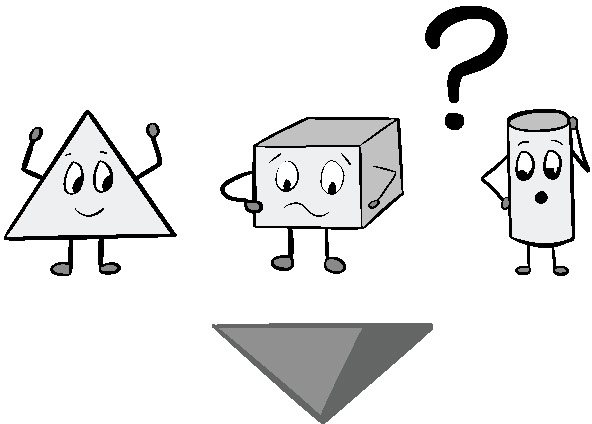
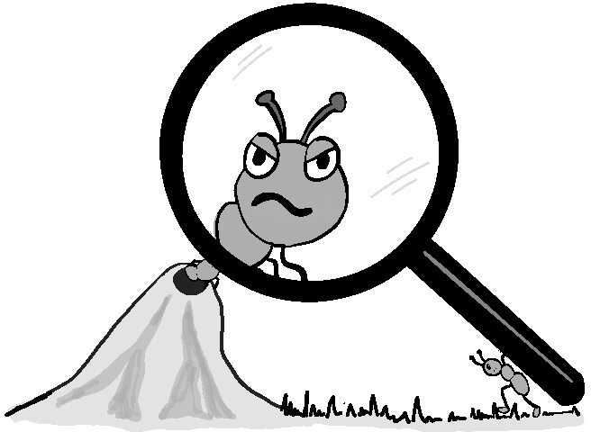

> _Ничто никогда не будет предпринято, если сначала должны быть преодолены все
> возможные возражения._
>
> --- Сэмюэл Джонсон.

Мысли о рисках вызывают чувство опасности личной или организационной. В то время
как некоторые люди находят флирт с опасностью возбуждающим, в конечном итоге все
хотят избежать ее последствий. Для ИТ риск --- это вероятность того, что продукт
или услуга не будут доставлены нужным людям в нужное время достаточно безопасным
и надежным способом, который позволит им успешно достичь намеченных результатов.
Поскольку ИТ встроены в критически важные части нашей повседневной жизни,
предотвращение сбоев ИТ становится все более важным. Поэтому важно, чтобы
поставщик, заказчик и его персонал были уверены в том, как выявляются,
оцениваются и устраняются любые вероятные и недопустимо опасные ошибки.

К сожалению, управлять ИТ-рисками стало сложнее. Раньше программное обеспечение
было проще и работало локально, сейчас ИТ-решения, скорее всего, будут состоять
из большого количества взаимозависимых компонентов. Сервисы часто
предоставляются несколькими организациями, многие из которых сами полагаются на
глобальные цепочки поставок, чтобы доставить свою часть пазла. Такая сложность
ломает многие методы традиционного управления рисками. Наличие такого количества
поставщиков в цепочке поставки затрудняет, если вообще не делает невозможным,
для организаций понимание всего стека технологий, чтобы полагаться на
стандартные процедуры выявления и контроля рисков. Как наглядно показали взломы
SolarWinds в 2020 году (см. врезку), достаточно одной ошибки в звене цепочки,
чтобы затронуть все остальные.

## Эксплойт Solar Winds Sunburst.

> Нарушения безопасности, известные под общим названием взломы SolarWinds, были
> вызваны серией уязвимостей в цепочке поставок ИТ. Хакерам удалось подвергнуть
> риску систему сборки, принадлежащую компании SolarWinds, что позволило им
> установить вредоносное ПО в обновления, распространяемые среди клиентов
> программного обеспечения SolarWinds для мониторинга сети Orion. Это позволило
> хакерам получить удаленный доступ к широкому кругу жертв, включая
> правительство США.
>
> В это же время злоумышленники также воспользовались уязвимостями в Microsoft,
> получив доступ ко всем действительным именам пользователей и паролям в каждой
> взломанной системе Microsoft. Это позволило им получить доступ к учетным
> данным, необходимым для получения привилегий любого пользователя, включая
> учетные записи клиентов Office 365. Нарушение было настолько глубоким, что на
> момент написания неясно, будут ли когда-либо полностью поняты его масштабы,
> не говоря уже об устранении всего ущерба.

Современные ИТ-решения требуют наилучшего способа оценки и управления рисками.
Вместо того чтобы продолжать полагаться на использование процессов соблюдения
требований для выявления потенциальных опасностей и последующего снижения их
рисков, нам нужно взглянуть на то, что мы знаем о доставке наших данных и в
целом экосистеме, в которой мы работаем. Это включает в себя, то насколько
хорошо мы видим элементы, составляющие экосистему, так же как предсказуемость и
упорядоченность ее работы.

В этой главе мы исследуем, как порядок и предсказуемость влияют на риски и
процессы принятия решений. Мы также рассмотрим ряд методов, которые помогут
снизить риски, связанные с неизвестными и непонятными уязвимостями в вашей
экосистеме.

## Cynefin и принятие решений

Мы знаем, что условия могут отличаться по сложности. Чем сложнее и динамичнее
наша среда, тем больше контекста и ситуационной осведомленности нам нужно, чтобы
уверенно принимать в ней эффективные решения. Однако сложность и динамичность
необязательно означает наличие большего или более серьезного риска. Например,
закройщик мяса на мясокомбинате работает в гораздо менее сложных условиях, чем
трейдер, торгующий фьючерсами, однако большинство согласится с тем, что
закройщик мяса сталкивается с более высоким риском травмы или смерти из-за
неправильного решения на рабочем месте.

Разница заключается в способах управления рисками. Хотя риски для закройщика
мяса более серьезные, их число невелико и хорошо известно. Большинство рисков
для закройщика мяса можно снизить с помощью прописанных заранее процедур,
которые можно тщательно контролировать, например, убедиться, что режущие
инструменты острые и в хорошем рабочем состоянии, использовать такие инструменты
только определенным образом и избегать скользких поверхностей.

Торговец овощами, с другой стороны, сталкивается с широким спектром причин, по
которым, казалось бы, разумные решения могут оказаться недействительными: от
плохой погоды и нашествий вредителей до неожиданных небывалых урожаев и
политических событий, которые резко меняют динамику спроса и предложения на
рынке. Для продавцов овощей прописанный заранее набор процедур вряд ли поможет
выявить риски, не говоря уже о том, чтобы управлять ими. Вместо этого им
приходится постоянно искать самую актуальную, релевантную и контекстуальную
информацию и соответствующим образом корректировать свои позиции в пределах
допустимого риска. 

Эта взаимосвязь между контекстуальной динамикой и актуальностью подхода стала
очевидной для Дэвида Сноудена, когда он работал над проблемой управления
информацией и организационной стратегией. На основе своей работы он разработал
схему, используемую для содействия принятию решений, под названием _Cynefin_.
Его схема представляет собой инструмент комплексного мышления, призванная помочь
людям почувствовать ситуационный контекст, в котором они находятся, чтобы
принимать более эффективные решения[^1]. Сноуден продолжал работать и
настраивать схему, которая превратилась в очень полезное руководство, помогающее
людям распознавать динамику области, в которой они работают, и понять, почему
подход, хорошо работавший в одном контексте, может с треском провалиться в
другом[^2].

[^1]: David J. Snowden and Mary E. Boone, "A Leader’s Framework for Decision
    Making," Harvard Business Review, November 2007
    <https://hbr.org/2007/11/a-leaders-framework-for-decision-making>

[^2]: The Cynefin Framework, <https://thecynefin.co>

**Рисунок 5.1** Фреймворк Cynefin

Фреймворк Cynefin состоит из пяти контекстуальных областей: _область четких
контекстов, cложная контекстуальная область, комплексная область, хаотичная_ и
_смешанная_. Каждый домен определяется характером связи между причиной и
следствием, при этом четкие и сложные домены представляют собой две формы
упорядоченных систем, а сложные и хаотические домены являются формами
неупорядоченных систем.

Некоторые среды с большей вероятностью принадлежат определенной контекстуальной
области, чем другие, но любые изменения могут повысить или понизить сложность,
которая переместит среду в другую область. Это часто не только нарушает
существующее управление рисками, но и может создавать разногласия при передаче
данных и ухудшать ситуационную осведомленность.

Изучение того, как распознавать области, в которых находится ваша организация в
данный момент времени, может помочь вам найти наилучший подход к управлению
любым риском. Это также может быть полезным способом выявления и смягчения
многих распространенных моделей поведения, которые часто снижают качество
принятия решений.

Давайте взглянем на каждую область, чтобы лучше понять различия между ними.

## Упорядоченные системы

Упорядоченные системы --- это такие системы, в которых конкретный ввод данных
или конкретное действие непосредственно и предсказуемо приведет к одному и тому
же результату. Эта четкая и очевидная взаимосвязь между причиной и следствием
сохраняется независимо от того, требуется ли для ее наблюдения особый опыт.
Таким образом, система может быть разобрана и собрана обратно простым способом
как машина.

Как вы увидите, именно уровень знаний, необходимый для того, чтобы увидеть
причинно-следственную связь и принять эффективное решение, разделяет очевидные и
комплексные контекстуальные области. Различие между этими областями также играет
значительную роль в том, как наилучшим образом управлять рисками в каждой из
них.

### Четкие контексты: <<Лучшая область для практики>>

**Рисунок 5.2** Область четких контекстов --- простая и очевидная

Четкие контексты --- это те, в которых проблема хорошо понята, а решение
очевидно, что обеспечивает идеальную ситуационную осведомленность. Сноуден
называет их <<общеизвестными>>[^3]. Решение проблемы не требует реальных знаний,
просто способность уловить проблему, классифицировать ее и реагировать в
соответствии с практикой установленной для этой категории проблем. Поскольку
проблема уже известна, все решения проблемы могут быть задокументированы
заранее, чтобы кто-то мог следовать им шаг за шагом, либо быть в виде
автоматизированного инструмента, который будет активирован в соответствующее
время.

[^3]: Там же, стр. 3

Предыдущий сценарий мясокомбината является хорошим примером упорядоченной
системы, работающей в четкой контекстуальной области. В то время как опытный
мясник может работать быстрее и с меньшей вероятностью получить травму, чем
новичок, здесь есть еле заметное отличие в разделке туш того же типа, которое не
может быть задокументированным.

Четкие контексты хорошо подходят для моделей управления, основанных на
Тейлористских методах, представленных в главе 2 <<Как мы принимаем решения>>.
Работа может быть определена и спланирована заблаговременно с помощью
инструкций, идущих сверху вниз, с подробным описанием  лучших практик. К
управлению рисками можно применить данный подход, обеспечив, что работники
строго придерживаются инструкций, в которых четко проверяется наличие известных
потенциальных опасностей, таких как состояние инструментов и поверхностей, как в
примере с мясокомбинатом. Четкие контексты являются желаемой областью служб и
функций поддержки уровня 1 в традиционном управлении сервисами, поскольку
инструкции могут быть размещены в документациях, которые могут быть изучены и
которым может следовать самый младший технический специалист.

Есть два типа проблем, которые могут погрузить четкую контекстуальную среду в
хаос, из которого трудно выбраться. Первая опасность заключается в том, что,
поскольку большая часть фактических раздумий и управления осуществляется сверху
вниз, условия могут легко изменится, приводя к образованию пробелов в
осведомленности. Поскольку люди, работающие в таких условиях, настолько привыкли
следовать заведенному порядку, они часто пропускают признаки надвигающейся
опасности до тех пор, пока не становится слишком поздно реагировать. Это не
только плохо сказывается на результатах, но и приводит к сбоям и хаосу, которые
могут привести к резкому падению доверия работников к менеджменту проекта, что
еще больше ухудшает осведомленность команды.

**Рисунок 5.3** Даже если область чиста, вам все равно нужно ее видеть.

Существует также вторая опасность, люди, работающие в экосистеме, настолько
привязываются к своему прошлому опыту, обучению и успехам, что становятся
слепыми к новым способам мышления, обучения и самосовершенствования. Прошлые
правила становятся неизменными в их сознании, даже когда вокруг них
накапливаются доказательства их непригодности. Устоявшиеся фирмы, которые
когда-то были успешными, и крупные бюрократические структуры часто попадают в
эту ловушку, уступая успех более динамичным компаниям.

### Сложно-контекстуальная область: Область экспертов

**Рисунок 5.4** Некоторые проблемы настолько сложны, что для их решения нужен
эксперт.

Сложная контекстуальная область --- это область квалифицированных экспертов. В
отличие от области четких контекстов, существует достаточно <<известных
неизвестных>>, чтобы менеджмент больше не мог полагаться исключительно на
многократно используемые сценарии, которым может следовать неквалифицированный
работник для решения проблемы. Вместо этого требуется определенный уровень
знаний в предметной области, чтобы как проанализировать происходящее, так и
выбрать подходящий эффективный набор действий. Типичными примерами такого опыта
являются автомеханик, специалист по ремонту электроники или специалист по
поддержке ИТ-систем. Скорее всего, все они были обучены сопоставлять симптомы с
известными решениями, которые они могут уверенно выполнять.

Вместо того чтобы тратить время на написание сценариев и внедрение методов,
менеджеры разбивают область оказания услуг по навыкам и количеству персонала, а
затем распределяют задачи в соответствии с предполагаемым спросом. В результате
управление рисками обычно осуществляется с помощью нисходящих "change-gate"
процессов. Это процессы, которые разделяют сферу оказания услуг на отдельные
этапы проектирования, разработки, тестирования и выпуска, каждый из которых
выделяется способом управления изменениями в конце каждого этапа, в котором
могут быть проанализированы условия для выявления потенциальных проблем,
требующих решения.

Несмотря на кажущуюся простоту, существует ряд проблем, которые традиционные
процессы управления рисками в сложно-контекстуальной области, как правило, не
могут решить должным образом. Одна из них заключается в чрезмерной зависимости
от узконаправленных квалифицированных специалистов. Поскольку они, как правило,
оправдывают свою важность только тем, насколько хорошо они выполняют свою
специальность, их узкая направленность часто фрагментирует организационную
ситуационную осведомленность по функциональным или специализированным
направлениям.

Организации, которые полагаются на квалифицированных специалистов, также зависят
от них в плане внедрения инноваций и улучшений. Это может быть проблематично,
когда специалисты, заинтересованные в обосновании своей ценности, чувствуют
угрозу из-за любых изменений, которые могут снизить ее. Они могут игнорировать
или отвергать новые концепции, которые им неизвестны или которые, по их мнению,
ставят под угрозу их ценность. Аналогичным образом, конкурирующие специалисты
также могут участвовать в бесконечных дебатах и <<аналитическом параличе>>,
которые создают трудноразрешимые разногласия при принятии решений. Это может
помешать организации решить проблему и двигаться вперед.

## Неупорядоченные системы

Неупорядоченные системы --- это те, в которых причинно-следственная связь может
быть определена только задним числом, если вообще может быть установлена, даже
если система стабильна. Ограничения и поведения развиваются со временем в
результате взаимодействия компонентов. В таких системах никакой анализ не
поможет предсказать системное поведение, поэтому их невозможно разобрать и
собрать заново, как упорядоченную систему.

Поскольку причинно-следственная связь не очевидна сразу, неупорядоченные системы
--- это также системы, в которых далеко не просто использовать средства контроля
в стиле упорядоченных систем для управления рисками. Это делает переход к
неупорядоченной системной области особенно опасным для организаций, которые
полагаются на четко и сложно контекстные подходы к управлению рисками.
Исчезновение связи между причиной и следствием может привести к тому, что
организации могут полностью упустить критически важные опасности или, что еще
хуже, не смогут справиться с ними, когда они возникнут.

На самом деле, такой переход может показаться настолько бессмысленным, что те,
кто ожидает упорядоченной системы, могут отказаться верить в то, что любой сбой
в управлении рисками является чем-то большим, чем недостаточно энергичное
применение существующих методов. Вместо того чтобы изменить подходы, они
усиливают жесткость своих неудачных процессов, добавляя дополнительные процессы,
документацию и руководство, которые мало помогают в устранении
непредсказуемости, возникающей в самой экосистеме.

Чтобы лучше понять, что происходит, давайте рассмотрим эти два совершенно разных
неупорядоченных системных домена.

### Комплексная область: <<Область возникновения>>

**Рисунок 5.5**

Комплексная область

Когда в экосистеме существуют неизвестные факторы, из-за которых одно и то же
действие при повторении приводит к разным результатам, скорее всего, вы попали в
комплексный контекст. В комплексной области окружающая среда находится в
постоянном движении, скрывая причинно-следственные связи в массе, казалось бы,
беспорядочно движущихся фрагментов. Мало того, что непонятно существует ли
правильный ответ на проблему, но может быть даже трудно найти правильные вопросы
для постановки. Решения становятся очевидными только после того, как они
обнаруживаются или появляются в результате постоянных экспериментов.

Эта необходимость постоянно исследовать и тестировать динамику экосистемы, чтобы
решать проблемы и принимать эффективные решения в ней, отражает многие элементы
цикла НОРД Бойда, рассмотренного в главе 2 <<Как мы принимаем решения>>. Это
позволяет тем, кто в нем находится, находить способы учиться с помощью серии
экспериментов, чтобы наблюдать, как системные элементы влияют на поведение
системы в целом. Это увеличивает объем доступной обратной связи, облегчая
выявление изменений и возникающих закономерностей, которые затем могут быть
использованы для повышения эффективности принятия решений.

Полагаться на эксперименты, а не на контроль процесса и мнение экспертов, может
показаться рискованным для тех, кто привык к упорядоченным системам. Риск больше
нельзя <<контролировать>> с помощью процессов <<сверху вниз>>. Не только это, но
и потребность в постоянных экспериментах требует, чтобы рабочая среда была как
терпимой к сбоям, так и безопасной при их возникновении. Сбой сам по себе не
может автоматически рассматриваться как неприемлемая опасность, не говоря уже о
признаках недостатков в управлении рисками.

Однако существует ряд вещей, которые люди упускают из виду при управлении
рисками в экосистеме с комплексно областью. Во-первых, терпимость к неудачамне
дает права на эксперименты, создающие неприемлемый уровень риска. Никто не
добивается успеха, бездумно внося экспериментальные изменения в критически
важные производственные услуги, которые, скорее всего, негативно повлияют на
клиентов. Необходимо обладать достаточной ситуационной осведомленностью, чтобы
люди могли смягчить любые чрезмерные риски, которые в противном случае могут
сделать провал эксперимента небезопасным.

Это подводит нас ко второй проблеме. Несмотря на то, что система
неупорядоченная, по-прежнему важно постоянно прилагать усилия для создания
порядка и прозрачности там, где это возможно. Хорошие методы управления
системами конфигурацией, компоновки и развертывания чрезвычайно важны для
снижения уровня шума в экосистеме, который может сильно осложнить получение
ситуационной осведомленности.

Снова и снова я сталкиваюсь с организациями, которые внедряют код в реальном
времени и вручную изменяют конфигурации, не заботясь о том, чтобы зафиксировать
изменения в достаточной степени, чтобы команда могла понять и легко воссоздать
изменения в будущем при необходимости. Это не только создает хрупкие системы
(snowflake), но и их невоспроизводимость означает, что любое разрушительное
событие (будь то сбой диска, случайное удаление/перезапись или шифровальная
атака с помощью программ-вымогателей) может стать неустранимым.

То же самое относится к бессерверным (serverless) архитектурам, где недостаточно
внимания уделяется пониманию и мепингу их архитектуры и событий. Я видел
всевозможные состояния гонки и искажения данных, возникающие из-за неожиданных
потоков событий. Аналогичным образом, я видел организации, в которых было так
много переключателей производственной конфигурации и комбинаций
A/B-тестирования, оставленных в производственной среде, что ни одно действие
клиента не было окончательно известно или повторяемо. Это делало устранение
неполадок и управление зависимостями практически невозможными.

Последняя область, вызывающая опасения, связана с организациями, в которых
сохраняется разделение рабочих мест и команд. Прежде всего, для успешного
проведения экспериментов все должны стремиться к одним и тем же общим целевым
результатам. Это помогает не только поддерживать межорганизационную
согласованность, но и свести к минимуму количество случаев, когда необходимо
опровергнуть неверную гипотезу.

Четкое разбиение по командам усложняют эту задачу. Обе проблемы излишне
фрагментируют ситуационную осведомленность и приводят к постановке
локализованных целей, которые могут легко стать разобщенными или конкурировать
друг с другом. Это может не только затруднить поиск решений, но и погрузить
организацию в еще более неупорядоченную контекстуальную область --- хаотичную.

### Хаотичная область: <<Область быстрого реагирования>>

**Рисунок 5.6**

Область хаоса, где все кажется вышедшим из-под контроля

Проблемы в хаотической области, как правило, напоминают бегущий грузовой поезд,
полный взрывчатки, охваченный пламенем. Окружающая среда перестает
функционировать с каким-либо подобием стабильности, что делает сдерживание хаоса
и установление порядка первоочередной задачей. Это область <<непознаваемого>>,
где все катастрофически рушится без явных признаков первопричины или способов ее
устранения. Проектные группы должны максимально страться, чтобы их область
разработки не стала хаотической.

В хаосе невозможно определить взаимосвязи между причиной и следствием, потому
что динамика постоянно меняется без какой-либо управляемой закономерности.
Ситуационная осведомленность теряется, а вместе с ней и способность принимать
какие-либо решения, за исключением самых элементарных. Такие кризисы требуют
решительных действий для немедленной сортировки и решения наиболее насущных
проблем. Чтобы благополучно выбраться из царства хаоса, требует следующее:

-   Определите и защитите наиболее важные участки, находящиеся в критической
    опасности, которые можно спасти.
-   Как можно быстрее разграничьте зоны стабильности и кризиса.
-   Улучшите поток информации везде, где это возможно, чтобы повысить
    осведомленность о ситуации и отслеживать ее.
-   Установите эффективные линии связи с членами команды, чтобы уменьшить 
    путаницу и помочь распределить ресурсы для сдерживания угроз.
-   Постарайтесь стабилизировать ситуацию и перевести ее из состояния хаоса в
    состояние комплексной области.

Все это должно быть сделано, не допуская паники среди людей, находящихся в такой
обстановке.

Периодические попадания в область хаоса иногда могут быть полезны для
организаций, которые закостенели и нуждаются во встряске. Такой опыт дает
возможность избавиться от старых концепций, которые уже не соответствуют своему
назначению, и стимулирует инновации, а также новые методы работы. На самом деле,
лидеры трансформации нередко подталкивают организацию к хаосу, чтобы ускорить
принятие необходимых изменений.

Однако область хаоса --- это не тот случай, когда организации могут позволить
себе оставаться в ней протяжении длительного периода времени. Это чрезвычайно
напряженная ситуация, а отсутствие стабильности часто отталкивает как
здравомыслящих клиентов, так и персонал. Попасть в данную область настолько
опасно, что военные стратеги, такие как Сунь-Цзы и Бойд, советовали
дестабилизировать противника, заставляя динамику поля боя меняться быстрее, чем
может выдержать их процесс принятия решений. Это часто называют <<проникновение
во вражеский цикл принятия решений>>.

Некоторые люди преуспевают благодаря приливу адреналина и чувству героизма,
которые могут возникнуть при стремительном преодолении кризиса. Они прилагают
все усилия, чтобы добиться этого, иногда даже сознательно или подсознательно
создавая те самые условия, которые толкают организацию в хаос. Они часто жаждут
культового обожания, которое может создать представление о них как о героях.
Данных людей можно сравнить с диктаторами или ппожарными-поджигателями.

### Диктаторы и поджигатели-пожарные

**Рисунок 5.7**

Диктатор

Вы когда-нибудь задумывались, почему некоторые люди кажутся довольными или даже
наслаждающимися обстановкой, которая кажется вечно хаотичной? Возможно, вы даже
пошли дальше, задаваясь вопросом, как такие диктаторы, как Сталин, Мао, Саддам
Хусейн и Кимы Северной Кореи, смогли сохранить власть, несмотря на регулярные
чистки своих рядов способами, которые, казалось бы, ослабляли возможности их
нации. Такие диктаторы, похоже, намеренно увековечивают тот самый хаос, который
разрушает то, что они должны защищать.

Одни стремятся успокоить личную неуверенность, в то время как другие хотят
испытать тот прилив самолюбия, который они получают, играя героя. Зачастую
именно динамика в способах получения признания и вознаграждения либо в нынешней
организации, либо в прошлой, заставляет людей обоих типов действовать таким
образом, чтобы создать организационный хаос. Важно распознать признаки их
опасности, а также структуры, которые могут ограничить их влияние в случае, если
вы однажды обнаружите одного из них в своей среде.

Диктаторы --- более опасная из этих двух групп. Вместо того чтобы помогать
организации в достижении поставленных целей, они постоянно ищут способы
дестабилизировать других. Иногда целью являются потенциальные конкуренты,
которых они хотят ослабить, чтобы получить над ними преимущество. В других
случаях цель состоит просто в том, чтобы их собственное пространство выглядело
сравнительно лучше, чем у других. Некоторые особо садистичные личности просто
хотят ощутить чувство власти и контроля, которые обычно недосягаемы, даже за
счет более крупной области влияния. Тот факт, что вызванная ими нестабильность
может дорого обойтись организации, не имеет значения для них, пока они достигают
своих личных целей.

Вопреки распространенному мнению, таким людям не обязательно занимать высокое
положение в организации или обладать особенно широкими полномочиями. На самом
деле, самые грозные из них находятся в ключевых точках и выполняют роль
привратников в экосистеме. Я встречал их на таких ответственных должностях, как
управление финансами и поставками, юриспруденция, архитектура,
ИТ-инфраструктура, управление проектами и программами и даже системное
администрирование. Это дает им чрезмерное влияние, выходящее далеко за рамки
возложенных на них обязанностей, тем самым позволяя им ставить под угрозу общие
цели бизнеса и желаемые результаты клиентов.

Распространенные модели поведения диктатора включают угрозы замедлить,
остановить работу или даже заставить принять альтернативное решение, казалось
бы, произвольным способом под предлогом защиты компании от невидимого или
воображаемого риска. Один из примеров, который я видел --- это принуждение к
использованию определенной технологии или архитектуры. Человек утверждал, что
это <<единственный проверенный и приемлемый вариант>>, даже если он явно не
подходит для поставленной задачи. Такое поведение может заставить тех, кому
приходится пробираться через ворота, умолять или делать неоптимальный выбор,
чтобы не пропустить сроки или не выглядеть плохо.

Другим распространенным примером потенциального диктатора является разработчик
или специалист по эксплуатации, который отказывается делиться с другими членами
команды тонкостями работы с конкретной подсистемой. Их скрытые знания снижают
ситуационную осведомленность и, следовательно, общую способность всей
организации к принятию решений. Намеренно или нет, они используют свои знания,
чтобы держать других членов организации в заложниках.

Важно выяснить первопричину такого поведения. Некоторые, кого привлекает
диктаторское поведение, возможно, стремятся к контролю, будь то контроль над
членами команды или контроль над самой работой и ее приоритетами. Однако иногда
такое поведение вызвано организациями, которые регулярно разрушают доверие к
себе. В таких случаях потенциальный диктатор может опасаться, что члены команды
<<все испортят>> и останутся безнаказанными или что его самого перестанут ценить
и он потеряет работу.

В то время как диктаторы на руководящих должностях могут использовать кризисы
для проведения необходимых изменений, другие диктаторы используют кризисы для
подавления подобных усилий, чтобы подтвердить свой контроль. Они могут
присваивать ресурсы и убивать жизнеспособные альтернативы под предлогом защиты
от предполагаемых организационных угроз. Это эффективное средство для устранения
конкурентов и подавления идей, которые они считают опасными, до того, как будет
доказано, что эти идеи являются жизнеспособными и безопасными альтернативами.

**Рисунок 5.8**

Пожарный-поджигатель за работой

У пожарных-поджигателей совершенно иные мотивы, нежели у диктаторов. Они
наслаждаются острыми ощущениями и ярлыком героизма, который приходит с
усмирением хаоса. Они часто ищут работу, которая позволяет им броситься на
помощь, но не заинтересованы в каком бы то ни было предотвращении кризиса.

Часто вы можете сказать, что ваша организация уязвима перед
пожарными-поджигателями, если регулярно выявляются и прославляются отдельные
герои. Общественное признание за упорный труд может быть чрезвычайно
привлекательным, особенно если другие, более полезные формы признания, такие как
общая гордость за предоставление продуктов или услуг, которые действительно
помогают другим, или способность регулярно добиваться ценного карьерного роста,
нелегко достижимы.

Хотя есть некоторые, кто жаждет внимания, связанного с преодолением кризисов, не
все пожарные-поджигатели намеренно создают кризис. Фактически, многие люди
становятся непреднамеренными поджигателями, сосредоточившись на своей
непосредственной сфере ответственности и не принимая на себя ответственность за
то, как их роль и выполняемая ими работа помогают организации достигать ее
целей. Эта функциональная направленность, которая часто усиливается организацией
и тем, как она оценивает работу отдельных сотрудников, заставляет некоторых
игнорировать или не чувствовать ответственности за то, что происходит происходит
вверх или вниз по течению. Другие настаивают на выполнении своей роли в
соответствии с каким-либо предписанным процессом или давно установившейся
практикой, полагая, что они работают в упорядоченной области, даже когда могут
быть внешние признаки того, что эти процессы и практика негативно влияют на
здоровье экосистемы в целом.

Придерживаясь подобного изолированного взгляда, такие IT-пожарные-поджигатели
могут добавлять в систему функции, которые, как они знают, принесут им похвалу,
не задумываясь о том, как они будут использоваться, или как будут поддерживаться
и сохранять здоровье базового кода. Они могут игнорировать ценность модульного
тестирования, разумной структуры репозитория, частые проверки,
автоматизированные системы сборки, непрерывную интеграцию, автоматизированное
развертывание или гигиены окружения. Часто они будут оправдываться тем, что
такая деятельность расточительна или не способствует их <<более эффективному>>
способу ведения бизнеса. На самом деле, противодействие обычно вызвано глубоко
укоренившимися опасениями, что никто из достаточно важных людей не признает и не
похвалит их за такие усилия. Аналогичным образом, они будут сортировать сбои и
создавать обходные пути для устранения ошибок из соображений целесообразности,
чтобы вернуться к более интересной работе, не пытаясь понять первопричину
проблемы или как предотвратить ее повторное возникновение.

Один из наиболее эффективных способов борьбы с диктаторами и
пожарными-поджигателями --- это посмотреть, что в экосистеме может заставлять их
действовать таким образом. Поощряет ли организация плохое поведение? Неужели
здесь мало доверия или прозрачности? Распределены ли роли и обязанности
фрагментарно, что мешает людям видеть целое? Существует ли организационная
культура, которая поощряет следование процессам, а не достижение результатов?
Существуют ли узкие места в организации управляемые кем-то, кто не несет
ответственности за помощь в достижении целевых результатов, важных для клиента?
Это важные места для исследования, чтобы по возможности свести к минимуму или
устранить лежащие в их основе первопричины.

Другой стратегией, которая помогает устранить подобную дисфункцию, является
чередование обязанностей. Это может помочь расширить чувство ответственности и
желание сотрудничать у людей, особенно если они считают, что могут оказаться в
затруднительном положении, когда на них внезапно свалится нести ответственность
за неизвестное. Чередование заставляет людей исследовать и учиться.

### Область смешанных контекстов

**Рисунок 5.9**

Салли понимает, что только что попала в страну замешательства.

Подобно переключению передач в автомобиле, замешательство --- это область
перехода, которая находится в пятом квадранте посередине между системами и
другими областями. Это как заблудиться в густом лесу. Основная цель, когда вы
оказываетесь в замешательстве, является сбор дополнительной информации, чтобы вы
могли сориентироваться и перейти в известную область, где вы сможете предпринять
соответствующие действия.

Немногие надолго оказываются в замешательстве, хотя бы по той причине, что это
область паралича принятия решений.

## Переосмысление управления рисками

Понимание сложности области, в которой вы работаете, важно для того, чтобы
избежать неправильного подхода к управлению рисками. Тем не менее, есть
несколько действий, которые могут помочь уменьшить риск и улучшить вашу
способность принимать эффективные решения, независимо от сложности области.
Каждое из них, вероятно, на первый взгляд будет звучать довольно очевидно, и все
они являются элементами, которые можно найти в этой книге. 

Давайте рассмотрим каждое из этих действий.

## Иметь четкие и понятные целевые результаты

Многие из нас в ИТ слишком сильно фокусируются на риске несоблюдения сроков,
сбоях в обслуживании, нарушениях уровня обслуживания и нарушениях безопасности,
что мы часто забываем о самом важном риске: риске того, что наша работа не будет
соответствовать потребностям и целевым результатам клиента.

Одной из главных причин неспособности достичь целевых результатов является
просто недостаточное знание или понимание того, что это такое. Это может
произойти потому, что никто не утруждает себя упоминанием о них, или то, что
является общим, либо основано на результатах, либо локализовано в отдельных
подразделениях и не согласовано по всей организации и с потребностями клиента.
Аналогично, мало кто полностью обсуждает антицели или то, каких опасностей и
ситуаций следует избегать и почему. Глава 11 <<Командование миссией>> подробно
рассматривает как причины этих распространенных дисфункций, так и способы их
предотвращения или преодоления.

Знание и понимание целевых результатов важно для каждого в любой области
сложности. Это даже включает в себя область Clear. Хотя задачи в области Clear
могут быть настолько очевидными, что руководство может их запрограммировать, на
самом деле очень важно убедиться, что работники, выполняющие задачи, знают, для
чего они предназначены и каких результатов они пытаются достичь.

Это была ключевая часть инструктажа по работе в рамках программы <<Обучение в
рамках промышленности>>, которая считается одним из основных источников многих
принципов основ Lean-производства, которые американская армия использовала для
обучения новых рабочих на фабриках, чтобы помочь в военных усилиях во время
Второй мировой войны. Хотя работа была разбита на маленькие части и сценарии,
работникам также сообщалось, какой результат они должны достичь. Идея
заключалась в том, что, зная целевой результат, работники могли бы использовать
эти знания для поиска и предложения улучшений, которые начальство могло не
заметить, но которые могут лучше достичь результата. Наличие четкой цели также
имеет большое побочное преимущество в том, что она мотивирует работников.

## Сделайте лучший выбор самым простым выбором

Рисунок 5.10 Лучший выбор должен быть самым простым в исполнении.

Будь то ручное выполнение быстрых взломов в рабочей среде или выбор кратчайшего
пути, который повторно использует ненадежную или небезопасную часть программного
обеспечения, принимается множество неверных решений, потому что выбранное
действие быстрее или проще, чем наилучшее. Выбор сокращенного пути только
потому, что он быстрый и простой, может показаться абсурдным из-за связанных с
этим рисков. Тем не менее, время, ресурсы и бюджет сами по себе часто
рассматриваются как непосредственные риски, которые необходимо уменьшить. Более
серьезные риски, которые они создают, не только отдалены, но и те, кому в
конечном итоге приходится с ними сталкиваться, часто бывают разными.

Лучший способ снизить такие риски --- сделать гораздо более простым и очевидно
выгодным выбор наилучшего и, в конечном счете, менее рискованного варианта для
организации и клиента. Один из подходов --- использовать идею Lean Manufacturing,
согласно которой детали могут быть собраны только правильным способом.
Распространенными физическими примерами являются сетевые разъемы RJ-45 и
USB-кабели. Упаковка программного обеспечения и различные формы определенного и
управляемого контроля доступа и управления версиями для API-интерфейсов служб
могут сделать так, что программное обеспечение может быть установлено только в
нужном месте с нужными зависимостями, а службы могут взаимодействовать только со
службами с правильным доступом и сведениями о версии.

Когда дело доходит до минимизации ручных взломов, первым шагом является создание
такой среды, чтобы использование отслеживаемых и воспроизводимых подходов
происходило быстрее, требовало меньше усилий и было долговечнее любых
альтернатив.Автоматизированные инструменты сборки, развертывания и управления
конфигурацией без помощи рук, которые уменьшают усилия, необходимые для внесения
изменений, безусловно, помогают. Я обычно сочетаю это с устранением всякой
необходимости в какой-либо оболочке или административном доступе, где можно
вносить ручные изменения. Я делаю это, внедряя инструменты, которые могут
выполнять эти действия воспроизводимым и отслеживаемым способом. Я также
установливаю систему, которая регулярно опрашивает конфигурацию и состояние
развернутых экземпляров. При обнаружении каких-либо нарушений эти экземпляры
могут быть либо немедленно автоматически отключены и помещены в карантин для
последующего изучения, либо автоматически уничтожены и перестроены из последней
известной хорошей конфигурации. Такой подход делает чрезвычайно трудным, если не
почти невозможным, внесение неизвестных внеплановых изменений.

Следующий шаг --- найти способы сделать видимыми общие затраты и риски,
связанные с использованием быстрого, но плохо подходящего решения. Важно
отметить, что давление времени и затрат, которое делает неоптимальные решения
привлекательными, часто игнорирует общую стоимость владения (TCO) в виде
поддержки, обслуживания и рисков для способности организации удовлетворять
своих клиентов. Иногда это происходит по вине команды проекта, которая не несет
ответственности за текущие расходы и успех решения после поставки. В других
случаях кто-то в цепочке принятия решений страдает от заблуждения о
невозвратных затратах (упомянутого в главе 6 <<Ситуационная осведомленность>>),
надеясь каким-то образом вернуть уже потраченные деньги, независимо от
пригодности решения для решения поставленной задачи.

Чтобы определить общую стоимость владения, я использую комбинацию данных,
собранных главным администратором очереди, и данных на панели управления
рабочими процессами команды (как описано в главе 12 <<Рабочий процесс>>), наряду
с любыми инструментальными данными (или их отсутствием), показывающими,
насколько хорошо работает решение для достижения результатов клиента. Такая
информация часто может быть представлена в денежной форме (например, затраты на
персонал и ресурсы для поддержки и технического обслуживания, а также риски,
связанные с расходами на выполнение договорных обязательств и потерей доходов
клиентов) или в форме упущенных возможностей (например, ресурсы, которые должны
быть направлены на поддержку решения вместо того, чтобы использоваться для
других инициатив, а также подверженность риску любых известных потенциальных
неисправимых сбоев или нарушений безопасности).

Я считаю, что такая информация о затратах не только помогает сбалансировать
рассмотрение краткосрочных и долгосрочных затрат, но также помогает создать
средства для привлечения проектных команд к текущим затратам. Возможно, вам
будет нелегко сделать это самостоятельно, если вы являетесь индивидуальным
участником. Однако, создавая средства для сбора и представления данных о
затратах и выгодах по рассматриваемым вариантам, руководство может
гарантировать, что проектные команды осознают, что им приходится выбирать между
выделением ресурсов для покрытия избыточных расходов или возмещением их
спонсорам.

## Постоянно улучшайте наблюдаемость экосистемы

Рисунок 5.11 Улучшение наблюдаемости экосистемы поможет вам понять, с какой
динамикой вы сталкиваетесь.

Трудно снизить риски, которые вы не можете найти или о которых ничего не знаете.
Поэтому крайне важно постоянно искать способы улучшить наблюдаемость состояния и
взаимодействий элементов по всей вашей экосистеме.

Легко предположить, что все автоматически наблюдается по умолчанию в
упорядоченной системной области и скрыто в неупорядоченном системной области. Ни
то, ни другое не обязательно верно.

В упорядоченных системах все может быть видно, но контекст настолько затемнен,
что осознание ухудшается. Такое замалчивание проблем удивительно распространено.
Для производителей инструменты и материалы на верстаке могут выглядеть как
обычно, так и ожидаемо, но при этом скрывать ряд серьезных проблем, от неуместно
расположенных или сломанных инструментов до бракованного материала. Бережливые
производители используют цветовую маркировку для инструментов, диаграмм и
рабочих пространств, чтобы было очевидно, когда что-то не на месте, или чтобы
было ясно, когда товар сломан или неисправен. В ИТ решаются такие простые
задачи, как перезапуск службы, создание учетных записей или даже отправка
обновления в окружение могут скрыть всё --- от дефектов и требований к ресурсам
команды до потенциальных проблем безопасности. Вот почему такие элементы
фиксируются и отслеживаются мастером очереди, как упоминалось в главе 13
<<Мастер очереди>>, и регулярно проверяются на предмет улучшения.

В неупорядоченных системах отсутствие заботы об улучшении наблюдаемости просто
затрудняет возникновение контекста или действий, направленных на стабилизацию
хаотической ситуации. На протяжении всего жизненного цикла сферы оказания услуг
существует множество способов значительно снизить уровень шума в неупорядоченной
системной области. Первый --- организовать <<рабочее место>> своей сервисной
экосистемы. Это включает в себя следующие действия:

-   Убедитесь, что весь код, пакеты, конфигурации и (по возможности) инструменты
    и тесты, используемые для предоставления и обслуживания служб,
    контролируются версиями и отслеживаются на протяжении всего их жизненного
    цикла. Цель состоит в том, чтобы ввести ключевые данные, необходимые для
    того, чтобы иметь возможность воссоздавать и <<обходить>> цепочку доставки и
    обслуживания в зависимости от выпуска, времени и среды развертывания.
-   Фиксируйте и отслеживайте любые изменения в вашей экосистеме. Кто обновил
    цели кода/пакета/конфигурации/инструмента/тестирования/развертывания, когда
    они были обновлены, что было изменено и почему это было изменено? Это должно
    позволить вам отследить, когда были введены ошибки или уязвимости, чтобы
    помочь в устранении неполадок, понимании продолжительности и степени любого
    потенциального воздействия и, в конечном счете, устранении проблемы.
-   Фиксируйте и отслеживайте свою цепочку зависимостей. Существуют ли сторонние
    технологии или сервисы, на которые вы полагаетесь? Если да, то где находятся
    точки соприкосновения? Насколько хорошо вы просматриваете стек, чтобы
    определить его стабильность и безопасность? Каковы последствия для ваших
    возможностей доставки и производственного обслуживания, если они выйдут из
    строя или будут каким-либо образом скомпрометированы?

Часть вашей рабочей среды также включает окружение, которое вы используете для
создания и запуска своих служб. Обеспечение надлежащей гигиены окружения --- это
хороший способ гарантировать, что конфигурация условий поставки и эксплуатации в
максимально возможной степени известна и воспроизводима. Для этого команда
должна стремиться к достижению следующего:

-   Установка механизмов таким образом, чтобы каждый экземпляр мог быть
    уничтожен, а весь стек был воссоздан идентично с нуля на уровне компонентов.
    Наряду с тем, какие версии компонентов развернуты, я также хотел бы
    отслеживать последнюю дату, когда каждый компонент был перестроен с нуля.
    Это позволяет вам выявить потенциальные <<слепые зоны>>, которые, возможно,
    потребуется исследовать.
-   Внедрение механизмы, позволяющие любому авторизованному пользователю с
    известным уровнем компетентности сгенерировать полный конфигурационный
    манифест экземпляра без использования <<инструментов обнаружения>>. Это
    позволяет вам отслеживать то, что у вас есть, а также быстро выявлять
    потенциальные области уязвимости и их последствия.
-   Убедиться, что существуют механизмы, позволяющие команде уверенно
    отслеживать изменения компонентов, экземпляров и среды с течением времени,
    не прибегая к копанию в запросах на изменения и угадыванию. Они могут
    использовать эти данные для уверенного воспроизведения конфигурации, которая
    была актуальна на определенную дату.
-   Разобраться в стеке данных и потоке данных по всей сервисной экосистеме.
    Есть много аспектов, которые важно знать, таких как: 
    -   Где находятся данные, куда они поступают и как они перемещаются по вашей
        экосистеме доставки?
    -   Каков профиль безопасности/защиты/приватности каждого элемента данных и
        как он защищен и проверен?
    -   Как этот профиль данных влияет на то, где данные могут быть размещены,
        кто может их использовать и как долго они могут храниться?
    -   Какие качества данных влияют на производительность и доступность
        различных сервисов?
    -   Как эти данные собираются, отслеживаются, тестируются и верифицируются в
        процессе доставки?
    -   Как будет восстановлена экосистема, сколько времени потребуется для ее
        восстановления и существуют ли какие-либо проблемы с синхронизацией или
        согласованием данных, которые необходимо будет решить (и, если да, то
        как)?

Наконец, существуют и другие области на протяжении всего жизненного цикла вашей
доставки, где данные могут и должны собираться, регулярно просматриваться и
анализироваться в рамках циклов тактического и стратегического анализа группы
доставки, которые могут помочь выявить потенциальные области риска. Многие из
этих областей рассматриваются в главе 11 <<Контрольно-измерительные приборы>> и
включают следующее:

-   Статистика кода и сборки.
-   Списки контроля доступа к персоналиям, инструментам и службам и механизмы
    отслеживания и проверки событий доступа и результирующих действий
-   Стабильность команды и модели общения
-   Оперативность и надежность каждой зависимости внешней цепочки поставок и
    технического обслуживания
-   Эффективность управления кодом
-   Плотность багов и проблемы с интеграцией
-   Истории инцидентов
-   Загруженность выпущенного продукта и статистика производительности
-   Инструментирование кода
-   Модели использования клиентами и впечатления от взаимодействия по вашей
    сервисной экосистеме
-   Управление конфигурацией окружения слоёв гигиены
-   Терпимость пользователя в случае снижения производительности и ошибок
-   Инциденты в области безопасности и степень их серьезности

Каждый из этих пунктов, вероятно, даст некоторое представление о состоянии
работоспособности и стабильности различных элементов вашей экосистемы.

Где они становятся особенно мощными, так это когда эти механизмы используются
вместе. Например, кто-то может просмотреть шаблоны использования клиентами,
которые отслеживают, когда и как они пользуются услугой. Эти данные можно
объединить со статистикой инцидентов и производительности, чтобы увидеть, есть
ли какие-либо интересные корреляции, которые могут указывать на проблему. Затем
результаты могут быть сопоставлены с инструментарием кода, чтобы определить,
какие фрагменты кода и инфраструктуры используются в эти моменты. Оттуда команды
доставки могут просмотреть код и инфраструктуру, состоящую из этих проверенных
компонентов, чтобы определить, являются ли какие-либо из них новыми или
нестабильно работали.

Со временем такие механизмы могут быть использованы для того, чтобы помочь
проявиться двум полезным паттернам. Первый --- это указание на потенциальные
области риска, которым, возможно, потребуется дополнительное внимание для
лучшего понимания и, в конечном счете, смягчения последствий. Во-вторых, данные,
полученные с помощью этих механизмов, могут дать представление об изменяющихся
закономерностях, которые могут указывать на новые возникающие риски или даже
неожиданное изменение сложности области. Эта информация может быть использована
для того, чтобы помочь организации подготовиться к этим рискам и более
эффективно управлять ими.

## Резюме

По мере того как экосистема предоставления услуг становится все более
динамичной, взаимосвязанной и важной для клиентов, недостатки более
традиционных способов управления рисками в ИТ становятся очевидными. Переход на
DevOps --- это возможность переосмыслить, как лучше всего осуществлять
управление рисками. Понимание динамики и контекстуальной области вашей
экосистемы доставки может помочь вам определить, где неправильная политика и
поведение могут подвергнуть вас и вашего клиента проблемам с доставкой и
операционным рискам. Гарантируя, что все знают и имеют одни и те же целевые
результаты, и при этом внедряя механизмы, которые улучшают наблюдаемость, а
также упрощают и повышают вероятность принятия более качественных и менее
рискованных решений, вы можете более надежно обеспечивать удовлетворение
потребностей вашего клиента.
