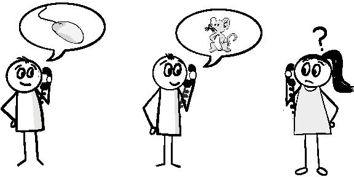
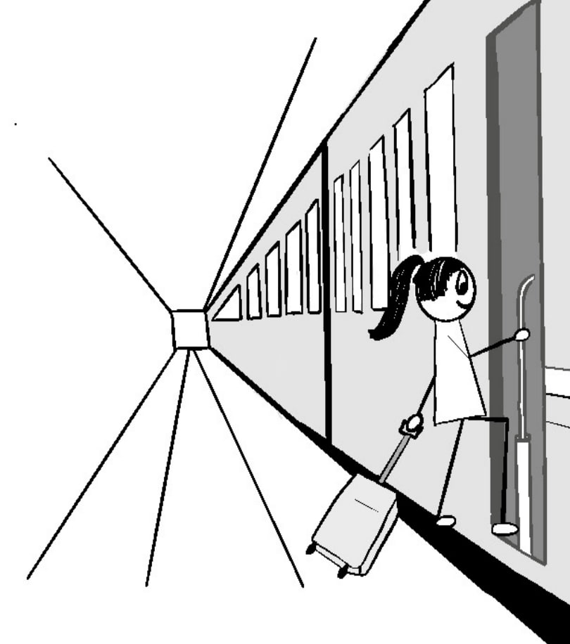
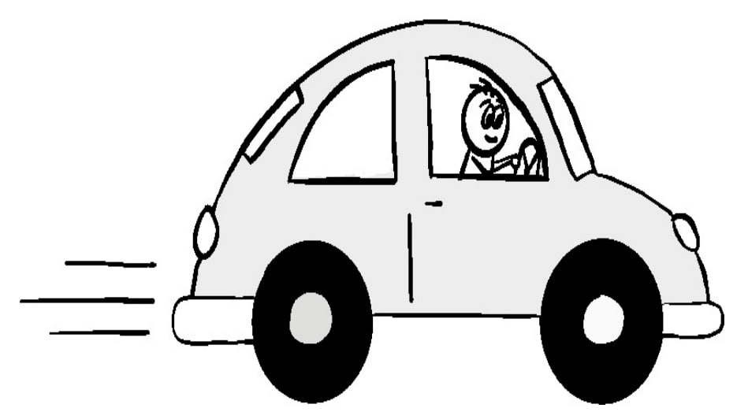
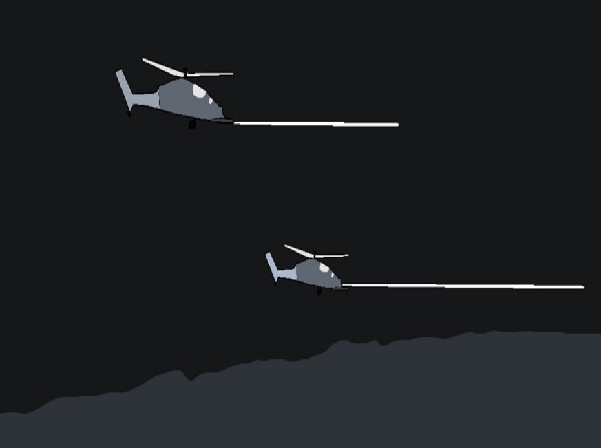
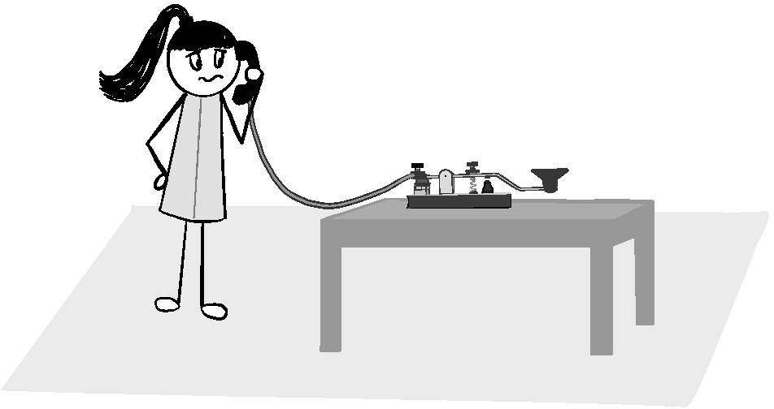
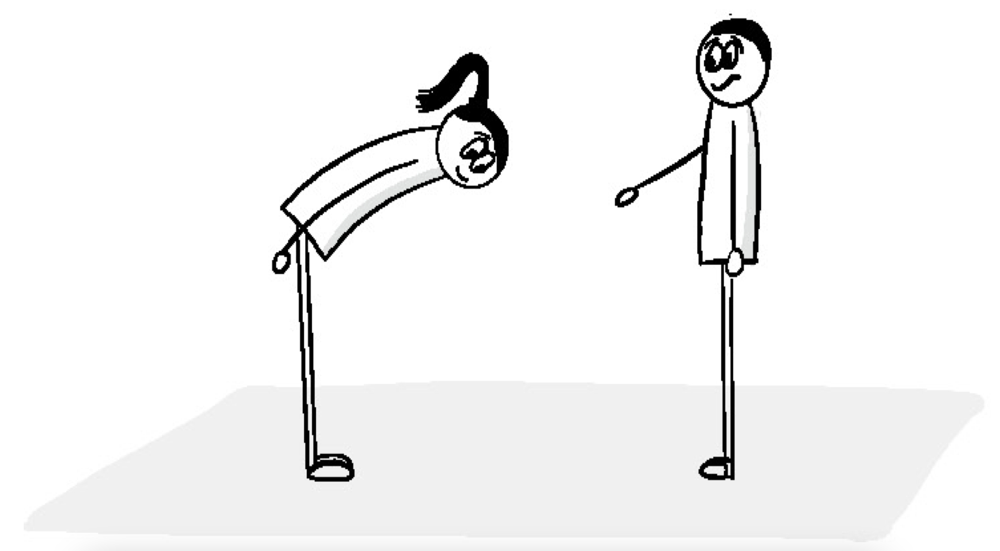

## Фрейминг

**Рисунок 6.4** Фрейминг не может быть бессистемным.

Каждое ваше действие, обязанность или решение, которое вы принимаете, имеет свою
цель, какой бы незначительной она ни была. Эта цель --- ваш ориентир,
позволяющий понять, на пути ли вы к ее успешному выполнению, и то, как она
сформулирована, может сильно повлиять на то, какую информацию вы будете
использовать на этом пути.

Фрейминг может принимать различные формы, многие из которых могут
взаимодействовать и даже мешать друг другу. Некоторые из них --- это критерии
качества отдельной задачи. Существуют также общие цели проекта для его
реализации. Далее следуют обязанности и приоритеты команды и роли, а также
показатели оценки работы, используемые для повышения, продвижения по службе и
премирования.

В идеале, все эти условия должны дополнять контекст, который позволяет лучше
согласовать работу для достижения целевых результатов, желаемых заказчиком.
Однако при наличии стольких уровней, с которыми приходится сталкиваться людям,
очень легко образуются <<пробелы>> и несоответствия.

## Поиск и устранение проблем, связанных с фреймингом

К лучшему или худшему, организационные проблемы, связанные с фреймингом, имеют
тенденцию следовать привычным шаблонам. Осознание этих паттернов поможет вам
найти несоответствия в вашей организации, которые необходимо исправить. Далее по
очереди описывается каждый из этих паттернов. Я включил некоторые подробные
сведения о том, как часто они появляются, а также некоторые способы их
преодоления.

### Паттерн 1: Привлечение клиентов

Согласовать работу с желаемыми результатами клиента всегда непросто. Заказчики
не всегда готовы поделиться информацией, и даже когда они это делают, бывает
трудно понять их пожелания в том же контексте, в котором они сформулированы. Не
способствует этому и то, что многие разработчики не всегда имеют возможности
встретиться и найти взаимоотношения, в которых информация и контекст могут
передаваться напрямую.

Организации делают многое, чтобы помочь в решении этой проблемы. Многие
используют продукт-менеджеров, отделы продаж и даже менеджеров для эффективного
посредничества в передаче информации между клиентами и теми, кто отвечает за
выполнение фактической работы. Обычно это делается на основе ошибочного
убеждения, что посредники могут лучше контролировать поток информации, а значит,
и выполняемую работу, чтобы технические специалисты сосредоточились на том, что
считается приоритетным, и не отпугивали клиентов ненужными подробностями о
процессе предоставления услуг, вырванных из контекста.

Такиe <<Air-gap сети>> в информационном потоке создают множество возможностей
для потери информации и неправильного построения модели. Это затрудняет проверку
и исправление ошибочных предположений, создавая утечку информации, которая может
привести к созданию опасно ошибочных моделей, подобно детской игре в телефон,
где информация все больше теряется или искажается с ростом цепи.

**Рисунок 6.5** Информация может искажаться при передаче от одного человека к
другому.

Хотя лучшим способом устранения утечки информации является попытка
взаимодействия с клиентом, это не всегда возможно или целесообразно нежели сразу
вступать с ним в разговор. Даже если вы это сделаете, скорее всего, потребуется
время и терпение, чтобы развеять все ошибочные предположения, которые вы и
другие члены вашей команды накопили за долгое время, прежде чем вы действительно
смогли понять, что происходит.

<<Они пользуются этим неправильно!>>

Попытка установить контакт с клиентом в той или иной форме может быть
чрезвычайно полезным. В одной компании я взял свою команду на сайт клиента,
чтобы проверить его инструменты и услуги в действии. Их было много, поэтому
после каждого обзора я собирал свою команду в кабинете, чтобы обсудить то, что
они заметили. Как и во многих других случаях, одним из первых отзывов от моей
команды было: <<Они используют это неправильно!>>. Им всегда требуется время и
терпение, чтобы понять, что проблема заключается в их интерпретации, а не в том,
как клиент использует свое решение.

Когда вы начинаете путь к пониманию клиента, лучше всего начать с тщательного
изучения способов его взаимодействия с вашей экосистемой. Во-первых, оцените
услуги, которыми клиент пользуется непосредственно. Зафиксируйте и
проанализируйте их опыт, чтобы выявить потенциальные проблемы и возможности.
Преимущество такой оценки в том, что она более знакома и доступна, чем общение с
заказчиком, а также это облегчить любой разговор в тех случаях, если у вас есть
возможность взаимодействовать с клиентом. Преимущество такой оценки заключается
также в том, что она позволяет выявить те аспекты взаимодействия с клиентами,
которые они могут не осознавать сами или не желают раскрывать.

Клиенты неизбежно оставляют после себя длинный след. Большая часть этих следов
обсуждается в главе 11, <<Инструментарий>>, и включает в себя все: от ведения
протоколов и сервисных телеметрий до мониторинга транзакций и производительности
услуг, а также отслеживания маршрутов клиентов и услуг.

Клиенты также напрямую взаимодействуют и влияют на вашу организацию, что может
дать дополнительные сведения как об их потребностях, так и о том, как ваша
организация их удовлетворяет. Отделы продаж, привлечения клиентов и поддержки
могут помочь установить связь с клиентом, а также получить некоторое
представление о его желаниях и проблемах. Вы можете обнаружить места, где
обслуживание понимается неправильно. Я предотвратил множество потенциально
катастрофических сделок, обнаружив и устранив такие недоразумения на этапах
продаж и переговоров по контракту, а также вникая в детали, лежащие в основе
жалоб клиентов и запросов на функциональность.

Я также, как обсуждается в главе 11, <<хожу на гембу>> или туда, где выполняется
работа, чтобы увидеть, как взаимодействие с клиентом влияет на предоставление и
поддержку услуг. Иногда клиенты охотно вносят коррективы в свои требования, если
понимают, что они ухудшают качество предоставления или поддержки других
функциональных возможностей, которые гораздо важнее для них. Сбор такой
информации позволяет вам вести более содержательные разговоры, которые помогут
вам достичь поставленных целей.

### Паттерн 2: Выходные показатели

Измерение результатов гораздо проще, чем измерение эффекта. Результаты также
гораздо менее неоднозначны. Это во многом объясняет, почему менеджеры отдают
предпочтение оценке индивидуальной и командной работы на основе достижения
поставленных целевых показателей.

Однако проблема заключается в том, что клиенты измеряют свой собственный успех
не на основе результатов, которые вы генерируете, а на основе достижений целей,
которые они получают. Клиентам все равно, обеспечивает ли ваш сервис безотказную
работу на 99,999% или дополнительные функции, если ничто из этого не
гарантирует, что они смогут эффективно использовать его для удовлетворения своих
потребностей в тот самый момент, когда это нужно. Я сталкивался с этой проблемой
множество раз, особенно на торговых площадках, где клиент может быть крайне
голословен. Такое несоответствие между целями и удовлетворением потребностей
клиента может быть дорогостоящим как с финансовой точки зрения, так и с точки
зрения доверия клиента.

Хотя это правда, что результаты могут способствовать достижению клиентом целей,
но фокус сотрудников на доставке результата гарантирует только достижение
результата, а не цели клиента. Информация, которая не нужна для доставки
результата, может быть легко упущена, проигнорирована или даже замаскирована,
если это может отвлечь от доставки результата. Это особенно верно, если доставка
метрики связана с показателями оценки эффективности.

Я активно стараюсь избавляться от метрик, связанных с результатами, всегда,
когда это возможно. Вместо этого я работаю с индивидуальными и командными
показателями, которые имеют значение для достижения клиентом целей. Лучше всего
начать с определения критериев приемлемости задач и обязанностей, чтобы помочь
клиенту достичь их, а затем искать способы, которыми вклад может быть измерен.
Например, в случае со временем безотказной работы я ищу способы измерения
отрицательного влияния на достижение клиентом целей из-за потери обслуживания,
ошибок и задержек. Для функций я смотрю, как функция вписывается в видение
клиента, насколько часто она используется, насколько легко ее использовать и
насколько ценна для помощи клиенту в достижении своих целей. Все это помогает
переориентировать вас и ваших сотрудников на то, чтобы по-новому взглянуть на
окружающую вас экосистему и решения, которые вы принимаете в ней.

### Паттерн 3: Локально ориентированные показатели

Показатели, которые жестко привязаны к действиям команды или отдельного
человека, являются еще одним распространенным искажением в организациях. Помимо
того, что они не ориентированы на результаты клиента, узкий фокус часто
заставляет команды терять из виду всю организацию.

В DevOps-организациях это может происходить по-разному. Сосредоточенность
исключительно на своих задачах может привести к тому, что у вас будут
долгоживущие ветки, в которых вы не будете задумываться о проблемах слияния и
интеграции, которые, вероятно, возникнут позже. Когда существуют
специализированные команды, есть риск того, что они будут сосредоточены только
на своих областях, а не на тех, которые позволяют достичь целевых результатов
заказчика. 

Иногда согласование настолько плохое, что другие команды используют обходные
пути, которые могут сделать хуже общую ситуационую осведомленность.

Также нарушается и искажается информационный поток. В лучшем случае фокус на
локальных метриках приводит к игнорированию любой информации, находящейся за
пределами этого узкого фокуса, даже если это вероятно будет полезно для другой
группы. Когда эти показатели используются для сравнения и оценки команд друг
против друга, это не только не содействует обмену и сотрудничеству, но и
приводит к тому, что информация становится валютой для того, чтобы ее скрыть или
селективно раскрывать для достижения преимущества над другими. В результате
информация искажается и возникает трение, которое ухудшает процесс принятия
решений во всей организации.

Я активно ищу локально ориентированные метрики для удаления, где только могу.
Чтобы исправить вред, который они наносят, я часто создаю показатели
производительности, сосредоточенные на помощи другим в организации в достижении
успеха. Это могут быть другие члены команды, смежные команды или другие команды,
предлагающие решения в одной и той же области. Я считаю, что это помогает
переориентировать людей на то, чтобы они думали о других, обо всей организации
и, в конечном счете, о потребностях клиента.

## Поток информации

Маловероятно,  что вся информация в экосистеме может быть легко доступна с
достаточной точностью для всех по запросу в любое время. Это, вероятно, было бы
ошеломляющим. Хотя точное оформление и обоснованные ментальные модели могут
сузить объём необходимой информации, они сами по себе не дают никакого
представления о своевременности, качестве, точности, охвате и
последовательности, которыми должна обладать информация, чтобы обеспечить
достаточную ситуационную осведомлённость для принятия точных решений.

Именно здесь проявляется динамика вашей экосистемы доставки.

## Почему важна динамика экосистем

Как вы узнали из главы 5 <<Риск>>, динамика вашей операционной экосистемы играет
фундаментальную роль в определении того, какие характеристики информации важны
для принятия решения. Причина этого заключается в том, что скорость,
предсказуемость и причинно-следственные связи изменений в экосистеме напрямую
связаны с тем, как часто и в какой степени необходимо проверять ментальные
модели для поддержания точной модели осведомлённости для принятия решений.

Другими словами, не нужно много обратной связи, чтобы достичь <<достаточно
хорошего>> решения для достижения желаемого результата в относительно
предсказуемой и легко понятной среде. В таких условиях вам нужно лишь
достаточное количество информации, чтобы определить, какие ментальные модели
использовать и когда их использовать, поскольку существует небольшой риск того,
что какие-либо резкие или непредвиденные изменения сделают их точность
недействительной.

По мере того как динамика вашего окружения увеличивается и становится все более
непредсказуемой и необнаруживаемой (или <<неструктурированной>> на языке
Cynefin, обсуждаемом в главе 5 <<Риск>>), точность ваших ментальных моделей
начинает разрушаться, и пороговые значения качества, охвата, типа и
своевременности обратной связи, необходимой для выявления и исправления любых
проблем в ментальной модели, а также для достижения <<достаточно хорошего>>
решения, значительно возрастают.

Чтобы лучше понять это, давайте рассмотрим динамичность экосистемы вашей поездки
на работу. Нет особой необходимости в большом количестве быстрой и качественной
обратной связи, если ваша поездка на работу состоит лишь из входа в систему из
дома на своем компьютере. Этот процесс хорошо известен и вряд ли сильно
изменится без предварительного предупреждения.

Если вы добираетесь до офиса на поезде, то вариаций немного больше. Вам нужно
будет знать наличие поездов, время отправления и прибытия, возможно, с какой
платформы отправляется поезд, и нужно ли вам получить новый билет. Хотя это,
конечно, больше информации, чем требуется когда вы работаете дома, большая её
часть лишь дополняет существующие ментальные модели. Неточности не только редко
бывают фатальными, но обычно их можно легко исправить по ходу дела, в худшем
случае причиняя лишь легкие неудобства.

**Рисунок 6.6** Поездки на поезде предъявляют низкие требования к
информационному потоку.

Однако поездка на работу на автомобиле --- это совершенно другая история.
Вождение автомобиля требует работы в очень динамичной экосистеме. Все, начиная
от дорожного движения и дорожных контролеров, других водителей, пешеходов и
животных, погоды, дорожных условий и даже неожиданных объектов может резко
изменить ситуацию, а вместе с ней и целесообразность любого решения, причем
мгновенно. Мне лично приходилось уклоняться, чтобы избежать всего, начиная от
кур и лосей, бегущих по проезжей части, шашлыка, летящего с впереди идущей
машины, до внезапного наводнения и полицейской погони. При такой динамике
обратная связь должна быть мгновенной, точной и с достаточным охватом для
корректировки любых новых событий, которые, если их пропустить, могут пагубно
повлиять на достижение желаемого результата --- добраться до работы живым, без
травм для себя и других. В отличие от двух других сценариев, ментальные модели в
большей степени предназначены для облегчения сбора информации и определения
приоритетов в принятии решений, а не как пошаговый рецепт для выполнения
деятельности до результата.

**Рисунок 6.7** Сэм должен ситуативно осознавать свое окружение, чтобы безопасно
передвигаться на автомобиле.

Чтобы понять, какие характеристики и информация вам нужны, необходимо знать
динамику экосистемы доставки. Как вы увидите, вам необходимо учитывать трения
ментальной модели и когнитивные предубеждения людей в вашей экосистеме доставки,
на какие результаты вы ориентируетесь, а также профиль риска, который вы готовы
принять, чтобы достичь их.

## Удовлетворение Ваших потребностей в информационном потоке

Чтобы быть эффективным, каждый человек имеет свои информационные потребности.
Некоторые люди быстро обнаруживают значимое состояние или несоответствие и
проводят расследование. Другие могут легко пропустить или с радостью
проигнорировать все, что не в точности соответствует ожиданиям их ментальных
моделей. Большинство людей находятся где-то посередине этого спектра, улавливая
некоторую информацию, пропуская другую, и приспосабливают все остальное таким
образом, что фильтруют или искажают свое понимание того, что происходит на самом
деле.

Найти эти вариации может быть непросто. Вот почему всякий раз, когда я начинаю
работать в организации, я нахожу множество <<трассировщиков>> (которые
представляют собой не более чем информационные элементы, задачи и события) для
эффективного отслеживания того, какие информационные характеристики используются
различными людьми и командами по мере того, как информация течет в организации.
Трассировщик зачастую представляет собой не более чем набор информационных
элементов, задач или событий, которые являются частью решения и элемента
поставки, что важно для удовлетворения потребностей клиента. Некоторые примеры
включают развертывание, инцидент, стандартный запрос и планирование работы.

**Рисунок 6.8** Думайте о <<трассировщиках>> как о военных трассирующих
выстрелах. Это нужно для того, чтобы убедиться, что вы понимаете и
приспосабливаетесь к условиям, чтобы лучше <<поразить цель>>.

Я считаю, что трассировщики могут помочь выявить уровень предсказуемости и
готовности к событиям, их вероятный диапазон и темп, как и где они происходят и
обрабатываются, насколько адекватно они управляются и завершаются и как этот
жизненный цикл влияет на клиентов. Трассировщики также выявляют источники и
потребителей информации, необходимой для принятия решений, а также ее поток и
то, насколько хорошо ее характеристики соответствуют потребностям лиц,
принимающих решения. Все это вместе взятое должно выявить пробелы в
эффективности, которые можно исследовать более глубоко, чтобы уменьшить или
снизить любые проблемы и связанные с ними риски.

Изучение трассировщиков в экосистеме, частью которой вы давно являетесь, может
быть трудным хотя бы потому, что вам приходится бороться с собственными
несовершенными ментальными моделями и когнитивными предубеждениями. К счастью,
существуют некоторые общие закономерности для проблем с информационными
потоками, которые помогут вам начать работу.

### Паттерн 1: Несоответствия при передаче информации

**Рисунок 6.9** Несмотря на план Сьюзи добавить в свой телефон функцию обмена
текстовыми сообщениями, она все еще с трудом получала необходимую ей информацию.

Передать информацию таким образом, чтобы она была сразу же понята в нужном
контексте и в нужное время и пригодна к действию, удивительно сложно.Как мы
видели на примере инцидента на Three Mile Island, это особенно сложно, если
информация должна опровергнуть любые потенциальные ментальные модели в процессе
попытки информирования.

Одна из наиболее распространенных проблем при передаче информации возникает
из-за того, что мы полагаемся на механизмы, которые не располагают свойствами,
способными донести информацию до тех, кто в ней нуждается таким образом, чтобы
она могла пробиться сквозь любую несовершенную ментальную модель и быть
использованной для принятия ключевых решений в нужное время.В большинстве
случаев это происходит потому, что люди не задумываются о том, какие свойства
важны. Вместо этого они полагаются либо на те методы передачи информации,
которые наиболее доступны, либо на те, которые обычно используют окружающие, не
задумываясь об их пригодности.

Некоторые распространенные проблеммы включают следующее:

-   Системы мониторинга, настроенные на улавливание и ретрансляцию событий, а не
    на ретрансляцию текущих условий, обеспечивают эффективную поддержку принятия
    решений. В результате информация должна быть отсеяна от шума, а затем
    собрана персоналом воедино, используя свой прошлый опыт, доступную
    документацию и догадки, чтобы выяснить, что происходит. Этот рискованный
    подход с большим числом противоречий может привести к эффектному провалу,
    как это произошло с Knight Capital, когда были пропущены зашифрованные
    предупреждения о критической неправильной конфигурации, которая в конечном
    итоге привела к краху компании, поскольку они были отправлены по электронной
    почте ранним утром.

-   Получение данных из систем для принятия решений без учета их точности,
    контекста, в котором они были сгенерированы, и их соответствия другим
    данным, с которыми они обрабатываются и сравниваются. Такие несоответствия
    часто встречаются в AI/ML системах, которые должны полагаться на данные из
    источников, которые изначально не были разработаны с учетом таких целей. Это
    может быть безвредно, когда приводит к плохо таргетированной рекламе, но
    может быть опасным или даже фатальным, когда речь идет о медицинских данных
    или данных об окружающей среде.

-   Использование длинных документов с требованиями, плохо продуманных
    пользовательских историй, длинных цепочек электронной почты и многочисленных
    встреч для передачи задач и ролей [^81], мало что делает для обеспечения
    достаточного количества целей, зависимостей и антицелей [^8]. В отличие от
    того, что было подробно описано в информации о целевых результатах, текущем
    состоянии, потенциальных рисках или о том, какие риски допустимы при
    достижении этих результатов. Вместо этого большая часть коммуникации
    фокусируется в первую очередь на том, _чтобы_ добиться результата, и
    игнорирует, _какой_ результат она пытается достичь и желателен ли он. Это
    приводит как к разочарованию, так и к вероятности неосознанных действий без
    достаточного контекста динамики экосистемы и не достижения целевых
    результатов.
    
-   Использование методов межкомандной и межорганизационной коммуникации,
    которые не учитывают, в каком объеме и с какой скоростью и точностью
    необходимо передавать контекст, а также недостаточно способствуют духу
    товарищества и сотрудничеству.

[^8]: Антицели --- это события, ситуации или исходы, которых вы хотите избежать.
[^81]: Глава 3, <<Децентрализованное командование>>

Это стало особенно актуальной проблемой в распределенной рабочей среде, в
которой сейчас находятся многие из нас. Электронные письма, заявки на
отслеживание задач, чаты и видеосвязи --- все они ограничены в точности передачи
контекстной информации. Они также изо всех сил пытаются выявить разобщенность и
ошибочные ментальные модели. Все это приводит к нарушению понимания экосистемы,
конфликтам <<мы против них>> и разрозненному мышлению. Все это чрезвычайно
затрудняет исправление недостатков ментальной модели и эффективное достижение
целевых результатов.

Несоответствия в передаче данных являются эндемичными в ИТ. Вероятно, это
связано с тем, что большинство работников отрасли склонны больше думать об
удобстве, новизне или следовании тому же подходу, который используют другие, чем
о поиске метода, наиболее подходящего для принятия своевременных и точных
решений. Однако это далеко не единственная отрасль с такими несоответствиями. Я
сталкивался с ними в самых разных отраслях --- от медицины и финансов до
энергетики и промышленных цепочек поставок. Многие отрасли, возможно, не так
охотно используют новые методы так быстро, как ИТ, но даже группам с такими
названиями, как <<Бизнес-аналитика>> и <<Поддержка принятия решений>>, часто все
еще трудно думать о том, чтобы информационные потоки обеспечивали принятие
разумных и обоснованных решений.

Вот почему так важно регулярно проверять потоки в вашей собственной экосистеме.
Многие практические методы, упомянутые в этой книге, от управления очередью
(глава 13) и ведущих ролей в сервисной инженерии (глава 9) до инструментария
(глава 11) и различных механизмов точек синхронизации (глава 14), приведены для
того, чтобы помочь вам и вашей команде в вашем путешествии.

> #### Катастрофа на перевале Кассерин
> 
> Армия США на собственном горьком опыте убедилась в важности обмена информацией
> и взаимопонимания между командованием и войсками в битве при Кассеринском
> перевале в феврале 1943 года. Этот опыт привел к полному пересмотру тактики
> ведения боя в США и структуры командования, которая частично существует и по
> сей день.
> 
> Кассерине в Тунисе стало первым настоящим столкновением между американскими и
> немецкими войсками во время Второй мировой войны и первым совместным действием
> американских войск с британцами. Инициатива состояла в том, чтобы отрезать
> немецкие пути снабжения и отступления в надежде заставить немецкого генерала
> Эрвина Роммеля капитулировать. Командующий войсками США генерал Ллойд
> Фредендалл допустил множество катастрофических ошибок. Во-первых, он построил
> свой штаб в 65 милях от линии фронта в труднодоступном каньоне, вдали от линий
> связи, где он оставался в течение всего сражения.
> 
> Фредендалл был известным мелким управленцем, который диктовал, какие должности
> должны быть, а не оставлял это решать своим подчиненным. Это создало
> неразбериху среди подразделений и разрушило доверие к его подчиненным.
> 
> Одно наблюдение, сделанное солдатом на поле боя, гласило: <<Никогда еще столь
> немногими не командовали так много людей издалека!>> [^9]
> 
> [^9]: Д'Эсте, Карло. Паттон: Гений войны. Нью-Йорк: Харпер Коллинз, 1995,
>     с.457
>
> И если только этого уже было достаточно, то Фредендалл рассредоточил свои
> войска по полю боя, даже не потрудившись проверить, что происходит. Его
> войска, в основном плохо обученные, рыли неглубокие траншеи, едва достаточные
> для того, чтобы залечь в них, а не настоящие окопы, что означало, что они не
> только были сильно подвержены огню вражеского оружия, но и могли быть (и были)
> задавлены немецкими танками.
> 
> Думая, что поступает умно, Фредендалл отдавал приказы по радио, используя
> жаргон и непонятные фразы. Идея состояла в том, чтобы сбить с толку любые
> вражеские мониторы, но все, что это сделало, —-- это сбило с толку его
> собственные войска. Подразделения авиации, артиллерии и пехоты были разделены
> и вынуждены взаимодействовать через Фредендалла, что резко снизило
> оперативность реагирования. Он также говорил по-англоязычному, что ухудшило
> его рабочие отношения с британцами.
> 
> Все это, конечно, разрушило всякую общую осведомленность о ситуации между
> Фредендаллом и его войсками. Перед лицом этого немцы легко смогли захватить
> позиции союзников, отбросив их назад более чем на 50 миль, при этом США
> потеряли 183 танка, понесли 10 000 потерь и 1500 военнослужащих были взяты в
> плен. Эйзенхауэр заменил Фредендалла генералом Джорджем Паттоном. Эйзенхауэр
> также настаивал на том, чтобы командиры вели свои подразделения с фронта и
> держали командные пункты на передовой. Младшим офицерам союзников был
> предоставлен больший простор для инициативы, и им было приказано сохранять
> концентрацию сил. Также предпринимались усилия по улучшению интеграции
> артиллерийской и авиационной поддержки с пехотными подразделениями, улучшая
> поток коммуникаций и оперативность реагирования между группами.

### Паттерн 2: Культурные разногласия 

**Рисунок 6.10** Культурные различия часто выходят далеко за рамки языка.

Различия в опыте, который имеют отдельные люди, команды и организации, влияют не
только на их модели мышления. Они также влияют на характеристики и
воспринимаемую ценность самой информации. Когда накопленным опытом деляться в
группе, он может стать частью общей культурной базы, которая может облегчить
внутригрупповую передачу информации в нужном контексте.

Как и в любой другой культуре, по мере роста и углубления совместного опыта со
временем эти рамки могут расширяться и включать широкий спектр жаргона, правил,
ценностей и даже ритуалов. Это может еще больше упростить коммуникацию внутри
группы, однако у этого есть и некоторые недостатки. Во-первых, общие модели
мышления еще труднее разрушить, чем индивидуальные. Другой недостаток
заключается в том, что рационализация коммуникации одной группы может показаться
непроходимым или бессмысленным бредом для посторонних.

Такие культурные разногласия могут создать реальные проблемы для потока
информации, необходимой для координации и согласования решений для достижения
нужных результатов.

В ИТ-организациях может существовать любое количество таких культур, каждая из
которых наполнена собственной терминологией и приоритетами. Команды
разработчиков ценят скорость предоставления функциональных возможностей или
использование новых интересных технологий, в то время как операционные культуры,
как правило, предпочитают стабильность и пониженные риски. Команды, занимающиеся
базами данных, заинтересованы в разработке схем и целостности данных, в то время
как сетевые команды склонны уделять пристальное внимание пропускной способности,
отказоустойчивости и безопасности. Различные склонности и мотивации каждой
команды меняют то, как воспринимается информация. Без правильной мотивации и
скоординированных целей может быть трудно поддерживать согласованность в
достижении общего результата.

Знание этих культурных различий может помочь вам найти способы уменьшить
разочарование и конфликты, вызванные ошибками и несоответствиями в понимании
ситуации между командами. Это может помочь найти и исправить любые неправильные
представления о целевом результате, которые могут быть вызваны такими
несоответствиями. Для этого существует несколько способов. Один из них ---
построение более эффективных коммуникационных мостов между группами, которые
способствуют доверию и пониманию, как обсуждалось в главе 3 <<Децентрализованное
командование>>. Вы также можете свести к минимуму количество ошибок в своих
предположениях, если будете более четко представлять себе, что происходит, а
также использовать такие концепции Mission Command, как обратный брифинг и
увеличение личных контактов, чтобы улучшить поток информации и выявить любые
несоответствия, которые могут образоваться по пути. Все это может сделать вас и
вашу команду более эффективными в принятии решений.

### Паттерн 3: Недоверие 

Доверие --- это недооцененная форма фильтрации информации в организации. Ваш
уровень доверия --- это мера, которую вы используете для определения того,
насколько вам необходимо защищать себя от эгоистичных и корыстных интересов
человека или организации. Чем меньше вы испытываете доверия, тем больше
вероятность того, что вы будете скрывать, фильтровать или искажать информацию,
которую другая сторона может использовать для принятия решений. Это имеет
очевидный эффект замедления потока информации, что снижает осведомленность о
ситуации и эффективность принятия решений.

Доверие может быть растрачено различными способами. Редко это связано с личной
или организационной социопатией. Чаще всего причина кроется в непонимании или
неправильном подходе к ситуации, когда человек чувствует себя обиженным или
использованным в чьих-то интересах. В ИТ наиболее часто это происходит следующим
образом:

-   **Принудительное обязательство:** Человека или команду заставляют принять
    обязательство, взятое кем-то другим, часто с легкомысленным пренебрежением к
    его реальной выполнимости. Это может быть что угодно: от агрессивно
    установленных сроков выпуска релиза до подписания трудновыполнимых
    требований. Суть проблемы заключается в несоответствии между ожиданиями
    клиента и затраченными усилиями. Приняв на себя обязательства, клиент
    ожидает, что риск неудачи ниже, чем он есть на самом деле. Мало того, что
    команда разработчиков не только постоянно находится под серьезной угрозой
    провала, любые усилия, прилагаемые для повышения шансов на успех, остаются
    непризнанными.
    
-   **Необоснованный негибкий подход:** Процесс, который должен улучшить
    ситуационную осведомленность, на самом деле вредит ей своей жесткой
    негибкостью и проблематичными технологическими цепочками. Вместо того, чтобы
    работать над тем, что должно быть желаемым результатом процесса, люди
    скрывают детали и используют политическое и социальное давление, чтобы
    обойти правила и процедуры. Это, конечно, открывает риск неожиданности и
    дальнейшего недоверия.

-   **Управление инцидентами на основе вины:** Процессы управления инцидентами
    ищут козлов отпущения в виде людей или технологий и возлагают вину на них
    вместо того, чтобы найти и устранить первопричину инцидента. Это приводит к
    игре в <<театр инцидентов>>, где рамки расследования сильно сужаются до
    самого события, детали затушевываются или опускаются, чтобы минимизировать
    вину, а шаги по улучшению ограничиваются либо малым списком выявленных
    проблем, либо раздутым списком плохо нацеленных улучшений, которые вряд ли
    устранят первопричину.
    
Наиболее эффективным способом избежать потери доверия является создание культуры
и поддерживающих механизмов, которые активно способствуют развитию сильного
чувства уважения между людьми в организации. Уважение --- это то, что создает
единое чувство цели, чувство доверия и безопасности, которое мотивирует людей
преодолевать барьеры и работать вместе для достижения успеха.

Команды и организации, которые способствуют укреплению доверия и уважения,
регулярно демонстрируют следующее:

-   **Создание безопасной рабочей среды:** Не приятно работать в среде, которая
    вызывает излишний стресс. Часто стресс возникает из-за самой технологии,
    например, когда приходится работать/отлаживать/разрабатывать опасное
    программное обеспечение, которое плохо спроектировано, слишком сложно,
    хрупко, тесно связано, полно дефектов, трудно/долго собирать, интегрировать
    и тестировать, или просто никогда не предназначалось для использования так,
    как его хотят использовать другие. В других случаях вспомогательные элементы
    для создания и поддержки безопасной рабочей среды являются основным
    источником стресса, например, ненадежная инфраструктура или инструменты,
    которые отказывают без причины, или инструменты, которые трудно использовать
    или затрудняют надежное и эффективное развертывание, конфигурирование или
    управление вашими услугами. Стресс также может быть связан с работой в
    среде, полной постоянных прерываний из-за шума, совещаний или занятий,
    которые отвлекают от усилий, необходимых для выполнения работы. Команды
    должны иметь возможность постоянно выделять время для выявления и устранения
    таких стрессовых элементов из своей рабочей среды. Это не только покажет,
    что организация заботится об их благополучии, но и поможет снизить уровень
    шума и стресса, который снижает уровень осведомленности о ситуации и
    принятия решений.
    
-   **Воспитание чувства значимости и принадлежности:** Люди, которые чувствуют,
    что они являются ключевой частью того, что делает команду успешной, а не
    просто каким-то взаимозаменяемым ресурсом, гораздо менее склонны скрывать
    или искажать информацию. Помогите им гордиться своей работой, стараясь
    создать атмосферу, в которой они чувствуют свою причастность к успехам и
    достижениям команды, организации и, в конечном итоге, клиента в достижении
    целевых результатов. Один из способов сделать это --- заменить конкретные
    цели работы на более ориентированные на клиента или организацию. Поощряйте
    команду определять ошибки и просчеты не как повод для обвинения, а как
    признаки того, что какой-то элемент экосистемы оказался небезопасным и его
    необходимо улучшить и сделать безопасным. Я также призываю команды
    по-настоящему узнать друг друга и не рассматривать других участников в
    качестве ресурсов или соперников.

-   **Создание ощущения прогресса:** Люди могут быть демотивированы и
    чувствовать, что работа менее целесообразна, если они не ощущают прогресса в
    достижении цели. Создайте частые и регулярные механизмы качественной
    обратной связи, которые покажут, насколько успешно идет работа по достижению
    определенных результатов или целей. Итеративные механизмы, такие как
    ежедневные совещания и визуальные доски рабочих процессов, помогают
    продемонстрировать достижения. Я также использую ретроспективы и
    стратегические обзоры, как описано в главе 14 <<Циклы и точки
    синхронизации>>, чтобы дать команде возможность поразмышлять о прогрессе,
    которого они достигли. Это помогает людям увидеть, что прогресс в
    совершенствовании достигнут, а также может служить мотивацией для поиска
    путей к еще большему улучшению.

## Анализ и улучшения

Учитывая, что наша ситуационная осведомленность может быть нарушена и искажена,
имеет смысл иметь в вашей команде какие-то средства для регулярной проверки,
исправления и упреждающего реагирования, чтобы предотвратить появление в будущем
любых недостатков, которые могут нанести ущерб предоставлению услуг. У
большинства команд есть некоторые средства для проверки и исправления проблем с
контекстом и согласованием. Обычно они принимают форму контрольных точек и
обзорных совещаний, направленных на проверку того, что у всех одинаковое общее
понимание данной ситуации и того, что необходимо сделать для продвижения вперед,
а также контрольные списки, которые помогут убедиться, что шаги случайно не
пропущены на этом пути.

Хотя такая стратегия может сработать для выявления и устранения
несогласованности и понимания ошибок, она рассчитывает на то, что все будут в
полной мере участвовать и уделять внимание. Это предположение небезопасно делать
даже в лучшие времена, и оно обычно терпит неудачу, когда люди находятся в
состоянии стресса. Это также мало что говорит нам о коренных причинах, которые
могут создавать пробелы в осведомленности, не говоря уже о том, чтобы устранить
их, чтобы они больше не сохранялись и не наносили ущерба в будущем.

Один из лучших способов исправить это --- изменить то, как вы и ваша команда
смотрите на ошибки и провалы. Вместо того чтобы думать о них как о вине человека
или ненадлежащем поведении компонента, подходите к ним как к безупречному сбою
ситуационной осведомленности. Выяснение причин потери ситуационной
осведомленности, будь то из-за ошибочной ментальной модели ситуации,
неправильного оформления или неправильного информационного потока, может помочь
вам раскрыть, почему это произошло, и внедрить механизмы, снижающие вероятность
того, что это произойдет в будущем. Такое изменение имеет дополнительное
преимущество, заключающееся в том, что его гораздо легче избежать вина.
Механизмы, поддерживающие индивидуальную и командную ситуационную
осведомленность, оказались неэффективными и нуждаются в совершенствовании для
обеспечения успеха. Это снижает риск указания пальцем и других форм поведения,
которые лишь ещё больше снижают эффективность команды.

Также важно активно искать потенциальные опасности, которые могут привести к
ухудшению ситуационной осведомленности, прежде чем у них появится шанс причинить
вред. Многие из техник, описанных в этой книге, будь то в форме ролей, таких как
очередь Ведущий мастер и сервисный инженер, синхронизирующие моменты, такие как
ретроспективы и стратегические обзоры, механизмы согласования работы, такие как
рабочие листы и краткие обзоры, или подходы к инструментовке и автоматизации,
разработаны с использованием элементов, которые пытаются выявить любые
расхождения между тем, как люди понимают свое окружение, и их фактическим
состоянием.

Еще один механизм, который я регулярно использую, --- это разыгрывать различные
сценарии с командой. Для этого я спрошу о конкретной услуге, взаимодействии,
потоке или каком-либо другом элементе, чтобы увидеть, как они формируют и
обновляют свою ситуационную осведомленность. Видя, как сильно люди полагаются на
свои ментальные модели, насколько сильны таковы ментальные модели, и та
информация, которая, по их мнению, может помочь им принять правильные решения,
может помочь выявить пробелы, которые можно быстро устранить. Часто пробелы
можно обнаружить в ходе простых дискуссий за круглым столом, хотя иногда за ними
следуют реальные или смоделированные сценарии, чтобы перепроверить правильность
деталей.

## Резюме

Наша ситуационная осведомленность --- это то, как мы понимаем нашу экосистему и
ориентируемся на принятие разумных решений в ее рамках для достижения наших
целевых результатов. Есть много способов, которыми наша ситуационная
осведомленность может пойти наперекосяк, начиная с ошибочной ментальные модели и
плохие методы коммуникации приводят к культурным различиям, плохо выверенным
подходам к оценке работы, нечетким или локально ориентированным целям,
отсутствию доверия и ощущения прогресса. Понимание этой динамики в вашей
экосистеме и постоянное ее совершенствование могут помочь устранить разного рода
перекосы и разочарования, которые мешают оптимальному предоставлению нужных
услуг.

