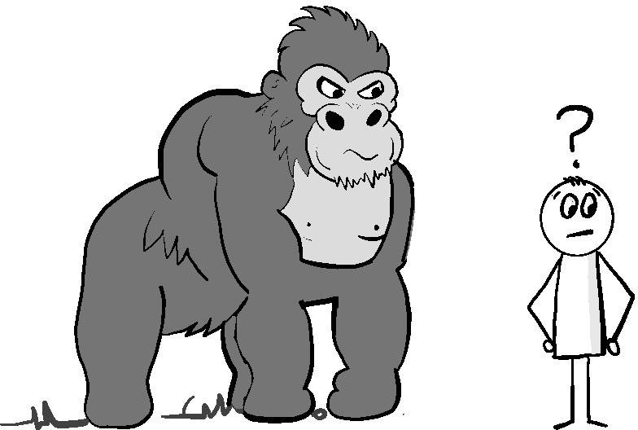
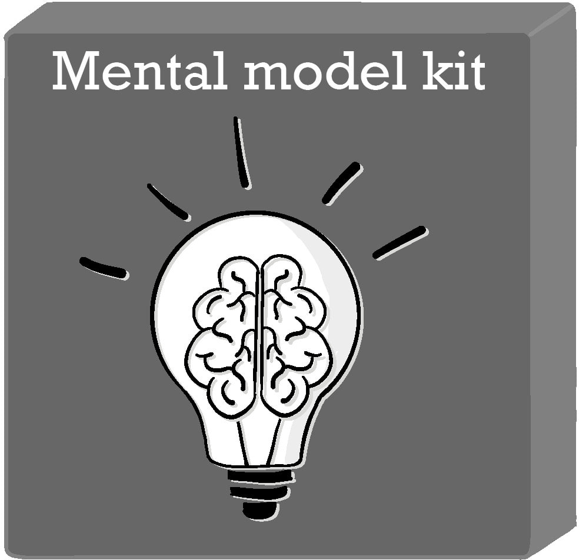

> За неимением обуви лошадь была потеряна. За неимением коня потерялся всадник.
> За неимением всадника послание было потеряно. За неимением послания битва была
> проиграна. 

Ситуационное понимание --- это осознание того, что окружает нас. Мы используем
его для того, чтобы быстро ориентироваться в происходящем, и оно является
ключевым компонентом в процессе принятия решений. Чтобы получить хорошую
ситуационную осведомленность, нам необходимо понимать текущие условия и
возможности нашей экосистемы. Как и предсказывал Джон Бойд в своей работе о
цикле OODA, от того, насколько хорошо мы сформируем это понимание, зависит то,
насколько быстро и точно мы сможем принимать решения.

Хотя доступность и наблюдаемость информации является важным компонентом в
создании ситуационной осведомленности, есть и другие факторы, которые еще более
важны для обеспечения ее точности. Они включают в себя все: наш прошлый опыт,
соответствующие концепции, которым нас учили, и то, что мы воспринимаем как цель
или результат, к которому мы стремимся. Многие из нас не знают, что на
ситуационную осведомленность также сильно влияют различные культурные элементы,
с которыми мы сталкивались дома и на работе, а также другие привычки и
предубеждения, которые мы приобрели со временем. Все это в совокупности не
только определяет, насколько значимой мы будем считаем информацию о нашей цели,
но и может помешать нам заметить ее вообще.

Разговор о том, как мы создаем и формируем нашу ситуационную осведомленность,
достаточно объемный и заслуживает отдельной книги. Эта глава --- лишь введение в
эти факторы, чтобы помочь вам заметить важные закономерности, которые могут
негативно повлиять на любые решения, принимаемые вами и другими членами вашей
команды. В конце главы приведены некоторые советы, которые не только помогут
улучшить вашу ситуационную осведомленность, но и усилят эффективность других
практик, описанных в этой книге.

## Осмысление нашей экосистемы

Собирать информацию, необходимую для создания ситуационной осведомленности для
принятия точных решений, может быть удивительно сложно и чревато ошибками. Мы
должны определить, какая информация нам доступна. Затем необходимо определить,
какие элементы являются релевантными, а также достаточно ли имеющейся у нас
информации и достаточно ли она точна для наших целей. Затем нам нужно выяснить,
как лучше получить доступ к ней и обработать ее.

Несмотря на то, что мозг человека является одним из самых больших и мощных в
животном мире, он с трудом справляется с задачей надежного и точного поиска,
сортировки и обработки всей информации, необходимой нам для принятия решений. На
самом деле существует множество исследований, которые показывают, что
человеческий мозг удивительно легко перегрузить. Например, по данным
Федерального управления гражданской авиации США (FAA) по меньшей мере 70
процентов аварий коммерческих самолетов и 88 процентов смертельных случаев в
авиации общего назначения объясняются человеческим фактором, в первую очередь,
стрессом, вызванным несовершенством конструкции кабины пилота[^1]. Начиная с
конца 1960-х годов, исследования, проведенные конструкторами кабины пилотов,
показали, что слишком большое количество сигналов может затруднить поиск
необходимой информации. Кабины со слишком большим количеством датчиков и
индикаторов повышают уровень стресса даже у самых опытных пилотов, заставляя их
совершать гораздо больше ошибок.[^2] Даже сегодня пилоты описывают опыт изучения
систем автоматизации кабины как <<питье из пожарного шланга>>[^3].

[^1]: Управление исследований и специальных программ Министерства транспорта США
    (1989) "Требования к исследованиям человеческого фактора в кабине пилота"

[^2]: Wiener, E.L., & Nagel, D.C. (1988). "Человеческие факторы в авиации".
    Лондон, Соединенное Королевство: Academic Press.

[^3]: BASI (1999) "Отчет об исследовании безопасности передовых технологий"

Чтобы преодолеть это ограничение, наш мозг создает умные быстрые клавиши,
которые фильтруют и предварительно обрабатывают элементы нашего окружения, чтобы
облегчить нагрузку. Мы видим эти короткие пути в действии, когда без усилий
выполняем относительно сложные задачи, не задумываясь, например, когда катаемся
на велосипеде или играем в любимую видеоигру. Именно благодаря этим механизмам
опыт часто приводит к более быстрому и точному принятию решений.

Почему важно знать об этих ярлыках, так это потому, что они имеют ряд
существенных недостатков. Во-первых, они далеки от совершенства из-за своей
быстроты могут нанести ущерб вашей способности принимать решения. Некоторые из
самых невинных побочных эффектов можно увидеть на примере чрезмерного стремления
нашего мозга к подбору шаблонов. Мы можем увидеть знакомые объекты в форме
облаков и чернильных клякс, которых на самом деле нет. К сожалению, это
стремление может также заставить нас видеть несуществующие закономерности в
более серьезных обстоятельствах, что может привести нас к преследованию проблем,
которых нет. Например, мы можем связать совпадение сбоя в работе сервиса с
действиями, выполняемыми в совершенно несвязанной части экосистемы, что приведет
к большой трате времени на устранение неполадок и ничего не даст.

Еще более проблематично то, что наш мозг использует те же самые короткие пути
для отсеивания информации, которую он считает излишней для выполнения
поставленной задачи. Когда наша умственная работа несовершенна или наше
понимание ситуации неточно, эти же механизмы могут отфильтровать ту самую
информацию, которая нам может понадобиться, заставляя нас упустить очевидные
факты, даже если они проскакивают прямо перед глазами.

Эта проблема была продемонстрирована много лет назад в коротком видеоролике под
названием <<Тест на избирательное внимание>>, результаты которого позже были
опубликованы в книге под названием <<Невидимая горилла>>[^4]. В нем шесть
человек, трое в черных футболках и трое в белых, передавали баскетбольный мяч по
коридору. Зрителю предлагалось подсчитать, сколько пасов было сделано между
людьми в белых рубашках. Во время 80-секундного ролика парень в костюме гориллы
вышел в центр действия, повернулся лицом к камере, ударил себя в грудь, а затем
ушел. Несмотря на то, что горилла была на экране целых девять секунд, более
половины людей, которые смотрят ролик, настолько сосредоточены на подсчете
пасов, что полностью игнорируют гориллу.

[^4]: http://www.theinvisiblegorilla.com

 Рисунок 6.1 <<Какая горилла?>>

Все мы в тот или иной момент были убеждены, что происходит что-то, чего нет, и
при этом не замечали пресловутых горилл в нашем окружении. Они могут проявляться
в виде ошибочной части кода в месте, которого мы не ожидали, неправильной
конфигурации, которая пагубно влияет на какую-то зависимость, которую мы
пропустили, или даже из-за разногласия между людьми, которое сеет хаос в нашей
среде.

Чтобы улучшить наше понимание ситуации, мы должны сначала понять, как наш мозг
создает и поддерживает эти умственные неточности. Это поможет нам разработать
способы избежания недостатков, которые могут помешать точному пониманию нашей
экосистемы.

Перед началом этого путешествия давайте рассмотрим два наиболее важных из этих
ментальных погрешностей --- ментальную модель и когнитивные предубеждения. Это
поможет нам лучше понять, как они работают, как они выходят из строя, и как мы
можем уловить, когда они нас подводят.

## Ментальная модель

 Рисунок 6.2 <<Ментальная модель>>

Ментальная модель --- это шаблон предсказуемых качеств и поведения, которые мы
усвоили и ожидаем, когда сталкиваемся с определенными предметами и условиями в
нашей экосистеме. Некоторые из них настолько просты, как знание того, что
резиновый мяч и яйцо будут вести себя по-разному, когда их бросить с высоты, или
что люди обычно останавливаются на красный свет светофора. Другие могут быть
более сложными, например, поведение и вероятный вывод процесса обслуживания при
определенном типе запроса. Вместе они формируют наше восприятие мира и
вероятность наступления определенных условий, которые мы можем использовать для
принятия решений и решения проблем.

Ментальные модели обычно строятся на основе точек данных, которые мы собираем
через сочетание личного опыта и информации, полученной от людей, книг и других
источников. Эти же точки данных становятся намеками, которые мы используем для
идентификации, проверки или прогнозирования событий в экосистеме. Чем больше
соответствующих точек данных мы собираем о заданной ситуации, и чем больше
личного опыта у нас с этих точек данных, тем больше мы можем получить глубину
ситуационного осознания из них. С течением времени постоянный контакт с этими
точками данных не только значительно снижает когнитивную нагрузку, необходимую
для идентификации заданной ситуации, но также увеличивает скорость принятия
решений, чтобы она стала мгновенной и интуитивной.

Гэри Клэйн, проводя исследования в области пожаротушения[^5], обнаружил, что
люди, обладающие таитическим знанием и экспертизой, могут быстро принимать
решения на основе незначительных, но важных сигналов, которые другие могут
упустить. В одном примере командир пожарных, который сражался с видимо небольшим
пожаром на кухне дома, почувствовал, что что-то не так, когда температура в
комнате не соответствовала его ожиданиям. В этом беспокойстве он немедленно
приказал своей команде покинуть дом. Как только последний человек покинул
здание, пол рухнул. Если бы мужчины были в доме, они бы провалились в горящий
подвал.[^6]

[^5]: https://www.researchgate.net/publication/254088491_Rapid_Decision_Making_on_the_Fire_Ground_The_Original_Study_Plus_a_Postscript
[^6]: https://www.fastcompany.com/40456/whats-your-intuition

## Проблемы, связанные с ментальными моделями

Когда ментальные модели хорошо построены, они являются невероятно полезным
механизмом. Однако вызов заключается в том, что их точность сильно зависит от
количества, качества и надежности используемых данных для их построения. Иметь
слишком мало данных может быть так же опасно, как полагаться на множество
неважных или ненадежных данных. Возьмем, например, пример командира пожарной
команды в предыдущем разделе. Он бы получил так же мало информации о ситуации,
зная только что пожар в кухне и небольшой, как и зная, что стены кухни окрашены
в синий цвет или что кастрюли и сковородки на кухне были свадебным подарком.

Механизмы, используемые для сбора данных, также играют важную роль в том,
насколько точно формируется наша модель мира. Самыми опасными являются те,
которые считаются более надежными, чем они на самом деле есть.

Один из примеров такого случая произошел в марте 1979 года на атомной
электростанции Три-Майл-Айленд. Серия небольших неисправностей привела к
застреванию клапана для сброса давления в системе охлаждения реактора, что
привело к снижению уровня охлаждающей воды в реакторном блоке. Ошибка в приборе
в центральном пункте управления заставила персонал электростанции ошибочно
полагать, что все в порядке. Но не имея возможности измерить уровень воды в
реакторном блоке, операторы не заметили, что происходит авария с потерей
охлаждения, даже когда сигналы тревоги указывали на перегрев ядра.[^7].Это
привело к частичному расплавлению реактора 2, радиоактивное загрязнение
контейнмента и выпуску пара, содержащего около 1 миллирема радиации, или
примерно одной шестой дозы рентгенографии грудной клетки. 

[^7]: https://www.nrc.gov/reading-rm/doc-collections/fact-sheets/3mile-isle.html

Механизмы сбора данных также играют важную роль в том, насколько точно
формируется наша модель мира. Наиболее опасными являются те, которые считаются
более надежными, чем они на самом деле являются.

Хорошим примером может служить авария на атомной электростанции Три-Майл-Айленд
в марте 1979 года. Ряд незначительных сбоев привел к тому, что клапан системы
охлаждения реактора застрял, позволив уровню охлаждающей воды в ядре реактора
снизиться. Ошибка в одном из приборов в контрольной комнате привела персонал
станции в заблуждение, что все в порядке. Без возможности измерять уровень воды
в ядре реактора, операторы не смогли понять, что станция испытывает аварию с
потерей охлаждения, даже когда сигналы тревоги свидетельствовали о перегреве
ядра. В результате частичного расплавления реактора Unit 2 загрязнился защитный
кожух, а в окружающую среду был выброшен пар, содержащий около 1 миллирема
радиации, или примерно одна шестая часть радиационной экспозиции от
рентгеновского снимка грудной клетки.

Интересно, что авария на Три-Майл-Айленд привела к созданию еще одного набора
ошибочных моделей мира. На этот раз это касается общественности. Несмотря на то,
что авария почти не оказала отрицательного влияния на здоровье людей,
общественность убедилась, что атомная энергетика намного опаснее, чем более
традиционные источники энергии, такие как уголь. При этом сгорание угля выделяет
в окружающую среду гораздо больше вредных веществ, часто включая
аэрозолизированные радиоактивные материалы. В результате строительство новых
атомных электростанций резко сократилось, а существующие станции были вынуждены
закрыться.

## Проблемы интерпретации данных

Имея точные источники данных, нельзя полностью избавиться от опасности.
Полезность задуманной модели также зависит от точности интерпретации данных,
которые используются для ее построения. Даже если данные фактически верны,
существует множество факторов, которые могут привести к неправильной
интерпретации. Недостаточная своевременность, охват, детализация и неоптимальные
методы сбора данных могут привести к тому, что мы будем плохо понимать текущую
ситуацию и события, приведшие к ней, а также неверно представлять себе
последствия любых предпринятых действий.

Неточная интерпретация это большая проблема во многих отраслях. Например,
вирусологи долгое время считали, что любое тело, которое больше 200 нанометров в
размере, не может быть вирусом. Это убеждение устоялось, потому что методы,
используемые для поиска вирусов, удаляли все, что было больше. Из-за последующих
фильтрационных ошибок ученые обнаружили класс гигантских мегавирусов, многие из
которых обладают уникальными свойствами. Это изменило многие другие
представления о вирусах, в которые когда---то верили исследователи. Аналогично
многие ИТ---организации страдают от мониторинга, который может быть слишком
чувствительным, производя столько ложных срабатываний, что настоящие проблемы
теряются, или наоборот недостаточно чувствительным, когда неожиданные ошибки и
состояния гонки полностью пропускаются.

## Устойчивость задуманной модели

Чем дольше используется задуманная модель, тем больше она становится основой
миропонимания. Так она становится более устойчивой. Подобная устойчивость может
быть полезна для быстрого и квалифицированного реагирования на ситуации, где
модель применима. Однако некоторые детали могут несущественным образом
отличаться от предыдущего опыта. Например, смена марки или модели автомобиля для
опытного водителя не представляет особой сложности, так как расположение
основных элементов управления находится в тех местах, которые укладываются в
задуманную модель.

К сожалению, когда задуманная модель оказывается ошибочной, найден новый, более
производительный подход или экосистема в общем изменилась настолько, что
задуманная модель устарела, эта же устойчивость может сильно повлиять на
принятие решения. Старые походы могут <<казаться правильными>> даже в те
моменты, когда существует множество доказательств о том, что они порождают
проблемы.

Подобные несоответствия вызывают стресс у тех, кто с ними сталкивается. Они
пытаются отвергнуть новые идеи в угоду устоявшимся представлениям. Поначалу
проблема будет описываться, как уникальное событие или попросту невезение, а
если ситуация начнет ухудшаться, то работники даже могут создать теорию
заговора, которая объяснит несоответствие. Для некоторых людей стресс может
стать настолько серьезным, что они впадут в когнитивный диссонанс. Такое
восприятие двух противоположных идей как одновременно истинных наносит
значительный ущерб эффективности принимаемых решений.

Для замены старых моделей на новые и более подходящие людям требуется время и
поддержка для их правильного внедрения. На современном рабочем месте это часто
бывает непросто, поэтому изменения в культуре и трансформация процессов
внедряются с трудом. Во многих отраслях и профессиях существуют собственные
укоренившиеся и неэффективные модели, которые еще больше затрудняют поддержку
таких улучшений. Без необходимого количества времени и помощи для исправления
этих несоответствий наш мозг иногда лишь сильнее полагаться на неработающую
модель. Наши взгляды становятся все более однообразными, и мы отвергаем или
принижаем любые проблемы, с которыми сталкиваемся. 

## Когнитивное искажение

Когнитивные искажения являются более глубокой и часто более грубой формой
ментальной модели. Они существуют на подсознательном уровне, полагаясь на едва
различимые внешние триггеры, которые предрасполагают нас к обработке и быстрому
принятию решений при малом количестве вводных или при скудном анализе. Некоторые
из них возникают из-за тонких культурных особенностей, таких как восприятие
времени и стиль общения или уровень терпимости к каким-либо неудачам и
неточностям. Однако, подавляющее большинство искажений являются более
врожденными и культурно независимыми. Именно они так часто остаются
незамеченными во влиянии на нашу способность принимать разумные решения.

Существует достаточно много когнитивных искажений, которые преследуют всех нас.
Таблица 6.1 включает в себя ряд наиболее серьезных проблем, с которыми я
наиболее часто сталкиваюсь в сфере предоставления услуг.

Таблица 6.1

Распространенные когнитивные искажения

* Искажение: Склонность к подтверждению своей точки зрения
  * Описание: Склонность обращать внимание на информацию, которая подтверждает
    существующие убеждения, игнорируя все, что этого не делает.
  * Влияние: Неспособность услышать противоположное мнение, и вероятность того,
    что люди по обе стороны проблемы, услышав один и тот же рассказ могут уйти с
    разным его толкованием.

* Искажение: Знание задним числом
  * Описание: Склонность видеть прошедшие события  более очевидными и
    предсказуемыми, чем они являются на самом деле
  * Влияние: Переоценивание способности предсказать и проводить события, ведущее
    к неразумным рискам

* Искажение: Эффект привязки
  * Описание: Склонность находиться под чрезмерным влиянием от первой крупицы
    полученной информации для принятия решения, и использование ее в качестве
    базы для сравнений
  * Влияние: Неспособность в полной мере учитывать остальную информацию, что в
    свое время ведет к не самому оптимальному принятому решению

* Искажение: Эффект понесенных расходов
  * Описание: Оправдание возросшего финансирования в решении или начинании,
    потому что время, деньги или труд уже были затрачены на это, независимо от
    того, превышают ли совокупные затраты все выгоды
  * Влияние: Лишнее выделение ресурсов, которые лучше было бы потратить еще
    где*либо

* Искажение: Нереалистичный оптимизм
  * Описание: Склонность недооценивать вероятность отрицательных исходов
  * Влияние: Плохая подготовка и слабый иммунитет к неудаче

* Искажение: Предвзятость автоматизации
  * Описание: Чрезмерная склонность людей отдавать предпочтения предложениям
    автоматизированных систем принятия решений и игнорировать противоречивую
    информацию, полученную без автоматизации, даже если она верна 
  * Влияние: Повышенный риск принятия плохого решения, слабая осведомленность о
    происходящем и заученная беспечность (например заехать в озеро, потому что
    так сказали гугл карты)

Этот список далеко не полный, и вы скорее всего столкнетесь с другими
когнитивными искажениями в своей организации. Важно убедиться, что вы и
остальная часть вашей команды осведомлены об их существовании и  их влиянии,
продолжая отслеживать их, считая это частью вашего процесса принятия решений.
Такая осведомленность сама по себе имеет решающее значение, перед тем, как
сделать следующий шаг, чтобы найти способы улучшить осведомленность о ситуации.

## Получение лучшей осведомленности о ситуации

Теперь, когда вы знаете о недостатках кратчайших путей, которые использует ваш
мозг для снижения когнитивной нагрузки, вы можете начать процесс создания
механизмов, чтобы увидеть их в действии, проверить их точность и внести
необходимые коррективы, чтобы получить лучшую осведомленность о ситуации и
сделать принимаемые решения надежнее.

Первый шаг в любой деятельности по улучшению является получение хорошего
представления о текущем состоянии. К счастью, существуют общие шаблоны, которым
следует каждый человек и компания для организации информации и управления ею,
необходимой для принятия решений. Можно разделить это на категории:

* Фрейминг: цель или намерение, которые сотрудники используют для выполнения
  своих задач и обязанностей. Любые несоответствия между этой структурой и
  целевыми результатами клиента могут к ошибочным ментальным моделям и
  разделениям информации.
* Поток информации: своевременность, качество, точность, охват и согласованность
  информации, используемой для принятия решений, по мере ее распространения по
  организации. Как это используется? Кто это использует? Изменяется ли
  информация, если да, то почему?
* Анализ и улучшение: механизмы, используемые для отслеживания осведомленности о
  ситуации и качества решений, а также выявление и устранения основных причин
  любых возникающий проблем. Кто выполняет эти действия, как часто они
  происходят и каковы критерии запуска анализа и улучшения?

Давайте рассмотрим каждый из них, чтобы понять, что они из себя представляют,
почему они важны, как они могут стать скомпрометированным или сделаться мало
эффективными и как их можно улучшить.
