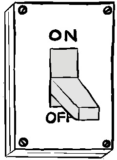

## Разочарование и информационная инженерия

Одна из важнейших обязанностей менеджера - помочь <<развеять туман>> при
оказании услуг. Это не так уж сложно, если вы регулярно обращаете внимание на
то, как вы можете помочь своей команде повысить эффективность оказания услуг.

Чтобы продемонстрировать это, позвольте мне привести пример ситуации, с которой
я столкнулся несколько лет назад, когда меня попросили принять участие в
управлении группой специалистов по разработке данных. Стратегическая программа
компании по бизнес-анализу (BI) шла плохо. Технические команды постоянно срывали
сроки, а те работы, которые они выполняли, считались некачественными.
Многочисленные бизнес-клиенты компании были справедливо возмущены, что заставило
задуматься о том, не лучше ли потратить бюджет программы на другие инициативы.

Когда я встретился с командой, было понятно, что они деморализованы. Все они
подолгу работали и мало чем могли похвастаться. Они возмущались, когда слышали,
что их беспокоят недостаточная квалификация или недостаточное усердие. Они
чувствовали нехватку ресурсов и не могли понять, почему компания не хочет
направить на проект больше инженеров.

На первый взгляд, ситуация казалась неразрешимой. Однако, когда я начал
разбираться в ситуации, стало ясно, что реальная проблема заключается в
чрезмерном <<тумане>> при доставке.

У этого <<тумана>> было три причины. Первая заключалась в том, что было
невероятно трудно понять, есть ли прогресс и чего они достигли. Все команды
работали две недели, используя спринты в стиле Scrum. Каждая команда вводила по
одному бизнес-компоненту за раз, при этом первая группа спринтов была посвящена
определению и последующей проверке различных источников данных, а также их
источников и структур. Вторая группа спринтов была посвящена написанию кода,
который затем будет обрабатывать эти данные для BI-системы.

Все это звучит достаточно разумно. Однако команды никогда не вопросами, какая
работа выполняется в тот или иной момент времени, кто ее выполняет, сколько
усилий прилагается, когда работа может быть завершена или какие проблемы
возникают на этом пути. Все, кто находился вне команды, могли видеть, что работа
ведется над одним бизнес-компонентом. В результате компонент обычно находился в
процессе работы на доске scrumban от двух до шести спринтов - период от четырех
до двенадцати недель, в течение которого никто, кроме инженеров, не имел
представление о том, насколько успешно идет работа.

Другая проблема заключалась в том, что между бизнес-командами, инженерами и
специалистами по обработке данных не было понимания о значимости каждого потока
данных. Это повлияло как на расстановку приоритетов, так и на точность
обработки, очистки и, в конечном итоге, интерпретации данных.

В условиях незнания о выполненной работе и непоследовательного представления о
ценности программы BI, бизнес-подразделения могли свободно изменять структуры
данных в своих каналах данных для удовлетворения новых требований бизнеса.
Конечно, об изменениях редко сообщалось командам инженеров по обработке данных,
хотя каждое изменение данных означало, что любая работа над затронутым каналом
должна была быть отброшена и выполнена заново.

Установить коммуникацию крайне важно. Первым шагом было улучшение видимости
работы, выполняемой командой. Для этого инженерным группам было предложено
разбить свою работу на разумные по размеру куски, не превышающие двух
человеко-дней. Любые артефакты, созданные в процессе работы, должны были быть
связаны с заданием, чтобы любой заинтересованный человек мог взглянуть на них,
чтобы лучше понять, что происходит.

Разделение работы и связывание артефактов давало ряд преимуществ. Во-первых,
бизнес мог получить представление о достигнутом прогрессе. Инженеры, выполняющие
работу, также могли видеть прогресс и накапливать полезную информацию для тех
случаев, когда они сталкивались с проблемой и нуждались в помощи.

Такое накопление артефактов имело еще одно преимущество: другие инженеры могли
использовать их, чтобы увидеть, есть ли общие типы подачи, которые можно
обобщить в более надежные и многократно используемые библиотеки. В конечном
итоге это ускорило и индустриализировало процесс внедрения BI-фидов, а также
стимулировало бизнес-клиентов к использованию общих стандартов.

Следующим шагом стало улучшение взаимодействия и сотрудничества между
бизнес-клиентами, инженерами по обработке данных и специалистами по анализу
данных. Перед началом работы с клиентом все должны были договориться об
относительном приоритете каждого фида и желаемых результатах. Это помогало
упорядочить и направить работу, когда она поступала в инженерные группы.
Бизнес-клиенты также согласились поделиться своими техническими дорожными
картами и работать над минимизацией изменений, которые могли бы нарушить работу
BI. Если по какой-то причине в процессе работы над фидом требовалось внести
изменения, было решено остановить работу и перенести фид в конец списка
приоритетов.

В результате этих действий скорость внедрения фидов значительно ускорилась.
Напряженность начала спадать, а моральный дух повысился. Качество итоговой
работы BI также значительно улучшилось, что помогло клиентам компании быстрее
достичь результатов, к которым они стремились.

## Определение того, что вы можете или не можете знать

Несмотря на то, что менеджеры играют важную роль в процессе, они не способны в
одиночку устранить всю неясность в предоставлении сервисов. Ключевые элементы
вашей экосистемы предоставления услуг, которые вносят свой вклад в те функции,
которые имеют значение или важны для вашего клиента, будут не только охватывать
системы, программное обеспечение, людей, навыки и поставщиков, на них также
будет влиять взаимодействие между ними. Некоторые из них, от самого программного
обеспечения и систем до конфигурации, подсистем контроля доступа, сетевых служб
и самих данных, вносят непосредственный вклад. Другие, от средств устранения
неполадок и восстановления, квалифицированного персонала и
контрольно-измерительных систем, являются вспомогательными механизмами,
помогающими находить и устранять неисправности, которые начинают выходить за
допустимые пределы.

Понимание того, что представляют из себя эти элементы, относительной важности
свойств, которые они обеспечивают, и того, какой вклад они в них вносят, поможет
вам построить карту, которую вы сможете использовать для изучения и улучшения
своей способности их реализовать. Что особенно важно при построении этой карты,
так это то, что вы скоро поймете, какой большой контроль вы имеете над
управлением силами, которые обеспечивают эти элементы. Элементы делятся на
следующие три отдельные категории: известные <<управляемые>>, известные
<<неуправляемые>> и неизвестные.

Давайте посмотрим, как каждая категория может помочь вам и вашей команде оценить
и, в конечном итоге, сформировать вашу организацию для наилучшего управления
операционными рисками.

## Что вы знаете и чем умеете управлять

Известные <<управляемые объекты>> включают в себя все элементы вашей сервисной
экосистемы, которые, как вы знаете, вы можете наглядно контролировать и которые
напрямую влияют на операционную эффективность вашего сервиса. Это та категория,
в которой в идеальном мире оптимально жили бы все элементы, необходимые для всех
критических или важных функций.

 Рисунок 8.6 <<Рабочие функции выключателя должны быть
известны и управляемы>>

Однако быть известным и <<управляемым>> полезно только в том случае, если вы
способны отслеживать, реагировать и восстанавливаться после любых событий,
которые ставят под угрозу выполнение этих задач, своевременным и эффективным
способом. Возьмем пример реагирования на транзакции. У большинства клиентов
будут ожидания относительно того, какая продолжительность задержки является
приемлемой для транзакции. Знание <<управляемых>> элементов, которые вы можете
настроить или изменить, чтобы сократить растущие задержки, не очень полезно,
если вы не можете вносить эти коррективы со скоростью или способом, который
могут терпеть клиенты. Точно так же недостаточно просто иметь элемент, который
прямо и сознательно <<управляем>>. Вам также нужны поддерживающие механизмы,
которые обнаруживают любые проблемы с доставкой функциональности с этим
элементом и исправляют их, чтобы также быть достаточно чувствительными. Это один
из самых распространенных способов, при котором организации, пытающиеся
управлять мощностями, терпят неудачу. Некоторые внедряют сложные инструменты и
технологии для управления такими функциями, как масштабируемость и
восстанавливаемость. Тем не менее, я видел, что у них либо не будет достаточно
внутренних навыков для их эффективного использования, либо они разделят
обязанности по всей организации и включают в себя команды, которые не могут или
не хотят вносить эффективный вклад в удовлетворение потребностей клиентов. Важно
знать такие элементы и то, как они способствуют успеху службы, знать и проверять
их пороговые значения, отслеживать их текущее состояние в производстве и
обеспечивать, чтобы любые группы, которые должны действовать при приближении к
пороговым значениям, были способны делать это оперативно. приемлемый таймфрейм с
приемлемым уровнем точности.

## Известные неуправляемые факторы

 Рисунок 8.7 <<Прошло некоторое время, прежде чем команда
Сэма смогла найти способ продемонстрировать ему известный неуправляемый фактор>>

Известные <<неуправляемые>> факторы это все элементы вашей экосистемы услуг,
которые вносят вклад в эксплуатационные возможности вашей услуги, однако не
находятся под вашим прямым контролем. Наиболее распространенными из них являются
облачные и PaaS сервисы, такие как AWS и Azure. Их используют, если нужно
предоставить критически важные инфраструктурные и платформенные услуги. Не менее
распространенными, но часто менее заметными, являются компоненты, поставляемые
коммерческими поставщиками коммерческого оборудования (например, поставщиками
сетевого, вычислительного оборудования или оборудования для хранения данных) или
программного обеспечения (например, баз данных, платежных или защитных COTS
пакетов), более мелкими, но часто не менее важными поставщиками услуг
кэширования и шлюзов, а также поставщиков внешних служб сборки, тестирования и
развертывания.

Осознание их важности и того вклада, который они вносят, чрезвычайно полезно. Но
главное в работе с известными <<неуправляемыми>> факторами это минимизация их
риска для экосистемы. Для систем и программного обеспечения это может включать в
себя создание надежных процедур мониторинга, устранения неполадок и
восстановления, а также использования более проверенных или стандартных версий и
конфигураций в тех местах, где они обеспечивают критически важные возможности..

Другой, более эффективный метод заключается в разработке и эксплуатации услуг
таким образом, чтобы они были устойчивы к любым проблемам, которые могут создать
эти <<неуправляемые>>. Именно этот подход лежит в основе концепций Chaos
Engineering и Simian Army компании Netflix. Там знали, что размещение
значительного количества  компонентов на AWS может привести к непредсказуемости
производительности, что негативно скажется на стабильности показываемого
пользователю видео. Они также знали, что инженеры склонны игнорировать или
преуменьшать угрозу проблем экосистемы, создавая программное обеспечение,
которое с трудом справляется с неожиданностями.

Используя такие инструменты, как Chaos Monkey и Latency Monkey, инженеры знали,
что когда-нибудь проблемы точно возникнут, и это заставляло их разрабатывать
программное обеспечение, которое способно устойчиво справляться с такими
ситуациями. Это приводит к снижению рисков для бизнеса и, в конечном итоге, к
более предсказуемому предоставлению услуг, которые ожидает клиент.

## Неизвестные

 Рисунок 8.8 <<Билли никогда не мог быть уверен в том, есть
ли какие-либо опасные неизвестные факторы, которые могут ему угрожать>>

Даже если у вас есть возможность управлять показателем работоспособности, это
мало чем поможет, если вы не знаете их составные элементы, их состояние и то,
как ими лучше управлять, чтобы обеспечить то, что нужно клиенту. Показатели
работоспособности такого рода это также неизвестные. Эти неизвестные повышают
уровень неуправляемого риска, который может повредить или даже разрушить бизнес.

К сожалению, с нехваткой информационного потока и неоптимальным уровнем
понимания сервисной части внедрения, неизвестность это состояние по умолчанию
для большинства показателей работоспособности. Именно в таком состоянии
находится большинство организаций по предоставлению услуг в начале пути своего
сервисного инжиниринга. Даже если вы решите проблему с определением того, что
нужно клиентам, вы понимаете, что вам предстоит проделать еще большую работу,
чтобы закрыть пробел в осведомленности в вашей системе поставок.

## Вы не знаете, чего вы не знаете

Я часто сталкиваюсь с компаниями типа BigCo и FastCo, которые могут казаться
успешными снаружи, но внутри оказываются в большом беспорядке. Обе модели имеют
свои собственные вызовы. Удивительно, но даже с гораздо меньшим количеством
организационной политики, осложняющей вещи, я часто обнаруживаю, что компании
типа FastCo, в своем стремлении к гибкости, каким-то образом умудрились создать
спектакулярно более глубокие проблемы.

Одна очень известная онлайн-сервисная компания в стиле FastCo неожиданно
оказалась в довольно неприятной ситуации своего собственного создания. Они с
гордостью довели все до крайности. Организация состояла из многих команд,
которые часто выпускали новые функциональные возможности в области, за которую
они были ответственны. Чтобы опробовать новые идеи, сохраняя при этом управление
рисками, они сильно использовали конфигурационные переключатели, canary,
Blue/Green и A/B-развертывание. Это делалось так, чтобы только часть
пользователей была подвержена новому коду, пока они не почувствовали себя
комфортно, распространяя его более широко.

Это все звучит очень разумно. Однако была одна важная проблема, о которой
компания не подумала. Несмотря на то, что они видели себя как конфедерацию
различных сервисов, клиенты воспринимали их все вместе как один продукт. Команды
внедрялись независимо друг от друга, часто с длительными циклами
A/B-развертывания. Хотя команды часто общались друг с другом и координировались,
их недостаток мышления о сервисах как об одном продукте означал, что они не
думали достаточно о всей картине.

Это означало следующее. Каждый новый переключатель мог создать совершенно новый
поток процесса и с ним новый пользовательский опыт. По мере роста количества
различных переключателей возможности, число потенциальных пользовательских
впечатлений возрастало экспоненциально. Команды все время пробовали новые идеи.
В конечном итоге они оказались с десятками тысяч живых переключателей,
разбивающих трафик на множество потенциально разных путей. Фактически, так много
различных путей, что было не только возможным, что ни один пользователь не
проходил по одному и тому же пути дважды, но и два пользователя, находившихся
рядом и потребляющих услугу в то же самое время, могли иметь очень разные
впечатления.

Это имело много очевидных недостатков. Во-первых, это создавало проблему
недетерминированного пользовательского опыта и кошмар для инженеров сервиса. Это
затрудняло понимание того, что испытывает пользовательское сообщество.
Бесконечное количество потенциальных комбинаций, которые пользователь может
пройти, также увеличивало количество крайних случаев, которые они могли
получить. Такая переменчивость также мешала одной вещи, которую они пытались
достичь: получить представлеобластиние о своей работе. Как можно убедиться, что
вы понимаете, что происходит, если вы не можете определенно знать, какие пути
пользователь выбрал для вашего кода?

## Способы устранения командой неопределенности при предоставлении услуг

Существует несколько способов, которыми команды могут улучшить свое общее
понимание ситуации, независимо от организационной структуры, продолжая при этом
учиться и совершенствоваться. Организовывая работы так, чтобы было понятно, что
происходит (рассматривается в главе 12, <<Workflow>>) имея регулярный, хороший,
но легкий обмен информацией и идеями (рассматривается в главе 14, <<Cycles and
Sync Points>>), а также интеллектуальная и значимая инструментация
(рассматривается в главе 11, <<Instrumentation>>) - это очевидные способы
помочь. Также есть способы переструктурировать процессы управления
(рассматривается в главе 15, <<Governance>>) и практики автоматизации
(рассматривается в главе 10, <<Automation>>), чтобы они способствовали, а не
мешали осознанию ситуации.

Прежде чем переходить к конкретным методам и практикам, важно, чтобы вы и ваша
команда заполнили и закрыли любые пробелы в знаниях, которые могут
препятствовать потоку информации и эффективной доставке. Об этом будет
рассказано в следующей главе, вместе с первой из <<обязанностей>>, которую
команда может использовать для облегчения потока оперативной информации и
выявления областей улучшения внутри и между командами. Я сам использовал этот
шаблон в нескольких организациях и нашел его отличным способом разрушения
силосов и одновременного улучшения технической координации и экспертизы между
командами.

Вторая <<обязанность>>, Queue Master, гораздо более важна. Она рассматривается в
главе 13, <<Queue Master>>, и представляет собой возможность для каждого члена
команды выйти из своей обычной работы, чтобы улучшить ситуационное понимание
команды и выявить области для обучения и улучшения, отслеживая работу,
проходящую через команду.

## Заключение

Эффективное предоставление услуг требует, чтобы команды имели необходимый объем
информации, чтобы знать цель, которую нужно достигнуть, возможности, доступные
клиентам, и элементы экосистемы, которые могут способствовать их предоставлению.
Изменив свое отношение к ролям и экосистеме, команды смогут <<развеять туман>> в
сфере предоставления услуг, который так часто заслоняет им путь к успеху.
