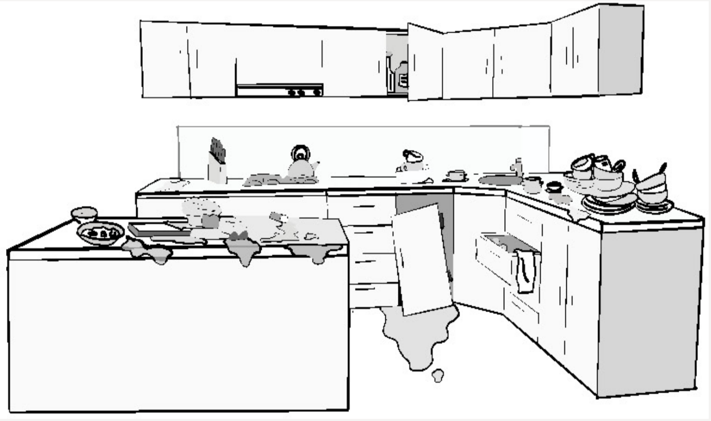
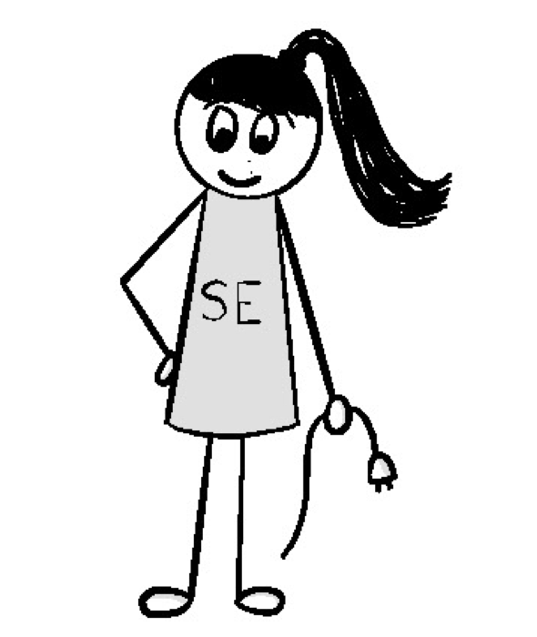

> _Если вы не можете увидеть куда направляетесь --- спросите того, кто побывал
> там раньше вас._
>
> --- Джей Джей Лорен Норрис

Эффективная разработка может быть сложной. Многие команды разработчиков
сосредотачиваются на задаче выяснить, как разработать то, что хочет клиент, без
проблем и с минимальными затратами. Но клиентам нужно нечто большее, чем просто
набор функций. Они также нуждаются в услугах, чтобы иметь <<возможности>>
(описанные в предыдущей главе), необходимые им для достижения поставленных
целей. Многие команды по предоставлению услуг изо всех сил пытаются достичь
зрелости, чтобы последовательно и уверенно предоставлять эти <<возможности>>, но
растущая сложность экосистемы только увеличивает трудности ее достижения. По
мере роста размера и количества команд, инстанций, служб даже, казалось бы,
отличным командам может быть трудно поддерживать общую осведомленность и
межорганизационную согласованность.

К сожалению, появляющиеся инструменты и подходы к предоставлению услуг в
основном по-прежнему направлены на устранение трудностей по их оказанию. В
результате они часто вносят незначительный вклад в обеспечение достаточного
потока информации, необходимого для того, чтобы оставаться в курсе
взаимодействий в экосистеме, которые формируют <<возможности>> предоставления
услуг. Это означает, что небольшие пробелы и перекосы свободно распространяются
по экосистеме, часто незаметно искажая нашу концепцию динамики обслуживания
таким образом, что в конечном итоге подрывает эффективность принятия решений.

Лучший способ для вас и вашей команды преодолеть эту проблему --- начать
оценивать зрелость практик и моделей поведения, на которые вы полагаетесь и
которые влияют на поток информации и ситуационную осведомленность. Это может
дать ключ к пониманию вашей подверженности проблемам с осведомленностью и их
вероятных источников, чтобы вы могли начать процесс избавления от тумана
осведомленности, который наносит ущерб процессу принятия решений и, в конечном
счете, качеству обслуживания ваших клиентов.

В этой главе я познакомлю вас с некоторыми найденными мной подходами, которые
могут помочь вам начать процесс открытий и вывести на правильный путь
совершенствования. Первый --- это структура зрелой модели, которая может помочь
вам определить, насколько хорошо вы знаете и можете эффективно управлять частями
вашей экосистемы обслуживания, которые влияют на вашу способность предоставлять
свои услуги с ожидаемыми <<возможностями>>. Эта модель опирается на концепции
познаваемости, описанные в предыдущей главе, и придерживается многих разумных
подходов к гигиене, архитектуре и сотрудничеству, которые позволяют командам
лучше понимать и повышать свою способность успешно выполнять задачи с
использованием средств, находящихся под их контролем.

По мере продвижения вы, вероятно, обнаружите, что для устранения вашего тумана
осведомленности требуется нечто большее, чем несколько корректировок процессов и
инструментов. Иногда у членов команды настолько высокие нагрузки по работе, что
они постоянно подвергаются риску развития <<туннельного видения>>, которое
затемняет важнейшие взаимосвязи между их областью и экосистемой в целом. В
других случаях потребность в актуальной, глубоко технической, информации
настолько высока из-за быстрой и сложной динамики экосистемы, что она не может
быть полностью удовлетворена даже самым увлеченным и исполненным благих
намерений менеджером, архитектором или руководителем проекта/программы.

Именно для решения таких проблем и предназначена вторая деталь. Это вращающийся
механизм, который может более непосредственно помочь повысить осведомленность и
согласованность команды. В зависимости от того, насколько сложна и
фрагментирована ваша экосистема, а также от того, каковы возможности и
способности вашей команды к совершенствованию, его можно использовать как на
временной, так и на более постоянной основе. Мне нравится называть этот механизм
*Service Engineering Lead*, или сокращенно *SE Lead*.

В этой главе будет рассказано о том, что это за механизмы, как они работают, а
также о некоторых идеях относительно того, как их можно внедрить в вашей
организации.

## Моделирование зрелости оказания услуг

Наша отрасль изобилует всевозможными моделями зрелости. Так многие из них --- не
более чем уловки для продажи консультационных услуг, поэтому даже упоминание
концепции может вызвать недовольство у членов команды. Однако есть некоторые
области, где хорошо структурированная модель может стать эффективным способом
измерения и направления организации к более предсказуемому, надежному и
результативному предоставлению возможностей и услуг, необходимых для
удовлетворения своих клиентов.

Это может показаться очевидным, но один из лучших способов определить, поможет
ли данная модель зрелости --- это посмотреть на то, что именно измеряется.
Полезная модель должна научить вас выявлять, а затем либо смягчать, либо
устранять коренные причины любой непредсказуемости и рисков, от которых страдает
ваша организация. Это отличается от более несовершенных моделей зрелости,
которые, как правило, фокусируются на подсчете результатов, которые в лучшем
случае выявляют только симптомы, а не их первопричины.

Прелесть модели зрелости заключается в том, что, в отличие от школьных оценок,
вам не обязательно иметь идеальный балл по всем параметрам, чтобы получить
наиболее практичный для вас уровень зрелости. Вы можете столкнуться с
ситуациями, подобными моей, когда некоторая незрелость и изменчивость в
какой-либо области вполне приемлемы, если известны их причины и диапазон, и они
никогда не влияют на <<возможности>>, от которых зависят клиенты.

На самом деле, любая модель зрелости, которая настаивает на том, что успех
приходит только тогда, когда все показатели идеальны, изначально ошибочна. Я
регулярно сталкиваюсь с организациями, которые, похоже, стремятся к высоким
уровням в ряде областей, которые не только не нужны, но и наносят ущерб их
способности предоставлять <<возможности>>, которые действительно нужны
заказчику. Вот почему ваша модель зрелости должна быть реализована таким
образом, чтобы она соответствовала результатам и <<возможностям>> клиента.

Одним из таких примеров являются те меры, которые повышают доступность услуг,
такие как поддерживаемость и сопряженность. Даже без модели зрелости показатели
доступности часто не соответствуют тому, что на самом деле нужно клиенту. Я
встречал команды, которые напрягались, чтобы соответствовать какому-то
мифическому показателю безотказной работы в 99,999%, не понимая, что клиентам
нужно, чтобы услуги работали только в течение предсказуемого периода в рабочие
дни. Клиентов, как правило, не волнует, доступна ли услуга, когда нет никаких
шансов, что им понадобится ею воспользоваться. На самом деле, они, скорее всего,
предпочли бы гораздо более простой и дешевый сервис, который доступен, когда им
это нужно, а не опасно перегруженный и всегда доступный сервис, который является
дорогим и медленно адаптируется к их потребностям.

Чтобы избежать подобных проблем, я стараюсь убедить команды не рассматривать
показатели зрелости как оценку, а вместо этого использовать их в качестве
руководства для повышения их ситуационной осведомленности об экосистеме
предоставления услуг, чтобы удовлетворить потребности их организации и
клиентской базы. Иногда показатель зрелости выявляет недостатки возможностей,
которые запрашивает клиент, которые необходимо устранить, или пробелы в навыках
или потоке информации, для устранения которых команде может потребоваться
помощь. Иногда командам требуется помощь руководства или специализированных
экспертов, таких как ведущий специалист по техническому обслуживанию, о котором
пойдет речь ниже, чтобы увидеть проблемы и продвинуться вперед. Устраняя страх
осуждения, команды чувствуют себя в безопасности, делясь информацией и обращаясь
за помощью, чтобы в конечном итоге добиться эффективного результата.

## Пример оценки качества кода

При оценке зрелости предоставления услуг важно убедиться, что вы оцениваете
область таким образом, который поможет вам разумно удовлетворить потребности
клиентов. Вы получаете то, что оцениваете. Очень легко оценить даже самую важную
область таким образом, что результирующее поведение отклонится от намеченной
цели. Хороший способ проиллюстрировать это --- взглянуть на такую
распространенную метрику, как качество кода.

Качество кода может многое рассказать вам о вероятной стабильности данной
области и способности команды изменять, расширять и поддерживать ее. Обычно
считается, что качество кода можно оценить путем подсчета и отслеживания
количества дефектов, которые были замечены в нем. По этой причине существуют
целые отрасли, посвященные подсчету, отслеживанию и построению графиков
тенденций роста и падения числа дефектов в течение жизненного цикла различных
частей кода.

Проблема с этой метрикой заключается в том, что количество замеченных дефектов
отражает только те, которые были обнаружены и сочтены достаточно важными для
фиксации. Могут существовать сотни или даже тысячи необнаруженных дефектов.
Некоторые из них могут жить в неисследованных, но легко встречающихся крайних
случаях. Другие могут проявляться только обыденными симптомами, из-за которых
команда не учитывает их. Также могут быть дефекты, когда взаимодействие между
компонентами или сервисами пересекает границу ответственности между командами.

Еще одна проблема с этой метрикой заключается в том, что команды часто
поощеряются или наказываются по количеству дефектов, а не по общему успеху или
неудаче обслуживания. Поскольку вы можете подсчитать только то, что было
зафиксированно как открытый дефект, члены команды поощряются скрывать или
утверждать, что что-то является <<особенностью, а не ошибкой>>, вместо того,
чтобы стремиться достичь желаемого: более высокого уровня качества кода в
экосистеме, чтобы укрепить доверие клиентов к вашей способности предоставлять и
поддерживать сервисы с <<возможностями>>, необходимыми для достижения целевых
результатов.

Вместо подсчета дефектов хорошая модель зрелости должна рассматривать, какими
способами вы и ваша команда активно снижаете возникновение дефектов. Одним из
таких показателей является частота и объем рефакторинга кода. Регулярный
рефакторинг устаревшего кода не только позволяет команде сократить количество
ошибок в кодовой базе, но и помогает членам команды поддерживать актуальное и
точное понимание различных частей кода, на которые вы полагаетесь. Это снижает
вероятность того, что ошибочные предположения о конкретном элементе кода
приведут к появлению дефектов. Такие факторы, как ротация членов команды вокруг
кодовой базы, еще больше повышают общую осведомленность.

## Уровни модели зрелости предоставления услуг

Оптимальная модель зрелости предоставления услуг работает на основе концепции
уровней зрелости в отношении интересующих областей возможностей. Я обычно
использую набор из шести уровней от 0 до 5. Помимо удобного соответствия
количеству уровней в большинстве других моделей зрелости, это число хорошо
согласуется с поэтапными изменениями в области общей осведомленности, обучения и
управления трудностями в экосистеме предоставления услуг.

Вот общая схема каждого из уровней:

- **Уровень 0:** Исходная точка для предварительной проверки. Это временное
  положение, с которого все начинают в самом начале внедрения модели, прежде
  чембудут зафиксированы какие-либо детали. На уровне 0 объясняется модель
  зрелости и составляется план по выяснению и фиксации уровня для каждой
  интересующей области возможностей. Нередко команда сразу же переходит на
  уровень 2 или 3 с этого положения.
- **Уровень 1:** Появление лучших практик. Это тот случай, когда информация по
  интересующей области возможностей была собрана и признана незрелой или
  находящейся в плохом состоянии. На этом уровне необходимо разработать план
  <<Оздоровления>> с графиком и ответственными лицами за каждое действие,
  чтобы помочь внедрить улучшения и довести область, по крайней мере, до
  уровня 2.
- **Уровень 2:** Локальный или компонентный уровень зрелости. Это уровень,
  которого команда достигает, когда она знает состояние интересующей ее
  области возможностей на локальном или компонентном уровне. Они могут
  отслеживать ее состояние, понимать, какие возможности клиента она
  обеспечивает или на что влияет, понимать, как контролируется состояние и
  производительность, и понимать, что может пойти не так. Существует набор
  практических методов управления деятельностью вокруг потенциала, которые
  команда приняла и может постоянно совершенствовать. Информация и координация
  за пределами местного уровня ограничены или недостаточно развиты.
- **Уровень 3:** Межкомпонентная непрерывная практика. На этом уровне команда
  имеет твердое понимание того, от каких компонентов, услуг, элементов данных
  и команд зависят компоненты и услуги, которые они предоставляют, что
  отслеживается и поддерживается в актуальном состоянии. Существует очевидный
  хороший набор практик координации и регулярные четкие каналы связи с
  командами и организациями, которые обеспечивают и поддерживают зависимости.
  Для программного обеспечения и услуг любые API являются чистыми и четко
  определенными, модели данных ясны и согласованы, потоки данных известны и
  отслеживаются, тестирование и мониторинг стабильны и надежны, связь между
  компонентами хорошо управляется и ослабляется там, где это целесообразно,
  модели развертывания продуманы и согласованы, а практика мониторинга и
  устранения неполадок ясна, роли и эскалация известны и согласованы для
  смягчения любых проблем координации во время важных событий.
- **Уровень 4:** Непрерывные практики в разных направлениях. На этом уровне
  все значимые планы на обслуживание, которые включают компоненты и услуги
  команды разработчиков, известны целиком и полностью. Сюда входят компоненты
  и услуги, которые находятся вне прямой компетенции команды разработчиков.
  Существует немало областей, которые являются либо <<известными>>, либо
  <<неизвестными>> и рассматриваются соответствующим образом. Существует
  четкое понимание и отслеживание зависимостей и уровня связи во всех
  структурах, отслеживаются все потоки, документируются и понимаются типы
  отказов, а также их влияние на клиента и желаемые результаты. Известны,
  документированы и наглядно продемонстрированы способы устранения неполадок,
  починки и эскалации. Связь и координация с командами на протяжении всего
  пути обслуживания являются четкими и регулярными. Имеются инструменты,
  позволяющие фиксировать, понимать и улучшать опыт обслуживания клиентов и
  модели использования на протяжении всего пути. Команды часто сами помогают
  друг другу, привлекая других участников бизнеса для помощи и инвестиций в
  слабые области, которые могут не входить в их непосредственную компетенцию.
  Этот уровень необходим для бесперебойного предоставления услуг в экосистемах
  с несколькими командами по предоставлению услуг или зависимыми внешними
  службами.
- **Уровень 5:** Постоянная оптимизация процесса предоставления услуг. Когда
  команды разработчиков достигают этого уровня, все работает безупречно.
  Команда разработки может и делает релизы по требованию в тесном
  взаимодействии с другими командами и клиентом, когда это необходимо.
  Непрерывные меры по улучшению повсюду, и команда регулярно бросает вызов
  бизнесу, чтобы улучшить и принять новые задачи, которые активно помогают
  текущим клиентам и привлекают новых клиентов для достижения их целевых
  результатов с помощью предоставляемых услуг. Зрелость обычно измеряется по
  нескольким параметрам, как показано на рисунке 9.1. Измерение различных
  направлений или областей, представляющих интерес, а не только один лишь
  показатель зрелости --- отличный способ помочь командам выявить
  потенциальные риски и выделить области, где им может потребоваться время и
  помощь для улучшения. Иногда это может показать, что есть смысл
  инвестировать в архитектуру работы для создания устойчивости или ослабления
  связи с проблемными зависимостями. В других случаях это может выявить места,
  где тратится много усилий, которые не способствуют достижению результатов
  для удволетворения клиентов.

**Рисунок 9.1**\
Диаграмма <<паука>> зрелости, представляющая текущее и целевое
состояния

Особенностью этой модели является то, что каждый уровень зрелости является
накопительным. Хотя между уровнями зрелости можно перемещаться вверх и вниз, в
основном это движение происходит за счет повышения уровня зрелости благодаря
лучшему пониманию того, что вы имеете, или за счет реального внедрения
улучшений, или за счет снижения уровня зрелости при внедрении новых компонентов,
решений или команд в экосистему услуг.

Еще одним преимуществом данного подхода является то, что он обеспечивает
незаметный, но эффективный толчок для улучшения коммуникационного потока и
сотрудничества между командами и даже другими важными сторонами за пределами
организации. Это может стать полезным стимулом для более замкнутых или
враждующих команд. Это также может выявить нездоровые отношения с поставщиками
или, как в случае с FastCo, описанном в главе 8, проблемное несоответствие
уровня услуг поставщика, которое необходимо устранить.

Чтобы собрать все это воедино, команда обычно работает с руководителем или
знающим человеком извне команды, чтобы собрать, проанализировать и отследить
доказательства, лежащие в основе каждого показателя возможностей. Это позволяет
время от времени проводить аудит данных, особенно в том случае, если произойдет
событие, которое не соответствует достигнутому уровню зрелости. Это может помочь
команде понять первопричину, которая привела к снижению уровня зрелости. Я часто
рекомендую командам строить диаграммы, как показано на рисунке 9.1, чтобы
отслеживать, на каком этапе они находятся, а также то, чего они намерены достичь
в следующем цикле совершенствования.

Следует отметить, что команды, как правило, редко уверенно достигают уровня 5 по
всем показателям. Уровень 5 --- это сложно. Он означает, что все действительно
работает. Экосистемы оказания услуг редко бывают настолько статичными, чтобы не
было необходимости устранять возникающие проблемы и улучшать их. Даже на 5-ом
уровне цель состоит в том, чтобы каждый постоянно находил новые способы более
эффективного достижения целевых результатов совместными усилиями.

## Области зрелости предоставления услуг, представляющих интерес

Теперь, когда у вас есть представление о работоспособном механизме оценки, стоит
обсудить аспекты того, что, вероятно, имеет смысл измерять и отслеживать в вашей
экосистеме.

Все экосистемы разные. Однако есть ряд общих полезных областей, на которые
следует обратить внимание для оценки зрелости предоставления услуг. Гигиена на
уровне программного обеспечения, данных и систем, безусловно, является одной из
них, как и то, как команда подходит к различным архитектурным практикам, таким
как сопряжение, избыточность и проблемы управления отказами. Все это ---
традиционные технические области, в которых любое незнание может создать большой
и потенциально разрушительный риск неудачи.

Есть и другие области, которые менее очевидны, но оказывают существенное влияние
на осведомленность команды по оказанию услуг и ее способность эффективно
реагировать и совершенствоваться перед лицом возникающих проблем. Список
интересных областей, которые я счел в целом применимыми для определения зрелости
возможностей предоставления услуг в большинстве организаций, включает следующее:

- Информационный поток и инструментарий
- Управление конфигурацией и гигиена обслуживания
- Поддерживаемость
- Смягчение последствий единой точки отказа (Single point of failure, SPoF) и
  управление взаимодействием
- Вовлеченность

Почему именно этот список? Давайте подробно остановимся на каждом из них, чтобы
разобраться более детально.

## Информационный поток и инструментарий

**Рисунок 9.2**\
Знание того, насколько хорошо поступают данные, имеет большое
значение.

Эффективный и своевременный поток информации в экосистеме имеет решающее
значение для поддержания ситуационной осведомленности. Информация поступает от
людей, кода и предоставляемых услуг, а также от любых платформ и механизмов,
поддерживающих создание, внедрение и эксплуатацию кода и услуг.

Цель этого показателя --- определить, насколько хорошо поддерживается
ситуационная осведомленность в командах доставки и эксплуатации. Это включает в
себя поиск ответов на такие вопросы, как:

- Каков баланс проактивных и реактивных инструментов, которые помогут нужным
  людям узнать о разработках, требующих внимания. Сколько из этих мер
  обязательно являются реактивными, и почему нет разумных проактивных
  альтернатив?
- Насколько велики возможные временные задержки между появлением разработки и
  тем, как нужные люди узнают о нем?
- Каково качество поступающей информации?
- Сколько знаний и опыта необходимо для оценки и понимания ситуации, и насколько
  широко эти знания и опыт доступны в команде?
- Насколько известны сильные и слабые стороны команды и сервисов?

Измерение информационного потока начинается с фиксирования простых и очевидных
вещей, например, насколько широкое участие в командных встречах и обсуждениях
принимают наблюдения, идеи и проблемы членов команды. Оно также включает
определение источников информации и знаний во всей экосистеме.

Способность команды знать, кто что знает, кто обладает знаниями для выполнения
определенных задач, и как эти знания могут быть разделены и расширены, может
подсказать вам, где могут быть узкие места, единые точки отказа или места, где
контекст может быть искажен или потерян. Например, информация, которая в
значительной степени зависит от менеджера или эксперта в предметной области,
выступающего в качестве связующего звена между ситуацией и людьми, которые
должны ее решать, может создать ненужные трения и потерю информации. Аналогичным
образом, использование чатов может быть отличным способом помочь потоку
информации. Однако они могут оказаться неэффективными, если их участники
фрагментированы, если в канале слишком много постороннего шума или если
информация не фиксируется каким-либо образом для дальнейшего использования.

Измерение потока и качества информации, поступающей от приборов экосистемы, не
менее важно. Непоследовательная практика протоколирования, малое или полное
отсутствие инструментария кода и сервисов, шумный или ненадежный мониторинг,
плохо отслеживаемое состояние конфигурации экземпляра, отсутствующая или
устаревшая документация, а также нестабильное отслеживание инцидентов могут
ограничить способность команды понять все --- от состояния сервиса и
взаимодействия с кодом до моделей использования и путешествий клиентов по
экосистеме. Я регулярно сталкиваюсь с командами, которые полагаются на внешних
поставщиков услуг для ключевых сервисов платформы, таких как очереди сообщений,
сетевые сервисы и сервисы данных, которые не очень хорошо понимают модели
использования этих сервисов и в итоге оказываются за пределами лимитов
поставщиков. Возникающие в результате дросселирование, отключение услуг и
раздутые бюджеты доставляют неудобства и могут негативно повлиять на клиента.

Ценность метрик самого процесса доставки также часто упускается из виду. Наличие
данных обо всем, начиная от количества оттока кода, распределения изменений кода
между разработчиками команды в рамках компонентов, статистики
сборки/интеграции/тестирования, версионности, атомарности пакетов, отслеживания
конфигурации развертывания и заканчивая восстановимостью среды и ее данных,
может выявить зоны риска и точки трения, которые могут препятствовать
способности команды реагировать на события и учиться.

Также важно изучить, как команда получает информацию о клиентах, их потребностях
и ожиданиях, если вообще получает. То, как команда получает и узнает о моделях
использования клиентов, какие <<возможности>> важны для них, и каких результатов
они пытаются достичь, может выявить потенциальные задержки, пробелы и неверные
направления, которые могут ухудшить жизненно важную ситуационную
осведомленность, необходимую для принятия решений.

Многие команды сталкиваются с проблемой оценки зрелости информационных потоков.
Во многом это объясняется тем, что зрелость информационного потока в меньшей
степени связана с количеством поступающей информации, а в большей с ее
способностью обеспечить достаточный контекст для согласования команд и повышения
эффективности решений.

Попытка ответить на вопросы, изложенные выше, может стать хорошим началом, чтобы
помочь вам и вашей команде начать путь к зрелости информационного потока. Я
часто дополняю их рядом экспериментов, направленных на проверку того, как и
насколько быстро информация распространяется по организации. Иногда это может
быть просто задавание одних и тех же вопросов разным командам и членам команд, а
затем поиск подсказок в любых различиях в их ответах. В других случаях я
использую так называемые <<трассеры>> (как упоминалось в Главе 6, <<Ситуационная
осведомленность>>) для поиска любых трений, узких мест и искажений в потоке
информации и результирующих действий в команде.

Со временем каждый член команды должен иметь возможность самостоятельно
проверять качество потока информации, даже если это делается только для
повышения собственной осведомленности и эффективности принимаемых решений.
Проверка того, какая информация поступает, куда она направляется, и ее общей
точности должна проводиться таким образом, чтобы команда четко понимала, что она
предназначена для поддержки команды, а не для ее осуждения. Пробелы, узкие места
и единые точки отказа возникают в самых лучших командах. Ценность приносит то,
что их можно быстро обнаружить, понять, как они образовались, и затем
постараться предотвратить их появление в будущем.

## Управление конфигурацией и гигиена обслуживания

**Рисунок 9.3**\
Гигиена имеет большое значение в вашей экосистеме обслуживания.

Каждый, кому приходилось иметь дело с неряшливым подростком или соседом по
комнате, может подтвердить, что неорганизованная комната не позволяет точно
определить, что в ней находится, в каком состоянии эти предметы и какие
зависимости им необходимы для работы. Это не только замедляет процесс поиска и
использования любых предметов, но и может привести к потере предметов, переделке
и другим дорогостоящим ошибкам. Это может быть незначительным раздражителем,
если речь идет об их спальне. Однако это может быть откровенно опасно для вашего
здоровья, если беспорядок распространяется на кухню, где такие скрытые радости,
как прогорклые продукты и загрязненная посуда, могут привести к болезни или
смерти.

То же самое происходит и в экосистемах обслуживания. Как и при приготовлении
еды, любой недостающий или поврежденный элемент, неправильная версия или тип,
неправильно используемая или настроенная часть технологического стека может
привести к разного рода неприятным сюрпризам, которые заставят сервисы вести
себя не так, как нужно клиенту.

Подобно организованной кухне, внедрение хороших методов гигиены экосистемы
позволяет понять состояние компонентов ваших услуг таким образом, чтобы получить
подсказки о том, насколько хорошо они и механизмы, которые вы используете для их
сборки и обслуживания, будут способствовать улучшению возможностей клиента.
Например, вы должны иметь возможность посмотреть на метрики сборки и
тестирования, чтобы обнаружить потенциально <<хрупкий>> код. Это те места, где,
кажется, все идет не так, как надо, каждый раз, когда к ним прикасаются.

Аналогичным образом, способность получить представление о том, сколько и где
изменений может произойти в среде, поможет вам определить уровень потенциального
риска при внедрении этих изменений. Это включает в себя определение того, какие
возможности могут быть затронуты изменениями, а также то, насколько обратимыми
могут быть изменения, если что-то пойдет не так.

Чтобы измерить уровень гигиены экосистемы, я обычно стараюсь, чтобы команда
попыталась ответить на следующие вопросы:

- Как команда обслуживания управляет своим кодом и средой обслуживания? Делается
  ли это более зрелым способом с хорошим контролем версий, атомарными пакетами и
  инструментами, которые создают и отслеживают изменения конфигурации, которые
  можно легко проверить на точность? Может быть, вместо этого используется менее
  зрелый способ с документацией, которой люди могут следовать, но где есть
  ограниченная видимость в обеспечении окончательного и текущего состояния?
- Применяются ли методы непрерывной сборки и интеграции, и если да, то насколько
  постоянно они дают представление о состоянии кода? Как часто это проверяется и
  используется для понимания состояния кода и его способности удовлетворять
  требованиям заказчика?
- Ведет ли команда разработчиков разработку по принципу top-of-trunk, когда весь
  код проверяется в одном стволе и конфликты решаются немедленно, или же команда
  использует сложные разветвления и исправления/слияния, что означает, что
  работа каждого не интегрируется вместе все время? При разборе конфликтов
  слияния можно легко упустить детали.
- Находится ли программное обеспечение в пакетах, и если да, то являются ли
  пакеты атомарными, чтобы их можно было легко удалить, не оставляя остатков в
  виде висячих файлов, осиротевших резервных копий или потенциально искаженных
  конфигураций?
- Все ли программное обеспечение и все ли пакеты имеют версии и отслеживаются ли
  изменения во времени? Если да, то можно ли определить, какая конфигурация была
  в среде в определенный момент времени, а также какие изменения были сделаны и
  когда, чтобы отследить ошибку или неожиданное изменение поведения?
- Можно ли узнать, кто что изменил, когда изменил и почему изменил?
- Известна, отслеживается и управляется ли совместимость версий между
  компонентами, и если да, то как?

То же самое необходимо сделать для сред:

- Все ли ее элементы известны, отслеживаются или обрабатываются иным образом?
- Включает ли это инфраструктуру хостинга?
- Насколько допустимы отклонения в инфраструктуре хостинга без возникновения
  проблем и почему?
- Известны ли отклонения и отслеживаются ли они? Если да, то кем и как часто они
  проверяются?
- Воспроизводим ли стек, и если да, то сколько времени и усилий требуется для
  его воспроизведения?
- Имеет ли кто-либо, уполномоченный создавать среду, возможность сделать это
  самостоятельно?
- Сколько времени требуется человеку, чтобы освоить процесс создания и
  конфигурирования среды, развертывания и конфигурирования релиза?
- Известны ли различия между средами разработки, тестирования и производства, и
  если да, то где отслеживаются эти различия, где находятся зоны риска,
  вызванные различиями между средами, и как они устраняются?

Хорошее управление конфигурацией и гигиена обслуживания --- это то, что
позволяет инструментам и механизмам непрерывного обслуживания по-настоящему
сиять. По этой причине это тот показатель возможностей, который может быть
наиболее эффективно использован дополнительными операционными инструментами и
механизмами.

## Поддерживаемость

**Рисунок 9.4**\
Являются ли ваши услуги поддерживаемыми или это несчастный случай, который
только и ждет, чтобы произойти?

Уровень поддерживаемости услуги зависит от двух важных факторов:

- Возможности, встроенные в компонент и экосистему, в которой живет сервис,
  которые обеспечивают средства для ее эффективной установки, управления и
  поддержки.
- Объем знаний и осведомленности, необходимых тем, кто осуществляет оперативную
  поддержку сервиса. Сюда входит понимание того, что может привести к деградации
  или отказу услуги и как она может повести себя, когда это начнет происходить,
  как устранять неполадки и восстанавливаться после проблем, когда они
  возникают, и как масштабировать услугу для роста и обработки периодических
  всплесков трафика.

Поддерживаемость --- это часто неправильно понимаемая и игнорируемая
способность. Например, наличие экосистемы услуг, в которой имеются механизмы
поддержки, и некоторых членов команды, которые потенциально могут их
использовать, не обязательно означает, что эти возможности развернуты
эффективно. Знания и осведомленность часто сильно раздроблены в команде, при
этом операционная поддержка нижнего уровня видит, что происходит, но обладает
лишь базовыми знаниями в области инфраструктуры и устранения неполадок, а более
глубокие навыки находятся в специализированных подразделениях, таких как команды
front-end, back-end и базы данных. Как и следовало ожидать, это замедляет
скорость реагирования и одновременно затрудняет выявление взаимосвязей между
разрозненными элементами экосистемы.

Еще одна проблема заключается в том, что концепцию поддерживаемости легко
неправильно истолковать как количество подготовленных процессов и планов по
обработке инцидентов. Я регулярно сталкиваюсь с документациями, которые ожидают,
что их пошаговые процессы будут бездумно выполняться для устранения проблемы,
вместо того, чтобы поощрять сотрудников к пониманию проблемы, чтобы они могли
найти способы проактивного снижения вероятности возникновения таких проблем в
будущем. На другом конце спектра находятся планы аварийного восстановления и
обеспечения непрерывности бизнеса, которые пытаются заранее спланировать шаги по
преодолению конкретных катастрофических бедствий. Хотя документирование подходов
к устранению возможных проблем и выполнению процедур восстановления и
обеспечения непрерывности бизнеса является разумным, рассчитывать на то, что все
пути выхода из строя и восстановления будут задокументированы таким образом, что
их сможет выполнить любой технический специалист, независимо от глубины его
знаний экосистемы, в которой он работает, зачастую опасно. Мало того, что
маловероятно, что все пути будут зафиксированы, они часто не учитывают
непредвиденную комбинацию событий, таких как деградация нескольких компонентов
или событие повреждения данных, которые происходят с большей вероятностью и
требуют глубокого знания экосистемы для решения проблемы.

> Каждый, кто имеет несколько лет карьеры, вероятно, был застигнут врасплох
> каскадом, казалось бы, незначительных проблем, которые снежным комом переросли
> в катастрофу. Некоторые из них, такие как ошибка BGP в Facebook/Meta в октябре
> 2021 года[^1], отказ электропитания в дата-центре 365 Main в 2007 году[^2],
> или отказ Azure в феврале 2012 года[^3], были достаточно масштабными, чтобы
> встряхнуть тысячи пострадавших клиентов от их катастрофически пассивного
> доверия к плохо понимаемым зависимостям. Однако не обязательно быть крупным
> поставщиком сервисов, чтобы попасть в такую ловушку. Я лично был свидетелем
> сотен менее известных, но не менее разрушительных каскадов отказов, многие из
> которых, как меня неоднократно убеждали заранее, никогда не произойдут.
> Поощряя сотрудников к пониманию экосистемы сервисов и результатов, которые они
> пытаются достичь, вы можете значительно сократить потенциальную
> продолжительность сбоя и ущерб, который он может нанести.
> 
> [^1]: Подробнее об отключении 4 октября, Мета:
> <https://engineering.fb.com/2021/10/05/networking-traffic/outage-details/>
> 
> [^2]: Потеря доверия к 365 Main, Gawker:
> <https://www.gawker.com/282257/365-mains-credibility-outage>
> 
> [^3]: Сводка о перебоях в работе службы Windows Azure 29 февраля 2012 года,
> Microsoft:
> <https://azure.microsoft.com/en-us/blog/summary-of-windows-azure-service-disruption-on-feb-29th-2012/>

Существует несколько хороших способов отслеживания поддерживаемости. Начать
стоит с измерения того, насколько быстро человек может освоить установку и
поддержку компонента или услуги. В прошлом я делал это, вводя в курс дела новых
сотрудников, где им давалось задание установить различные ключевые компоненты
услуги. Это включает в себя выяснение того, как устанавливать различные
компоненты, затем выполнение установки и документирование того, что они
испытали. После этого с новыми сотрудниками проводится брифинг, чтобы они могли
предложить, что следует исправить, и описать, какую пользу, по их мнению,
принесут предложенные ими исправления.

В одной компании это упражнение началось с того, что на стол новичка положили
новый сервер, только что из коробки. Затем они должны были выяснить не только,
как установить по, но и как установить сервер в стойку и подключить его к сети,
установить на него нужную операционную систему и определить все остальные детали
конфигурации и поддержки. Это был впечатляюще эффективный способ улучшить
установку и настройку сервисов. Все, кто прошел через это, могли вспомнить всю
боль, через которую они прошли, и были мотивированы на поиск путей постоянного
упрощения.

Подобные упражнения легко проводить при предоставлении сервисов в облаке, в том
числе проводя код через конвейер поставки или пытаясь определить, как запустить
новые экземпляры сервисов. Я знаю, что некоторые компании делают это, заставляя
новых сотрудников выполнять push в продакшн в рамках процесса адаптации, чтобы
помочь им ознакомиться с процессами поставки и push, а также получить
представление о том, как их можно улучшить.

Также полезно внедрить аналогичные процессы, которые измеряют, как быстро
текущие члены команды могут полностью войти в курс дела в тех частях экосистемы,
с которыми они ранее не работали. Это особенно полезно для крупных организаций,
в которых имеется множество сервисных компонентов, разбросанных по многим
областям. Это не только открывает глаза, но и является отличным способом
поощрить всех к открытому обмену информацией и сотрудничеству переступая рамки
команды.

Отслеживание инцидентов может стать еще одним отличным окном в поддержку частей
вашей экосистемы. Как и в случае с качеством кода, ценность представляет не
количество инцидентов, а то, что происходит в них и вокруг них. Например, в
одной компании нам удалось таким образом обнаружить серьезную неисправность в
подшипниках внутри жесткого диска определенной модели. Поскольку у нас были
тысячи таких дисков, проактивное отслеживание спасло нас от потенциальной потери
данных и головной боли.

Хорошей отправной точкой для оценки зрелости команды является попытка ответить
на следующие вопросы:

- Совпадают ли определенные инциденты с изменениями? Это может указывать на
  проблему ситуационной осведомленности в вашей экосистеме поставки, которую
  необходимо устранить.
- Кажется ли, что определенные типы инцидентов всегда обрабатываются одним и тем
  же небольшим подмножеством всей команды, которая занимается инцидентами? Это
  может указывать на опасные пробелы в знаниях, чрезмерную специализацию или
  единые точки отказа.
- Являются ли инциденты настолько распространенными в определенной области, что
  члены команды создали или хотят создать инструмент, который очищает и
  перезапускает процесс, а не устраняет основную проблему? Это может опасно
  скрыть проблемы, влияющие на клиента, которые могут ухудшить качество
  предоставляемых вами услуг.
- Существуют ли закономерности сбоев в одном или нескольких определенных
  компонентах или типах инфраструктуры или между ними? Это может указывать на
  хрупкость экосистемы или потерю информационного потока, которые необходимо
  устранить.

Как и в случае с установкой, одним из способов упреждающего поиска таких слабых
мест в осведомленности во время устранения неполадок является имитация сбоев при
тестировании, а затем привлечение различных людей из команды для устранения
неполадок, стабилизации и восстановления. При правильном подходе такие
мероприятия могут повысить скорость реагирования и стимулировать новые
инновационные способы решения будущих проблем.

## Устранение единой точки отказа и управление соединениями

**Рисунок 9.5**\
В этот момент Билл понял, что быть SPoF - это не весело.

Единичные точки отказа (SPoF) --- это ужасно. Они возникают в коде, сервисах,
инфраструктуре и людях. Эти точки отказа ограничивают гибкость организации в
реагировании на разворачивающиеся события. Цель данного мероприятия ---
определить, где могут существовать SPoF, почему и как они образовались, чтобы
затем создать механизмы для их устранения и предотвращения их возникновения в
будущем. Люди, пожалуй, являются самой опасной формой SPoF. Они задерживают
знания, осведомленность и возможности там, где организация имеет меньше всего
возможностей для контроля. Люди могут умереть, уйти или забыть, оставив всех
беззащитными. SPoF обычно проявляются в людях, на которых организация постоянно
полагается в решении самых сложных проблем. Эти люди не только полезны, но и
часто работают долгие часы, выходя за рамки своих возможностей, чтобы спасти
положение. Для тех из вас, кто читал книгу <<Проект Феникс>> [^4] , персонаж
Брент Геллер --- отличный пример такого героя. Когда мы встречаем их в природе,
мы часто шутим, что они, возможно, спасли день, но они сделали это, превратив
обычное в тайны супергероев.

[^4]: Джин Ким, Кевин Бер и Джордж Спаффорд (IT Revolution Press, 2014)

Поручив своему Бренту выполнить задание, которое он всегда делал раньше, вы
почувствуете себя в безопасности. Кто хочет рисковать, когда вы знаете, что
Брент может уверенно справиться с задачей сам? Эта логика работает до тех пор,
пока в конце концов не наступит день, когда не будет Брента, которого можно
попросить.

Люди SPoFs могут возникать как на стороне разработки, так и на стороне
эксплуатации. Избежание SPoFs --- одна из многих причин, по которым я являюсь
сторонником ротации членов команды в разные области. Ротация дежурных ролей,
таких как Queue Master и SE Lead, также помогает уменьшить SPoFs. Они не только
являются отличными механизмами, помогающими членам команды сделать шаг назад и
заметить дисфункцию или обнаружить какую-то ключевую деталь, которая еще не была
должным образом зафиксирована и передана, но также это отличный способ напомнить
всем о необходимости постоянного широкого обмена знаниями в команде. Практика
ротации ролей и обмена, необходимого для того, чтобы они работали, также
укрепляет ценность регулярной ротации всей работы в команде. Нет ничего более
раздражающего, чем снова и снова застревать на выполнении одной и той же работы,
потому что вы единственный человек, который знает, как ее делать, или рисковать
тем, что вас постоянно будут беспокоить вопросы о какой-то детали, которую никто
не знает, и которую вы забыли задокументировать в прошлой работе.

Код, сервис и инфраструктура SPoFs также опасны. К ним относятся места, где
компоненты тесно связаны друг с другом. Жесткая связь, когда один компонент не
может быть изменен или удален без серьезных или катастрофических последствий для
другого компонента, ограничивает гибкость и быстроту реакции. Изменения,
обслуживание и модернизация часто требуют тщательной обработки и отслеживания.
Тесно связанные компоненты часто должны обновляться вместе или проверяться на
обратную совместимость.

Фиксация и отслеживание этих проблем важны для выявления рисков, которые они
представляют для команды, чтобы команда могла нацелиться на них и устранить. Это
можно сделать несколькими способами. Я помогал командам создавать реестры тесно
связанных компонентов и упорядочивать зависимости и их влияние, которые затем
высвечиваются каждый раз, когда к ним прикасаются.

Для людей SPoFs я заставляю членов команды поменяться ролями, а затем
документировать каждый случай, когда они были в чем-то не уверены или им
требовалось обратиться за помощью к другому человеку. Когда кто-то особенно
навязчиво относится к какой-то области, иногда полезно, чтобы менеджер или
команда рекомендовали отправить этого человека на обучение или в отпуск, чтобы
выявить масштабы проблемы. Информационные пробелы, которые можно выявить и затем
закрыть, пока человек находится в отъезде, могут стать отличным способом помочь
людям понять ценность снижения риска SPoF.

## Взаимодействие 

Знание того, что происходит внутри команды, не всегда способствует общей
осведомленности всей остальной экосистемы доставки. Важно измерять, с кем
взаимодействует команда, как и как часто они взаимодействуют, а также насколько
последовательны и совместны эти взаимодействия, чтобы найти и устранить любые
барьеры, которые могут снизить общую осведомленность и обмен знаниями. Особенно
важно отслеживать и поддерживать взаимодействие между командой и организациями,
от которых она зависит. Примером может быть другая команда, с которой тесно
связаны их компоненты или услуги, или поставщик критически важных услуг. Сюда
также входят операционные команды, которые могут работать и поддерживать ваши
услуги, а также один или несколько клиентов, которые, как вы и ваша команда
знаете, являются важной частью сообщества пользователей, для которых вы в
конечном итоге предоставляете услуги.

Метрика вовлеченности --- это средство измерения здоровья этих вовлечений.
Являются ли сотрудничество и обратная связь регулярными и двунаправленными?
Являются ли взаимодействия более проактивными или реактивными? Являются ли
взаимодействия дружественными и хорошо структурированными, с четкими целями и
зависимостями, или они происходят бессистемно или в обвинительном ключе?

Насколько хорошо команды доставки и поддержки сотрудничают с коллегами из
нетехнических команд для координации действий друг с другом и с заказчиком?
Происходит ли это гладко, или, похоже, есть много бессистемности и
перекладывания ответственности на других?

Если разработка и эксплуатация находятся в разных группах, думают ли эти две
команды о совместной работе, обмениваются ею и совместно планируют ее, или они
рассматривают только свой собственный силос? Часто это можно определить по
количеству сопротивления изменениям и жалоб на то, что изменения
<<перебрасываются через стену в последнюю минуту>>.

Взаимодействие с клиентом в той или иной форме также очень важно. Команды по
доставке не обязательно должны напрямую взаимодействовать с клиентами, но они
должны знать о клиентах достаточно, чтобы они могли разрабатывать и настраивать
свою работу так, чтобы хотя бы попытаться соответствовать потребностям клиентов.
Это включает в себя понимание того, какие действия и события могут серьезно
повлиять на клиентов, и есть ли определенные периоды времени, когда они особенно
мешают работе. Существуют ли решения, способные свести проблемы к минимуму?
Известно ли время, когда работы по техническому обслуживанию могут быть
выполнены с минимальным воздействием на клиентов? Как они известны, и как они
проверяются?

Развитие способности команды к взаимодействию важно для успеха каждого. Это
также, вероятно, та область, которой, под постоянным давлением доставки, команды
часто пренебрегают больше всего.

Чтобы помочь вовлечению, я ищу возможности для обмена полезной информацией.
Например, я выясняю, могут ли члены команды отправиться вместе с отделом продаж
на <<экскурсию>> к дружелюбному клиенту, чтобы увидеть его продукт в действии.
Если есть команда User Experience, я ищу возможность пригласить членов команды
посмотреть на исследования UX в действии. Чтобы стимулировать межкомандный
обмен, я поощряю команды приглашать другие команды на заседания с коричневым
мешком, где они обсуждают какую-то задачу или компонент из своей области. Я
также ищу способы, чтобы люди из разных команд могли вместе работать над
определенной проблемой, чтобы они могли наладить связи.

Иногда для взаимодействия между командами требуется нечто большее, чем просто
неформальное взаимодействие. Это одно из многих мест, где может помочь модель
Service Engineering Lead pattern.

## Руководитель службы технической поддержки

**Рисунок 9.6**\
Руководитель службы технической поддержки.

Многим командам трудно найти баланс между необходимостью поддерживать
ситуационную осведомленность и улучшать свои возможности по предоставлению
услуг, одновременно справляясь с потоком поступающей работы. Отчасти это связано
с тем, что многие из нас долгое время были приучены думать о своей работе в
рамках традиционных ролей и обязанностей человека, занимающего нашу должность.
Мы все также склонны упускать из виду общую картину, когда сосредоточены на
задачах, которые нам необходимо выполнить.

Противодействие всему этому часто требует целенаправленных усилий. Эта
концентрация становится еще более важной, когда мы пытаемся повысить зрелость
доставки и заполнить пробелы в знаниях. По этим причинам я счел полезным ввести
в компании должность, которую я называю <<Лидер сервисной инженерии>>.

Лидер сервисной инженерии (или SE Lead) --- это дежурная роль (то есть роль,
которая ротируется в команде), задачей которой является обеспечение прозрачности
экосистемы на протяжении всего жизненного цикла предоставления услуг. Одна из ее
задач --- иметь человека, который на некоторое время сосредоточится на
каком-либо аспекте зрелости предоставления услуг команды, чтобы помочь ей найти,
отследить и устранить любые пробелы, мешающие способности команды эффективно
предоставлять услуги. Это особенно важно для команд, которые заняты или склонны
к специализации, и им нужна помощь, чтобы обеспечить достаточное количество
усилий, направленных на то, чтобы помочь команде улучшить себя.

Еще одна важная область, в которой руководитель сервисной инженерии может
оказать большую помощь, --- это необходимость улучшить взаимодействие, поток
информации и совместную ответственность в командах и специализированных
подразделениях. Это особенно полезно в тех случаях, когда такие силосы тесно
взаимосвязаны, как, например, в более традиционной конфигурации отдельных команд
по разработке и эксплуатации.

## Зачем нужна отдельная ротация?

Некоторым командам повезло иметь менеджера, архитектора или руководителя
проекта/продукта, который не только обладает всем необходимым временем,
навыками, техническим и операционным мастерством, доверием команды и желанием
взять на себя обязанности SE Lead, но и уже выполняет большую часть этой роли.
Если это так, то создание ротационной роли SE Lead может и не понадобиться.

Тем не менее, немногим организациям повезло так удачно. Если вы думаете, что
ваша организация может быть такой, вам следует проверить два важных условия,
прежде чем принимать решение об отказе от ротации SE Lead. Первое --- есть ли у
вас на примете один конкретный человек. Это, конечно, чревато созданием
совершенно новой единой точки отказа. Решите, сможете ли вы справиться или легко
переключиться на SE Lead, если этот человек уйдет.

Вторая проверка --- достаточно ли этот человек или функция близки к деталям,
чтобы обладать ситуационной осведомленностью, необходимой для реальной помощи
остальным членам команды как в поддержании их ситуационной осведомленности, так
и в обучении и совершенствовании. К сожалению, некоторые ошибочно считают, что
SE Lead --- это еще одно название для ряда ролей, которые не соответствуют этим
требованиям. Наиболее распространенные из них включают

- Другое название для менеджера или координатора проекта. Хотя руководитель SE
  помогает, вся команда несет ответственность за повышение зрелости
  предоставления услуг.
- Другое название для функции службы поддержки. В то время как SE Lead часто
  подбирает мероприятия, направленные на улучшение информации и рабочего
  процесса, они не являются другим названием для функции захвата и
  маршрутизации.
- В случае отдельных команд разработки и эксплуатации, другое название для лакея
  IT Ops команды доставки. Руководитель SE может взять на себя выполнение
  некоторых операционных задач, если это имеет смысл и не отвлекает его от
  основной задачи по обеспечению операционного руководства и согласования между
  командами.

Есть несколько причин, по которым я предпочитаю, чтобы SE Lead ротировался среди
технических коллег, которые хорошо разбираются как в кодировании, так и в
сервисных операциях. Во-первых, будучи частью команды, даже если они из
операционной команды и ротируются в качестве SE Lead для команды разработчиков,
они уже будут обладать глубокими знаниями в своей области. Это может помочь
устранить любые потенциальные пробелы в знаниях при создании и поставке
программного обеспечения, инструментария, инфраструктуры обслуживания и
возможностей поддержки. Наличие человека, знакомого как с кодом, так и с
сервисными операциями, может обеспечить разумный выбор дизайна, развертывания и
операционной поддержки, которые помогут обеспечить необходимые сервисные
возможности.

Принадлежность к команде также означает, что руководитель SE имеет необходимые
отношения с членами команды для улучшения осведомленности и потока информации.
Знание членов команды и их областей также повышает вероятность того, что
руководитель SE будет знать, кого необходимо подключить к разговору, чтобы
понять или направить предстоящие изменения или решения.

Наконец, ротация SE Lead среди технических коллег также увеличивает <<шкуру в
игре>>, необходимую для повышения шансов на успех. У них будет возможность
отступить назад и посмотреть на то, что происходит в команде или с конкретной
поставкой, и знать, что любые улучшения, которые они могут помочь внедрить, в
конечном итоге помогут и им.

Ротация роли в качестве временной <<командировки>> также может открыть людям
глаза на проблемы, причины и следствия определенных проблем, о которых они могли
не знать или не оценить в полной мере. По этой причине при принятии решения о
ротации важно найти правильный баланс между стабильностью в контексте и
минимизацией вероятности создания новой единой точки отказа.

В нормальных условиях я обычно меняю SE Lead на разумной границе примерно через
месяц после начала работы. Разумная граница обычно наступает после окончания
конкретного спринта, в момент затишья или смены фокуса в процессе выполнения
проекта, или просто в конце четвертой или пятой недели. Единственный раз, когда
я могу увеличить продолжительность периода работы SE Lead, --- это на этапе
первоначального обнаружения модели зрелости. В это время команда будет нуждаться
в большой помощи. Ведущий на этом этапе должен быть очень хорошо осведомлен о
модели, чтобы команда знала, для чего нужна модель и почему она важна для
оказания им помощи. По этой причине я обычно выбираю ведущего и поручаю ему
работать над внедрением модели зрелости полный рабочий день в течение вдвое
большего срока, чем обычно, или, как правило, двух месяцев.

SE Leads могут стать полезным дополнением для руководства не только при
разработке кода и предоставлении услуг. Они также полезны в операционной
деятельности, бизнес-аналитике, науке о данных, а также искусственном интеллекте
и машинном обучении. Характер обязанностей SE Leads может отличаться в
зависимости от типа поставки. Важным остается то, что они активно работают над
повышением осведомленности и согласованности, чтобы обеспечить предоставление
<<возможностей>>, ожидаемых от сервиса.

## Как SE Lead улучшает осведомленность

Чтобы попытаться улучшить поток информации и ситуационную осведомленность,
руководитель SE должен быть полностью интегрирован в команду. Это включает в
себя, по возможности, посещение всех собраний, стендапов и других точек
синхронизации команды. Это позволяет руководителю SE оставаться в курсе процесса
поставки, <<возможностей>>, которые команда доставки должна предоставить вместе
с услугой, а также любых зависимостей и точек координации, которые в конечном
итоге могут повлиять на успешную доставку и эксплуатацию услуги.

Для этого руководитель SE вместе с командой ответит на следующие вопросы и
определит, какие доказательства, скорее всего, потребуется собрать команде
доставки, чтобы убедиться, что все необходимые условия выполнены:

- Какие услуги и <<удобства>> являются частью поставки или могут быть затронуты
  ею?
- Какие клиенты могут быть вовлечены и/или затронуты?
- Каковы минимально приемлемые уровни для затронутых <<способностей>>, и будут
  ли продукты этой поставки соответствовать им?
- Сколько необходимых условий имеется для выполнения заявленных и согласованных
  договорных обязательств?
- Существуют ли какие-либо инфраструктурные элементы, которые могут
  потребоваться или на которые повлияет изменение? Если да, то на какие
  <<возможности>> они повлияют?
- Добавляются ли какие-либо новые компоненты инфраструктуры, программного
  обеспечения или услуг, которые необходимо приобрести у внешних поставщиков?
- Есть ли какие-либо сроки, которые необходимо учитывать для заказа и получения
  внешних зависимостей?
- Какие элементы конфигурации будут затронуты, и как фиксируются и отслеживаются
  изменения в экосистеме?
- Есть ли какие-либо специальные навыки, которые могут потребоваться для
  реализации проекта и которые должны быть привлечены извне? Если да, то как
  будет осуществляться координация и обмен информацией, чтобы не снижалась
  осведомленность команды?
- Вносит ли предоставление услуги какие-либо заметные изменения в способ
  оперативного управления услугой (новые услуги, исчезновение старых, новые
  вещи, которые необходимо отслеживать, новые <<возможности>>, новые или иные
  шаги по устранению неполадок, новые или иные методы управления и т.д.)? Если
  да, то как они будут фиксироваться и отслеживаться?
- Существуют ли какие-либо юридические, нормативные или управленческие
  требования, которые необходимо учитывать или которые могут потребовать
  проведения дополнительной работы, выполнения процессов, уведомления сторон
  и/или создания артефактов?
- Каковы последствия поставки для безопасности? Улучшены или ухудшены ли
  какие-либо элементы, и если да, то как и с каким эффектом?
- Есть ли какие-либо изменения в элементах данных, потоке данных, архитектуре
  данных или какие-либо корректировки классификации и лечения, которые
  необходимо внести? Если да, то что это за изменения в данных? Кто отвечает за
  их внедрение? Как они будут управляться и отслеживаться?
- Существуют ли какие-либо известные управляемые <<возможности>>, которые
  необходимо протестировать и задокументировать?
- Есть ли какие-либо известные неуправляемые <<возможности>>, о которых команда
  должна знать и от которых должна защищаться?
- Есть ли какие-то неизвестные <<возможности>>, которые могут вызвать проблемы?
- Существуют ли какие-либо действия или изменения, которые осуществляются
  командами или организациями за пределами страны, которые могут повлиять на
  способность команды выполнить работу?
- Если да, то каковы они, кто их поставляет и как они могут повлиять на команду?
- Кто координирует эти изменения с командой, отслеживает их и информирует
  команду об их последствиях?
- Существуют ли какие-либо платформенные инструменты или технологии, которые
  могут помочь команде более эффективно осуществлять доставку, которые можно
  было бы интегрировать в процесс доставки? Как правило, это инструменты и
  технологии, которые могут облегчить доставку и общую гигиену экосистемы.
- Если да, то что это такое, и кто может помочь в обучении команды о них и их
  использовании?
- Можно ли их использовать в процессе поставки без ущерба для общего дизайна и
  архитектуры услуги или без необходимости срывать поставку?

Получить четкие ответы на многие из этих вопросов может быть непросто, особенно
когда вы только начинаете работать, а сервисная инженерия в организации еще не
очень развита. Но наличие ответов на них помогает руководителю SE и другим
сотрудникам начать процесс выявления проблемных областей и создания дорожной
карты для их устранения.

## Организационные конфигурации с SE Lead

Все --- от истории и внутренней политики до юридических и нормативных правил ---
может повлиять на расположение организационных структур и обязанностей. Хотя эти
различия не помешают вам иметь SE Lead, они, скорее всего, повлияют на общую
форму деятельности, которой имеет смысл заниматься Лидеру. Чтобы
проиллюстрировать это и лучше понять, в каких областях SE Lead, скорее всего,
сможет помочь в рамках вашей организационной структуры, давайте рассмотрим две
наиболее вероятные конфигурации.

### Разделение команд разработчиков и ИТ-операторов

**Рисунок 9.7**\
Традиционная конфигурация команды.

До сих пор довольно часто ответственность за эксплуатацию сервисов возлагается
на команду, которая организационно отделена от разработки. В некоторых
организациях такое разделение обязанностей требуется по закону или в
соответствии с нормативными требованиями. Чаще всего такая конфигурация
возникает из-за того, что организации по-разному смотрят на обязанности по
разработке и эксплуатации, а также из-за различий в наборах навыков, которыми
должны обладать члены команды.

В такой конфигурации наиболее целесообразно взять SE Lead из команды IT
Operations, а затем обеспечить ротацию каждого Lead в команде разработчиков.

Присутствие руководителя отдела эксплуатации SE в команде разработчиков имеет
ряд неоспоримых преимуществ. Во-первых, гораздо выше вероятность того, что
ведущие специалисты будут обладать глубокими операционными знаниями, которых так
часто не хватает в команде разработчиков. Будучи частью команды разработчиков,
SE Lead может направлять разработчиков на разработку и внедрение решений,
которые с большей вероятностью приведут к результатам и возможностям, желаемым
заказчиком.

Оперативные SE Leads также являются отличным способом обеспечения
информационного потока экосистемы. Их опыт работы с экосистемой услуг может
подсказать разработчикам детали, которые важны и должны быть учтены для принятия
лучших решений по техническому проектированию и реализации. Это позволяет
разработчикам понять, не приведет ли более простой в реализации выбор сейчас к
дополнительным рискам или трениям, которые могут оказаться слишком
дорогостоящими в долгосрочной перспективе.

Большинство команд ИТ-операторов также знакомы, если не активно взаимодействуют,
с другими командами разработчиков или поставщиками, поставляющими компоненты или
услуги, от которых команда разработчиков может зависеть или на которые она может
повлиять. Это создает для команды разработчиков новый канал для получения
информации о существующих или предстоящих условиях, которые они могут
рассмотреть или отметить как потенциальные риски для своей собственной
разработки. Я лично видел, как это происходило несколько раз, стимулируя
разговоры и упреждающие корректировки, которые предотвращали последующие
головные боли.

Аналогичным образом, SE Leads могут помочь остальным членам операционной команды
получить более раннее и, вероятно, более глубокое представление о нюансах
предстоящей поставки. Это снижает вероятность неожиданностей, позволяя
операционной команде более активно готовиться к установке и поддержке любых
изменений и тем самым повышая шансы на успех в работе.

Важно отметить, что члены команды ИТ-операторов гораздо лучше знакомы с
различными облачными инструментами и технологиями DevOps. Они должны понимать,
какие из них присутствуют или имеют наибольший смысл для использования в вашей
экосистеме предоставления услуг, и уметь помочь разработчикам максимально
использовать их преимущества. Если в операционной команде есть функция
разработки инструментов и автоматизации (как описано в главе 10,
<<Автоматизация>>), SE Lead может помочь координировать работу между ними.

И наконец, участие SE Lead в работе команды доставки с гораздо большей
вероятностью будет способствовать формированию чувства общей ответственности за
успех предоставления услуг между двумя организациями. Став частью команды по
предоставлению услуг, SE Lead может наладить отношения, которые помогут
разрушить стены изолированности, которые так часто отделяют команды от общих
результатов, полученных в результате их решений.

## Проблемы, на которые следует обратить внимание

Назначение человека из внешней команды на такую важную роль, как руководитель
SE, сопряжено с рядом проблем.

Первая заключается в том, что между разработчиками и операционным персоналом ИТ,
скорее всего, будут существовать значительные культурные различия. Разработчиков
долгое время поощряли к быстрому выполнению работ, в то время как операционный
персонал стремился минимизировать риски. Часто эти противоречивые взгляды
ухудшали отношения между двумя группами. Чтобы решить эту проблему,
руководителям обеих сторон следует изменить структуру мотивации, чтобы каждая
сторона получала выгоду от совместной работы над тем, что действительно важно:
целевыми результатами и возможностями, которые желает получить заказчик.

Другая проблема заключается в том, что традиционно немногие сотрудники отдела
ИТ-операций имеют большой опыт работы с кодом и разработкой программного
обеспечения на этапе жизненного цикла поставки. Аналогичным образом,
разработчики редко имеют полное представление обо всем стеке услуг, которые они
предоставляют. Многие из них склонны чувствовать себя неловко или пытаться
скрыть эти пробелы в знаниях, или, что еще хуже, убеждены, что они не существуют
или не имеют значения.

Обе стороны должны искать возможности для обучения друг друга. Хотя инженерам
операционной службы не обязательно становиться полноценными кодерами, для них
крайне полезно знать основы написания сценариев и понимать некоторые
элементарные концепции кодирования и доставки программного обеспечения, такие
как зависимости, связь, наследование, согласованность и контроль версий. Это не
только поможет им более эффективно взаимодействовать с разработчиками, но и
изменит их представление об устранении неполадок и эксплуатации производственной
среды. Умение писать сценарии полезно тем, что заставляет человека думать о том,
как автоматизировать скучные повторяющиеся задачи. Даже если в итоге они ничего
не напишут, думать о том, где это можно сделать, важно для того, чтобы помочь
команде найти пропускную способность для выполнения более ценной работы.

Более глубокое понимание разработчиками стека сервисов помогает снизить
вероятность того, что они будут придерживаться ошибочных предположений о нем.
Они также с гораздо большей вероятностью будут разрабатывать свое программное
обеспечение таким образом, чтобы более эффективно использовать облачные
технологии и инструменты DevOps. Наконец, близкое знакомство с операционной
стороной может побудить разработчиков задуматься о том, как инструментировать
создаваемые ими сервисы, чтобы помочь всем понять, что происходит при их
развертывании. Разработчики часто настолько привыкли к возможности прощупать
экземпляр разработки, что забывают, насколько сложно сделать то же самое, когда
в производстве могут быть развернуты сотни или тысячи экземпляров.

## Стимулирование сотрудничества и совершенствования

Талантливые менеджеры знают, что самым важным показателем успеха команды
является то, насколько хорошо они могут обеспечить результаты, которые важны для
клиента. Именно здесь может помочь модель зрелости. Стимулируя команды на всех
этапах жизненного цикла поставки для улучшения способности организации
обеспечивать эти результаты и искомые возможности, она может побудить членов
команды найти способы устранения командных барьеров и сотрудничества.

Одним из наиболее убедительных способов сделать это является поиск разумных пар
организационных мероприятий, которые вместе улучшают доставку. Одним из лучших
примеров является сопряжение улучшения упаковки и управления конфигурацией с
автоматизированным развертыванием и инструментами управления конфигурацией
среды.

Разработчики и тестировщики всегда ищут хорошие места для опробования нового
кода, но возможности, которые они имеют для этого, далеки от идеальных.
Песочница, в которой большинство разработчиков пишут код, редко отражает
производственные условия. Даже если преодолеть разницу в размерах
инфраструктуры, <<песочница>> захламлена посторонним мусором и обычно не имеет
всех необходимых зависимостей. Тестовые среды, как правило, лишь незначительно
лучше, их количество ограничено, и они пользуются большим спросом. Благодаря
широкой доступности облачных провайдеров, создание элементов инфраструктуры
может быть таким же простым, как использование кредитной карты. Однако средства
для развертывания остальной части стека услуг гораздо более хлопотны. Некоторые
пытаются использовать короткие пути, такие как моментальные снимки
предварительно сконфигурированных контейнеров и виртуальных машин, которые без
достаточного ухода могут устареть и наполниться посторонним кодом и
конфигурационными данными, что, как и в случае с Knight Capital, может привести
к проблемам.

Автоматизированная система развертывания и конфигурирования, особенно та,
которая в значительной степени поощряет более чистую и атомарную упаковку
программного обеспечения, токенизированные конфигурации и функции аудита, может
значительно уменьшить трение при установке и значительно упростить поиск и
отслеживание изменений, которые иначе невозможно было бы отследить. Этот тип
автоматизированной системы может быть объединен с информационными панелями,
показывающими конфигурации различных сред и отмечающими любые различия или
дрейф, что значительно облегчает выявление потенциальных зон риска и в конечном
итоге помогает более эффективно управлять средами.

Еще одна отличная пара - улучшение инструментария кода и крючков инструментария
служб с помощью инструментов мониторинга, телеметрии и устранения неполадок на
производстве. Многие разработчики и тестировщики либо не знают о том, что можно
собрать и представить с помощью современных инструментов мониторинга и
телеметрии ИТ-операций, либо не видят большой личной выгоды в расширении
богатства информации, доступной для них. Расширение доступности таких
инструментов может помочь создать общую осведомленность по всему жизненному
циклу поставки, что приведет к более образованным способам согласования условий
в различных средах для создания более качественных услуг. При правильном подходе
это также может помочь SE Lead лучше выявлять потенциально проблемные
несоответствия на более ранних этапах жизненного цикла поставки, которые можно
исследовать и либо устранить, либо подготовиться к ним.

## Разработчики, выполняющие производственные услуги

**Рисунок 9.8**\
Попытка сделать все это.

Все более распространенной конфигурацией является полный отказ от ИТ-операций и
возложение обязанностей по обслуживанию на разработчиков, создающих продукт.
Некоторые считают это настоящим DevOps или даже NoOps. При отсутствии командной
границы между службой эксплуатации и разработкой не возникает проблемы
конфликтующих приоритетов этих двух команд, а также риска разрыва информационных
потоков между этими двумя функциями.

В такой модели есть несколько способов внедрения должности руководителя
сервисной инженерии. Наиболее распространенным является ротация обязанностей
между членами команды доставки. Преимущество этого способа в том, что он
устраняет любые потенциальные конфликты стимулов и проблемы доверия между
командами. Это также гарантирует, что кто-то все еще следит за улучшением
зрелости, чтобы более эффективно предоставлять услуги, необходимые клиенту.

Однако существуют некоторые проблемы, которые потенциально могут ограничить
ценность, которую может принести наличие SE Lead. Первая заключается в том, что
большая часть пользы от SE Lead заключается в том, чтобы быть тем человеком,
который может обеспечить дополнительную концентрацию внимания для обеспечения
потока информации и ситуационной осведомленности, чтобы более эффективно
предоставлять услуги, необходимые клиенту. Если только ваша команда не работает
вместе с другими командами доставки, где SE Lead может помочь улучшить
координацию и согласование, большая часть внимания SE Lead, скорее всего, будет
сосредоточена на операционных аспектах услуги.

Проблема заключается в том, что немногие разработчики имеют достаточный опыт
работы, чтобы точно перевести эксплуатационные возможности услуги в дизайн и
предоставление услуги. Это может быть особенно проблематично, когда речь идет об
операционных инструментах, конфигурации и использовании инфраструктурного стека.
Недостаток знаний в любой из этих областей часто приводит к тому, что они
используются неэффективно, если вообще используются.

За последние годы я лично сталкивался с большим количеством различных команд,
которые сильно страдали от этой проблемы. К тому времени, когда меня приглашают,
они обычно успевают закрутить свою производственную среду в неуправляемые узлы,
неправильно используя все, начиная от Kubernetes и контейнеров и заканчивая
инфраструктурными сервисами AWS. В большинстве случаев это имело реальные
последствия не только для способности организации выпускать изменения, но и для
того, что испытывал клиент. Иногда клиентские сессии срывались, заказы
неожиданно терялись или удваивались, или даже хуже.

Очевидно, что это не лучший способ достижения целевых результатов для клиентов.

Крупные организации, в которых имеется много групп доставки, могут счесть
выгодным встраивание возможностей SE Lead в центральную группу по платформе,
особенно в ту, которая уже предоставляет основной рабочий инструментарий.
Преимущество такой конфигурации заключается в том, что она способствует обмену
информацией между командами, а также способствует внедрению инструментов
платформы.

## Преодоление разрыва в опыте эксплуатации

Хотя некоторым командам доставки повезло иметь одного или нескольких сильных
старших разработчиков, которые провели значительное количество времени на
операционных должностях и могут помочь в создании дисциплины SE Lead,
большинству не так повезло. Чтобы преодолеть этот пробел в опыте работы, команды
могут рассмотреть возможность найма одного или нескольких человек с солидным
опытом работы в сфере обслуживания и создания операционных инструментов. Это не
будет напрасным наймом. Когда ваша команда либо научится эффективно выполнять
задачи SE Lead, либо утратит необходимость в SE Lead, этот специалист по
оперативному инструментарию может перейти на должность инженера по инструментам
и автоматизации, где он сможет расширить ваши возможности по оперативному
инструментарию.

После того, как вы определили людей, которые помогут вам начать свой путь, эти
люди должны помочь команде разработать список операционных элементов, которые
команда должна внедрить, чтобы повысить уровень зрелости команды. Эти пункты
могут включать такие улучшения, как чистая атомарная упаковка и автоматическое
развертывание, определение ключевых показателей и пороговых значений для
здоровья сервиса, определение инструментария, необходимого для устранения
неполадок и понимания динамики экосистемы, минимизация ручных изменений, захват
и проактивное управление конфигурациями и версиями развертываний, отслеживание
того, какие версии сервисов развернуты и какие используются, наличие методов для
обеспечения обмена знаниями и отслеживания результатов работы клиентов и т.д..
После этого команде необходимо придумать способ ротации обязанностей SE Lead.
Как и в модели ИТ-операций, обязанности члена команды на время ротации должны
быть сокращены, чтобы он мог отойти от дел и взять на себя эту роль. Именно в
этом случае очень полезным является накопление опыта и составление бэклога
зрелости или контрольного списка на ранних этапах. Это позволяет распределить
улучшения в области зрелости между членами команды, а также дать тем, кто не
имеет опыта или испытывает дискомфорт от операционной деятельности, достаточно
рекомендаций и людей, на которых можно опереться, чтобы добиться успеха.

Еще одна проблема, с которой сталкиваются такие команды, выполняющие двойную
работу, --- это управление реактивной незапланированной работой. Наличие
реактивной работы в команде, скорее всего, потребует внесения ряда изменений в
методы работы команды. Самая большая из них --- сделать поток работы видимым для
всех, особенно для тех, кто находится внутри команды (см. главу 12,
<<Операционный рабочий процесс>>). Также необходимо создать механизм,
позволяющий минимизировать количество реактивной работы, которая затрагивает всю
команду (см. главу 13, <<Мастер очереди>>).

## Заключение 

Внедрение модели зрелости, которая измеряет и создает цели, чтобы помочь вашей
команде улучшить свою способность преодолевать туман в предоставлении услуг,
является эффективным способом обеспечения того, что вы сможете предоставить
результаты и услуги, которые желает клиент. Создание ротации лидеров сервисной
инженерии может способствовать дальнейшему прогрессу, позволяя команде по
предоставлению услуг иметь человека, который может сделать шаг назад и поискать
несоответствия и неэффективность, которые могут образоваться и встать на пути.

Чтобы еще больше укрепить этот путь, команды должны обратить внимание на то, как
они управляют и отслеживают свою рабочую нагрузку. Именно здесь может помочь
управление рабочими процессами и Queue Master.
