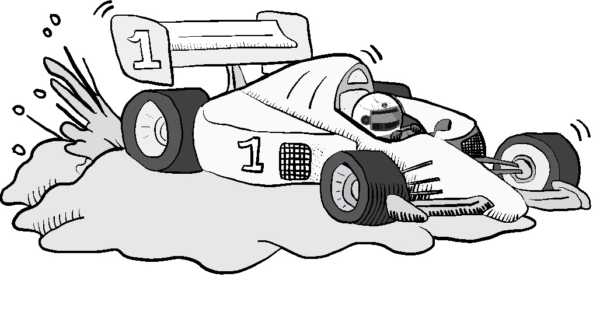
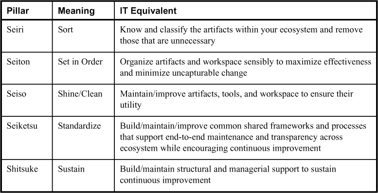
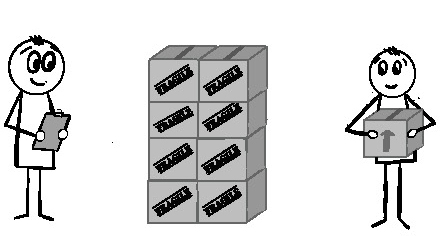
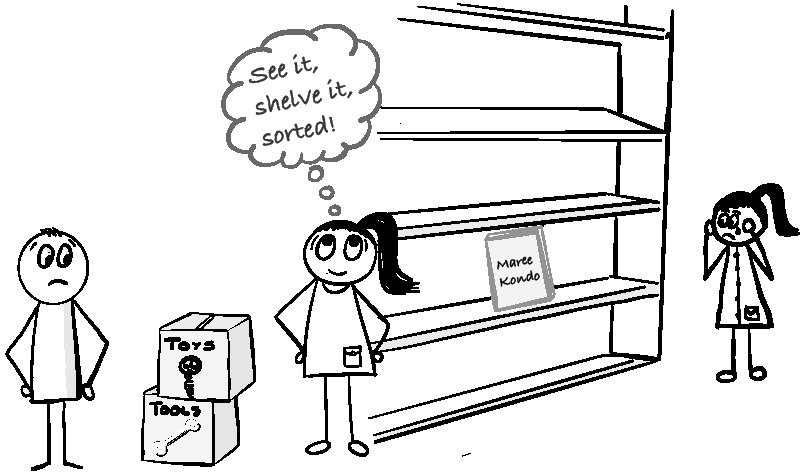
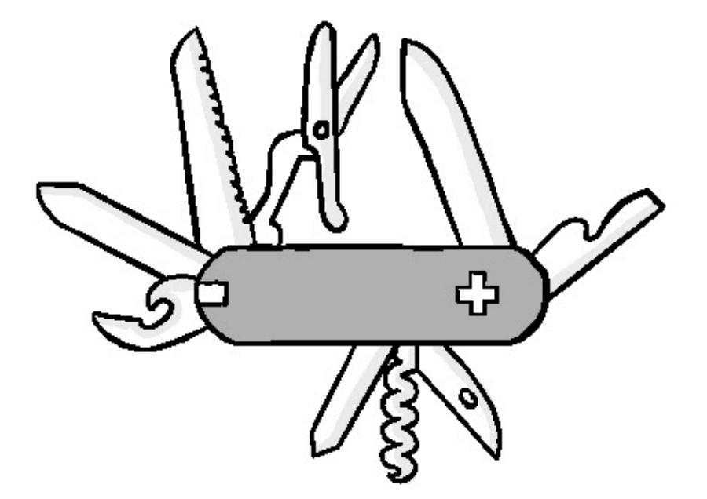

> _Автоматизация, примененная к неэффективной операции, увеличит ее
> неэффективность._
>
> --- Билл Гейтс.

Возможность быстрого и простого развертывания, настройки и устранения неполадок
производственных служб с помощью инструментов и автоматизации является
неоспоримой. Для бизнеса это дает возможность быстро экспериментировать с
различными рыночными предложениями, одновременно повышая способность организации
быстро реагировать на новые или изменяющиеся требования клиентов. С технической
точки зрения это может помочь увеличить объем работы, которую может выполнить
команда, одновременно делая эту работу гораздо менее сложной для выполнения, а
ее результаты более предсказуемыми.

Однако многие организации упускают из виду, что для получения реальных
преимуществ автоматизации требуется гораздо больше, чем просто установка набора
инструментов. Во-первых, лучший подход к автоматизации для одной организации,
скорее всего, будет значительно отличаться от лучшего подхода для другой. На
самом деле, игнорирование этих различий путем использования инструментов,
которые не соответствуют условиям вашей экосистемы, может в действительности
привести к увеличению объема работы и снижению предсказуемости поставок.

Поиск оптимального подхода к автоматизации для вашей организации начинается с
понимания динамики и условий в вашей экосистеме доставки, а затем с разработки
решений по инструментам, которые наилучшим образом соответствуют этим
требованиям. Как вы увидите, с помощью этого процесса вы можете создать цикл
положительной обратной связи, который одновременно улучшает осведомленность о
вашей экосистеме и делает ее более предсказуемой и менее трудоемкой.

Эта глава начинается с обзора того, как условия окружающей среды могут влиять на
эффективность автоматизации. Исходя из этого, мы исследуем, как такие концепции,
как 5S от Lean, могут повысить осведомленность при одновременном снижении
ненужной вариативности. Мы также расскажем о роли отдела разработки инструментов
и автоматизации и о том, как такая группа может значительно улучшить вашу
стратегию автоматизации и, в конечном счете, расширить возможности вашей
организации.

## Инструменты и экосистемные условия

Компании хотят автоматизировать работу по целому ряду причин. Некоторые хотят
быстрее предоставлять услуги и масштабироваться. Другие хотят сократить расходы.
Есть даже компании, которые на самом деле не заботятся ни о чем из этого, но
хотят, чтобы их считали обладателями стратегии автоматизации/облака/DevOps.

Те организации, которые испытывают некоторую страсть к автоматизации, часто
описывают то, что они хотят, как некое сочетание облачных возможностей Amazon,
сервисных возможностей Netflix, гибкости ресурсов Spotify, возможностей
интеллектуального анализа данных Google и возможностей непрерывной доставки
Etsy. Возможно, им не всегда ясны все детали, но обычно они хотят автоматизации
сейчас, думают, что ее легко получить, и хотят знать, какие инструменты они
могут купить или загрузить, чтобы это произошло немедленно.

Компании, стремящиеся к такой изощренной автоматизации, обычно руководствуются
благими намерениями, но не знают, с чего начать. Самая большая проблема
заключается в разрыве между условиями, которые мы видим, и теми, которые должны
быть созданы для внедрения инструментов с любым шансом для достижения желаемых
целей.

Несоответствие набора инструментов условиям экосистемы --- это все равно что
использовать для гонок не тот тип гоночного автомобиля. Например, гонка серии
Формула-1 задумана как соревнование в скорости и маневренности. Автомобили,
которые ездят по нему, оптимизированы для такой динамики, но в результате
требуют безупречной гигиены трассы. Один случайный кусок мусора или плохо
проложенная дорожка --- и кто-то, скорее всего, пострадает. в противоположность
им --- гонки по бездорожью. Хотя это все еще автомобильная гонка, это
соревнование на выносливость в суровых и непредсказуемых условиях. Внедорожники
должны обеспечивать баланс между прочностью и скоростью, что делает их намного
медленнее, но более долговечными, чем их аналоги из Формулы-1.

**Рисунок 10.1** Неверное представление Билла о гоночных автомобилях оборвало
его карьеру гонщика по бездорожью.

Автоматизация работает во многом таким же образом. Иногда несоответствие
означает, что, подобно гонщику по бездорожью в гонке Формулы-1, инструмент
оказывается не особенно полезным. Это происходит, например, когда методы сборки
и репозитория кода не согласованы с установленными настройками автоматической
сборки и непрерывной интеграции (CI). Внедрение автоматизации в неуклюжий,
медленный или хрупкий процесс сборки, как правило, только усложняет ситуацию. То
же самое верно и для CI, если разработчики проверяют код нечасто, происходит
чрезмерное ветвление кода, вы создаете и интегрируете только небольшие части, а
не все вместе, или процесс доставки сильно зависит от фазы. Предполагается, что
автоматизация обеспечит быструю обратную связь о состоянии всей кодовой базы.
Это трудно сделать, если вы лишь изредка получаете обратную связь от небольшого
процента участников этого процесса.

Несоответствия также могут вызвать разочарование или даже дополнительные
напрасные усилия. Одно из наиболее распространенных мест, где это происходит ---
это инструменты мониторинга и анализа данных, где для того, чтобы несоответствие
имело масштабный эффект, требуется совсем немного. На стороне сервиса
несоответствия, как правило, принимают форму несогласованных, неадекватно
документированных или плохо обслуживаемых интерфейсов и данных, любые из которых
могут затруднить сопоставление и понимание того, что происходит внутри систем и
между ними. Сильная зависимость от частного программного обеспечения и услуг,
поставляемых поставщиками, может быть настолько непроницаемой, что создаст
большую аналитическую черную дыру в вашей экосистеме.

Часто несоответствия происходят из-за того, что само программное обеспечение или
сервисы просто не были разработаны с учетом аналитики или инструментария, в
результате чего данные плохого качества содержат слишком много шума, чтобы их
можно было использовать для наблюдения и понимания. В других случаях проблема на
самом деле заключается в выборе инструментов мониторинга или аналитики и их
конфигурации. Я регулярно вижу, как такие инструменты становятся тупиковыми или
беспорядочно выбрасывают мусор, потому что либо они были развернуты в среде, для
которой не были предназначены, либо произошли какие-то незначительные изменения
во внутренней работе процесса, из-за которых показатели или данные, которые
когда-то искали инструменты, больше не актуальны.

Опасности, связанные с несоответствиями, могут быть чрезвычайно рискованными.
Точно так же, как болидам Формулы-1 нужны строго контролируемые условия на
трассе, некоторые инструменты также чрезвычайно чувствительны к несоответствиям.
Но, в отличие от Формулы-1, обычно страдает экосистема.

Особенно это касается средств автоматизированного развертывания. Проблема
чрезмерно тесного взаимодействия служб или данных может затруднить
автоматическое развертывание. Однако более серьезная проблема возникает из-за
простого отсутствия четкой и достаточно последовательной модели вашей экосистемы
развертывания. Если целевые объекты развертывания не организованы с соблюдением
высокой гигиены конфигурации и минимальным изменением неизвестного или
неуправляемого состояния, автоматизация развертывания значительно увеличивает
вероятность возникновения непредвиденных или неконтролируемых проблем с
развертыванием и конфигурацией, которые являются необратимыми.

Не все несоответствия обязательно носят технический характер. Некоторые из
наиболее сложных несоответствий, с которыми приходится иметь дело, влияют на то,
как люди выполняют свою работу. Автоматизированное развертывание и общедоступные
облачные решения могут серьезно повлиять на установленные процедуры и иметь
вполне реальные правовые и нормативные последствия. Адаптация людей и процессов
к новым подходам к предоставлению услуг может вызвать у организаций настоящую
головную боль в бизнесе. Если новым технологиям и процессам не хватает
достаточно четкого и отслеживаемого управленческого контроля и средств защиты,
любой предполагаемый недостаток может даже ограничить возможности рынков и
потребителей. Если выбор средств автоматизации не будет сделан тщательно, то это
также может сделать работу персонала гораздо более громоздкой и подверженной
ошибкам, что приведет к отказу, который может подорвать жизнеспособность и
эффективность самой инициативы по автоматизации.

## Создание устойчивых условий

Итак, как же вы находите и устраняете несоответствия? Вашим первым побуждением
может быть желание получить представление о том, каковы условия внутри вашей
экосистемы. Но для этого вам сначала нужно знать, где искать.

В главе 6 <<Понимание ситуации>> обсуждается, что для получения достаточного
контекста требуется гораздо больше, чем просто осмотреться. Все, начиная от
предвзятости ментальных моделей и заканчивая плохими или вводящими в заблуждение
информационными потоками, может ввести запутать вас. Гораздо более эффективный
способ --- воспользоваться методом бережливого производства. Бережливое
производство основывается на двух желаниях, которых обычно придерживаются
сотрудники. Первое --- это гордиться своим рабочим местом и достижениями на нем.
Второе заключается в том, что рабочая экосистема устроена таким образом, что
выполнять работу правильным способом проще, чем выполнять работу неправильным
способом.

Методология бережливого производства достигает этого с помощью подхода, который
называется 5S.

## 5S

Подобно автоматизации ИТ, заводские инструменты и автоматизация работают хорошо
только тогда, когда экосистема известна и чиста, а инструменты соответствуют
тому, что нужно работникам для превращения материалов в желаемый конечный
продукт. Бережливый метод организации и поддержания порядка на рабочем месте
называется 5S. Традиционными столпами 5S являются сортировка (cэири), соблюдение
порядка (cэитон), содержание в чистоте (сэисо), стандартизация (сэикэцу) и
совершенствование (сицукэ). Они подходят друг другу, как русские матрешки,
причем каждая последующая опора опирается на предыдущие и усиливает их.

На первый взгляд названия этих столпов могут показаться многим в ИТ неуместными
задачами по уборке. Что, чёрт возьми, вообще <<освещается>> в ИТ? Не обращайте
внимания на сами термины, поскольку они являются не более чем простым
сокращением для чего-то гораздо большего. Даже производители, которые
ориентируются только на условия, видят мало пользы. Как для производства, так и
для ИТ-сферы, значение имеет смысл, стоящий за каждым термином. В таблице 10.1
представлено справочное руководство.

**Таблица 10.1**\
Основные принципы 5S.

Давайте подробно рассмотрим каждый из этих столпов 5S, чтобы понять, как они
могут помочь нам в нашем путешествии.

### Сэири: Знай, что там есть

**Рисунок 10.2**\
<<Похоже, у нас готовы все пакеты для следующего релиза!>>

Первым и самым центральным элементом 5S является сортировка (сэири). Цель сэири
--- получить представление обо всех элементах, составляющих вашу среду, от кода,
инфраструктуры и других строительных блоков стека сервисов до инструментов и
процессов внутри него. Это не простая инвентаризационная проверка или поисковая
операция. Они предоставляют только моментальный снимок того, что может быть у
вас в вашей среде. Сэири обязательно должен быть непрерывным, чтобы поддерживать
осведомленность о том, что вам на самом деле нужно и зачем вам это нужно.

Очевидно, что полезно выяснить, какие компоненты существуют в вашей экосистеме,
что они делают, кто их использует, кому они принадлежат, где они живут, а также
как они входят в экосистему, перемещаются по ней и покидают ее. Это повышает
вашу осведомленность о том, что происходит, помогая выявлять риски и
потенциальные несоответствия, которые могут вызвать проблемы, усложняющие работу
по автоматизации.

Попытка определить назначение всего также поможет вам определить те вещи,
которые не нужны, больше не нужны или действительно не должны находиться там,
где они есть. В производстве сэири рассматривается как полезный механизм для
борьбы с отходами. Организации обычно собирают всевозможный хлам. Часто на его
устранение отводится мало времени, потому что либо люди слишком заняты, либо
усилия просто кажутся не стоящими. Некоторые могут даже подумать, что они
поступают умно, оставляя это при себе. Сеири подчеркивает, почему игнорирование
или сохранение <<беспорядка>> является неправильным подходом.

Избавляясь от всего, что непосредственно не требуется для доставки, вы
устраняете многие места, где могут прятаться вещи, а также шум, который мешает
вам понимать, что происходит. Хорошей аналогией является очистка вашего двора от
листьев или сухого кустарника. Расчищая двор, вы не споткнетесь о садовый шланг
или не наступите на змею, которая решила поселиться у вас во дворе. Удаление
также имеет дополнительное преимущество, заключающееся в устранении чего-то
вроде фрагмента кода или ошибочной конфигурации, которые могут вызвать
катастрофические проблемы.

Сэири --- это хороший способ заставить всех задуматься о назначении всего в
экосистеме, что не только улучшает общее понимание, но и неизбежно побуждает
людей думать о способах улучшения. Сэири также значительно сокращает количество
бесхозных сирот, что может привести к потенциально катастрофическим сюрпризам в
будущем.

> #### Knight Capital
>
> Если сэири не имеет особого смысла или кажется вам ненужным, возможно, стоит
> пройтись по довольно известному примеру того, как невыполнение этого может
> привести к катастрофе.
>
> Knight Capital когда-то была высококлассным брокером-дилером финансовых услуг
> в Соединенных Штатах. Как и многие подобные фирмы, Knight Capital вложила
> значительные средства в создание собственной высокоскоростной алгоритмической
> системы торговли акциями. Эти системы предназначены для выявления и
> использования незначительных различий в ценах, или <<неэффективности>>, внутри
> рынков и между ними. Есть много причин, по которым могут появиться эти
> различия. Вероятно, одной из наиболее печально известных причин является
> существование <<скрытых пулов>>. Это частные биржи, которые изначально были
> созданы для того, чтобы позволить крупным институциональным инвесторам
> анонимно покупайте и продавайте большие пакеты ценных бумаг (как правило, для
> балансировки своих портфелей), не оказывая влияния на рынок. Позже темные пулы
> стали для торговых фирм способом полностью избегать бирж и маркет-мейкеров,
> иногда даже получать прибыль за счет своих клиентов.
>
> В июне 2012 года Нью-Йоркская фондовая биржа (NYSE) получила разрешение на
> создание собственного <<скрытого пула>> под названием Retail Liquidity Program
> (RLP). Knight быстро изменила программное обеспечение своего внутреннего
> торгового маршрутизатора под названием SMARS изменит процесс обработки заказов
> для интеграции в RLP в день своего открытия 1 августа.
>
> Задача SMARS состояла в том, чтобы получать родительские ордера с торговой
> платформы верхнего уровня, а затем определять, исходя из доступной
> ликвидности, наилучший способ распределения ордеров по внешним пулам и рынкам
> для исполнения.
>
> Как и многие компании в финансовой индустрии, Knight Capital отдавала
> предпочтение новым функциям, а не сохранению того, что уже существовало. Это
> особенно верно для функций фронт-офиса, таких как торговые столы, где трейдеры
> постоянно находятся в поиске любой новой функции, которая могла бы дать им
> преимущество на рынке. Это означало, что повсюду валялось много старого,
> бездействующего кода. SMARS ничем не отличался. Одним из них была часть
> устаревшей функциональности под названием <\<Power Peg\>>. Она была
> разработана для кумулятивного отслеживания того, как общие ресурсы выполнялись
> на разных рынках, чтобы знать, когда следует прекратить попытки отправки
> заказов. Power Peg был снят с производства в 2003 году, а отслеживающая часть
> в конечном итоге была выведена из режима Power Peg в другую функцию. Но хотя
> эта конкретная процедура была прекращена, код не только был оставлен, но и все
> еще был доступен для вызова.
>
> Как вы можете себе представить, оставлять бездействующий код, который все еще
> доступен для вызова, невероятно опасно. Это программный эквивалент снятия с
> предохранителя заряженного пистолета, небрежно оставленного в куче вещей в
> глубине вашего шкафа. Любое количество непритязательных вещей может случайно
> оживить его, посеяв хаос в вашем окружении. Именно это и произошло в Knight.
>
> Разработчики Knight знали об этом пресловутом оружии, но явно не осознавали
> всей степени опасности, с которой они столкнулись. В рамках работы над RLP они
> решили удалить код Power Peg, чтобы они могли повторно использовать флаг,
> который активировал его, для нового кода RLP.
>
> Хотя удаление вызываемого кода всегда является хорошей идеей, делать это в то
> же время, когда вы собираетесь повторно использовать флаг, который его
> активирует, все равно что шарить в глубине темного шкафа в поисках заряженного
> пистолета. К несчастью для Knight, у них были некоторые другие проблемы,
> создающие беспорядок, из-за которых дуло пистолета было направлено прямо на
> них. Одна из них заключалась в том, что, как и многие другие компании, Knight
> не особенно хорошо умела поддерживать конфигурации развертывания в известном и
> согласованном состоянии.
>
> 27 июля, незадолго до запуска RLP, планировалось постепенное развертывание
> нового кода RLP SMARS на восьми производственных серверах SMARS, чтобы свести
> к минимуму сбои. К сожалению, один из восьми серверов был пропущен и не
> обновлен новым кодом, в результате чего остался сервер, на котором программное
> обеспечение Power Peg не было удалено.
>
> Тот факт, что произошло это несоответствие конфигурации сервера, означал, что
> не существовало достаточно эффективных механизмов для его предотвращения.
> Отсутствие обнаружения говорит о том, что какие-либо проверки на месте были
> либо недостаточно тщательными, либо недостаточно заметными, чтобы привлечь
> чье-либо внимание к этой аномальной ситуации. Вряд ли это недостаток, которого
> хотят разработчики, особенно когда они слишком заняты или небрежны, чтобы
> удалять бездействующий код.
>
> За полтора часа до открытия рынка 1 августа Knight получила заказы от
> клиентов, которые имели право использовать RLP с измененным флагом. В то время
> как семь серверов, получивших новый код, обрабатывали заказы правильно, заказы
> активировали код Power Peg, который все еще присутствовал на восьмом сервере.
>
> \*клик\*
>
> В этот момент Knight все еще могла восстановиться. Условия на восьмом сервере
> вызвали серию из 97 ошибок, уведомляющих о наличии проблемы. Поскольку это
> было еще до открытия рынка, существовала вероятность того, что оповещение
> могло вызвать ответную реакцию, чтобы исследовать, найти и, возможно, даже
> устранить проблему до открытия рынков. К сожалению, предупреждения были
> пропущены, что стало еще одной вероятной проблемой, когда беспорядок мешает
> осознанию и действиям.
>
> Инструментарий невероятно важен. Если все сделано правильно, это может
> значительно помочь, дав вам гораздо лучшее понимание того, что происходит в
> вашей среде. Пропустить раннее оповещение о потенциальной проблеме никогда не
> бывает хорошо. Пропажа 97 из них в течение 90 минут, а затем все еще
> остающееся в неведении относительно причины спустя много времени после
> стихийного бедствия намекает на огромное количество дисфункций с тем, как было
> установлено оборудование, как оно использовалось и как оно интерпретировалось.
> Хотя возможно, что оповещения шли не по адресу, более вероятно, что было так
> много шума, что контекст и, следовательно, ценность были потеряны. Любой, кто
> был на приемной стороне шумной системы мониторинга, знает, что через некоторое
> время вы просто игнорируете все.
>
> При открытии рынка код Power Peg начал сеять хаос. Поскольку бездействующий
> код больше не мог отслеживать, были ли выполнены заказы, он продолжал
> воспроизводить заказы миллионы раз. Администраторы, все еще не подозревающие о
> несоответствии конфигурации, отреагировали (как и многие, кто хотел бы
> остановить кровотечение, не зная, что происходит), откатив код на других
> рабочих серверах. Это, конечно же, усугубляло проблему. Флаг был в заказах,
> поэтому откат привел к тому, что проблема возникла на всех восьми серверах.
> Это намекает на то, что было либо ограниченное понимание того, как работает
> код, либо недостаточная оценка рисков, связанных с принятым подходом.
>
> К тому времени, когда ошибочный код был остановлен 45 минутами позже, компания
> выполнила более 4 миллионов ордеров по 154 акциям на сумму более 397 миллионов
> акций, оставив чистую длинную позицию по 80 акциям с позицией в 3.5 миллиарда
> долларов и короткую позицию по 74 акциям примерно на 3.15 миллиарда долларов.
> В итоге Knight Capital потеряла более 460 миллионов долларов на нежелательных
> позициях.
>
> Этот провал в знаниях в конечном итоге стал причиной гибели компании Knight,
> что привело не только к убыткам в размере 460 миллионов долларов, но и, в
> конечном итоге, к ее гибели как независимой организации.

### Сэитон: Организовывайте так, чтобы это было полезно

**Рисунок 10.3**\
Мэри обнаружила, что организация рабочего пространства приносит ей радость.

Знать, что у вас есть, и избавиться от того, что вам не нужно, --- отличный
способ не стать следующими Knight Capital. Но знание того, что у вас что-то
есть, полезно только в том случае, если вы знаете, где это находится и что это
можно использовать, когда вам это нужно. Вот тут-то и приходит на помощь второй
компонент 5S (cэитон). Сэитон --- это организация различных частей вашей
экосистемы в разумном порядке. На заводе это означает создание хорошо
продуманного рабочего места, где каждый предмет легко находится в наиболее
разумном и удобном для него месте. Логическая организация всего улучшает поток и
точность, а также позволяет пользователям этих ресурсов быть в курсе,когда
что-то не так.

Для тех, кто никогда не проводил много времени в хорошо организованной среде,
это, вероятно, кажется скорее приятной мелочью, чем важным требованием.
Возможно, это немного расстраивает, когда приходится время от времени искать
что-то, но организация отнимает время от других, более важных дел, на которых
можно заработать деньги.

Причина, по которой эти убеждения сохраняются, заключается в том, что та же
самая неорганизованность скрывает реальную стоимость. Полезный способ
продемонстрировать это --- перенести эту неорганизованность и отсутствие заботы
на что-то, где опасность гораздо более очевидна.

Представьте на мгновение, что вам нужно лечь в больницу на незначительную
операцию. Вас направляют в палату и говорят лечь на операционный стол. Когда вы
входите в комнату, вам кажется странным, что в углу комнаты на полу навалена
куча хирургических инструментов в разном состоянии. Некоторое время спустя
входит доктор, за ним следует медсестра. Доктор просит вас лечь, а сам начинает
рыться в куче.

Через некоторое время доктор лезет в карманы, достает пару старых ложек и нож
для стейка и говорит: <<Я рад, что в столовой был день супа и стейка! Я не могу
найти подходящее хирургическое оборудование, но этого должно хватить для
работы>>.В это время медсестра наполняет шприц из одного из многочисленных ампул
на тележке. Когда он делает инъекцию вам в руку, он говорит: <<Все препараты
выглядят одинаково. Этот ближе всего ко мне, так что он подойдет!>>.

Такой сценарий, скорее всего, заставит вас отчаянно пытаться выбежать за дверь.
Риск для вашего благополучия высок и очевиден, и вы, скорее всего, допустите его
только в ситуации катастрофы, когда на кону стоит ваша жизнь и других вариантов
нет.

Однако больничная среда не является самоорганизующейся. Хотя вы, возможно, не
найдете хирургического оборудования на полу, хранение оборудования и лекарств,
организованное таким образом, чтобы свести к минимуму количество ошибок, все еще
является постоянной проблемой. Фактически, в первом отчете Института медицины
<<Пропасть качества>> говорится, что на ошибки, связанные с приемом лекарств,
приходится 1 из 131 случаев смерти амбулаторных пациентов и 1 из 854 случаев
смерти стационарных пациентов, что составляет более 7000 смертей в год.[^1]

[^1]: Institute of Medicine. To Err Is Human: Building a Safer Health System.
Washington, DC: National Academy Press; 1999, p. 27

Организационные проблемы являются одной из наиболее распространенных причин
врачебных ошибок в больницах. Многие лекарства имеют похожие/звучащие названия и
хранятся в больничных аптеках в одинаковых контейнерах. Именно поэтому в
больницах все чаще используется сэитон и другие методы 5S, такие как разный цвет
и форма контейнеров для лекарств; организация медицинских тележек и шкафов для
разделения, чтобы снизить вероятность ошибок; использование штрих-кодов и других
вторичных проверок для выявления ошибок до того, как они приведут к опасным для
жизни проблемам.

Хотя это не всегда так очевидно опасно для жизни, дезорганизация в ИТ может быть
столь же опасной. Когда возникает необходимость в доставке, а с кодом трудно
работать, инструменты новые или громоздкие, или создание рабочей среды занимает
слишком много времени, люди неизбежно будут срезать углы. Точно так же, как врач
пользуется столовыми приборами, неаккуратно скопированный код, плохо управляемые
зависимости или повторное использование какой-либо случайной или менее
подходящей цели развертывания могут показаться “достаточно хорошими” для
выполнения этой работы.

Хотя посторонним такой менталитет кажется беспечно-безрассудным, он подвергает
организацию ненужной изменчивости и риску. Это затрудняет чтение кода и работу с
ним, а также устранение неполадок, часто затрачивая больше времени и усилий, чем
экономится с помощью оригинальных ярлыков. Для автоматизации такая изменчивость
создает дополнительные крайние случаи, которые тем, кто внедряет средства
автоматизации, неизбежно придется выявлять и решать, чтобы убедиться, что их
усилия полезны и работают надежно. Когда инструменты или даже крупные звенья
цепочки поставок неизвестного качества или происхождения, как это произошло в
случае нарушений безопасности SolarWinds и codecov2, эти неизвестные могут даже
представлять прямую опасность для вашего бизнеса.

Так же, как и в больницах, усилия cэитон в области информационных технологий
должны быть направлены на то, чтобы было проще и выгоднее делать все правильно,
а не использовать короткие пути. Часто это означает выявление и устранение
первопричин дисфункции. Например, плохо расположенные репозитории кода и
чрезмерное ветвление часто приводят к ошибкам при проверке и болезненным
слияниям, которые увеличивают количество ошибок и отнимают время на их
устранение. Эти проблемы часто вызваны незнанием инструментов контроля версий и
их лучших практик; плохо разработанным и внедренным кодом; и неадекватно
определенной и управляемой работой. Небрежное кодирование и плохое управление
зависимостями часто являются результатом сочетания неправильных представлений о
проблемном пространстве; нереалистичных временных и ресурсных ограничений; и
скрытого или недостаточно понятного существующего технического долга.

Это тот же самый случай с оперативной точки зрения. Медленные и громоздкие
процессы подготовки, плохая упаковка программного обеспечения и
непоследовательная установка и конфигурирование вручную не только расстраивают,
но и побуждают людей разрабатывать обходные пути, которые создают еще большую
вариативность, с которой необходимо бороться. Вы можете разорвать цикл, который
в первую очередь вызывает проблемы, организовав свою экосистему с помощью
улучшенной упаковки, настройки и предоставления ресурсов, а также мер, которые
уменьшают необходимость входа в развернутые экземпляры.

> #### Неорганизованное управление зависимостями
>
> Мало кто из ИТ-специалистов усомнился бы в важности управления зависимостями.
> Тем не менее, еще меньше тех, кто на самом деле тратит время на обеспечение
> надлежащего управления зависимостями.
>
> Это несоответствие между важностью и исполнением в конечном счете заняло
> центральное место в одной крупной глобальной компании. Они решили переписать
> один из своих основных сервисов. С годами он органично превратился в сложное
> для поддержки сочетание нескольких языков и технологий. Желание состояло в
> том, чтобы очистить стек и переписать его на одном языке (Java), что сделало
> бы стек более поддерживаемым, расширяемым и надежным.
>
> Как и многие крупные проекты в крупных компаниях, он быстро разросся до сотен
> разработчиков программного обеспечения в более чем 20 командах, разбросанных
> по всему миру. На первый взгляд это может показаться не таким уж ужасным.
> Проблема заключалась в том, что все они работали над одним и тем же сервисом в
> целом, и многие части, поступавшие от разных команд, были тесно связаны, если
> не прямо зависели друг от друга. Что усугубляло ситуацию, так это то, что
> каждая команда решила использовать свой собственный экземпляр Maven. Это
> означало, что существовало более 20 различных объектных моделей проекта (POM),
> что означало более 20 различных версий зависимостей.
>
> Проблема с тем, как Maven определяет зависимости библиотек, особенно в то
> время, усугубила эту проблему. Когда были ссылки на две разные версии
> библиотеки, если вы явно не указали иное, Maven, как правило, выбирал ту,
> которая ближе всего к корню дерева зависимостей. Это было сложно всегда делать
> правильно, даже когда вы знали, что все, что вы загружаете как из
> общедоступных, так и из частных репозиториев, обратно совместимо, поскольку
> версии библиотек все равно могли меняться от сборки к сборке, открывая
> возможность всевозможных новых вариаций.
>
> Добавить 20 команд, не разговаривающих друг с другом и не имеющих уверенности
> в обратной совместимости? Во время интеграции вы получаете эквивалент
> 100-автомобильной аварии. Ничто не могло последовательно строиться, не говоря
> уже о работе, и в результате проект застопорился.
>
> Для решения этой проблемы была собрана специальная команда. Что делало
> ситуацию особенно плохой, так это то, что было много случаев, когда конфликты
> возникали каскадом, вовлекая множество конфликтующих версий в десятках или
> сотнях компонентов и нескольких командах. Временами это было похоже на поиски
> иголки в стоге сена.
>
> Команды взялись за оружие, поскольку многие месяцы работы пришлось переписать
> или выбросить, чтобы преодолеть конфликты. В некоторых случаях команды
> приходилось распускать или переносить работу, чтобы свести к минимуму
> дальнейшие проблемы. В конце концов, проект так и не был полностью
> восстановлен и был объявлен массовым провалом.

### Сэисо: Обеспечение и поддержание работоспособности

**Рисунок 10.4** Проактивное техническое обслуживание позволяет поддерживать все
в оптимальном рабочем состоянии.

Третий столп 5S, cэисо, заключается в создании механизмов и культуры, которые
поддерживают и улучшают организацию, работоспособность и полезность артефактов и
процессов в экосистеме. Сэисо укрепляет cэири, помогая создавать механизмы,
предотвращающие ненужный беспорядок, и укрепляет cэитон, поддерживая
эффективность усилий организации.

Поддержание работоспособности вашей экосистемы доставки кажется разумным
решением. Мы знаем, что все, начиная с нашего автомобиля, компьютера, дома и
даже нашего собственного тела, время от времени нуждается в некотором уходе и
внимании, чтобы оставаться в приемлемом рабочем состоянии. К сожалению, в IT это
вряд ли так. Всем, начиная с кода и систем и заканчивая процессами, которые их
обеспечивают и управляют ими, обычно пренебрегают. Ошибки и устаревшие или
неоптимальные процессы часто лишаются приоритета или игнорируются, позволяя им
задерживаться до тех пор, пока они не вызовут серьезное событие, которое сделает
их устранение абсолютно необходимым. То же самое касается и систем. Как только
они установлены, их, как правило, перестраивают с нуля только в случае крайней
необходимости, и то часто неохотно.

Некоторые утверждают, что главным виновником является ощущение, что поддерживать
и совершенствовать --- значит выбрасывать больше денег на то, что должно быть
уже решенной проблемой. Легко обвинять менеджеров и современные методы ведения
бизнеса, такие как составление бюджета на основе нуля, которые, как правило,
отдают предпочтение новым функциям и продуктам с кажущейся очевидной, но
недоказанной отдачей от инвестиций, а не пытаются устранить существующие ошибки
или ненадежные настройки с гораздо более непрозрачными преимуществами. Но любой,
кому приходилось спорить о приоритетности исправления ошибки или пытаться
побудить членов команды к активному рефакторингу кода или перестройке систем,
знает, что команды разработки и эксплуатации с такой же вероятностью предпочтут
работать над новым и блестящим, а не заботиться о том, что уже есть.

Быстрая и непрерывная эволюция ИТ-экосистем делает особенно важной настройку и
обслуживание систем, программного обеспечения и процессов, из которых они
состоят. Это справедливо даже в относительно стабильных и простых средах с
незначительными изменениями требований. Технологические сдвиги по-прежнему
регулярно приводят к устареванию технологических стеков. Обслуживание как
аппаратного, так и программного обеспечения становится все более дорогостоящим,
поскольку поставщики объявляют старые версии устаревшими (EoL). Но это едва ли
самая сложная проблема. Многие банки и крупные предприятия с устаревшими
ИТ-системами могут рассказать вам о высоких расходах и трудностях, связанных с
поиском людей, которые знают и готовы поддерживать давно устаревшие технологии.
Никому не нравится пытаться взять на себя поддержку старой и громоздкой системы,
особенно когда те, кто ее создавал, давно ушли, а организация не заинтересована
в улучшении или модернизации того, что есть.

Существует также проблема, связанная с тем, что устаревшие системы с долгим
сроком службы, как правило, накапливают так много мусора, что оставаться в
достаточной степени осведомленным о том, что находится в системах и как все это
работает, становится чрезвычайно сложно. Это создает наихудший из всех
сценариев, который представляет собой постепенно усложняющийся в поддержке
компонент, который становится все труднее улучшать или заменять, не нарушая по
незнанию чего-то важного.

Внедрение сэисо не означает постоянной погони за новинками месяца, для этого
необходимо оставаться в русле мейнстрима, создавая культуру, которая берет на
себя ответственность и гордится здоровьем и благополучием экосистемы. Поощряйте
людей указывать на проблемы и пытаться улучшить экосистему таким образом, чтобы
она одновременно решала проблемы и соответствовала результатам, которых пытается
достичь организация. Именно здесь пригодятся концепции обучения kata и кайдзен
(представленные в главе 7 <<Обучение>>). Они помогают людям взглянуть на
проблемы по-новому и вместо того, чтобы браться за решение огромной проблемы
сразу, попытаться постепенно совершенствоваться и учиться более устойчивым
способом.

Однако, чтобы достичь этого, вам нужно нечто большее, чем увлеченные люди и
процесс. Именно здесь вступают в действие последние два столпа 5S.

> #### Таинственная система 
>
>  Существует множество историй о различных банках, авиакомпаниях и
> телекоммуникационных компаниях с давно устаревшими системами, приводящими к
> чрезвычайно неприятным перебоям в работе. Некоторые из наиболее известных
> включают инцидент со стабильностью банков RBS (RBS, NatWest, Ulster Bank и
> т.д.), в результате которого люди на несколько дней потеряли доступ к своим
> счетам [^2]; сбой системы бронирования рейсов Sabre, используемой различными
> авиакомпаниями[^3]; и многочисленные отмены рейсов British Airways, связанные со
> сбоями в системах[^4]; Хотя этим компаниям очень не повезло, они далеко не
> единственные, кто сталкивается с подобными унаследованными рисками.
>
> [^2]: https://publications.parliament.uk/pa/cm201213/cmselect/cmtreasy/640/640.pdf
> [^3]: https://techcrunch.com/2019/03/26/us-airlines-computer-issues/?guccounter=1
> [^4]: https://edition.cnn.com/2019/08/07/business/british-airways-london-flights-canceled/index.html
>
> В начале своей карьеры я работал в компании, которая создавала торговые
> системы для инвестиционных банков. У нас была не только собственная
> запатентованная базовая технология, мы также глубоко интегрировали наши
> продукты в различные системы торговли, комплаенса, бэк-офиса и отчетности
> наших клиентов. Это был отличный учебный опыт. Это также дало мне всевозможные
> уроки о том, _чего не следует_ делать.
>
> Я оказался в очень странной ситуации через несколько лет после того, как ушел
> с работы в финансовой индустрии. Меня пригласили посетить известный
> инвестиционный банк, чтобы обсудить некоторые проблемы, с которыми они
> столкнулись при разработке распределенного программного обеспечения. Офис,
> который я посещал, когда-то принадлежал другой инвестиционной фирме, с которой
> я провел некоторое время. Чего я не понимал, так это того, насколько это будет
> похоже на прогулку по переулку воспоминаний.
>
> По пути в конференц-зал мои спутники провели меня по торговому залу. Торговые
> площадки часто выглядят довольно впечатляюще, с большим количеством мониторов
> и технологий повсюду и быстрым темпом действий. Когда мы проходили мимо, я
> узнал пару устаревших серверов HP 9000, на которых я когда-то работал. Я
> заметил, что был удивлен, что они все еще там.
>
> Этого было достаточно, чтобы все остановились. Один из моих спутников спросил,
> что я знаю о них. Я обнаружил, что они пару раз пытались извлечь их, но каждый
> раз обнаруживали, что различные важные задания бэк-офиса завершались
> неожиданным образом. Это был такой беспорядок, что они просто оставили их на
> месте.
>
> К счастью, я смог объяснить, что они делали, пока мои спутники делали
> подробные записи. Меня так позабавила ситуация, что я попросил консоль. Оттуда
> я ввел свои старые учетные данные для входа в систему, и, конечно же, у меня
> все еще был доступ.

### Сэикэцу: Прозрачность и совершенствование за счет стандартизации

Несмотря на то, что вся экосистема извлекает выгоду из первых трех компонентов
5S, их основное внимание, как правило, сосредоточено на организации и улучшении
работы на функциональном уровне. Основная цель Сэикэцу --- устранить
изменчивость, которая мешает достаточно хорошо понять состояние экосистемы,
чтобы иметь возможность уверенно получать предсказуемые и надежные результаты.
Это повышает прозрачность между экосистемами, а также повышает уровень
осведомленности о снижении сложности и фамильярности, помогая различным функциям
более эффективно взаимодействовать друг с другом.

Важно отметить, что эти стандарты не являются традиционными правилами
<<наилучшей практики>>, которые создаются и применяются сверху вниз. Вместо
этого они разрабатываются и согласовываются теми, кто находится в первых рядах,
чтобы уменьшить количество вариативности и <<шума>>, которые затрудняют
достижение целевых результатов.

Есть много отличных мест для внедрения сэикэцу в экосистему доставки. Что
касается разработки, сэикэцу обычно реализуется в инструментах, которые
позволяют любому разработчику эффективно работать над любым фрагментом кода и в
любом проекте или команде с небольшим временем наращивания. Эти инструменты
включают в себя такие вещи, как стандарты стиля кодирования, стандартные форматы
ведения журнала и структуры данных, инструментарий наблюдаемости, а также
стандарты среды сборки и разработки. Хотя они не всегда реализуются идеально,
они довольно распространены в очень опытных организациях по разработке
корпоративного программного обеспечения.

С точки зрения предоставления программного обеспечения и его дальнейшей 
эксплуатации наиболее важными местами для внедрения философии сэикэцу являются 
упаковка программного обеспечения, развертывание и управление конфигурацией.
Наличие понятных и предсказуемых конфигураций и потоков, которые широко известны
и легко воспроизводимы, устраняет многие проблемы, с которыми сталкиваются 
команды разработчиков. Понятное управление конфигурацией также позволяет гораздо 
четче определить, когда и где возникают проблемы, поскольку имеют возможность
подчеркивать те места, в которых они могут скрываться.

Более спорный момент заключается в том, что команды разработчиков также должны 
стараться использовать одни и те же инструменты управления версиями и 
задачами (разумеется, с соответствующими разрешениями), когда это имеет смысл. 
Когда потребности и цели команд сильно различаются, это может оказаться 
невозможным. Однако, часто команды выбирают различные инструменты и системы
контроля версий из личных предпочтений, а не исходя из реальной необходимости.
В таком случае они зачастую неосознанно вносят ненужные риски в экосистему 
создания и поставки программного обеспечения. Такие команды неизбежно начинают 
испытывать трудности в моменты, когда код и задачи переходят между командами и 
их различными системами. Это приводит не только к необходимости прилагать больше 
усилий для синхронизации систем, но и увеличивает риск того, что задачи и код 
могут быть неправильно обработаны или искажены.

Согласование, которое создает философия сэйкэцу, может значительно оптимизировать
работу, обеспечивая два преимущества:

- Это отбивает охоту делать что-то неправильно, потому что требует больше усилий
  нежели в том случае, когда все делается правильно. Например, создание готового
  к внедрению атомарного пакета программного обеспечения будет подразумевать 
  прикладывания меньших усилий в ручной установке, устранении неполадок и 
  удалении программного обеспечения на устройстве, чем если бы использовался
  подход "spray and pray".
- Оптимизированная стандартизация может позволить использовать локально 
  специфические элементы, такие как новые автоматизированные тестовые системы и
  инструменты бизнес-анализа. Они могут быть легко добавлены к уже существующей
  системе в период всего жизненного цикла программного обеспечения.

Этот подход также может быть применен к процессам в команде. Команды могут 
договориться о предоставлении стандартных интерфейсов для улучшения обмена 
информацией или кодом. Данных подход улучшает предсказуемость и снижает 
разногласия в процессе разработки. 

Требуется лишь немного предусмотрительности, чтобы начать стандартизацию таким 
образом, который позволит связать вместе более важные инструменты и процессы.
Связи также не должны происходить одновременно или повсеместно. Они должны
устанавливаться в тех местах, где могут принести большую пользу в виде либо 
новых знаний, либо в области, более устойчивой к образованию ошибок разработки
и поставки ПО.

> ### Проблема с наборами инструментов под названием "всё в одном"
>
> 
>
> **Рисунок 10.5**\
> Подобно швейцарскому армейскому ножу, инструменты "всё в одном" часто вынуждены 
> обменивать функционал на эффективность.
>
> Ключ к тому, чтобы стандартизация работала, --- внедрение политики, которая будет
> подразумевать, что данная унификация является разумной и "правильной" для тех, 
> кто ее использует. Одна из главных проблем, с которой я постоянно сталкиваюсь, 
> заключается в наличии и использовании инструментов, к которым люди просто не 
> имеют достаточной подготовки. Когда такое случается, это прискорбно, но это 
> довольно легко обнаружить и исправить. Но чаще всего проблема заключается 
> всё-таки в навязанном "стандарте".

