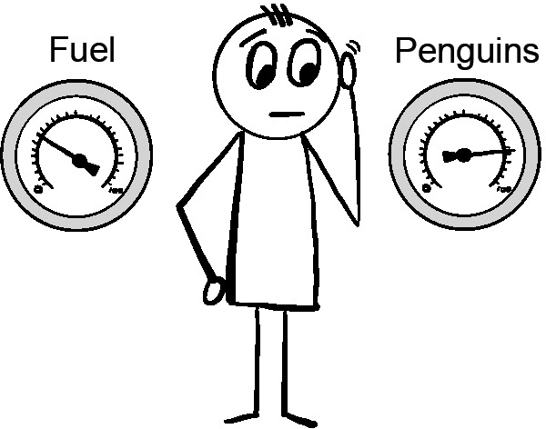
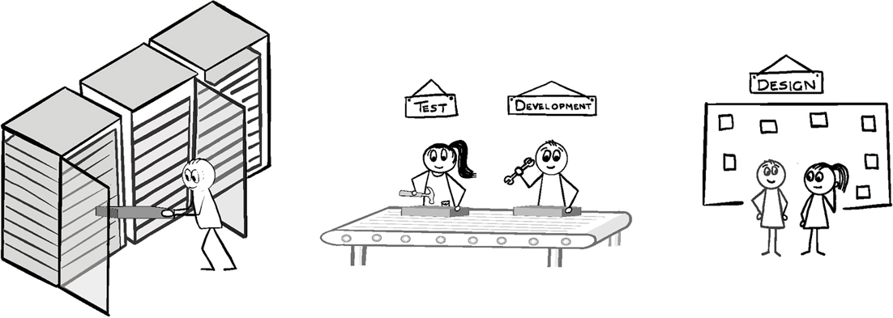

## Введение

> Мы обречены на провал без ежедневного уничтожения наших различных
> предубеждений. Тайити Оно

Все чаще компании утверждают, что они ориентированы на данные. Инициативы в
области бизнес-аналитики и Big Data пытаются объединить растущие стопки данных,
которые создаются в экосистеме доставки, чтобы улучшить информированность и
научиться чему-то новому. Такое сочетание может показаться мощным, особенно
когда оно используется с методологиями, такими как Lean Startup и Agile, которые
разработаны для получения обратной связи в быстром и эффективном режиме. Однако
на практике достижение обещанного --- все лучшие и более безопасные решения для
клиентов более быстро и бесшовно --- все еще кажется недостижимым.

Что идет не так, и как можно решить эту проблему?

Для успешной доставки необходимо не только быстро создавать и развертывать
возможности сервиса, но и затем собирать любые сгенерированные данные. Чтобы
доставка была эффективной, она также должна предоставлять решения, которые
клиенты считают важными для достижения своих целей. Сбор данных полезен только в
том случае, если он обеспечивает обратную связь, которая улучшает принятие
решений и способность достигать этих целей.

Получение такой качественной информации на самом деле намного сложнее, чем может
показаться. Сначала вам нужно иметь хорошее представление о том, какого рода
информация была бы полезной. Большинство тех, кто собирает и анализирует
информацию об экосистеме, обычно собирают ту информацию, которая согласуется с
тем, во что они верят. Это приводит к подтверждению предвзятости, которая может
повредить качеству принимаемых решений.

Чтобы избежать ошибок, связанных с подтверждением собственных предубеждений,
гораздо лучше искать доказательства, которые опровергают эти убеждения, а не
подтверждают их. Такой подход снижает вероятность ошибочных ментальных моделей,
которые постепенно разрушают качество принятия решений. Анализ неожиданных
результатов создает возможности для обучения и улучшения.

Вторым шагом является определение лучших механизмов для сбора необходимой
информации. Они должны делать это точно и в своевременном режиме с достаточным
контекстом, чтобы информация могла эффективно направлять принятие решений.
Фактически, применение готовых инструментов для сбора и обработки существующих
данных в экосистеме может быть опасным. Это рискует захватывать и анализировать
данные вне их намеренного контекста. Не только могут отсутствовать полезные
идеи, но также использование таких инструментов может обрабатывать и объединять
несвязанную информацию таким образом, что создаются ложные корреляции, которые
могут на самом деле повредить пониманию того, что происходит в вашей экосистеме.

Наконец, информация, которую вы захватываете, должна быть достаточно видимой и
понятной для принимающих решения людей, чтобы они могли максимально использовать
эту информацию.

Эта глава пытается провести вас через этот путь, предоставляя некоторые ответы,
которые помогут вам достигнуть этой цели прагматичным способом. Она основана на
многих концепциях, обсуждаемых в этой книге, чтобы помочь вам преодолеть
множество проблем, связанных с определением <<правильных>> данных. Также,
поскольку технический ландшафт постоянно меняется, появляются новые и
инновационные подходы каждый день, я попытался оставаться независимым от
конкретных инструментов. Любые ссылки на конкретные инструменты следует
рассматривать как полезные примеры, а не конкретные рекомендации.

## Определение <<правильных>> данных.

**Рисунок 11.1**\
<<Хотя они собрали его, Билл не знал, откуда оно и зачем нужно.>>

Некоторое время назад я присутствовал на ужине с рядом знаменитостей из движения
DevOps. Как это часто бывает, одной из тем, которая возникла, было об
отслеживании и аналитике. Я начал рассказывать о некоторой интересной сервисной
инструментации, которую мы установили в одной из компаний, где я работал.
Большая часть инструментации была направлена на то, чтобы позволить нам
отслеживать все, начиная от пользовательских и задачных путей до связанных
событий и их влияния на сервисную экосистему.

В какой-то момент несколько человек вызвали меня на дискуссию. Некоторые из этих
вызовов действительно оставили на меня впечатление, частично потому, что то, что
я принимал за очевидное, было явно не так. Они касались следующего:

* <<Даже если бы я мог получить эту информацию, зачем мне хотеть это?>> 
* <<Сбор данных стал фетишем. Я уже плаваю в них. Если добавлять ее еще, то это
  только усложнит выполнение задач.>>

Своими возражениями они выделили очень реальную проблему. Удивительно большая
часть усилий по сбору данных и аналитике вводится только потому, что кто-то
думает, что со всем ростом модных слов <<data driven>>, каждый должен это
делать.

Действительно, взрыв интереса к науке о данных и аналитике для многих
организаций оказался таким же продуктивным, как рыться в беспорядочном гараже
некоего скоплению вещей. В то время как в горах случайных вещей могут быть
что-то полезное, не зная качества того, что было собрано, откуда это было
собрано и насколько соответствует вашим потребностям, шансы на то, что что-то
будет полезным, невелики. 

Однако, сбор и просеивание случайных данных часто закапывает или искажает
полезную информацию, которая может существовать, что делает ее поиск вовремя для
конструктивного использования почти невозможным.

Для тех, кто выражал протест на ужине, мое описание сбора и анализа данных
звучало как еще больше того же самого. Однако, в этом случае все было иначе.
Компания, речь о которой шла, выработала ключевые принципы, которые обеспечивают
эффективную инструментальную базу и аналитику:

* Все собранные данные должны иметь известную цель. Данные не должны собираться,
если нет идентифицируемой цели или ценности сбора данных. Их также не следует
собирать, если их единственная цель - подтвердить, что верно то, что считается
правильным. 
* Все собранные данные должны иметь известную аудиторию. Средства сбора и
представления информации должны гарантировать, что предполагаемая аудитория
достаточно хорошо понимает, что данные представляют собой, чтобы извлекать из
них ценность. 
* Источник данных должен быть известен и достаточно доверенным, последовательным
и своевременным для целей, для которых данные будут использоваться.

Компания не только соблюдала эти правила для новых данных и инструментов. Также
регулярно проверяли существующие данные, их источники, тех, кто на них
полагался, и документацию, поддерживающую их, чтобы убедиться в их
действительности. Если это переставало быть таким, причины исследовались, и
результатом было замена или выход из употребления инструментов и данных.

Для тех, кто работал в среде с множеством неизвестных или устаревших данных и
систем, перечисленные критерии оказываются чрезвычайно полезными как для
уменьшения беспорядка, так и для сохранения фокуса инструментальной базы и
аналитики. Для тех, кто хочет узнать больше, давайте рассмотрим каждое правило,
чтобы лучше понять его важность.

## Знание цели и значения

Только потому, что данные могут быть собраны, не означает, что это необходимо
делать. Сбор излишнего количества данных не только тратит много ресурсов, но
также может сделать поиск нужной информации и создание необходимого контекста
для ее использования намного сложнее.

Поэтому необходимо иметь четкую цель сбора данных. Цель обычно заключается в
одном или нескольких из следующих:

* Выявление или уточнение целевых результатов, которых необходимо достичь 
* Помощь в принятии решений, необходимых для достижения целевых результатов 
* Помощь в понимании и осведомленности об экосистеме доставки, чтобы улучшить
соответствующие способности, необходимые для более эффективного выполнения
работы в ней 
* Предоставление доказательств, необходимых для соблюдения юридических или
регуляторных требований

Одной из самых больших проблем в области предоставления услуг является
отсутствие четкого представления о целевых результатах. Иногда это связано с
тем, что у вас нет прямого доступа к клиенту, чтобы выяснить. В других случаях
могут быть неточные предположения или предубеждения, скрывающие или искажающие
проблему, которую необходимо решить. Иногда, как это произошло с компаниями
Slack и Flickr, вы можете натолкнуться на совершенно другую потребность клиента,
которая является намного более ценной, чем ваша первоначальная цель.

Чтобы убедиться, что у вас правильное понимание целевых результатов, необходимо
начать с установки некоторой инструментации для захвата и представления динамики
текущей ситуации, которая повлияет на их достижение. Этот процесс неизбежно
итеративен, так как вы, вероятно, обнаружите, что некоторые из ваших
первоначальных мер не имеют значения или имеют пробелы, которые снижают их
полезность.Когда вы узнаете больше и начнете экспериментировать с решениями,
чтобы продвигаться к целевым результатам, вам понадобятся более подробные и
целевые меры, которые могут рассказать вам больше не только о самих результатах,
но и о том, насколько хорошо ваши улучшения уменьшают разрыв и помогают клиенту
достигнуть целей. Также начнет становиться понятно, какие инструменты могут
захватывать динамику вашей экосистемы и эффективность ваших возможностей в ней,
чтобы вы могли учиться и улучшать свои возможности и подход.

Давайте рассмотрим два очень разных примера, чтобы показать, как работает
определение целей данных.

## Покупка мебели онлайн

**Рисунок 11.2**\
<<Как узнать, соответствует ли опыт требованиям вашего клиента?>>

Клиент, который рассматривает покупку мебели в интернет-магазине, обычно ищет
идеи различной мебели, которая отвечает его потребностям и желаемому
эстетическому стилю, а также доступна для покупки. Успех в данном случае обычно
означает нахождение и приобретение именно того, что он искал (возможно, вместе с
другими предметами, о которых он не знал, но теперь не может жить без них).
Чтобы достичь успеха, клиент должен иметь возможность найти интернет-магазин,
найти искомую мебель, оформить и оплатить заказ, а затем получить и счастливо
использовать свою покупку. Любое препятствие на этом пути наносит ущерб не
только отношениям магазина с этим конкретным клиентом, но и, вероятнее всего,
отпугивает других потенциальных клиентов. 

Метрики для измерения успеха интернет-магазина довольно просты. Они обычно
следуют следующему общему контуру:
* Отношение между количеством поисков и количеством товаров, добавленных в
  корзину покупок
* Количество заброшенных корзин и место их забрасывания в процессе заказа
* Отношение успешных и неудавшихся платежей с указанием причин неудач
* Отношение возвращенных товаров к общему количеству доставленных, с указанием
  причин возврата
* Отношение удовлетворенных и возвращающихся клиентов к недовольным клиентам

Каждая из этих метрик является отправной точкой для дальнейшего исследования и
развития. Например, информация о поиске может быть расширена для изучения того,
сколько поисков было необходимо, чтобы найти товар, сколько поисков вернулись
без результатов, и сколько неудачных поисков были основаны на категориях, а
сколько на основе характеристик или названий товаров. Наиболее важно начать
искать способы уловить причины неудач.

Еще одним важным аспектом при инструментировании для обеспечения наблюдаемости
являются случаи, когда ключевые части вашей экосистемы доставки обслуживаются
другими сторонами. Это, вероятно, будет так в случае процессора платежей, а
также поставщика логистики доставки мебели. Несмотря на то, что вы не можете
инструментировать их напрямую, их производительность все еще является важной
частью того, будет ли клиент достигать своей целевой цели. Нахождение способов
для инструментирования, даже косвенно, условий, которые скорее всего окажут
негативное влияние на клиента, ценно. Например, захват и поиск паттернов, таких
как ошибки валидации платежа, уровень возвратов и жалобы, могут предоставить
полезные подсказки, которые могут указать на ценность дальнейшего исследования
ситуации.

## Достижение успешного оказания медицинских услуг

**Рисунок 11.3**\
<<Как обеспечить хорошие результаты для пациентов?>>

Иногда цель сбора и анализа данных может казаться ясной, но инструменты и
данные, доступные для этого, настолько фрагментированы и дисфункциональны, что
использование их для принятия эффективных решений далеко не прямолинейно. Такое
положение дел, безусловно, существует в госпиталях.

Люди обращаются в больницы по самым разным причинам, в основном из-за травм,
заболеваний или какой-то проблемы, которая влияет на качество жизни пациента.
Немногие идут в больницу с ожиданием того, что они подвергают себя
дополнительному риску смерти. Тем не менее, хождение в больницу, можно
утверждать, является одним из самых опасных видов деятельности.

В 2006 году главный медицинский советник Великобритании Сэр Лиам Дональдсон
заявил, что риск смерти из-за медицинской ошибки в больнице составляет 1 случай
на 300, что в 33 000 раз больше, чем риск гибели в авиакатастрофе. Если
медицинская ошибка вас не убьет, то инфекция, которую вы получите во время
посещения больницы, может. Согласно Центру контроля и профилактики заболеваний
США, ежегодно почти 1,7 миллиона госпитализированных пациентов заболевают
инфекцией, и более 98 000 из них умирают [^1].

[^1]: "Health care-associated infections – an overview", US National Library of
    Medicine, US National Institute of Health, 2018;
    https://www.ncbi.nlm.nih.gov/pmc/articles/PMC6245375/

В медицинской среде общая цель любого посещения больницы - поставить диагноз и
затем лечить заболевание пациента. Целевым результатом, как правило, является не
только стабилизация пациента, но и улучшение его общего здоровья. Достижение
этого результата с ограниченными или неполными данными, которые могут привести к
ошибкам или контакту с опасными патогенами, крайне сложно. Поэтому важно, чтобы
персонал больниц собирал и анализировал контекстные данные, необходимые для
принятия обоснованных решений, которые помогут пациентам достичь хороших
результатов.

Существует несколько областей, где получение и представление контекстных данных
в своевременном режиме помогут достигнуть правильных результатов для пациентов,
включая:
* Данные о точности классификации и маршрутизации при триаже и поступлении
* Причины и распространенность проблем с точностью, доступностью и полнотой
  медицинских записей пациентов
* Задержки в лечении, ошибки, типы и причины
* Местоположение и модели использования оборудования, лекарств, материалов и
  персонала
* Местоположение и движение пациентов, типы поступления и их взаимодействие с
  оборудованием, лекарствами, материалами и персоналом

Каждая из этих областей, подобно интернет-магазину мебели, является всего лишь
отправной точкой для дальнейшей работы. Например, проблемы с медицинскими
записями могут быть признаком фрагментированной системы записей, неудобной и
склонной к ошибкам в использовании для врачей или признаком более крупных
проблем управления записями. Аналогично, паттерны использования медицинского
оборудования могут быть связаны с записями о чистке и обслуживании, чтобы
увидеть, происходило ли кросс-контаминация по какой-либо причине. Каждая из этих
областей может быть изучена дополнительно для дальнейшего обучения и улучшения,
чтобы повысить шансы пациентов на получение безопасного и точного лечения.

## Знание аудитории

**Рисунок 11.4**\
<<Знание аудитории может предотвратить неловкость и неудачи.>>

Знание целей информации, которую вы собираете, конечно, ценно при определении
лучшей информации для сбора и лучшего способа ее сбора, однако цель не всегда
раскрывает лучшую информацию для сбора или оптимальный способ ее сбора и
представления. Вам также нужно понимать, кто будет ее потреблять. 

Аудитории обычно естественным образом делятся на несколько перекрывающихся
групп:

* Технические команды, которые используют информацию для устранения неполадок,
  проектирования и улучшения технических решений
* Нетехнические команды, которые являются частью общей доставки продукта или
  услуги, такие как команда склада и инвентаризации в магазине мебели или врачи
  и медицинский персонал в больнице в предыдущих примерах
* Сотрудники и партнеры, поддерживающие более ориентированные на бизнес функции,
  такие как нацеливание на клиентов и рынок, планирование, продажи, операционная
  и финансовая отчетность и соответствие
* Сами клиенты, которые часто пытаются понять и оптимизировать свои действия в
направлении достижения своих целевых результатов 

Не все потребители информации используют ее одинаково, с тем же контекстом или
мотивацией. Это означает, что то, что может показаться правильными данными для
вас, может быть неоптимальным для тех, кто этим нуждается. Умение определить и
исправить потенциальные несоответствия может существенно помочь в обеспечении
того, чтобы предполагаемая аудитория могла что-то сделать с информацией, что в
конечном итоге помогает им достигать своих целевых результатов. 

Давайте рассмотрим некоторые из более распространенных несоответствий информации
и проблем, которые они могут вызвать.

## Несоответствия в языковой области

Одной из наиболее распространенных несоответствий является представление данных
способом, который не соответствует аудитории, которая их потребляет. Это мешает
им понимать информацию и то, что она значит для них, заставляя их игнорировать
ее или принимать неправильные решения.

**Рисунок 11.5**\
<<Мы работаем в песочнице?>>

Многое может вызвать это несоответствие. Иногда оно может быть вызвано
использованием языка, который может иметь совершенно другое значение для
аудитории, получающей его. Простой пример - не понимание того, что <<упавшие
таблицы>> означают что-то другое для мебельного магазина, чем для вашего DBA.
Люди также могут путаться в аббревиатурах, которые могут означать разные вещи в
разных контекстах, таких как <<ATM>> для <<Асинхронный режим передачи>> или
<<Автоматизированный банкомат>>.

Еще одна распространенная форма разрыва связи возникает, когда аудитория узнала,
что такое термин или статистика, но недостаточно информирована о базовой
информации, чтобы использовать термин или статистику эффективно. Я сталкивался с
этой проблемой как с техническими, так и с непрофессиональными командами. Это
может быть особенно болезненно, когда инструментирование направлено на
удовлетворение правового или регулирующего требования. Несоответствия в языке,
такие как информация об изменениях и доступе для Sarbanes-Oxley (SOX), могут
создавать ложные тревоги, вызывая огромные проблемы с соблюдением для быстро
движущихся команд по доставке.

Возможно, наиболее раздражающая ситуация - это когда инструментарий расположен в
области, где те, кто должен его использовать, либо не используют его, либо не
имеют достаточных знаний, чтобы интерпретировать его вывод. Это часто происходит
с программными статистическими данными, такими как статистика сборки и кода, а
также статистика использования инфраструктуры и сервисов. Я сталкивался с
командами, у которых была отличная статистика, показывающая случаи, когда
хрупкий код страдал от высокой частоты дефектов из-за большого объема изменений
в конце цикла разработки, но команды не могли эффективно интерпретировать
статистику сами. Также я видел случаи очевидных узких мест, где даже небольшое
увеличение нагрузки или изменение схемы использования приводило к каскаду
серьезных отказов сервисов, но решения по изменению поведения сервисов
внедрялись слепо.

Такие несоответствия могут быть крайне раздражающими для всех участников. Чтобы
повысить шансы на успешную коммуникацию, старайтесь найти любые термины, которые
могут вызвать проблемы, и замените их более простыми. Чтобы найти такие термины,
а также метрики, которые могут быть неправильно поняты, используйте новых членов
команды. Новые члены команды не знают значения внутренних необычных терминов или
метрик. Фиксируя любые проблемы, с которыми они сталкиваются при обучении, можно
найти и решить проблемы, где возможны несоответствия и расхождения. Они могут
быть связаны с неясными терминами или процессами, которые они могут
документировать и передать обратно. Они также могут столкнуться с ситуациями,
когда существующий персонал имеет разные интерпретации метрик или процессов,
которые нужно переосмыслить, чтобы команда была более эффективной.

Для соблюдения юридических и регуляторных требований я всегда рекомендую
проводить время с юридическим и командами по соответствию. Таким образом, вы
можете проверить, что вы понимаете, какая информация требуется организацией для
соответствия, а также получить хорошее понимание того, какую цель преследуют эти
требования и как они будут использованы. Таким образом, вы можете убедиться в
том, что захватываемая информация является правильной, понятной и полной, и что
ее можно легко понять теми, кто будет ее использовать. Вы также можете
столкнуться с проблемами в общении при запросе информации о соответствии. Лично
я несколько раз сталкивался с ситуацией, когда то, что было фактически нужно,
было гораздо проще предоставить, чем то, что было запрошено, что позволило
избежать множества проблем, в процессе создавая полезное доверие с командой по
соответствию.

## Искажения при сборе и представлении данных

Иногда проблема с данными не заключается в использовании языка, а в том, как их
контекст и значение теряются или искажаются способом их сбора или представления.
Когда это происходит, результат может быть хуже, чем если бы данных вообще не
было.

Я часто сталкиваюсь с ситуациями, когда искажения при инструментировании и сборе
данных были настолько большими, что аудитория информации приобретала ложное
чувство осведомленности и понимания экосистемы доставки. Были те, кто был
счастливо неосведомлен о производительности, надежности, безопасности и даже
образцах использования. Другие неправильно интерпретировали данные и охотились
за фантомными проблемами, часто предлагая сложные и совершенно ненужные решения
для их решения.

Как и с несоответствием языка, лучший способ решить такие ошибки - потратить
время с аудиторией информации. Какие данные им нужны для достижения цели за
ними, и в каком формате они могут лучше понимать его тонкости? Например,
представление информации о тенденциях часто требует знания масштаба и объема,
чтобы обеспечить, чтобы важные детали не были скрыты или усреднены.

Также может быть важно, где представлена информация. Например, в случае
катастрофы Knight Capital, описанной в главе 10 <<Автоматизация>>, за несколько
часов до краха система SMARS выдала 97 предупреждений о проблеме, которая в
конечном итоге уничтожила компанию. Однако предупреждения были слишком общими и
отправлены на электронную почту, где сотрудники поддержки пропустили срочность
проблемы.

Также информацию может потребоваться представлять таким образом, чтобы она имела
более широкий контекст. Примером может служить представление всего, от
мониторинга и сервисов до потоков данных производства через призму их деревьев
зависимостей. Такие презентации улучшают отслеживание и устранение неполадок, а
также планирование, координацию и проверку изменений в сервисе.

## Знайте источник

Рисунок 11.6 <<Я уверен, что когда-то это была вода горного родника!>>

Получение <<правильных>> данных не зависит только от того, кто их потребляет и
зачем они нужны. Источник, откуда они берутся, и способ, которым они попадают
туда, где они нужны, также важны.

Большинство из нас неявно знают, что не все источники данных производят
информацию одинаковой ценности. Например, батарея сервисных зондов, вероятно,
предоставит более ясное представление о характере проблемы ответа службы, чем
жалоба на медленность службы от одного пользователя. Зонды скорее всего
предоставят гораздо больше контекста о том, что медленнее, насколько, в каких
условиях и как это влияет на экосистему сервиса. Это обеспечивает гораздо более
фактическое фокусирование, на котором можно действовать.

К сожалению, наиболее оптимальный источник для необходимой информации в
определенный момент не всегда так очевиден. Как вы можете систематически
определить те источники, которые, если не являются лучшими, по крайней мере
достаточны для достижения целевых результатов?

Есть несколько аспектов любого данного источника, которые могут помочь вам
определить его пригодность для помощи предполагаемой аудитории достигнуть своих
намеченных целей. Среди них:

* Насколько доверенен и последовательен источник данных? 
* Насколько своевременно собираются, обрабатываются и передаются данные, чтобы
информировать и улучшить способность аудитории принимать решения?

Давайте рассмотрим, как каждый аспект влияет на пригодность вашего источника.

## Доверительность и последовательность

Доверительность и последовательность - увлекательные и часто неправильно
понимаемые аспекты аналитики данных и управления информацией. Одна из ошибок,
которую мы совершаем, заключается в том, что мы путаем доверительность и
последовательность с точностью. Данные могут быть точными и при этом не
считаться ни доверительными, ни последовательными. Жалоба клиента на медленную
реакцию службы поддержки - пример таких данных, и это имеет свои причины. Жалобы
клиентов поступают случайным образом и не всегда указывают на причину, которую
можно исправить и решить.

Проблема заключается в том, что немногие из нас уделяют много времени мышлению о
доверительности и последовательности источников наших данных, не говоря уже о
том, чтобы понимать, как эти качества могут искажать сам процесс принятия
решений. Эта проблема становится наиболее очевидной, когда вы полагаетесь на
данные, которые были сгенерированы или обработаны приборами, которые могут не
соответствовать вашей ситуации или цели, для которой вы их используете.

Я сталкиваюсь с этим наиболее часто с готовыми к использованию инструментами и
решениями. Несоответствия обычно можно разделить на три категории. Первая - это
майнинг данных из журнала по умолчанию, не понимая предназначения, точности или
контекста, для которых создаются записи. Я видел ситуации, когда организации
пытались разумно добывать данные из журналов по всему пути обслуживания, только
чтобы оказаться в затруднительном положении из-за того, что подход к тому, что и
как записывать, отличался в различных внешне разработанных или поставленных на
рынок решениях. У некоторых майнинговых данных были большие и необъяснимые
пропуски, а другие источники данных использовали криптографический язык с идеей,
что только организация-автор будет его анализировать.

Затем бывают несоответствия, которые возникают, когда инструментарий <<из
коробки>> является инструментированием. Одна из форм вызывается несоответствием
между тем, что инструментирование предназначено для захвата, и тем, как оно
интерпретируется. Иногда проблема заключается в предвзятостях, встроенных в то,
как решение подходит к экосистеме, в которой оно находится. Это может быть все,
начиная от подхода, что отсутствие явных проблем означает, что все в порядке, до
рассмотрения путешествия клиента в виде фрагментов (например, разделения нашего
примера онлайн-магазина на часть поиска и покупки и на часть обработки и
получения, или разделение потоков персонала, пациентов и оборудования в примере
больницы), вместо того, чтобы смотреть на полный путь от начала до конца.

Это распространенная проблема при использовании синтетических решений
мониторинга транзакций. Они обычно предназначены для проверки работоспособности
определенных заданных потоков. Это полезно, когда потоки услуг состоят из многих
движущихся частей, а также когда пути клиентов являются последовательными и
хорошо известными. Однако часто бывает так, что синтетические решения
принимаются как полностью представляющие опыт клиента, даже если использование
клиентом не является последовательным или хорошо известным. Синтетика часто
упускает важные аспекты экосистемы доставки, которые оказывают реальное влияние
на то, что испытывает клиент. Это включает различия в конфигурациях клиентской
среды (таких как какие системы и программное обеспечение клиенты используют для
доступа к сервису, откуда они к нему обращаются и т. д.), кэшировании клиентов и
характеристиках пользователей, которые могут изменить способ их навигации и
использования системы. Иногда эти различия могут быть настолько значительными,
что метрики, полученные из синтетики, бесполезны.

Один распространенный шаблон, который я видел во многих компаниях, - это
отслеживание времени транзакций входа в систему, даже если их пользователи почти
всегда остаются в системе. Я также видел транзакции, которые отслеживались, не
учитывая того факта, что время ответа всегда напрямую коррелирует с размером,
структурой или уровнем разрешений пользователя или объемом информации,
кешированной на стороне клиента. Иногда пользователь должен выполнять серию
действий не потому, что сами действия полезны, а потому что это единственный
способ получить определенные данные или достичь желаемого состояния услуги. Это
означало, что возможности переструктурировать или оптимизировать транзакции были
постоянно упущены.

Третий случай несоответствия происходит, когда инструментарий "off-the-shelf"
применяется в экосистеме, для которой он не был разработан. Это обычно
происходит с различными универсальными инструментами отслеживания использования
ресурсов и производительности, которые применяются в виртуальных и облачных
средах. Гипервизор, контейнер и услуги, предоставляемые виртуально, могут
искажать доступность ресурсов и время обработки. Иногда ресурсы могут казаться
доступными, когда они этим не являются (общая проблема виртуальных машин), или,
наоборот, казаться недоступными, когда они имеются. У Docker долгое время были
ошибки статистики, из-за которых казалось, что ресурсов не хватает, когда это не
так.

Аналогично, бывают ситуации, когда инструментарий не может распознать проблему,
для которой он не был разработан. Например, я видел случаи, когда
инструментарий, предназначенный для поиска проблем с отзывчивостью и
повреждениями, не мог обнаружить отброшенные кадры или ошибки данных из
потоковых источников.

Решение таких проблем требует шага назад и оценки того, насколько вы уверены в
надежности и последовательности инструментария и источников данных. Если
инструментарий важен, и вы не можете быть полностью уверены, что он
соответствует вашим потребностям, вам, вероятно, придется изменить свой подход.

## Своевременность

Рисунок 11.7 Иногда прибытие позднее хуже, чем не прибывать вовсе.

Сколько раз вы находили необходимую вам ключевую информацию только после того,
как она вам понадобилась? Получение и осознанное использование данных вовремя
становится все более важным в наш век информационного голода. Инвестиционные
банкиры платят миллионы долларов, чтобы получить и оперативно использовать
информацию миллисекунды раньше других, в то время как другие компании
рассматривают наличие культуры работы с данными как ключевой фактор успеха.

Точность обратной связи также определяет, насколько быстро мы можем принимать
решения в ответ на изменяющуюся динамику нашей экосистемы доставки.
Своевременная обратная связь нужна не только для того, чтобы дать организациям
преимущество перед конкурентами. Клиенты ожидают, что провайдеры услуг быстро
будут оповещены, реагировать и решать любые проблемы с сервисом, с которыми они
сталкиваются. Клиенты чувствуют обиженность, когда им приходится уведомлять
провайдера о проблеме, веря в то, что они каким-то образом выполняют работу
провайдера за него.

Инструментация должна захватывать и представлять полный контекст, когда это
необходимо. Это означает, что необходимо учитывать все, начиная от того, сколько
времени нужно для получения и представления контекстуальной информации,
заканчивая тем, как и когда она используется, при разработке самой
инструментации. Это также включает в себя обеспечение того, чтобы
инструментация, которая зависит от нескольких источников данных, могла устранять
любые задержки и фрагментацию этих источников. Такое устранение может быть
непростым. Обычно это означает, что данные будут актуальными только насколько
источник данных с наибольшей задержкой.

Для инструментации, которая уже установлена, важно регулярно отслеживать ее цикл
получения и представления, чтобы убедиться, что она используется только для
принятия решений, соответствующих принятому временному окну ее основной цели.
Если задержка настолько большая, что она выходит за это окно, организация,
использующая инструментацию, должна определить, является ли более низкий уровень
информации и контекста приемлемым, пока не будет найден более своевременный
способ получения данных.

Я видел много компаний, которые делают обратное. Они разрабатывают сложные планы
аналитики данных для принятия решений практически в реальном времени, которые
могут быть выполнены, скажем, за одну-пять минут, только чтобы обнаружить, что
требуется три-семь дней для получения и обработки необходимых данных для
принятия целевого решения.

## Создание наблюдаемой экосистемы

Умение мыслить о полезности данных - это важный первый шаг. Однако, для
эффективной и безопасной доставки необходимо не только инструментировать и
собирать данные в производственной среде, но и иметь уверенность в понимании
остальной экосистемы, которая создает и доставляет услуги. Для этого нужно
подумать о том, как сделать экосистему доставки наблюдаемой.

Этот процесс начинается с того, что необходимо сделать шаг назад и взглянуть на
экосистему доставки на всем протяжении жизненного цикла. В Lean Manufacturing
это делается путем выполнения так называемого <<walking the gemba>>, что
означает <<walking the floor>> или <<место работы>> на японском языке. В
производственном процессе они проходят через все этапы доставки, чтобы
наблюдать, что происходит, и строить контекст по всей экосистеме.

Один из ключевых моментов заключается в том, что они не начинают <<прогулку
по Гемба>> с начала процесса доставки и не проходят до конца. Вместо этого они
начинают с последнего шага и идут в обратном порядке через жизненный цикл до
начала.

**Рисунок 11.8**\
<<Прогулка по Гемба задом наперёд>>

Существует множество причин, по которым следует начинать с последнего шага. Одна
из них заключается в том, что, начиная с результата и двигаясь в обратном
направлении, вы можете намного легче проследить его качества до их причин.
Например, если вы видите повреждение в одном и том же месте на двери нескольких
завершенных автомобилей, вы начнете искать потенциальные причины на более ранних
этапах производства. Аналогично, вы будете искать причины того, что дефект,
обнаруженный в производстве, не был обнаружен ранее в цикле доставки. В одной
компании я обнаружил, что причина того, что многие дефекты производства никогда
не были обнаружены ранее, заключалась в том, что программные пакеты, помещаемые
в производство, никогда не тестировались заранее. Вместо этого они строились и
упаковывались непосредственно перед этим. Поскольку в производственные пакеты
включались определенные библиотеки, проблемы, возникшие между этими библиотеками
и новым байт-кодом, могли быть обнаружены только в производстве.

Еще одна причина для движения назад через процесс заключается в том, что это
делает намного сложнее для мозга делать предположения, которые могут привести к
пропуску важных деталей. Большинство людей склонны пропускать детали, которые
кажутся скучными или несущественными, если только в этот момент не происходит
явная проблема. Если проблема становится заметной позже, вам придется вернуться
назад, чтобы выяснить причину.

В экосистеме доставки сервисов я обычно начинаю <<прогулку по Гембе>> с любой
функции обслуживания клиентов и поддержки, чтобы посмотреть, какие запросы и
жалобы поступают. Это может дать некоторые намеки на то, где текущее решение не
соответствует ожиданиям клиентов и их способности достигать своих целей.

Затем я перехожу к производству и тем, кто его управляет. Я смотрю на их
настроение, на что они жалуются, какую работу они выполняют, а также на приборы
и источники данных, которые они используют для ее руководства, и как эта
информация передается. Затем я смотрю на то, насколько проактивной или
реактивной является их работа, и насколько эффективно их труд улучшает сервис.
Не редко возникают высокореактивные операции производства, которые упорно
борются за сохранение статус-кво, или информация может замыкаться или искажаться
таким образом, что различные члены команды имеют разный уровень осведомленности
и представления об экосистемной динамике.

Оттуда я продолжаю свой путь по жизненному циклу продукта, рассматривая разницу
между выпуском и исправлением ошибок, динамику и поток информации в процессах
тестирования, создания и репозитории кода/пакета, а также инструментальные
средства вокруг них. Затем я рассматриваю сам процесс разработки, включая
организацию команд, их знакомство с кодом и экосистемой, уровень знания того,
чего хотят клиенты и пользователи, а также динамику между командами и функциями
продукта и архитектуры. Я также смотрю на потоки информации и артефактов,
инструменты вокруг них, кто их использует и как.

Путь продолжается через Продукт и Архитектуру, Маркетинг и Продажи, а иногда
включает одного или нескольких клиентов и, возможно, высшее руководство. На этом
этапе я оцениваю уровень осведомленности каждой из этих групп об остальных
этапах жизненного цикла, чтобы определить, есть ли значительные разрывы, и, если
есть, то каковы их потенциальные причины.

Все это должно помочь вам создать самую общую картину вашей экосистемы. Это не
должно занимать много времени. В зависимости от размера проблемной области,
обычно мне требуется от двух до шести недель, чтобы все организовать,
рассмотреть, встретиться, проверить гипотезы и задокументировать. Вам может быть
немного трудно сделать это, но важно ограничить первый проход чем-то
относительно коротким.

В конце концов, то, что вы получаете, является самым началом того, что вы будете
использовать для формирования карты дороги по наблюдению за экосистемой. Она не
будет полной. Некоторые элементы могут даже не иметь смысла с самого начала или
создавать больше вопросов, чем ответов. Они могут не казаться приоритетными или
не давать возможности действовать. Это нормально. Вы находитесь только в самом
начале пути.

Вы также почти наверняка увидите проблемы, которые нужно решить немедленно. У
вас может быть даже быстрое решение, чтобы справиться с ними. Если не решить
проблему немедленно, это может причинить серьезный и необратимый ущерб
организации, но все же не стоит сразу бросаться в ее решение. Очень вероятно,
что вы упускаете важный момент, который может изменить то, как вы решаете
ситуацию. Вместо этого лучше быстро записать проблемы. Таким образом, вы сможете
избежать случайного возникновения проблем.

Перед переходом к следующей фазе вам нужно проверить некоторые из своих гипотез,
запустив трассировку через экосистему. Эти трассировки обычно запускаются для
наблюдения за динамикой ключевых действий, которые вы не наблюдали в действии
или у которых возникли вопросы. Эти действия могут быть связаны с отслеживанием
маленьких задач от начала до конца, устранением сбоя, устранением ошибки и ее
развертыванием, установкой новой мощности и т.д. Это должно помочь покрыть все,
что вы пропустили на первом этапе, или дать ответы на некоторые вопросы. Часто
их можно делать параллельно, по мере появления возможностей.

Оттуда вы можете начать искать возможности для наблюдения за экосистемой.

## Инструментирование для Обзорности

Следующий шаг в путешествии - начать определять типы и потенциальные источники
данных с приемлемым уровнем доверия, последовательности и своевременности,
необходимые для объединения информации, необходимой для создания контекстуальной
информационной экосистемы и, в конечном итоге, достижения целей аудитории.

Ваш исходный обзор должен дать вам представление о том, что уже существует и
насколько подходящим оно может быть для предоставления полезного понимания.
Некоторые инструменты, такие как система мониторинга и система управления
заявками, могут показаться хорошей отправной точкой. Однако, прежде чем начать
работу по очистке, вы должны сначала определить места в экосистеме, где есть
перерывы, пробелы и ошибки в потоке информации. Это указания на неизвестные в
экосистеме.

Важно сделать как можно больше ваших экосистем известными или контролируемыми,
чтобы минимизировать невидимые воздействия, которые могут вызвать неизвестные
факторы, не только в отношении ваших информационных целей, но и в вашем пути к
достижению целевых результатов.

Следующие разделы касаются экосистемы доставки, а также некоторых способов
подхода к их инструментированию. Хотя порядок начинается с того, что большинство
считает началом технического жизненного цикла, не принимайте это как место, с
которого вам необходимо начать. Я начинал путешествия практически в любом месте
в организации и во многих случаях запускал их в нескольких местах параллельно,
потому что это было разумным.

## Инструментирование разработки

Возможно, помимо производственной среды, среда разработки является одним из
наиболее информационно насыщенных компонентов экосистемы доставки. Она часто
игнорируется или используется для управления людьми, а не для оценки пригодности
доставки и экосистемы доставки. Задачи и рабочие процессы, код, статистика
сборки и другая полезная информация могут дать отличное представление о динамике
доставки. Все эти данные еще более полезны, когда вы можете связать их, чтобы
узнать, как все работает вместе.

Для этого я обычно начинаю с небольших мер, часть из которых разработчики уже
используют. В первую очередь, я присваиваю идентификаторы всем элементам работы.
Эти идентификаторы чрезвычайно распространены и возникают естественным образом,
если вы используете систему отслеживания задач, такую ​​как Jira, Bugzilla или
GitLab/GitHub для отслеживания работы. Поскольку элементы работы - это задачи,
которые кто-то считал достойными документирования и выполнения, это одни из
первых прослеживаемых элементов, которые можно использовать для связи
<<почему>>, <<как>> и других важных отношений между артефактами во всей
экосистеме. Иногда они находятся в спецификации или документе требований. Иногда
они будут просто содержаться в самом элементе работы. Наличие идентификатора
позволяет помечать эти артефакты, созданные элементом работы.

Далее идет сама работа. Большинство разработки связано с кодом. Убедитесь, что
все возможное занесено в репозиторий контроля версий и помечено идентификатором
задачи в комментариях. Это создает прослеживаемость, которая позволяет другим
понимать, какие артефакты были изменены и каким образом для выполнения тех или
иных задач. Эта процедура настолько мощна, что многие организации, с которыми я
работал, настроили свои репозитории таким образом, что коммиты принимаются
только в случае, если у них есть идентификатор задачи.

Все эти данные начинают делать ваши линии доставки наблюдаемыми с целью
улучшения общего понимания людьми внутри экосистемы доставки ее динамики.

Метрики кода (изменения, оборот, мертвый/неактивный код, распределение
разработчиков) могут помочь вам разумно понимать все от потенциально хрупких
областей до взаимодействий, которые могут потребовать тестирования, и кто на
самом деле знает ваш код. Захватывание метрик кода и их регулярный просмотр как
части жизненного цикла доставки могут помочь вам лучше нацелить тестирование, а
также найти и минимизировать единичные точки отказа. Удивительно, но подобная
информация редко захватывается и изучается, что оставляет огромное и легко
устранимое множество неизвестных непосредственно в сердце процесса доставки.

Следующий шаг - автоматизировать и сообщать о результатах сборки и интеграции.
Автоматизированные системы сборки и непрерывной интеграции (CI) могут
предоставить полезную информацию о проблемах, связанных со сборкой и
интеграцией. Если такие системы уже существуют, то имеет смысл обеспечить
структурированный и удобочитаемый отчет о сборке, который может улучшить
видимость любых шаблонов проблем или сбоев, связанных с конкретными частями
кода. Использование идентификаторов задач в каждом коммите кода также позволит
вам увидеть, есть ли проблемы с определенными типами рабочих элементов, а также
выявить потенциальные проблемы координации между людьми и/или командами. Это
позволяет определить места, где может быть проблемный код, трение или проблемы с
потоком информации.

Активно попробуйте объединить всю эту информацию в панели управления
(dashboards), которые позволят вам начать с любой части процесса, пройти вниз и
проследить все связи. Вы можете сделать это с помощью всего, начиная от сильно
настраиваемых конфигураций Jenkins до пользовательских верхнеуровневых панелей
управления, которые отслеживают, графики и позволяют вам просматривать различные
области в более подробных деталях.

Технические команды являются основными потребителями этой информации. Она
помогает им избежать упущения проблем, которые они должны были бы увидеть сами.
Определение параметров разработки может показаться не слишком полезным вне
статистики сборки. Я регулярно получаю от команд отпор по поводу необходимости
помещать идентификаторы задач в коммиты кода и отслеживать работу. Это особенно
верно в низкодоверительных средах, где люди думают, что их <<эффективность>>
будет оцениваться. Есть способы обойти часть этого сопротивления, хотя важно
найти механизмы для выявления вызванной им дисфункции. Как вы увидите в боковой
истории, данные также могут оказаться очень полезными для бизнеса. При наличии
руководства они могут позволить обнаружить риски и одиночные точки отказа,
которые остались незамеченными и могут причинить вред.

## Heikkovision

Я столкнулся с уникальным примером мощи осведомленности разработки в стартапе,
который находился в процессе приобретения. Хотя организация казалась
процветающей, исполнительная команда была нервной. Несмотря на огромные
улучшения в скорости доставки и качестве сервиса благодаря переходу на
Agile-техники разработки и развертыванию инструментов CI, была непредсказуемость
в отношении качества и времени выпуска функциональных возможностей. Переносы и
функции плохого качества создавали очевидные риски для привлекательности
компании. Также были реальные риски, вызванные самим приобретением. Приобретения
требуют много ресурсов и отвлекают. Они также могут заманить ключевых людей
уйти. Мало кто знал, кто эти люди могут быть, каковы могут быть последствия,
если они уйдут, или как минимизировать ущерб.

Мне было предложено помочь.

Хотя невозможно всегда точно знать, кто покинет организацию или какие проблемы
могут помешать выпуску релиза, можно многое сделать, чтобы выявить места, где
риски высоки. Для этого я начал две инициативы. В первой я хотел отобразить, как
выпуски перемещаются через организацию.

Не прошло и доли минуты, чтобы найти источник непредсказуемости релизов. Первая
проблема заключалась в том, что хотя команды работали в коротких спринтах, мало
было сделано для уменьшения количества тесных зависимостей между командами. Это
создавало ситуации, когда зависимости создавали длинные, сериализованные цепочки
релизов. В этих цепочках функционал мог требовать работы от одной команды,
скажем, над важной библиотекой кода, которая затем передавалась и
интегрировалась в спринт другой команды, и так далее, как изображено на рисунке
11.9. Некоторые из этих цепочек имели длину в шесть или восемь команд, что
означало, что даже в самом оптимальном сценарии на релиз функционала уходило
более 16 недель (количество команд, умноженное на количество недель на спринт).

Рисунок 11.9 Сериализованные цепочки зависимостей

Проблема заключалась в том, что немногие функции проходили оптимальный путь.
Часто команда на нижнем уровне находила ошибку, которую нужно было исправить
команде на верхнем уровне. Это часто происходило через несколько команд в
цепочке, требуя повторного прохода через каждую команду на верхнем уровне.
Иногда требовалось несколько спринтов, чтобы завершить работу, или что-то
происходило, из-за чего сериализованная работа не приоритетизировалась командой
посередине, оставляя все в застое.

Выявление причины и определение функциональности функций, вероятно, требующих
сериализованных цепочек выпусков, позволили всем увидеть, где находятся проблемы
и что их вызывает. Люди могли решить, будут ли жить с ними и соответственно
устанавливать ожидания, убирать или ослаблять зависимости, переорганизовывать
работу или просто избегать таких видов деятельности в целом. В большинстве
случаев выбор в конечном итоге сводился к смешиванию, обычно приводя к более
коротким и предсказуемым цепочкам.

Вторая инициатива была направлена на то, чтобы риски стали более заметными.
Некоторая работа, проведенная для выявления зависимостей, также позволила нам
увидеть некоторые области риска, будь то в виде скопления важной работы,
зависимостей или мест повышенной частоты дефектов. Это было несколько полезно.
Однако одним из самых важных рисков, который необходимо было уловить и понять,
были места, где были человеческие одиночные точки отказа (SPoFs).

Чтобы понять этот риск, мы начали анализировать статистику кода, чтобы понять,
какие разработчики работали над каждым участком кода, когда и как часто этот код
был изменен и как много изменений произошло в коде. Эти данные были затем
внедрены в информационные панели, которые позволили нам увидеть места, где мало
людей в организации знали код, кто они были, и какой код является ломким. Это
показало, какие участки кода подвержены риску SPoF, а также где рефакторинг кода
будет наиболее ценен.

Информационные панели были чрезвычайно мощными, и они быстро получили прозвище
<<Heikkovision>> в честь разработчика, который помог их создать. Это было похоже
на рентгеновское зрение, которое могло проникнуть сквозь шум и помочь увидеть,
что происходит в компании. Это помогло бизнесу оценить свои риски и улучшить
управление ресурсами, приоритеты выпуска и планирование. Это также дало
технической стороне доказательства, которые они могли использовать, чтобы
показать потенциальную пользу в инвестициях, чтобы облегчить свою жизнь.