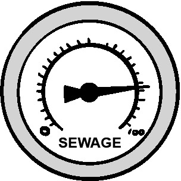

## Введение

> Мы обречены на провал без ежедневного уничтожения наших различных
> предубеждений. Тайити Оно

Все чаще компании утверждают, что они ориентированы на данные. Инициативы в
области бизнес-аналитики и Big Data пытаются объединить растущие стопки данных,
которые создаются в экосистеме доставки, чтобы улучшить информированность и
научиться чему-то новому. Такое сочетание может показаться мощным, особенно
когда оно используется с методологиями, такими как Lean Startup и Agile, которые
разработаны для получения обратной связи в быстром и эффективном режиме. Однако
на практике достижение обещанного --- все лучшие и более безопасные решения для
клиентов более быстро и бесшовно --- все еще кажется недостижимым.

Что идет не так, и как можно решить эту проблему?

Для успешной доставки необходимо не только быстро создавать и развертывать
возможности сервиса, но и затем собирать любые сгенерированные данные. Чтобы
доставка была эффективной, она также должна предоставлять решения, которые
клиенты считают важными для достижения своих целей. Сбор данных полезен только в
том случае, если он обеспечивает обратную связь, которая улучшает принятие
решений и способность достигать этих целей.

Получение такой качественной информации на самом деле намного сложнее, чем может
показаться. Сначала вам нужно иметь хорошее представление о том, какого рода
информация была бы полезной. Большинство тех, кто собирает и анализирует
информацию об экосистеме, обычно собирают ту информацию, которая согласуется с
тем, во что они верят. Это приводит к подтверждению предвзятости, которая может
повредить качеству принимаемых решений.

Чтобы избежать ошибок, связанных с подтверждением собственных предубеждений,
гораздо лучше искать доказательства, которые опровергают эти убеждения, а не
подтверждают их. Такой подход снижает вероятность ошибочных ментальных моделей,
которые постепенно разрушают качество принятия решений. Анализ неожиданных
результатов создает возможности для обучения и улучшения.

Вторым шагом является определение лучших механизмов для сбора необходимой
информации. Они должны делать это точно и в своевременном режиме с достаточным
контекстом, чтобы информация могла эффективно направлять принятие решений.
Фактически, применение готовых инструментов для сбора и обработки существующих
данных в экосистеме может быть опасным. Это рискует захватывать и анализировать
данные вне их намеренного контекста. Не только могут отсутствовать полезные
идеи, но также использование таких инструментов может обрабатывать и объединять
несвязанную информацию таким образом, что создаются ложные корреляции, которые
могут на самом деле повредить пониманию того, что происходит в вашей экосистеме.

Наконец, информация, которую вы захватываете, должна быть достаточно видимой и
понятной для принимающих решения людей, чтобы они могли максимально использовать
эту информацию.

Эта глава пытается провести вас через этот путь, предоставляя некоторые ответы,
которые помогут вам достигнуть этой цели прагматичным способом. Она основана на
многих концепциях, обсуждаемых в этой книге, чтобы помочь вам преодолеть
множество проблем, связанных с определением <<правильных>> данных. Также,
поскольку технический ландшафт постоянно меняется, появляются новые и
инновационные подходы каждый день, я попытался оставаться независимым от
конкретных инструментов. Любые ссылки на конкретные инструменты следует
рассматривать как полезные примеры, а не конкретные рекомендации.

## Определение <<правильных>> данных.

 **Рисунок 11.1**\
<<Хотя они собрали его, Билл не знал, откуда оно и зачем нужно.>>

Некоторое время назад я присутствовал на ужине с рядом знаменитостей из движения
DevOps. Как это часто бывает, одной из тем, которая возникла, было об
отслеживании и аналитике. Я начал рассказывать о некоторой интересной сервисной
инструментации, которую мы установили в одной из компаний, где я работал.
Большая часть инструментации была направлена на то, чтобы позволить нам
отслеживать все, начиная от пользовательских и задачных путей до связанных
событий и их влияния на сервисную экосистему.

В какой-то момент несколько человек вызвали меня на дискуссию. Некоторые из этих
вызовов действительно оставили на меня впечатление, частично потому, что то, что
я принимал за очевидное, было явно не так. Они касались следующего:

- <<Даже если бы я мог получить эту информацию, зачем мне хотеть это?>>
- <<Сбор данных стал фетишем. Я уже плаваю в них. Если добавлять ее еще, то это
  только усложнит выполнение задач.>>

Своими возражениями они выделили очень реальную проблему. Удивительно большая
часть усилий по сбору данных и аналитике вводится только потому, что кто-то
думает, что со всем ростом модных слов <<data driven>>, каждый должен это
делать.

Действительно, взрыв интереса к науке о данных и аналитике для многих
организаций оказался таким же продуктивным, как рыться в беспорядочном гараже
некоего скоплению вещей. В то время как в горах случайных вещей могут быть
что-то полезное, не зная качества того, что было собрано, откуда это было
собрано и насколько соответствует вашим потребностям, шансы на то, что что-то
будет полезным, невелики.

Однако, сбор и просеивание случайных данных часто закапывает или искажает
полезную информацию, которая может существовать, что делает ее поиск вовремя для
конструктивного использования почти невозможным.

Для тех, кто выражал протест на ужине, мое описание сбора и анализа данных
звучало как еще больше того же самого. Однако, в этом случае все было иначе.
Компания, речь о которой шла, выработала ключевые принципы, которые обеспечивают
эффективную инструментальную базу и аналитику:

- Все собранные данные должны иметь известную цель. Данные не должны собираться,
  если нет идентифицируемой цели или ценности сбора данных. Их также не следует
  собирать, если их единственная цель - подтвердить, что верно то, что считается
  правильным.
- Все собранные данные должны иметь известную аудиторию. Средства сбора и
  представления информации должны гарантировать, что предполагаемая аудитория
  достаточно хорошо понимает, что данные представляют собой, чтобы извлекать из
  них ценность.
- Источник данных должен быть известен и достаточно доверенным, последовательным
  и своевременным для целей, для которых данные будут использоваться.

Компания не только соблюдала эти правила для новых данных и инструментов. Также
регулярно проверяли существующие данные, их источники, тех, кто на них
полагался, и документацию, поддерживающую их, чтобы убедиться в их
действительности. Если это переставало быть таким, причины исследовались, и
результатом было замена или выход из употребления инструментов и данных.

Для тех, кто работал в среде с множеством неизвестных или устаревших данных и
систем, перечисленные критерии оказываются чрезвычайно полезными как для
уменьшения беспорядка, так и для сохранения фокуса инструментальной базы и
аналитики. Для тех, кто хочет узнать больше, давайте рассмотрим каждое правило,
чтобы лучше понять его важность.

## Знание цели и значения

Только потому, что данные могут быть собраны, не означает, что это необходимо
делать. Сбор излишнего количества данных не только тратит много ресурсов, но
также может сделать поиск нужной информации и создание необходимого контекста
для ее использования намного сложнее.

Поэтому необходимо иметь четкую цель сбора данных. Цель обычно заключается в
одном или нескольких из следующих:

- Выявление или уточнение целевых результатов, которых необходимо достичь
- Помощь в принятии решений, необходимых для достижения целевых результатов
- Помощь в понимании и осведомленности об экосистеме доставки, чтобы улучшить
  соответствующие способности, необходимые для более эффективного выполнения
  работы в ней
- Предоставление доказательств, необходимых для соблюдения юридических или
  регуляторных требований

Одной из самых больших проблем в области предоставления услуг является
отсутствие четкого представления о целевых результатах. Иногда это связано с
тем, что у вас нет прямого доступа к клиенту, чтобы выяснить. В других случаях
могут быть неточные предположения или предубеждения, скрывающие или искажающие
проблему, которую необходимо решить. Иногда, как это произошло с компаниями
Slack и Flickr, вы можете натолкнуться на совершенно другую потребность клиента,
которая является намного более ценной, чем ваша первоначальная цель.

Чтобы убедиться, что у вас правильное понимание целевых результатов, необходимо
начать с установки некоторой инструментации для захвата и представления динамики
текущей ситуации, которая повлияет на их достижение. Этот процесс неизбежно
итеративен, так как вы, вероятно, обнаружите, что некоторые из ваших
первоначальных мер не имеют значения или имеют пробелы, которые снижают их
полезность.Когда вы узнаете больше и начнете экспериментировать с решениями,
чтобы продвигаться к целевым результатам, вам понадобятся более подробные и
целевые меры, которые могут рассказать вам больше не только о самих результатах,
но и о том, насколько хорошо ваши улучшения уменьшают разрыв и помогают клиенту
достигнуть целей. Также начнет становиться понятно, какие инструменты могут
захватывать динамику вашей экосистемы и эффективность ваших возможностей в ней,
чтобы вы могли учиться и улучшать свои возможности и подход.

Давайте рассмотрим два очень разных примера, чтобы показать, как работает
определение целей данных.

## Покупка мебели онлайн

 **Рисунок 11.2**\
<<Как узнать, соответствует ли опыт требованиям вашего клиента?>>

Клиент, который рассматривает покупку мебели в интернет-магазине, обычно ищет
идеи различной мебели, которая отвечает его потребностям и желаемому
эстетическому стилю, а также доступна для покупки. Успех в данном случае обычно
означает нахождение и приобретение именно того, что он искал (возможно, вместе с
другими предметами, о которых он не знал, но теперь не может жить без них).
Чтобы достичь успеха, клиент должен иметь возможность найти интернет-магазин,
найти искомую мебель, оформить и оплатить заказ, а затем получить и счастливо
использовать свою покупку. Любое препятствие на этом пути наносит ущерб не
только отношениям магазина с этим конкретным клиентом, но и, вероятнее всего,
отпугивает других потенциальных клиентов.

Метрики для измерения успеха интернет-магазина довольно просты. Они обычно
следуют следующему общему контуру:

- Отношение между количеством поисков и количеством товаров, добавленных в
  корзину покупок
- Количество заброшенных корзин и место их забрасывания в процессе заказа
- Отношение успешных и неудавшихся платежей с указанием причин неудач
- Отношение возвращенных товаров к общему количеству доставленных, с указанием
  причин возврата
- Отношение удовлетворенных и возвращающихся клиентов к недовольным клиентам

Каждая из этих метрик является отправной точкой для дальнейшего исследования и
развития. Например, информация о поиске может быть расширена для изучения того,
сколько поисков было необходимо, чтобы найти товар, сколько поисков вернулись
без результатов, и сколько неудачных поисков были основаны на категориях, а
сколько на основе характеристик или названий товаров. Наиболее важно начать
искать способы уловить причины неудач.

Еще одним важным аспектом при инструментировании для обеспечения наблюдаемости
являются случаи, когда ключевые части вашей экосистемы доставки обслуживаются
другими сторонами. Это, вероятно, будет так в случае процессора платежей, а
также поставщика логистики доставки мебели. Несмотря на то, что вы не можете
инструментировать их напрямую, их производительность все еще является важной
частью того, будет ли клиент достигать своей целевой цели. Нахождение способов
для инструментирования, даже косвенно, условий, которые скорее всего окажут
негативное влияние на клиента, ценно. Например, захват и поиск паттернов, таких
как ошибки валидации платежа, уровень возвратов и жалобы, могут предоставить
полезные подсказки, которые могут указать на ценность дальнейшего исследования
ситуации.

## Достижение успешного оказания медицинских услуг

 **Рисунок 11.3**\
<<Как обеспечить хорошие результаты для пациентов?>>

Иногда цель сбора и анализа данных может казаться ясной, но инструменты и
данные, доступные для этого, настолько фрагментированы и дисфункциональны, что
использование их для принятия эффективных решений далеко не прямолинейно. Такое
положение дел, безусловно, существует в госпиталях.

Люди обращаются в больницы по самым разным причинам, в основном из-за травм,
заболеваний или какой-то проблемы, которая влияет на качество жизни пациента.
Немногие идут в больницу с ожиданием того, что они подвергают себя
дополнительному риску смерти. Тем не менее, хождение в больницу, можно
утверждать, является одним из самых опасных видов деятельности.

В 2006 году главный медицинский советник Великобритании Сэр Лиам Дональдсон
заявил, что риск смерти из-за медицинской ошибки в больнице составляет 1 случай
на 300, что в 33 000 раз больше, чем риск гибели в авиакатастрофе. Если
медицинская ошибка вас не убьет, то инфекция, которую вы получите во время
посещения больницы, может. Согласно Центру контроля и профилактики заболеваний
США, ежегодно почти 1,7 миллиона госпитализированных пациентов заболевают
инфекцией, и более 98 000 из них умирают [^1].

[^1]: "Health care-associated infections – an overview", US National Library of
    Medicine, US National Institute of Health, 2018;
    https://www.ncbi.nlm.nih.gov/pmc/articles/PMC6245375/

В медицинской среде общая цель любого посещения больницы - поставить диагноз и
затем лечить заболевание пациента. Целевым результатом, как правило, является не
только стабилизация пациента, но и улучшение его общего здоровья. Достижение
этого результата с ограниченными или неполными данными, которые могут привести к
ошибкам или контакту с опасными патогенами, крайне сложно. Поэтому важно, чтобы
персонал больниц собирал и анализировал контекстные данные, необходимые для
принятия обоснованных решений, которые помогут пациентам достичь хороших
результатов.

Существует несколько областей, где получение и представление контекстных данных
в своевременном режиме помогут достигнуть правильных результатов для пациентов,
включая:

- Данные о точности классификации и маршрутизации при триаже и поступлении
- Причины и распространенность проблем с точностью, доступностью и полнотой
  медицинских записей пациентов
- Задержки в лечении, ошибки, типы и причины
- Местоположение и модели использования оборудования, лекарств, материалов и
  персонала
- Местоположение и движение пациентов, типы поступления и их взаимодействие с
  оборудованием, лекарствами, материалами и персоналом

Каждая из этих областей, подобно интернет-магазину мебели, является всего лишь
отправной точкой для дальнейшей работы. Например, проблемы с медицинскими
записями могут быть признаком фрагментированной системы записей, неудобной и
склонной к ошибкам в использовании для врачей или признаком более крупных
проблем управления записями. Аналогично, паттерны использования медицинского
оборудования могут быть связаны с записями о чистке и обслуживании, чтобы
увидеть, происходило ли кросс-контаминация по какой-либо причине. Каждая из этих
областей может быть изучена дополнительно для дальнейшего обучения и улучшения,
чтобы повысить шансы пациентов на получение безопасного и точного лечения.

## Знание аудитории

 **Рисунок 11.4**\
<<Знание аудитории может предотвратить неловкость и неудачи.>>

Знание целей информации, которую вы собираете, конечно, ценно при определении
лучшей информации для сбора и лучшего способа ее сбора, однако цель не всегда
раскрывает лучшую информацию для сбора или оптимальный способ ее сбора и
представления. Вам также нужно понимать, кто будет ее потреблять.

Аудитории обычно естественным образом делятся на несколько перекрывающихся
групп:

- Технические команды, которые используют информацию для устранения неполадок,
  проектирования и улучшения технических решений
- Нетехнические команды, которые являются частью общей доставки продукта или
  услуги, такие как команда склада и инвентаризации в магазине мебели или врачи
  и медицинский персонал в больнице в предыдущих примерах
- Сотрудники и партнеры, поддерживающие более ориентированные на бизнес функции,
  такие как нацеливание на клиентов и рынок, планирование, продажи, операционная
  и финансовая отчетность и соответствие
- Сами клиенты, которые часто пытаются понять и оптимизировать свои действия в
  направлении достижения своих целевых результатов

Не все потребители информации используют ее одинаково, с тем же контекстом или
мотивацией. Это означает, что то, что может показаться правильными данными для
вас, может быть неоптимальным для тех, кто этим нуждается. Умение определить и
исправить потенциальные несоответствия может существенно помочь в обеспечении
того, чтобы предполагаемая аудитория могла что-то сделать с информацией, что в
конечном итоге помогает им достигать своих целевых результатов.

Давайте рассмотрим некоторые из более распространенных несоответствий информации
и проблем, которые они могут вызвать.

## Несоответствия в языковой области

Одной из наиболее распространенных несоответствий является представление данных
способом, который не соответствует аудитории, которая их потребляет. Это мешает
им понимать информацию и то, что она значит для них, заставляя их игнорировать
ее или принимать неправильные решения.

 **Рисунок 11.5**\
<<Мы работаем в песочнице?>>

Многое может вызвать это несоответствие. Иногда оно может быть вызвано
использованием языка, который может иметь совершенно другое значение для
аудитории, получающей его. Простой пример - не понимание того, что <<упавшие
таблицы>> означают что-то другое для мебельного магазина, чем для вашего DBA.
Люди также могут путаться в аббревиатурах, которые могут означать разные вещи в
разных контекстах, таких как <<ATM>> для <<Асинхронный режим передачи>> или
<<Автоматизированный банкомат>>.

Еще одна распространенная форма разрыва связи возникает, когда аудитория узнала,
что такое термин или статистика, но недостаточно информирована о базовой
информации, чтобы использовать термин или статистику эффективно. Я сталкивался с
этой проблемой как с техническими, так и с непрофессиональными командами. Это
может быть особенно болезненно, когда инструментирование направлено на
удовлетворение правового или регулирующего требования. Несоответствия в языке,
такие как информация об изменениях и доступе для Sarbanes-Oxley (SOX), могут
создавать ложные тревоги, вызывая огромные проблемы с соблюдением для быстро
движущихся команд по доставке.

Возможно, наиболее раздражающая ситуация - это когда инструментарий расположен в
области, где те, кто должен его использовать, либо не используют его, либо не
имеют достаточных знаний, чтобы интерпретировать его вывод. Это часто происходит
с программными статистическими данными, такими как статистика сборки и кода, а
также статистика использования инфраструктуры и сервисов. Я сталкивался с
командами, у которых была отличная статистика, показывающая случаи, когда
хрупкий код страдал от высокой частоты дефектов из-за большого объема изменений
в конце цикла разработки, но команды не могли эффективно интерпретировать
статистику сами. Также я видел случаи очевидных узких мест, где даже небольшое
увеличение нагрузки или изменение схемы использования приводило к каскаду
серьезных отказов сервисов, но решения по изменению поведения сервисов
внедрялись слепо.

Такие несоответствия могут быть крайне раздражающими для всех участников. Чтобы
повысить шансы на успешную коммуникацию, старайтесь найти любые термины, которые
могут вызвать проблемы, и замените их более простыми. Чтобы найти такие термины,
а также метрики, которые могут быть неправильно поняты, используйте новых членов
команды. Новые члены команды не знают значения внутренних необычных терминов или
метрик. Фиксируя любые проблемы, с которыми они сталкиваются при обучении, можно
найти и решить проблемы, где возможны несоответствия и расхождения. Они могут
быть связаны с неясными терминами или процессами, которые они могут
документировать и передать обратно. Они также могут столкнуться с ситуациями,
когда существующий персонал имеет разные интерпретации метрик или процессов,
которые нужно переосмыслить, чтобы команда была более эффективной.

Для соблюдения юридических и регуляторных требований я всегда рекомендую
проводить время с юридическим и командами по соответствию. Таким образом, вы
можете проверить, что вы понимаете, какая информация требуется организацией для
соответствия, а также получить хорошее понимание того, какую цель преследуют эти
требования и как они будут использованы. Таким образом, вы можете убедиться в
том, что захватываемая информация является правильной, понятной и полной, и что
ее можно легко понять теми, кто будет ее использовать. Вы также можете
столкнуться с проблемами в общении при запросе информации о соответствии. Лично
я несколько раз сталкивался с ситуацией, когда то, что было фактически нужно,
было гораздо проще предоставить, чем то, что было запрошено, что позволило
избежать множества проблем, в процессе создавая полезное доверие с командой по
соответствию.

## Искажения при сборе и представлении данных

Иногда проблема с данными не заключается в использовании языка, а в том, как их
контекст и значение теряются или искажаются способом их сбора или представления.
Когда это происходит, результат может быть хуже, чем если бы данных вообще не
было.

Я часто сталкиваюсь с ситуациями, когда искажения при инструментировании и сборе
данных были настолько большими, что аудитория информации приобретала ложное
чувство осведомленности и понимания экосистемы доставки. Были те, кто был
счастливо неосведомлен о производительности, надежности, безопасности и даже
образцах использования. Другие неправильно интерпретировали данные и охотились
за фантомными проблемами, часто предлагая сложные и совершенно ненужные решения
для их решения.

Как и с несоответствием языка, лучший способ решить такие ошибки - потратить
время с аудиторией информации. Какие данные им нужны для достижения цели за
ними, и в каком формате они могут лучше понимать его тонкости? Например,
представление информации о тенденциях часто требует знания масштаба и объема,
чтобы обеспечить, чтобы важные детали не были скрыты или усреднены.

Также может быть важно, где представлена информация. Например, в случае
катастрофы Knight Capital, описанной в главе 10 <<Автоматизация>>, за несколько
часов до краха система SMARS выдала 97 предупреждений о проблеме, которая в
конечном итоге уничтожила компанию. Однако предупреждения были слишком общими и
отправлены на электронную почту, где сотрудники поддержки пропустили срочность
проблемы.

Также информацию может потребоваться представлять таким образом, чтобы она имела
более широкий контекст. Примером может служить представление всего, от
мониторинга и сервисов до потоков данных производства через призму их деревьев
зависимостей. Такие презентации улучшают отслеживание и устранение неполадок, а
также планирование, координацию и проверку изменений в сервисе.

## Знайте источник

Рисунок 11.6 <<Я уверен, что когда-то это была вода горного родника!>>

Получение <<правильных>> данных не зависит только от того, кто их потребляет и
зачем они нужны. Источник, откуда они берутся, и способ, которым они попадают
туда, где они нужны, также важны.

Большинство из нас неявно знают, что не все источники данных производят
информацию одинаковой ценности. Например, батарея сервисных зондов, вероятно,
предоставит более ясное представление о характере проблемы ответа службы, чем
жалоба на медленность службы от одного пользователя. Зонды скорее всего
предоставят гораздо больше контекста о том, что медленнее, насколько, в каких
условиях и как это влияет на экосистему сервиса. Это обеспечивает гораздо более
фактическое фокусирование, на котором можно действовать.

К сожалению, наиболее оптимальный источник для необходимой информации в
определенный момент не всегда так очевиден. Как вы можете систематически
определить те источники, которые, если не являются лучшими, по крайней мере
достаточны для достижения целевых результатов?

Есть несколько аспектов любого данного источника, которые могут помочь вам
определить его пригодность для помощи предполагаемой аудитории достигнуть своих
намеченных целей. Среди них:

- Насколько доверенен и последовательен источник данных?
- Насколько своевременно собираются, обрабатываются и передаются данные, чтобы
  информировать и улучшить способность аудитории принимать решения?

Давайте рассмотрим, как каждый аспект влияет на пригодность вашего источника.

## Доверительность и последовательность

Доверительность и последовательность - увлекательные и часто неправильно
понимаемые аспекты аналитики данных и управления информацией. Одна из ошибок,
которую мы совершаем, заключается в том, что мы путаем доверительность и
последовательность с точностью. Данные могут быть точными и при этом не
считаться ни доверительными, ни последовательными. Жалоба клиента на медленную
реакцию службы поддержки - пример таких данных, и это имеет свои причины. Жалобы
клиентов поступают случайным образом и не всегда указывают на причину, которую
можно исправить и решить.

Проблема заключается в том, что немногие из нас уделяют много времени мышлению о
доверительности и последовательности источников наших данных, не говоря уже о
том, чтобы понимать, как эти качества могут искажать сам процесс принятия
решений. Эта проблема становится наиболее очевидной, когда вы полагаетесь на
данные, которые были сгенерированы или обработаны приборами, которые могут не
соответствовать вашей ситуации или цели, для которой вы их используете.

Я сталкиваюсь с этим наиболее часто с готовыми к использованию инструментами и
решениями. Несоответствия обычно можно разделить на три категории. Первая - это
майнинг данных из журнала по умолчанию, не понимая предназначения, точности или
контекста, для которых создаются записи. Я видел ситуации, когда организации
пытались разумно добывать данные из журналов по всему пути обслуживания, только
чтобы оказаться в затруднительном положении из-за того, что подход к тому, что и
как записывать, отличался в различных внешне разработанных или поставленных на
рынок решениях. У некоторых майнинговых данных были большие и необъяснимые
пропуски, а другие источники данных использовали криптографический язык с идеей,
что только организация-автор будет его анализировать.

Затем бывают несоответствия, которые возникают, когда инструментарий <<из
коробки>> является инструментированием. Одна из форм вызывается несоответствием
между тем, что инструментирование предназначено для захвата, и тем, как оно
интерпретируется. Иногда проблема заключается в предвзятостях, встроенных в то,
как решение подходит к экосистеме, в которой оно находится. Это может быть все,
начиная от подхода, что отсутствие явных проблем означает, что все в порядке, до
рассмотрения путешествия клиента в виде фрагментов (например, разделения нашего
примера онлайн-магазина на часть поиска и покупки и на часть обработки и
получения, или разделение потоков персонала, пациентов и оборудования в примере
больницы), вместо того, чтобы смотреть на полный путь от начала до конца.

Это распространенная проблема при использовании синтетических решений
мониторинга транзакций. Они обычно предназначены для проверки работоспособности
определенных заданных потоков. Это полезно, когда потоки услуг состоят из многих
движущихся частей, а также когда пути клиентов являются последовательными и
хорошо известными. Однако часто бывает так, что синтетические решения
принимаются как полностью представляющие опыт клиента, даже если использование
клиентом не является последовательным или хорошо известным. Синтетика часто
упускает важные аспекты экосистемы доставки, которые оказывают реальное влияние
на то, что испытывает клиент. Это включает различия в конфигурациях клиентской
среды (таких как какие системы и программное обеспечение клиенты используют для
доступа к сервису, откуда они к нему обращаются и т. д.), кэшировании клиентов и
характеристиках пользователей, которые могут изменить способ их навигации и
использования системы. Иногда эти различия могут быть настолько значительными,
что метрики, полученные из синтетики, бесполезны.

Один распространенный шаблон, который я видел во многих компаниях, - это
отслеживание времени транзакций входа в систему, даже если их пользователи почти
всегда остаются в системе. Я также видел транзакции, которые отслеживались, не
учитывая того факта, что время ответа всегда напрямую коррелирует с размером,
структурой или уровнем разрешений пользователя или объемом информации,
кешированной на стороне клиента. Иногда пользователь должен выполнять серию
действий не потому, что сами действия полезны, а потому что это единственный
способ получить определенные данные или достичь желаемого состояния услуги. Это
означало, что возможности переструктурировать или оптимизировать транзакции были
постоянно упущены.

Третий случай несоответствия происходит, когда инструментарий "off-the-shelf"
применяется в экосистеме, для которой он не был разработан. Это обычно
происходит с различными универсальными инструментами отслеживания использования
ресурсов и производительности, которые применяются в виртуальных и облачных
средах. Гипервизор, контейнер и услуги, предоставляемые виртуально, могут
искажать доступность ресурсов и время обработки. Иногда ресурсы могут казаться
доступными, когда они этим не являются (общая проблема виртуальных машин), или,
наоборот, казаться недоступными, когда они имеются. У Docker долгое время были
ошибки статистики, из-за которых казалось, что ресурсов не хватает, когда это не
так.

Аналогично, бывают ситуации, когда инструментарий не может распознать проблему,
для которой он не был разработан. Например, я видел случаи, когда
инструментарий, предназначенный для поиска проблем с отзывчивостью и
повреждениями, не мог обнаружить отброшенные кадры или ошибки данных из
потоковых источников.

Решение таких проблем требует шага назад и оценки того, насколько вы уверены в
надежности и последовательности инструментария и источников данных. Если
инструментарий важен, и вы не можете быть полностью уверены, что он
соответствует вашим потребностям, вам, вероятно, придется изменить свой подход.

## Своевременность

Рисунок 11.7 Иногда прибытие позднее хуже, чем не прибывать вовсе.

Сколько раз вы находили необходимую вам ключевую информацию только после того,
как она вам понадобилась? Получение и осознанное использование данных вовремя
становится все более важным в наш век информационного голода. Инвестиционные
банкиры платят миллионы долларов, чтобы получить и оперативно использовать
информацию миллисекунды раньше других, в то время как другие компании
рассматривают наличие культуры работы с данными как ключевой фактор успеха.

Точность обратной связи также определяет, насколько быстро мы можем принимать
решения в ответ на изменяющуюся динамику нашей экосистемы доставки.
Своевременная обратная связь нужна не только для того, чтобы дать организациям
преимущество перед конкурентами. Клиенты ожидают, что провайдеры услуг быстро
будут оповещены, реагировать и решать любые проблемы с сервисом, с которыми они
сталкиваются. Клиенты чувствуют обиженность, когда им приходится уведомлять
провайдера о проблеме, веря в то, что они каким-то образом выполняют работу
провайдера за него.

Инструментация должна захватывать и представлять полный контекст, когда это
необходимо. Это означает, что необходимо учитывать все, начиная от того, сколько
времени нужно для получения и представления контекстуальной информации,
заканчивая тем, как и когда она используется, при разработке самой
инструментации. Это также включает в себя обеспечение того, чтобы
инструментация, которая зависит от нескольких источников данных, могла устранять
любые задержки и фрагментацию этих источников. Такое устранение может быть
непростым. Обычно это означает, что данные будут актуальными только насколько
источник данных с наибольшей задержкой.

Для инструментации, которая уже установлена, важно регулярно отслеживать ее цикл
получения и представления, чтобы убедиться, что она используется только для
принятия решений, соответствующих принятому временному окну ее основной цели.
Если задержка настолько большая, что она выходит за это окно, организация,
использующая инструментацию, должна определить, является ли более низкий уровень
информации и контекста приемлемым, пока не будет найден более своевременный
способ получения данных.

Я видел много компаний, которые делают обратное. Они разрабатывают сложные планы
аналитики данных для принятия решений практически в реальном времени, которые
могут быть выполнены, скажем, за одну-пять минут, только чтобы обнаружить, что
требуется три-семь дней для получения и обработки необходимых данных для
принятия целевого решения.

## Создание наблюдаемой экосистемы

Умение мыслить о полезности данных --- это важный первый шаг. Однако, для
эффективной и безопасной доставки необходимо не только инструментировать и
собирать данные в производственной среде, но и иметь уверенность в понимании
остальной экосистемы, которая создает и доставляет услуги. Для этого нужно
подумать о том, как сделать экосистему доставки наблюдаемой.

Этот процесс начинается с того, что необходимо сделать шаг назад и взглянуть на
экосистему доставки на всем протяжении жизненного цикла. В Lean Manufacturing
это делается путем выполнения так называемого "walking the gemba", что
означает "walking the floor" или <<место работы>> на японском языке. В
производственном процессе они проходят через все этапы доставки, чтобы
наблюдать, что происходит, и строить контекст по всей экосистеме.

Один из ключевых моментов заключается в том, что они не начинают <<прогулку по
Гемба>> с начала процесса доставки и не проходят до конца. Вместо этого они
начинают с последнего шага и идут в обратном порядке через жизненный цикл до
начала.

 **Рисунок 11.8**\
<<Прогулка по Гемба задом наперёд>>

Существует множество причин, по которым следует начинать с последнего шага. Одна
из них заключается в том, что, начиная с результата и двигаясь в обратном
направлении, вы можете намного легче проследить его качества до их причин.
Например, если вы видите повреждение в одном и том же месте на двери нескольких
завершенных автомобилей, вы начнете искать потенциальные причины на более ранних
этапах производства. Аналогично, вы будете искать причины того, что дефект,
обнаруженный в производстве, не был обнаружен ранее в цикле доставки. В одной
компании я обнаружил, что причина того, что многие дефекты производства никогда
не были обнаружены ранее, заключалась в том, что программные пакеты, помещаемые
в производство, никогда не тестировались заранее. Вместо этого они строились и
упаковывались непосредственно перед этим. Поскольку в производственные пакеты
включались определенные библиотеки, проблемы, возникшие между этими библиотеками
и новым байт-кодом, могли быть обнаружены только в производстве.

Еще одна причина для движения назад через процесс заключается в том, что это
делает намного сложнее для мозга делать предположения, которые могут привести к
пропуску важных деталей. Большинство людей склонны пропускать детали, которые
кажутся скучными или несущественными, если только в этот момент не происходит
явная проблема. Если проблема становится заметной позже, вам придется вернуться
назад, чтобы выяснить причину.

В экосистеме доставки сервисов я обычно начинаю <<прогулку по Гембе>> с любой
функции обслуживания клиентов и поддержки, чтобы посмотреть, какие запросы и
жалобы поступают. Это может дать некоторые намеки на то, где текущее решение не
соответствует ожиданиям клиентов и их способности достигать своих целей.

Затем я перехожу к производству и тем, кто его управляет. Я смотрю на их
настроение, на что они жалуются, какую работу они выполняют, а также на приборы
и источники данных, которые они используют для ее руководства, и как эта
информация передается. Затем я смотрю на то, насколько проактивной или
реактивной является их работа, и насколько эффективно их труд улучшает сервис.
Не редко возникают высокореактивные операции производства, которые упорно
борются за сохранение статус-кво, или информация может замыкаться или искажаться
таким образом, что различные члены команды имеют разный уровень осведомленности
и представления об экосистемной динамике.

Оттуда я продолжаю свой путь по жизненному циклу продукта, рассматривая разницу
между выпуском и исправлением ошибок, динамику и поток информации в процессах
тестирования, создания и репозитории кода/пакета, а также инструментальные
средства вокруг них. Затем я рассматриваю сам процесс разработки, включая
организацию команд, их знакомство с кодом и экосистемой, уровень знания того,
чего хотят клиенты и пользователи, а также динамику между командами и функциями
продукта и архитектуры. Я также смотрю на потоки информации и артефактов,
инструменты вокруг них, кто их использует и как.

Путь продолжается через Продукт и Архитектуру, Маркетинг и Продажи, а иногда
включает одного или нескольких клиентов и, возможно, высшее руководство. На этом
этапе я оцениваю уровень осведомленности каждой из этих групп об остальных
этапах жизненного цикла, чтобы определить, есть ли значительные разрывы, и, если
есть, то каковы их потенциальные причины.

Все это должно помочь вам создать самую общую картину вашей экосистемы. Это не
должно занимать много времени. В зависимости от размера проблемной области,
обычно мне требуется от двух до шести недель, чтобы все организовать,
рассмотреть, встретиться, проверить гипотезы и задокументировать. Вам может быть
немного трудно сделать это, но важно ограничить первый проход чем-то
относительно коротким.

В конце концов, то, что вы получаете, является самым началом того, что вы будете
использовать для формирования карты дороги по наблюдению за экосистемой. Она не
будет полной. Некоторые элементы могут даже не иметь смысла с самого начала или
создавать больше вопросов, чем ответов. Они могут не казаться приоритетными или
не давать возможности действовать. Это нормально. Вы находитесь только в самом
начале пути.

Вы также почти наверняка увидите проблемы, которые нужно решить немедленно. У
вас может быть даже быстрое решение, чтобы справиться с ними. Если не решить
проблему немедленно, это может причинить серьезный и необратимый ущерб
организации, но все же не стоит сразу бросаться в ее решение. Очень вероятно,
что вы упускаете важный момент, который может изменить то, как вы решаете
ситуацию. Вместо этого лучше быстро записать проблемы. Таким образом, вы сможете
избежать случайного возникновения проблем.

Перед переходом к следующей фазе вам нужно проверить некоторые из своих гипотез,
запустив трассировку через экосистему. Эти трассировки обычно запускаются для
наблюдения за динамикой ключевых действий, которые вы не наблюдали в действии
или у которых возникли вопросы. Эти действия могут быть связаны с отслеживанием
маленьких задач от начала до конца, устранением сбоя, устранением ошибки и ее
развертыванием, установкой новой мощности и т.д. Это должно помочь покрыть все,
что вы пропустили на первом этапе, или дать ответы на некоторые вопросы. Часто
их можно делать параллельно, по мере появления возможностей.

Оттуда вы можете начать искать возможности для наблюдения за экосистемой.

## Инструментирование для Обзорности

Следующий шаг в путешествии - начать определять типы и потенциальные источники
данных с приемлемым уровнем доверия, последовательности и своевременности,
необходимые для объединения информации, необходимой для создания контекстуальной
информационной экосистемы и, в конечном итоге, достижения целей аудитории.

Ваш исходный обзор должен дать вам представление о том, что уже существует и
насколько подходящим оно может быть для предоставления полезного понимания.
Некоторые инструменты, такие как система мониторинга и система управления
заявками, могут показаться хорошей отправной точкой. Однако, прежде чем начать
работу по очистке, вы должны сначала определить места в экосистеме, где есть
перерывы, пробелы и ошибки в потоке информации. Это указания на неизвестные в
экосистеме.

Важно сделать как можно больше ваших экосистем известными или контролируемыми,
чтобы минимизировать невидимые воздействия, которые могут вызвать неизвестные
факторы, не только в отношении ваших информационных целей, но и в вашем пути к
достижению целевых результатов.

Следующие разделы касаются экосистемы доставки, а также некоторых способов
подхода к их инструментированию. Хотя порядок начинается с того, что большинство
считает началом технического жизненного цикла, не принимайте это как место, с
которого вам необходимо начать. Я начинал путешествия практически в любом месте
в организации и во многих случаях запускал их в нескольких местах параллельно,
потому что это было разумным.

## Инструментирование разработки

Возможно, помимо производственной среды, среда разработки является одним из
наиболее информационно насыщенных компонентов экосистемы доставки. Она часто
игнорируется или используется для управления людьми, а не для оценки пригодности
доставки и экосистемы доставки. Задачи и рабочие процессы, код, статистика
сборки и другая полезная информация могут дать отличное представление о динамике
доставки. Все эти данные еще более полезны, когда вы можете связать их, чтобы
узнать, как все работает вместе.

Для этого я обычно начинаю с небольших мер, часть из которых разработчики уже
используют. В первую очередь, я присваиваю идентификаторы всем элементам работы.
Эти идентификаторы чрезвычайно распространены и возникают естественным образом,
если вы используете систему отслеживания задач, такую ​​как Jira, Bugzilla или
GitLab/GitHub для отслеживания работы. Поскольку элементы работы --- это задачи,
которые кто-то считал достойными документирования и выполнения, это одни из
первых прослеживаемых элементов, которые можно использовать для связи
<<почему>>, <<как>> и других важных отношений между артефактами во всей
экосистеме. Иногда они находятся в спецификации или документе требований. Иногда
они будут просто содержаться в самом элементе работы. Наличие идентификатора
позволяет помечать эти артефакты, созданные элементом работы.

Далее идет сама работа. Большинство разработки связано с кодом. Убедитесь, что
все возможное занесено в репозиторий контроля версий и помечено идентификатором
задачи в комментариях. Это создает прослеживаемость, которая позволяет другим
понимать, какие артефакты были изменены и каким образом для выполнения тех или
иных задач. Эта процедура настолько мощна, что многие организации, с которыми я
работал, настроили свои репозитории таким образом, что коммиты принимаются
только в случае, если у них есть идентификатор задачи.

Все эти данные начинают делать ваши линии доставки наблюдаемыми с целью
улучшения общего понимания людьми внутри экосистемы доставки ее динамики.

Метрики кода (изменения, оборот, мертвый/неактивный код, распределение
разработчиков) могут помочь вам разумно понимать все от потенциально хрупких
областей до взаимодействий, которые могут потребовать тестирования, и кто на
самом деле знает ваш код. Захватывание метрик кода и их регулярный просмотр как
части жизненного цикла доставки могут помочь вам лучше нацелить тестирование, а
также найти и минимизировать единичные точки отказа. Удивительно, но подобная
информация редко захватывается и изучается, что оставляет огромное и легко
устранимое множество неизвестных непосредственно в сердце процесса доставки.

Следующий шаг - автоматизировать и сообщать о результатах сборки и интеграции.
Автоматизированные системы сборки и непрерывной интеграции (CI) могут
предоставить полезную информацию о проблемах, связанных со сборкой и
интеграцией. Если такие системы уже существуют, то имеет смысл обеспечить
структурированный и удобочитаемый отчет о сборке, который может улучшить
видимость любых шаблонов проблем или сбоев, связанных с конкретными частями
кода. Использование идентификаторов задач в каждом коммите кода также позволит
вам увидеть, есть ли проблемы с определенными типами рабочих элементов, а также
выявить потенциальные проблемы координации между людьми и/или командами. Это
позволяет определить места, где может быть проблемный код, трение или проблемы с
потоком информации.

Активно попробуйте объединить всю эту информацию в панели управления
(dashboards), которые позволят вам начать с любой части процесса, пройти вниз и
проследить все связи. Вы можете сделать это с помощью всего, начиная от сильно
настраиваемых конфигураций Jenkins до пользовательских верхнеуровневых панелей
управления, которые отслеживают, графики и позволяют вам просматривать различные
области в более подробных деталях.

Технические команды являются основными потребителями этой информации. Она
помогает им избежать упущения проблем, которые они должны были бы увидеть сами.
Определение параметров разработки может показаться не слишком полезным вне
статистики сборки. Я регулярно получаю от команд отпор по поводу необходимости
помещать идентификаторы задач в коммиты кода и отслеживать работу. Это особенно
верно в низкодоверительных средах, где люди думают, что их <<эффективность>>
будет оцениваться. Есть способы обойти часть этого сопротивления, хотя важно
найти механизмы для выявления вызванной им дисфункции. Как вы увидите в боковой
истории, данные также могут оказаться очень полезными для бизнеса. При наличии
руководства они могут позволить обнаружить риски и одиночные точки отказа,
которые остались незамеченными и могут причинить вред.

## Heikkovision

Я столкнулся с уникальным примером мощи осведомленности разработки в стартапе,
который находился в процессе приобретения. Хотя организация казалась
процветающей, исполнительная команда была нервной. Несмотря на огромные
улучшения в скорости доставки и качестве сервиса благодаря переходу на
Agile-техники разработки и развертыванию инструментов CI, была непредсказуемость
в отношении качества и времени выпуска функциональных возможностей. Переносы и
функции плохого качества создавали очевидные риски для привлекательности
компании. Также были реальные риски, вызванные самим приобретением. Приобретения
требуют много ресурсов и отвлекают. Они также могут заманить ключевых людей
уйти. Мало кто знал, кто эти люди могут быть, каковы могут быть последствия,
если они уйдут, или как минимизировать ущерб.

Мне было предложено помочь.

Хотя невозможно всегда точно знать, кто покинет организацию или какие проблемы
могут помешать выпуску релиза, можно многое сделать, чтобы выявить места, где
риски высоки. Для этого я начал две инициативы. В первой я хотел отобразить, как
выпуски перемещаются через организацию.

Не прошло и доли минуты, чтобы найти источник непредсказуемости релизов. Первая
проблема заключалась в том, что хотя команды работали в коротких спринтах, мало
было сделано для уменьшения количества тесных зависимостей между командами. Это
создавало ситуации, когда зависимости создавали длинные, сериализованные цепочки
релизов. В этих цепочках функционал мог требовать работы от одной команды,
скажем, над важной библиотекой кода, которая затем передавалась и
интегрировалась в спринт другой команды, и так далее, как изображено на рисунке
11.9. Некоторые из этих цепочек имели длину в шесть или восемь команд, что
означало, что даже в самом оптимальном сценарии на релиз функционала уходило
более 16 недель (количество команд, умноженное на количество недель на спринт).

Проблема заключалась в том, что немногие функции проходили оптимальный путь.
Часто команда на нижнем уровне находила ошибку, которую нужно было исправить
команде на верхнем уровне. Это часто происходило через несколько команд в
цепочке, требуя повторного прохода через каждую команду на верхнем уровне.
Иногда требовалось несколько спринтов, чтобы завершить работу, или что-то
происходило, из-за чего сериализованная работа не приоритетизировалась командой
посередине, оставляя все в застое.

Выявление причины и определение функциональности функций, вероятно, требующих
сериализованных цепочек выпусков, позволили всем увидеть, где находятся проблемы
и что их вызывает. Люди могли решить, будут ли жить с ними и соответственно
устанавливать ожидания, убирать или ослаблять зависимости, переорганизовывать
работу или просто избегать таких видов деятельности в целом. В большинстве
случаев выбор в конечном итоге сводился к смешиванию, обычно приводя к более
коротким и предсказуемым цепочкам.

Вторая инициатива была направлена на то, чтобы риски стали более заметными.
Некоторая работа, проведенная для выявления зависимостей, также позволила нам
увидеть некоторые области риска, будь то в виде скопления важной работы,
зависимостей или мест повышенной частоты дефектов. Это было несколько полезно.
Однако одним из самых важных рисков, который необходимо было уловить и понять,
были места, где были человеческие одиночные точки отказа (SPoFs).

Чтобы понять этот риск, мы начали анализировать статистику кода, чтобы понять,
какие разработчики работали над каждым участком кода, когда и как часто этот код
был изменен и как много изменений произошло в коде. Эти данные были затем
внедрены в информационные панели, которые позволили нам увидеть места, где мало
людей в организации знали код, кто они были, и какой код является ломким. Это
показало, какие участки кода подвержены риску SPoF, а также где рефакторинг кода
будет наиболее ценен.

Информационные панели были чрезвычайно мощными, и они быстро получили прозвище
"Heikkovision" в честь разработчика, который помог их создать. Это было похоже
на рентгеновское зрение, которое могло проникнуть сквозь шум и помочь увидеть,
что происходит в компании. Это помогло бизнесу оценить свои риски и улучшить
управление ресурсами, приоритеты выпуска и планирование. Это также дало
технической стороне доказательства, которые они могли использовать, чтобы
показать потенциальную пользу в инвестициях, чтобы облегчить свою жизнь.

## Инструментирование упаковки и зависимостей

Следующая часть процесса --- это сами артефакты сборки. Как и инструментирование
разработки, полученная информация в основном полезна для технических команд.
Интересно, что относительно мало людей уделяют время изучению структуры этих
артефактов, способов их использования и подробностей их зависимостей.
Большинство просто помещают их на сервер или в хранилище без возможности
отслеживания.

Лично я предпочитаю размещать артефакты в репозитории, где они могут быть более
чисто версионированы, и где можно оставлять идентификаторы задач, информацию о
сборке и другие заметки. Это также место, где я предпочитаю уведомлять различные
инструменты автоматизации о любых обновлениях, которые могут быть использованы
для запуска следующих шагов процесса доставки. Многие инструменты для сборки и
оркестрации позволяют настраивать поиск такой информации. Это обеспечивает
дополнительную прослеживаемость артефакта как вверху, по цепочке сборки к коду и
идентификаторам задач, так и внизу, по цепочке развертывания. Также полезным
сигналом является использование меток для автоматических систем развертывания,
чтобы инициировать обновление целевой среды развертывания. При полном управлении
программным обеспечением и конфигурациями сред разработки в полностью
отслеживаемом и автоматизированном режиме также можно отслеживать пакеты с
такими условиями.

При правильной реализации все данные должны быть доступны для запросов и
отображения на панели управления в дальнейшем.

Помимо информации, связанной с конкретной версией артефакта, есть несколько
важных факторов, которые стоит учитывать и отражать в отчётах:

- **Насколько атомарны мои пакеты?** Атомарные пакеты означают, что вы можете
  применять и удалять их в любой среде с небольшим риском того, что они оставят
  следы или иным образом изменят среду таким образом, что это не сможет быть
  автоматически отменено.
- **Насколько мои пакеты независимы от среды?** Многие организации привыкли
  создавать разные пакеты для разработки, тестирования и продакшена. Это
  нехорошая привычка, так как она создает потенциальные <<неизвестности>>,
  которые могут вызвать проблемы. Эти различия следует преобразовать в параметры
  конфигурации или флаги, которые можно будет установить при установке или
  запуске. Если есть причина, по которой это невозможно сделать, и такие
  различия действительно неизбежны, убедитесь, что пакеты, зависящие от среды,
  отражены в отчете вместе со своими причинами, потенциальными рисками и
  способами их тестирования и смягчения.
- **Какие зависимости имеют мои пакеты?** Зависимости --- это неприятные вещи,
  которые часто не получают должного внимания. Это особенно верно, когда они
  внешние, или, что еще хуже, получены через что-то вроде NPM или Maven. Эти
  зависимости должны быть учтены и отражены в отчете, с применением смягчающих
  мер, где это возможно, например, иметь локальные копии, чтобы избежать их
  исчезновения или скрытых проблем.

Каждый из этих факторов направлен на выявление и отслеживание уровня вашей
подверженности потенциальным <<неизвестностям>>. Обычно я размещаю эти вопросы
на панели управления или вики, чтобы каждый мог быть в курсе их состояния и
того, насколько хорошо они в настоящее время управляются. Целью должно быть
минимизировать эти риски, либо устранить их, либо выделить их опасность.

## Instrumenting Tooling

Увеличение зависимости от инструментов и автоматизации, в целом, является
положительным явлением. Когда это реализовано правильно, оно снижает
вариативность и заставляет нас задуматься о способах сделать нашу экосистему
более повторяемой. Но сколько из нас **instrument our tooling** для сбора
и отслеживания того, что было сделано с ним, как он работал и каковы были
конечные результаты? Сколько из нас создают прослеживаемые связи между
действиями инструментов, использованными или взаимодействующими с ними
артефактами и любыми задачами, стоящими за их запуском?

Сбор такой информации очень полезен, особенно для тех, кто сильно полагается на
ожидаемую производительность **tooling** и того, насколько хорошо он
выполняет свою работу. Если вам не повезло и **tooling** вышел из строя или
начал работать неправильно, причем в результате ваша экосистема оказалась в
полном беспорядке, то вы, вероятно, знаете, насколько полезными являются записи
о том, что произошло и почему, для устранения последствий и предотвращения
подобных ситуаций в будущем. Я видел много случаев, когда системы мониторинга
перегружались и не предоставляли своевременных отчетов. Я также обнаруживал
случаи, когда инструменты сборки, резервное копирование и другие процессы
обслуживания ломались незаметным способом, который не обнаруживался до
наступления катастрофы.

Инструментирование может помочь обнаружить несоответствия до того, как они
станут проблемами. Оно также может помочь обнаружить потенциальные улучшения и
оценить их возможную ценность. Хорошей практикой является регулярное
планирование обзора инструментирования и отчетности, чтобы команды привыкли
анализировать, насколько хорошо они понимают, что происходит с **tooling**, а
также чтобы выявить области, где инструментирование было пропущено или оказалось
недостаточно эффективным для проактивного обнаружения ухудшающихся условий.
Часто это помогает команде обнаружить несоответствия внутри или между различными
инструментами, а также места, где оно было неправильно интерпретировано, и где
можно провести улучшения.

## Инструментирование изменений среды и управления конфигурацией

Очень распространенной и обычно хорошей практикой в ИТ является создание заявок
на изменение при внесении изменений в производственную среду. Это создает
полезную запись, позволяющую знать, когда были внесены изменения, кто их внес,
что было изменено и почему.

Но сколько из нас на самом деле подробно фиксируют, что было сделано, как именно
это было сделано и какие различия между исходным и новым состояниями? Сколько из
нас регулярно обращаются к записям об изменениях для сравнения текущей или
прошлой динамики экосистемы с внесенными изменениями?

Как поставщик услуг, изменения, которые вы вносите, пожалуй, являются самой
заметной и важной деятельностью, которая влияет на динамику экосистемы. Поэтому
важно фиксировать изменения, а также различия между существующим и новым
состоянием конфигурации. Это очень важно для создания общего осознания и помощи
в устранении любых последующих инцидентов, вызванных изменениями, таким образом,
что корневая причина может быть понята. Документирование изменений в таком виде
настолько важно, что я всегда настоятельно рекомендую командам размещать ссылки
на детали последних пяти-десяти изменений на главной странице любого инструмента
для отчетности об инцидентах. Я раз за разом обнаруживал, что это помогает не
только тем, кто разбирается в инциденте, сократить время восстановления, но
также помогает тем, кто участвовал в изменении, более лаконично решить любые
корневые причины.

К сожалению, большинство команд по внедрению плохо справляются с полным
фиксированием подробностей любого изменения таким образом, чтобы это
поддерживало общее осознание состояния экосистемы и могло использоваться как
полный аудиторский след. Это часто делается настолько плохо, что многие
операционные команды сопротивляются частым изменениям в производственной среде.

Самым распространенным способом упущения информации об изменениях является
выполнение изменений вручную. Такие неотслеживаемые ручные изменения иногда
возникают, когда людям приходится вмешиваться для устранения проблем и заставить
все работать. Иногда используется коммерческое программное обеспечение, которое
требует выполнения изменений вручную через административные консоли или другие
сложные для автоматизации механизмы. В обоих случаях детали часто упускаются, и
их следует минимизировать или фиксировать всякий раз, когда это возможно. Я
видел команды, которые сохраняют историю командной строки или используют
сценаризированные (**scripted**) тестовые инструменты, которые могут
управлять графическими интерфейсами для создания более повторяемой и
прослеживаемой записи изменений.

Еще одной удивительно распространенной проблемой является ситуация, когда работа
автоматизирована, но инструменты, выполняющие изменения, не фиксируют предыдущее
состояние конфигурации и то, что произошло при выполнении изменений. Некоторые
не проверяют конечный результат изменения, чтобы убедиться, что он соответствует
ожиданиям. Я лично видел инструменты развертывания, которые перемещали файлы или
символические ссылки, добавляли что-то в файлы конфигурации и подобное,
перемещали контейнеры, и затем объявляли успех, не проверяя, действительно ли
выполненные действия привели к ожидаемому результату. В некоторых случаях
инструменты игнорировали ошибки, от конфликтов разрешений до того, что файлы
либо не находились там, где ожидалось, либо были неполными, и переходили к
следующему шагу. Иногда API-интерфейсы сервисов не запускались должным образом
или давали неожиданные ответы. Даже когда ошибки записываются, мало кто обращает
на них внимание, пока что-то не взорвется, если вообще обращают.

Возможно, самой большой и наиболее распространенной проблемой является то, что,
в то время как мы можем отслеживать изменения, внесенные в производственные
сервисы, очень немногие из нас делают то же самое для тестовых и разработческих
сред, а также для изменений, внесенных в поддерживающие сервисы, такие как
сервисы мониторинга или резервного копирования. На самом деле, чрезвычайно
распространено, что все эти изменения вносятся без отслеживания.

Другая проблема заключается в том, что немногие из нас действительно фиксируют и
сравнивают конфигурации, существующие в разработке, тестировании и продакшене,
чтобы проанализировать их различия и понять, как эти различия могут создавать
разные динамики в каждой из сред. Проходил ли пакет через разработку и
тестирование перед отправкой в продакшен? Если нет, был ли он установлен в них
позже? Это не означает, что конфигурации в разработке и тестировании должны быть
точно такими же, как в производстве, или даже что они должны иметь одинаковую
конфигурацию друг с другом. В большинстве случаев это почти невозможно. Однако
признание наличия различий не означает, что необходимо игнорировать
существование этих различий, или не проверять и не учитывать, как они могут
изменять поведение. Пропускание или игнорирование этих различий создает лишние и
часто проблематичные неизвестные факторы.

Фиксация, отчетность и анализ такой информации позволяют вам гораздо лучше
понять, что имеется внутри вашей среды. Создание связей между всеми артефактами
и действиями, от заявок на задачу до заявок на изменение в конечной точке цикла,
позволяет вам, начиная с любой точки, проследить всю вашу экосистему, чтобы
понять и восстановить контекст происходящего в ней.

## Инструментирование тестирования

При правильной организации тестирования можно получить множество полезной
информации. Оно может предоставить различные идеи и представления, превышающие
выявление потенциальных рисков, вызванных дефектами в коде. Одним из наиболее
важных способов использования инструментирования тестирования для улучшения
общего понимания экосистемы является возможность захвата того, как изменения в
сервисе вероятно будут вести себя в целевой операционной среде.

Использование автоматизированных инструментов тестирования и инструментации в
этом контексте может показаться неособо заметным или даже простым
перефразированием того, что, как считается, делают команды по тестированию.
Однако отличие состоит в том, что это не направлено на <<обеспечение качества>>.
Во-первых, концепция QA оказывается недостаточно эффективной. Она не дает много
гарантий. В основном она сообщает вам, какие ошибки были обнаружены во время
тестирования, и, вероятно, существуют другие ошибки, которые просто не были
обнаружены.

Это не означает, что такое тестирование не нужно проводить. Вместо этого
тестирование должно быть ориентировано на улучшение понимания того, как сервисы
будут вести себя в различных сценариях и условиях, чтобы улучшить вашу
способность эффективно реагировать на различные поведения сервисов. Тестирование
также должно помочь вам лучше понять, какие условия вероятно возникают при
определенных поведениях сервиса.

Я также предпочитаю использовать тестирование для более полного выявления
проблемного кода, обнаруженного при помощи инструментации разработки. Это
помогает выявить больше деталей <<размера выгоды>>, инвестируя в рефакторинг или
более полную переработку проблемной области.

Для максимальной полезности инструментирования тестирования я рекомендую
интегрировать его с инструментарием мониторинга и анализа работы продуктивной
среды (**augment it with production instrumentation tooling whenever possible
**), и наоборот. Это включает использование инструментов мониторинга,
анализа логов, неразрушающего тестирования, синтетических транзакций и других
подобных инструментов для осуществления прямых сравнений. Путем предоставления
информации о тестовых случаях и их результатов, а также сравнения с
производственной средой, можно настроить как тестовое, так и операционное
инструментирование. Это позволяет анализировать и сравнивать правильные динамики
в будущих сценариях.

Кроме того, ценно зафиксировать и документировать различия в конфигурации
развертывания между тестовыми и производственными средами. В документации
следует также отразить любые отличия в поведении и производительности,
возникающие из-за этих различий в конфигурации. Понимание и отслеживание таких
различий позволяют иметь большую уверенность в том, какие настройки могут быть
изменены, когда подобные условия возникают в производственной среде.

## Инструментирование продакшена

Внедрение инструментирования в продакшен является разумным подходом, и,
вероятно, именно поэтому вы решили прочитать эту главу. Продакшен является
особенно важной для обеспечения наблюдаемости вашей экосистемы. Это место, где
ваши пользователи взаимодействуют с вашими сервисами, и поэтому именно здесь вы
должны искать понимание того, как эти сервисы помогают пользователям достигать
своих целевых результатов. Многие организации осознали это, и это привело к
большому интересу и инвестициям в решения Big Data-аналитиков.

Однако часто пропускается то, что для построения точного уровня понимания этой
динамики в наиболее всестороннем и эффективном способе требуется больше, чем то,
что может быть сделано с использованием традиционных подходов к мониторингу и
ведению журналов. Это верно даже при использовании современных аналитических
инструментов Big Data.

Если ваша цель заключается в том, чтобы улучшить понимание экосистемы продакшена
для принятия более эффективных решений, то стоит обратить внимание на ряд
областей инструментального обеспечения, которые часто упускаются из виду, как
описано в следующих разделах.

## Запрашиваемый/отчетный оперативный код и сервисы

Одна из самых больших проблем, связанных с бессерверными сервисами и тому
подобным, заключается в том, что инструментировать и отслеживать их
традиционными способами не так-то просто. Один из лучших способов преодолеть это
--- напрямую разместить в ваших сервисах перехватчики с возможностью запроса,
которые могут дать вам представление о том, что происходит.

Вам не нужно иметь особо продвинутые перехватчики, чтобы начать. Даже такой
простой перехватчик, который реагирует на флаг, спрашивающий <<Ты жив?>>,
является полезным началом. Это можно легко расширить до <<Каковы ваши показатели
здоровья?>> вплоть до дополнительной информации, подобной отладочной, такой как
<<Что происходит с этими пользователями/сеансами/данными при их прохождении
через сервис?>> Другие способы инструментировать и отслеживать происходящее ---
это использовать такие инструменты, как Java Management Extensions (JMX), или
заставлять службы регистрироваться самостоятельно и отправлять регулярные
метрики в виде pub / sub на центральную шину или точку, где они могут быть
собраны и проанализированы.

Ни один из этих подходов не является особенно сложным в реализации. Что делает
такие возможности полезными, так это то, что их внедрение и использование может
значительно снизить сложность и временные задержки, возникающие при попытке
сделать то же самое с помощью более традиционного механизма логгирования.
Возвращаемые значения могут быть приведены в соответствие с применяемым
стандартом, что позволяет быстро отображать значения на панели управления для
анализа, чтобы выявить любые различия между экземплярами сервиса.

Если все сделано правильно, инструментирование сервисов и пользовательских
интерфейсов может позволить вам наблюдать за пользователями и пользовательскими
сеансами практически в режиме реального времени по мере их перемещения по
экосистеме сервисов. Это особенно удобная возможность при анализе проблем, с
которыми сталкивается один или небольшая группа пользователей.

## Совместное представление записей о задачах, изменениях, инцидентах и проблемах

Многие поставщики инструментов управления сервисами говорят о том, что
преимущества использования их инструментальных экосистем заключаются в том, как
все взаимосвязано. Они будут включать в себя системы поиска ошибок с рабочими
процессами, базы данных управления конфигурацией (CMDBS) и даже мониторинг.
Проблема в том, что подавляющее большинство данных либо скрыто в отдельном
хранилище, либо их не особенно легко объединить в представления, полезные вам и
другим, кто в них нуждается.

Я обнаружил, что часто чрезвычайно полезно представлять всю эту информацию
вместе. Это особенно верно в отношении информации об изменениях, которая должна
быть немедленно доступна для просмотра любому, кто занимается исследованием
инцидента. Для этого я обычно предпочитаю использовать простую веб-страницу или
какой-либо другой столь же несложный механизм, который легко просматривается
независимо от того, находитесь ли вы в пути или сидите за своим рабочим столом.

Хотя сведение воедино записей об изменениях и инцидентах чрезвычайно важно, мне
также нравится искать способы легко проследить цепочку взаимосвязей из любой
точки моей экосистемы. Возможность начать, например, с пакета или конфигурации и
вернуться как к серии задач, которые их создали, так и перейти к тому, где и как
они были развернуты, чрезвычайно эффективна. Такой подход позволяет вам собрать
воедино информацию, которая может вам понадобиться, в нужном контексте и в
нужное время. Перекрестный посев (**cross-seeding**), как упоминалось
ранее, имеет решающее значение для этого; однако упрощение его использования
также означает, что он будет использоваться гораздо интенсивнее. Ключом к этому
является создание простой системы, которая позволит вам легко перемещаться по
экосистеме.

Еще одна полезная вещь, которую нужно сделать, --- это регулярно представлять
данные и тенденции, которые могут быть интересны технической и нетехнической
аудитории. Это может быть что угодно --- от неудачных изменений и аспектов
изменений, которые привели к неожиданному поведению сервиса, до инцидентов,
обработка которых заняла гораздо больше времени, чем обычно. Эта презентация
должна быть сделана таким образом, чтобы стимулировать улучшение, а не
превращаться в игру с обвинениями. Обвинение, как мы знаем, побуждает людей
скрывать данные и разрывать отношения. Я, как правило, направляю большую часть
отчетов тем, кто ближе к делу, но позволяю безукоризненно оформить их для
передачи высшему руководству, когда требуется помощь и поддержка.

## Конфигурация среды

Ранее мы говорили об управлении конфигурацией и развертываниями. Но знаете ли вы
обо всем, что происходит в вашей экосистеме доставки? Знаете ли вы, как быстро и
последовательно вы можете перестроить и перераспределить каждую часть вашей
экосистемы доставки с нуля?

Знать, что у вас есть в вашей экосистеме доставки --- это нечто большее, чем
знать версии установленного программного обеспечения или очень простые элементы,
такие как сетевые адреса и тому подобное. Речь идет о том, чтобы точно знать и
регулярно пересматривать, из чего состоит экосистема. Я обнаружил, что лучший
способ распознать эту информацию --- это регулярно пересобирать как можно
большую часть вашей экосистемы.

Под <<пересборкой>> я подразумеваю нечто большее, чем перемещение нескольких
контейнеров или файлов на диске виртуальной машины (VMDKS). Я имею в виду
возможность переустановить полный стек, настроить его и запустить в
производство. Знание того, насколько быстро и последовательно вы можете это
делать, позволяет вам знать, сколько времени может потребоваться для
восстановления любого компонента в аварийной ситуации.

Пересборка также действует как катализатор для выявления ситуаций, когда в
процессе перестройки имеются отдельные точки сбоя. Возможность перестроить таким
образом также означает, что вам не нужно рассчитывать на какой-либо инструмент
обнаружения, который попытается изучить и отследить то, что у вас может быть,
если он вообще сможет это выяснить. Это также означает, что если вы столкнетесь
с нарушением безопасности, таким как атака программ-вымогателей, вы можете быть
уверены в том, какую часть стека вы сможете сбросить и восстановить заново, а не
потерять.

Другой важной частью отслеживания конфигурации среды является то, что вы можете
создать способ фиксировать и понимать, что меняется в вашей среде и как она
меняется. Это также позволяет вам быстро обнаруживать подозрительные или
несанкционированные изменения.

Я стараюсь искать возможности регулярно проводить пересборки, а также создавать
панели управления, которые фиксируют точки трения и другие опасные точки,
которые команда может попытаться устранить. Они должны пересматриваться через
очень регулярные промежутки времени, по крайней мере, так же часто, как
стратегические обзоры, где можно ставить цели и предпринимать действия для
улучшения ситуации.

## Логгирование

Логгирование является традиционной и важной частью любой экосистемы; однако как
часто мы на самом деле просматриваем логи? Насколько они заслуживают доверия,
рассказывая нам то, что мы хотим знать? Насколько они структурированы и
удобочитаемы?

Я подхожу к логгированию с двух сторон:

- ** Эксплуатационная полезность: ** Логи, которым не стоит доверять, которые
  трудно анализировать или которые просто не предоставляют никакой ценности,
  должны быть выделены. Что в них не является полезным, заслуживающим доверия
  или простым для анализа? Как это повлияет на оперативную поддержку? Сбор и
  просмотр этой информации позволит вам разобраться в ситуации. Иногда вы можете
  обнаружить, что существуют лучшие способы получения той же информации, или что
  существует так много ложного шума, что многое из того, что в данный момент
  регистрируется, следует отключить или настроить на более низкий уровень.
  Ведение логов --- определенно одно из тех мест, где у вас может быть слишком
  много, слишком мало и слишком неуместно.
- ** Долгосрочная полезность: ** Что передают логи и кто может использовать эту
  информацию? Существуют ли какие-либо юридические или нормативные правила,
  которые могут повлиять на их обращение или хранение? Легко ли их получить и
  обработать? Сколько времени требуется для приведения их в пригодную для
  использования форму и почему? Какова их точность? Выделение и отслеживание
  таких логов и их записей, особенно тех, которые важны или могут отличаться от
  потребностей тех, кто хочет использовать информацию, помогает выявить
  потенциальные задержки в информировании, которые могут снизить эффективность
  принятия решений.

## Мониторинг

Мониторинг --- это одна из тех вещей, которыми мы все занимаемся. В этом есть
смысл. Но так же, как и опасения по поводу инструментария обслуживания, которые
высказали мои друзья-DevOps инженеры, насколько полезен для вас весь мониторинг?
Всегда ли он своевременно сообщает вам то, что вам нужно знать, с достаточным
контекстом для действий?

Несмотря на то, что большая часть данных мониторинга, собираемых организациями,
в лучшем случае некачественна, многие из нас склонны считать, что чем больше,
тем лучше. Мы часто собираем оповещения и статистику, на которые почти никогда
не обращаем внимания, не говоря уже о том, чтобы использовать, в результате чего
системы мониторинга выглядят как цифровой эквивалент гаража барахольщика,
полного старых газет.

Лучший способ подойти к мониторингу --- это изучить его, чтобы определить не
только его точность, но и то, кто будет использовать данные, по какой причине и
какие решения они, вероятно, примут на их основе. Если существуют лучшие, более
точные или более своевременные способы, с помощью которых можно легко получить
информацию, то старый метод следует заменить новым, более совершенным. Если
мониторинг запускает оповещения, которые не просматриваются до тех пор, пока не
накопится несколько или не произойдет что-то еще, эту проблему следует
устранить. Получать слишком много бесполезной информации иногда хуже, чем не
получать ничего, поскольку это снижает вашу чувствительность к информации.

Настройка мониторинга должна быть частью регулярного тактического обзора. Это
следует делать, особенно после инцидентов, когда это было недостаточно
эффективно для того, чтобы помочь заблаговременно выявить проблемы до того, как
они вызовут проблемы. Также имеет смысл рассмотреть вопрос о том, как повысить
общую эффективность мониторинга при проведении стратегических обзоров.
Мониторинг необходимо последовательно настраивать и совершенствовать по мере
изменения динамики.

Следует также поощрять персонал к тому, чтобы он не привыкал к наращиванию
<<шумного>> или бесполезного мониторинга.

## Отслеживание и анализ безопасности

Безопасность, как правило, является источником политик, создающих неудобства,
которые часто кажутся намного большими, чем ценность безопасности, которую они
обеспечивают. Однако в мире услуг безопасность необходима для защиты как вашей
организации, так и, в конечном счете, вашего клиента; однако у безопасности
также есть побочное преимущество, которое часто упускается из виду. Безопасность
может стать еще более мощным стимулом для сбора и отслеживания того, что
находится в вашей экосистеме. Это может быть использовано для лучшего понимания
поведения экосистемы, вызванного различными состояниями и действиями
пользователей, что может улучшить вашу общую осведомленность.

Многие методы обеспечения безопасности и инструментальные средства, как правило,
либо дополняют другие механизмы отслеживания, такие как журналы, отслеживание
конфигурации среды и тому подобное, либо имеют свои собственные
специализированные инструменты для мониторинга таких вещей, как специфический
трафик и угрозы. Эти механизмы ищут вещи, которые выглядят странными или
ненормальными, что может быть сделано двумя способами.

Вы можете использовать эти механизмы для поиска списка действий и состояний,
которые отражают известные угрозы безопасности и нарушения. Именно так поступает
большинство организаций, поскольку это довольно просто сделать, но полностью
полагаться на этот подход не стоит, поскольку по умолчанию предполагается, что
несанкционированного доступа не было. Это не лучшая позиция для большинства
организаций, особенно для тех, которые являются достаточно крупной или
интересной целью. Этот подход также не учитывает тот факт, что многие из
наиболее неприятных нарушений безопасности начинаются изнутри, либо со стороны
внутреннего злоумышленника, либо кого-то, чьи учетные данные были каким-либо
образом скомпрометированы.

Другой способ приблизиться к безопасности --- попытаться зафиксировать и
отслеживать состояние и действия как можно большей части вашей операционной
экосистемы. Это включает в себя отслеживание изменений конфигурации и данных,
сетевого трафика и тому подобного, оставляя вокруг заманчивые приманки, чтобы
попытаться заманить злоумышленников узнать о них больше, чтобы вы могли лучше
защитить наиболее чувствительные части вашей экосистемы.

Чтобы иметь возможность отслеживать эту информацию, фиксируйте и отслеживайте
конфигурацию и вносимые вами изменения, чтобы вы могли легко запрашивать и
проверять наличие любых неизвестных различий. Это должно отражать как
потенциальные угрозы безопасности, так и поведение (будь то от ошибочных
инструментов или незарегистрированных процессов), которые не отслеживаются.

Основные моменты таких данных должны быть видны, чтобы помочь командам и
организации совершенствоваться.

## Сервисные данные

Последняя область, которую вам следует рассмотреть, состоит из структуры,
хранения и доступности сервисных данных. Сюда входят как данные о клиентах, так
и другие формы данных, используемые для управления вашими услугами.

Несмотря на то, что большинство программ обработки больших данных ориентированы
на интенсивный анализ сервисных данных, относительно немногие организации тратят
много времени на размышления об общей архитектуре и структуре имеющихся у них
данных, помимо того, что абсолютно необходимо для управления сервисами. Такие
данные неизбежно органично разрастаются в различные кучи, разбросанные по
экосистеме. Это приводит к дублированию и несоответствиям, из-за которых данные
гораздо труднее собрать воедино и понять, чем то, что они представляют. Это
также затрудняет получение информации для анализа.

Чтобы уменьшить количество подобных проблем, лучше всего внедрить два механизма
в рамках вашего процесса доставки:

- Иметь сменяющуюся роль, которая создает архитектурную карту того, какие данные
  хранятся, где, каким образом и с помощью каких приложений и служб они
  используются, и владеет ею. Дубликаты и несоответствия должны быть обнаружены
  и устранены везде, где это возможно.
- С самого начала следует рассматривать архитектуру и дизайн данных как часть
  процесса доставки. Где должны храниться данные? Что должно получить к нему
  доступ? Были ли учтены дубликаты и сведены ли они к минимуму везде, где это
  возможно? Как могут быть извлечены данные, куда и с какой целью? Этот процесс
  не обязательно должен быть особенно тяжелым. Правда, гораздо легче управлять
  небольшими изменениями, чем более крупными.

## Собираем все воедино

Внедрение правильного инструментирования для донесения нужной информации до
нужной аудитории в соответствии с ее целями может показаться действительно
сложным. С чего вы начнете? Как вам удастся поддерживать это в рабочем
состоянии? Как вы будете совершенствоваться?

Иногда трудно увидеть наилучший путь продвижения вперед, особенно когда вы очень
близки к проблеме и привыкли к тому, как вы всегда поступали.

К счастью, это далеко не единственная отрасль, которая сталкивается с такого
рода проблемами с приборами. Многие другие отрасли промышленности нуждаются в
приборостроении, поскольку они также предъявляют высокие требования к
доступности, крайне непредсказуемому спросу и неумолимо высокой чувствительности
к отказам. Наблюдение за тем, как кто-то копирует в совершенно другом контексте,
часто может помочь вам сделать шаг назад и более объективно взглянуть на свой
собственный мир.

Отрасль, по которой мне лично нравится проходиться --- это та, с которой
большинство из нас взаимодействует почти каждый день, но о которой мало думают:
_сфера управления сточными водами_.

## Инструментирование экосистемы управления сточными водами

 **Рисунок 11.10**\
<<Инструментирование экосистемы управления сточными водами --- это нечто
большее, чем простое (**gauge**)>>

Мало кто станет спорить с тем, что услуга, которая одновременно заботится о
ваших отходах и не допускает в ваш дом отходы вашего соседа, не важна. И все же,
сколько людей задумываются о сложностях построения такой системы и управления
ею?

У меня была возможность увидеть вблизи одну из таких систем, которыми управляет
город Лос-Анджелес. Запахи были предсказуемо неприятными, как и ежедневные
угрозы безопасности, которым подвергались сотрудники, работая рядом с
действующей сетью канализационных коллекторов, влажных колодцев, варочных котлов
и накопительных прудов. Но то, что большинство считало бы очень заурядным и
часто забываемым сервисом, вскоре оказалось совсем не таким.

Как и большинство городов, Лос-Анджелес предоставляет услуги водоснабжения и
канализации жителям и предприятиям через сеть труб и туннелей, проходящих по
всему городу. Люди не только ожидают, что их вода будет безопасной и все, что
попадает в канализацию, не вернется обратно, но и ожидают, что на улицах не
будет отходов. Канализационные коллекторы также являются местами, где без
активного мониторинга и рассеивания могут скапливаться вредные газы, создавая
опасные облака, а иногда и взрывоопасные условия.

Однако Лос-Анджелес сталкивается с гораздо большими проблемами, чем
среднестатистический муниципалитет. Большая столичная область занимает более
4800 квадратных миль засушливой и полузасушливой местности, пересекающей сложную
топологию гор и долин. Этот район подвержен как засухе, так и внезапным
наводнениям. И то, и другое вредно для канализационных систем. В первом случае в
трубах могут скапливаться отходы. Последнее может привести к переполнению систем
сбора отходов и стоков, в результате чего опасные объекты заполнят улицы, а
иногда даже дома людей. В довершение всего Лос-Анджелесу также приходится
бороться с дополнительными стихийными бедствиями, такими как землетрясения,
оползни и лесные пожары. Если это недостаточно сложно, системы водоснабжения,
канализации и ливневой канализации пересекаются с лабиринтом местных органов
власти, которые часто не сходятся во взглядах, не говоря уже о том, что у них
есть желание и средства для сотрудничества.

Несмотря на эти трудности, я стал свидетелем динамичной системы, которая стала
одной из самых передовых в мире, в действии. Мало того, что сточные воды на
улицах встречаются чрезвычайно редко, так еще и количество стоков и сбросов
отходов за последние годы сократилось более чем на 95%. Более того, система
улучшила качество воды и возможности ее доставки, снизила общее потребление воды
в реальном выражении и уменьшила количество зарастания береговой линии и других
экологических проблем. Это было достигнуто, несмотря на продолжающийся рост
населения и изменения во всем регионе.

Как это делает санитарное управление Лос-Анджелеса?

Во-первых, они поняли, что экосистема ни за что не выживет, если город
воспользуется подходом к созданию статичной конструкции сети труб в земле.
Один-единственный шторм или несанкционированный завод, незаконно сбрасывающий
опасные материалы в систему, может уничтожить значительные районы региона. Им
нужно было активно изучать экосистему и происходящие в ней изменения, постоянно
пытаясь найти новые способы улучшения.

Департамент по-прежнему был сосредоточен на достижении целевых результатов: не
допускать попадания сточных вод в дома и на улицы людей и свести к минимуму
опасность для здоровья и загрязнение окружающей среды, одновременно изыскивая
возможности для переработки и повторного использования воды. Они начали с того,
что попытались больше узнать об окружающей среде, в которой они работали. Они
разбросали датчики и провели тесты по всей сети и по всему региону. Это помогает
им понять, как вода течет на поверхности, под землей, а также по дренажным и
канализационным сетям. Они проверяют не только производительность и скорость
потока, но и отслеживают наличие опасных концентраций всего --- от взрывоопасных
и ядовитых газов до проблемных материалов, проходящих через систему. Они также
смотрят на то, как работает вся система, от канализационных коллекторов,
насосных станций и очистных сооружений до поведения людей, которые их используют
и эксплуатируют.

Такой мониторинг и отслеживание в корне отличаются от традиционного
ИТ-мониторинга и управления рабочим процессом обслуживания. В отличие от ИТ, они
не были сосредоточены в первую очередь на выявлении аномалий, на которые нужно
было реагировать. На замену ливневого канала или увеличение пропускной
способности канализации могут уйти месяцы или даже годы, из-за чего даже самый
отсталый процесс закупок ИТ кажется молниеносным. Вместо этого они выходят за
рамки ИТ, стремясь активно понимать и формировать саму экосистему. Информация
постоянно анализируется и используется для постоянного повышения эффективности
понимания сети каждым пользователем.

Такой подход и образ мышления не просто повышают оперативность реагирования на
возможные сценарии сбоев. Это позволяет выделить точки трения и зоны риска и
лучше их понять. Все, что угодно, от открытия новой фабрики до изменения
рецептуры широко используемого геля для ванн, может легко изменить динамику всей
сети. Они также изучают местную и региональную гидрологию и модели
поверхностного дренажа, чтобы понять и спрогнозировать потенциальные опасности
для стока. Активный сбор информации помогает получить еще более точное
представление об операционной среде и любых соответствующих закономерностях,
которые она может содержать. Это улучшает адресность всего - от улучшения
дорогостоящей инфраструктуры до изменений в местной политике и постановлениях.
Они даже заходят так далеко, что участвуют в планировании и позволяют понять,
как предлагаемые изменения могут повлиять на систему, предлагая решения, которые
помогают сохранить экосистему здоровой.

По мере того как усложнялась система, повышались и требования общественности к
сервису. Если воды так мало, можно ли собирать сточные воды и превращать их в
пригодные для повторного использования или даже питьевые? Можно ли каким-то
образом переработать отходы и направить их на полезное дело, которое уменьшит их
негативное воздействие на окружающую среду?

Округ старается соответствовать этим требованиям. Они постоянно рассматривают
возможность модернизации ливневой канализации, канализационных стоков и методов
подачи воды для максимального повторного использования воды. Улучшилась не
только очистка сточных вод, но и округ узнал, что они могут воспользоваться
некоторыми уникальными особенностями бассейна Лос-Анджелеса для улучшения
повторного использования воды. Большая часть Лос-Анджелеса расположена на
поверхности чередующихся водоносных горизонтов и нефти. Они поняли, что могут
уверенно закачивать переработанную серую воду в грунт в стратегически важных
местах, где состав почвы будет дополнительно очищать воду, одновременно пополняя
подземные водоносные горизонты, которые уже используются в качестве источников
питьевой воды. Это позволяет поддерживать местные источники воды, одновременно
стабилизируя грунт, чтобы снизить риски пропитания и проникновения соленой воды,
а также свести к минимуму подземные перемещения, которые потенциально могут
привести к землетрясению. Эти усилия были настолько успешными, что не только был
снижен уровень отходов, но и фактическое потребление воды сократилось в реальном
выражении, даже несмотря на рост населения.

Восстановление не заканчивается водой. Метан из сети улавливается и используется
для выработки электроэнергии, в то же время предпринимаются усилия по
переработке как можно большего количества остальных отходов. Это чрезвычайно
сложная задача, особенно с учетом того, что нет реального способа заставить
пользователей по всей экосистеме отчитываться о том, что они сбрасывают в
канализацию, не говоря уже о том, как и когда они используют сеть.

Результатом всех этих усилий является то, что те, кто управляет экосистемой,
чувствуют себя так, словно понимают <<биение сердца>> города. Они могут видеть
структуру использования каждый день, начиная с неуклонного увеличения потока из
жилых районов, когда люди встают утром, и заканчивая перемещением в офисные и
торговые парки, а также промышленные районы, когда люди идут на работу, и
обратно в жилые районы вечером. Аналогичным образом, рыночные тенденции и
сезонные особенности фабрик и офисов становятся очевидными по мере изменения
потоков и состава их содержимого. Даже воздействие общественных мероприятий и
погодных условий может быть идентифицировано и понято в шумовом сигнале других
событий, происходящих по всей сети.

Все эти наблюдения позволяют лучше ориентироваться и более активно реагировать
на изменения, помогая неожиданностям становиться все более редкими. Затем эти
знания могут быть использованы при городском планировании, зонировании и выдаче
разрешений, выявляя потенциальные проблемы до того, как у них появится шанс
нанести ущерб этой скрытой экосистеме.

## Инструментирование ИТ-экосистемы

Вы можете использовать тот же подход, описанный в предыдущем разделе, для
создания столь же глубокого понимания вашей ИТ-экосистемы.

Позднее в своей карьере я работал в компании, которая предоставляла широкий
спектр веб-сервисов и интернет-услуг. Ожидания в отношении производительности и
удобства использования значительно различались. Например, пользователи были
гораздо более чувствительны к отклику и проблемам с качеством потокового
мультимедиа, чем, скажем, к RSS-ленте. Однако между рынками существовали и
важные различия. Несоответствие этим ожиданиям оказало значительное негативное
влияние как на репутацию на рынке, так и на итоговый результат.

Будучи в значительной степени ориентированными на потребителя, многие из наших
сервисов также были уязвимы для экстремальных скачков трафика в стиле
<<Slashdot-эффекта>>. Были времена, когда трафик внезапно увеличивался в
1000-100000 раз по сравнению с нормальным потоком. Без достаточной доступной
инфраструктуры и быстрого реагирования все может быстро рухнуть. Однако
экономическое обоснование приобретения всех дополнительных мощностей не всегда
было четким. Было непомерно дорого иметь такой избыток, который большую часть
времени простаивал без дела, и поскольку эксплуатационные характеристики сервиса
со временем менялись, было даже неясно, будут ли мощности, приобретенные сейчас,
эффективно работать в будущем.

С таким количеством меняющихся переменных нам нужно было найти способы
использования инструментов для лучшего понимания динамики нашей экосистемы.

Что касается сервиса, мы начали встраивать хуки, которые позволяли нам изучать
работоспособность и эксплуатационные характеристики самих сервисов. Мы
сопоставили их с другими операционными инструментами, такими как журналы и
информация мониторинга, чтобы получить дополнительные сведения о том, как
различные события повлияют на динамику операционной экосистемы.

Мы также внедрили такие же инструменты в среду разработки и тестирования, где мы
искали те события и профили загрузки, которые могли бы создать проблемы с
производительностью. Это позволило нам затем разработать различные варианты,
которые могли бы быть у нас для решения подобных задач, от более традиционного
масштабирования емкости до отключения различных функций и превращения
определенных элементов в статические или кэшированные.

Затем мы начали измерять количество времени и вариативность, затрачиваемые на
реагирование на изменяющиеся события. Это включало время выполнения работ и
точность реагирования на событие, время и потенциальные риски, связанные с
изменением пропускной способности различных сервисных элементов, время и
сложность, связанные с отключением или изменением функций, время и потенциальные
проблемы с перемещением и восстановлением данных и тому подобное. Это дало нам
некоторое представление о наших затратах на задержку, которые можно было бы
использовать для определения направления инвестиций.

Еще одним элементом, который был важен для всего этого инструментария, было
понимание ожиданий клиентов и моделей использования. Несмотря на то, что никогда
не было легко определить грядущие скачки нагрузки или оценить удовлетворенность
клиентов обслуживанием, мы нашли ряд полезных подсказок, которые помогли.
Например, мы заметили четкие временные интервалы в течение дня, когда некоторые
сервисы использовались интенсивнее, чем другие. Мы также могли видеть ряд
признаков того, что клиенты были разочарованы качеством обслуживания.

Располагая всей этой информацией, мы начали искать места для оптимизации. Мы
начали в значительной степени автоматизировать нашу способность развертывать и
перенастраивать экземпляры служб, чтобы повысить скорость реагирования и
гибкость. Мы использовали шаблоны использования клиентов для динамического
перебалансирования пропускной способности различных сервисов в течение дня. Для
элементов с более высокими профилями трения, таких как данные, мы стремились
своевременно реплицировать и перемещать данные, чтобы повысить нашу
оперативность реагирования на потенциальные события.

Мы также регулярно проверяли качество и своевременность наших измерительных
данных. Это позволило нам постоянно настраивать то, что у нас было, находить
новые места для инструментов и получать достаточно точные показатели вероятной
окупаемости инвестиций (RoI) для такой работы.

В конце концов, мы стали гораздо более чутко реагировать на изменения
экосистемы. Нам также удалось улучшить наши общие показатели использования,
чтобы максимизировать отдачу от наших инвестиций в инфраструктуру и развитие.
Более активная деятельность также значительно повысила моральный дух и
креативность команды.

## Подводя итоги

Инструментирование вашей экосистемы доставки таким образом, чтобы сделать ее
динамику заметной, имеет решающее значение для обеспечения ситуационной
осведомленности, необходимой для принятия решений. Но чтобы делать это
эффективно, вам нужно понимать, какие данные являются нужными для аудитории,
потребляющей их, и для чего они их потребляют. Мы, ИТ-специалисты, делаем много
вещей, которые затрудняют это, от накопления неверных данных до сбора данных,
искаженных из-за недостаточной точности, своевременности и предвзятости. Создав
правильные инструменты и механизмы проверки в своей экосистеме, вы сможете
обнаружить и свести к минимуму эти искажения, чтобы встать на правильный путь.
