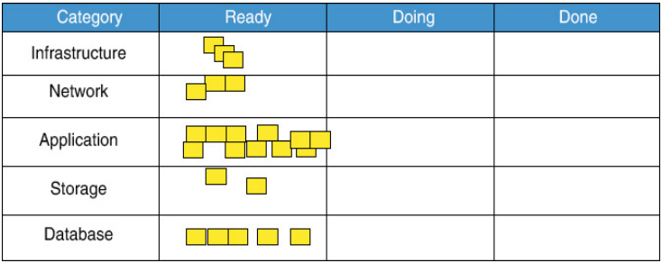
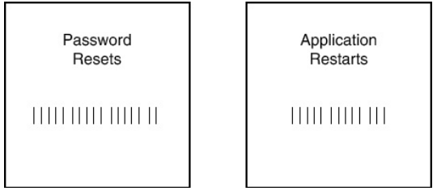
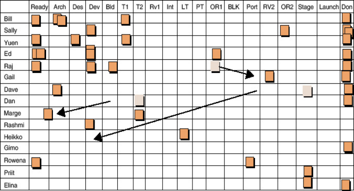
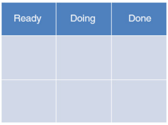
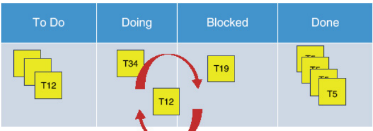

## Избегайте создания перегруженных плавательных дорожек

Частым искушением для команд является создание большого количества плавательных
дорожек. Одной из самых распространенных причин, почему команды это делают,
является разделение типов работ на отдельные категории. Например разделение
работы веб-сервера и бэкэнда или задач по базам данных и сетевым задачам. Это
особенно привлекательно для специалистов, работающих в узконаправленной области.
Иногда команды создают по одной плавательной дорожке на каждого члена команды.
Создание большого количества таких дорожек должно жестко подавляться, поскольку
они имеют тенденцию создавать эффект бутылочного горлышка и дисфункциональность
при очень небольшой прибыли. 

Рассмотрим следующий пример из реальной жизни, чтобы лучше понять проблему.
Предположим, вам необходимо доставить покупателю новое приложение или сервис,
которому требуются инфраструктурные услуги, такие как сеть, хранение данных и
настройка базы данных для его запуска. Многие будут искушены разделить каждую из
этих задач на доске, которая выглядит как на рисунке 12.17.

**Рисунок 12.17**\
Пример плавательной дорожки

Это расположение может показаться разумным, но есть две очевидные проблемы: 

- **Работа не распределена между колонками:** если каждой колонке привязаны
отдельные люди, те, кто занят работой с приложением, могут оказаться
подавленными, в то время как команда хранения данных просто сидит без дела. Даже
если команда хранения данных поможет команде по приложению, они должны оставлять
свою работу по приложению, когда что-то появляется в их плавательной дорожке?

- **Как вы справляетесь с зависимостями между плавательными дорожками?**Эта проблема гораздо
сложнее. Например, каждый может зависеть от завершения тикета инфраструктуры,
прежде чем начать работать. Могут быть еще более сложные потоки между
приложением, базой данных и хранилищем, где взаимозависимости перемещаются туда
и обратно между плавательными дорожками. Теряется не только все это, но и
ясность приоритетов и порядка тикетов в разных дорожках. Управление этим
становится кошмаром, а ценность доски самой по себе сильно ограничивается.

Если категории работ важны для вас, то вам может быть лучше начать с простой
традиционной доски с двумя дорожками и использовать цветные тикеты. Таким
образом, порядок выполнения и взаимозависимости могут быть размещены в той же
дорожке, что снижает путаницу. Кроме того, размещение всех в одной плавательной
дорожке снижает возможность "мы --- они" менталитета в команде.

Это не значит, что вам теперь никогда нельзя  добавлять дополнительную дорожку.
Хотя это редко имеет смысл, если вы все же добавляете дополнительную
плавательную дорожку, вы должны быть бдительны в мониторинге общего потока
работы по доске, чтобы увидеть, соответствует ли дорожка вашим целям без
введения дисфункции. Если вы добавляете дополнительную плавательную дорожку,
следует сопроводить это планом действий, направленных на изменение условий,
которые требуют добавления дорожки. Это может включать такие вещи, как
кросс-тренинг, автоматизация или просто устранение работы. Это дает вам гибкость
в будущем для удаления дорожки в случае возникновения проблем.

## Карточки задач

Последний элемент на доске: карточка задачи, обычно представляющая собой
бумажную карточку размером 3x5 или записку-стикер, на которой написана задача.
На карточке должна быть какая-то идентифицирующая информация, дата создания,
которая поможет отслеживать цикл времени, и, возможно, краткое описание задачи.
Цветовое кодирование карточек на основе типа задачи может быть очень полезным.
Категоризация карточек может выполняться по разным критериям, от конкретного
продукта или проекта до типов работы или навыков. Один из удачных вариантов
--- цветовое кодирование по типу задач: "проекты", "техническое
обслуживание", "производственные изменения" и "запросы".

Как упоминалось ранее, задачи должны быть разбиты на логические и разумные
фрагменты. Оптимально, эти отдельные задачи должны быть разбиты на такие,
которые могут быть выполнены не более чем за один день. Почему за один день?
Ритм работы в операционной среде быстрый и постоянно меняется. Задачи, которые
нельзя выполнить за день, часто прерываются и откладываются на более срочные,
что вызывает задержки в работе и оставляет незавершенную работу. Кроме того,
более крупные задачи часто застревают на доске, что уменьшает чувство прогресса,
вызывает фрустрацию и заставляет людей запрашивать статус об остановленных
задачах, что является очень распространенной и неприятной формой прерываний.

Вы вероятно обнаружите, что большинство операционных задач обычно достаточно
малы, чтобы каждый человек мог осуществлять выполнение нескольких задач в день.
Однако, если вы обнаружите, что это не так, то вам следует исследовать, почему.
Иногда вы можете обнаружить, что ваша среда стала настолько сложной и трудной
для работы, что она находится в опасности полностью стать неотзывчивой для
бизнеса. В таких условиях необходимо найти способы уменьшить сложность среды и
задач. Это может включать в себя сопутствующее техническое или организационное
трение, которое необходимо упростить или удалить.

Ещё один важный момент для обдумывания при создании задач --- это обеспечение
возможности извлечения уроков из выполненной работы, для чего необходимо
ответить на следующие вопросы:

- Почему нам нужно было это сделать?

- Есть ли способы улучшить или избавиться от этого? 

- Ясно ли, какая цель стоит за этим? 

- Раскрыла ли выполненная работа какую-то проблему, которую нам необходимо
дополнительно исследовать.

Вы не должны включать этот тип информации в задачу, если она не представляет
особой ценности. Она предназначена скорее для проведения ревью и улучшения
работы в дальнейшем.

## Предотвращение <<Темной Материи>>

Необходимость создания тикета для мелких задач по-прежнему является проблемой
при работе с доской задач. Большинство команд сталкиваются с слишком высоким
уровнем трения, даже если они каким-то образом преодолевают вызов убедиться в
ценности захвата такого мелкого элемента.

Чтобы уменьшить это трение, стоит рассмотреть создание простых досок учета, где
каждая завершенная (_Done_) задача становится простой отметкой на доске, как
показано на рисунке 12.18. Вы можете иметь одну доску для перезапуска, другую
для сброса паролей, третью для простых работ по уборке и т. д. Доска может быть
настолько простой, насколько обычный лист бумаги на стене рядом с доской задач,
к которому может добавляться каждый. Если вы используете программное
обеспечение, вы можете создать простую веб-страницу с кнопкой, которая мгновенно
создает и закрывает тикет такого конкретного типа задач.

**Рисунок 12.18**\
Примеры досок учёта

В конце недели отметки могут быть собраны и подсчитаны. Числа могут помочь при
дальнейшем исследовании или в составлении инвестиционных предложений. Тенденции
роста могут предоставить раннее предупреждение о грядущих проблемах. Самым
распространенным результатом является то, что команда и руководство поражены
масштабом и частотой, с которыми им приходится иметь дело с мелкими задачами.

> ## Проблемная доска задач

> Я часто встречаюсь с командами, для которых сложности начинаются уже на этапе
оформления доски задач. Обычно это смесь из нескольких проблем: Обычно это
вызвано тем же сочетанием проблем, что и при управлении рабочим процессом:
слишком много колонок, слишком много дорожек для плавания, плохое качество задач
или неудачное обозначение находящихся в разработке задач (WIP --- Work In
Progress). Однако одна команда запомнилась мне тем, что собрала все
перечисленные проблемы.

> Эта команда разработала, протестировала и эксплуатировала внутреннюю систему
программного обеспечения. Они решили создать доску задач, которая будет
отображать все действия, выполняемые командой от начала до конца разработки,
включая дизайн, тестирование, выпуск и поддержку операций. Даже несмотря на то,
что команда работала в одном офисе, они купили электронное устройство под видом
того, что это делает работу более эффективной. Мы были приглашены, когда
менеджеры стали беспокоиться о том, что <<канбан>> уже давно работает, но не
приносит видимых результатов.

> То, что я обнаружил, было поразительно. Хотя некоторые члены команды работали
над несколькими задачами, каждый человек, как правило, концентрировался на
определенном типе задач. Они решили создать доску, на которой у каждого члена
команды была бы своя полоса для плавания. Затем они создали много-много
столбцов, в том числе несколько для задач проектирования, один для разработки,
один для создания, один для каждого типа тестирования и несколько разных для
различных операционных задач. Задачи выталкивались на доску менеджером в
какую-нибудь произвольную колонку, где они затем перемещались в различных
направлениях между разными колонками. Нередко задача несколько раз возвращалась
в один и тот же столбец или застревала и неделями сидела на одном месте без
видимого прогресса. Работа перескакивала с одной полосы на другую всякий раз,
когда задачи нужно было передать другому человеку. Хотя команда пыталась
установить лимиты WIP по столбцам в каждой плавательной дорожке, в большинстве
плавательных дорожек было много WIP, разбросанных по нескольким столбцам. Хуже
всего было то, что все это происходило в темноте, создаваемой электронным
инструментом.

> Сжечь весь текущий порядок вещей и начать с начала было очень заманчивой идеей,
но сперва мне нужно было убедиться, что команда поняла, в какой бардак попала.
Сначала я нашел способ показать им их доску во всей ее красе --- 19 столбцов и
15 плавательных дорожек. Но эта задачао казалась нетривиальной, и программное
обеспечение было лишь одной из многих проблем, с которыми мы столкнулись.

> Рисунок 12.19 иллюстрирует доску задач, с которой мы познакомились, придя в
компанию --- она чрезмерно сложна и требует упрощения.

> 

> **Рисунок 12.19**\
В таком виде мы застали доску задач

> Рисунок 12.20 иллюстрирует доску задач после её упрощения.

> 

> **Рисунок 12.20**\
> Доска задач после упрощения

> Когда эта задача была решена, команда перешла к очень простой физической доске с
тремя колонками и двумя дорожками для плавания. Каждый раз, когда кто-то хотел
добавить колонку или дорожку для плавания, он должен был написать предложение, в
котором подробно описывались преимущества, которые это даст всей команде.
Преимущества должны были быть четкими и измеримыми. Были введены штрафы за любое
время, в течение которого работа циклически перемещалась туда-сюда между
дополнительной колонкой или дорожкой. Это предложение ставилось на голосование и
должно было получить единогласное одобрение. Затем оно рассматривалось и
голосовалось ежемесячно.

> Затем был создан более совершенный механизм для создания задач. Мы согласовали
максимальный рабочий размер, который позволял работе легче проходить через
совет, не создавая слишком больших накладных расходов. Мы также установили
правило, согласно которому вся работа должна начинаться с левой стороны доски, и
никакая задача не может быть перемещена в любой столбец кем-либо, кроме того,
кому она была поручена.

> Эти изменения дали немедленный результат. Весь объем и виды работы, которая
ложилась на команду, внезапно стали гораздо более очевидными. Команда стала
гораздо более ответственно относиться к поставленным перед ней задачам, и
появилось ощущение потока. Хотя команда время от времени играла с добавлением
колонок то тут, то там, они сохраняли доску очень простой, что в конечном итоге
помогло всем.

> ## Использование доски

> Принцип работы доски прост. Каждый член команды берет рабочий элемент,
находящийся в колонке "Готов", над которым он готов работать, и перемещает его в
колонку "Выполняю". Затем они выполняют задание. Когда задание выполнено, они
переносят его в колонку "Выполнено", отмечая на карточке задания дату, когда
работа была завершена. Затем они берут следующий элемент в колонке "Готов" и
начинают процесс заново.

> Все очень просто. Бывают случаи, когда поступают задания, которые сразу попадают
в колонку "Выполнено". Обычно это важные действия, которые либо ускоряются,
либо, что более вероятно, дополнительный связанный и непредвиденный пункт,
который человек, выполняющий задачу, заметил и хочет быстро записать и
позаботиться о нем. Хотя важные дела не должны долго ждать в колонке
"Готовность", важно, чтобы задачи не подталкивались к выполнению кем-то другим,
кроме того, кто выполняет задачу. Выдвинутые задачи могут стать причиной
прерываний и ненужного накопления незавершенной работы.

> Наблюдать за тем, как задачи перемещаются по доске --- удивительно приятно.
Видеть, как завершенная работа накапливается в колонке "Выполнено", дает
ощущение того, что работа выполняется, и позволяет команде получить визуальное
представление об объеме работы, которую они выполняют. Поскольку многие
оперативные задачи в конечном итоге оказываются небольшими, ожидайте, что это
будет внушительная куча. Доска также служит отличным инструментом связи с
общественностью, который помогает другим увидеть, что и в каком объеме
происходит. Это позволяет команде улучшить восприятие своей отзывчивости по
отношению к клиентам, а также выявить и разрядить моменты, когда команда
перегружена. Поскольку большая часть работы в сфере ИТ зачастую незаметна,
множество элементов, перемещающихся по доске, дают отличное визуальное
представление о том, что происходит на самом деле.

## Видение проблем

Работа неизбежно застревает в графе <<Выполнение>>. У этого могут быть самые
разные причины. Иногда работу блокирует внешняя зависимость. В других случаях
работа оказывается гораздо сложнее, чем кажется на первый взгляд, и занимает
гораздо больше времени, чем предполагалось. Людей также могут отвлекать другие
рабочие или жизненные дела, в результате чего выполнение задач задерживается.
Иногда мимо пролетает ускоренный пункт, из-за которого работу приходится на
время забросить. Сила доски в том, что все эти события должны создавать видимый
эффект, который может заметить каждый.

Я воспользовался несколькими советами, чтобы справиться с этими непредвиденными
обстоятельствами и сохранить движение доски. Первое - это отслеживание времени
цикла выполнения задачи. Часто это будет очевидно, когда одна или несколько
карточек застрянут в одном месте. Однако если у вас много работы, вы можете
пометить, когда рабочие элементы попадают в колонку <<Выполнено>>. Отмечая по
времени задачи, когда они перемещаются в колонку <<Выполнение” и когда они
перемещаются в столбец <<Выполнено>>, даже с точностью до даты, вы можете начать
выявлять те задачи, на выполнение которых ушло больше времени, чем обычно. в
рабочем процессе. Это может дать подсказки, которые помогут диагностировать и
решить проблемы, существующие в вашей среде. Вы также можете найти пользу в том,
чтобы отмечать, когда элементы впервые появляются в колонке <<Готовность>>, если
вы подозреваете, что определенные задачи находятся без выполнения слишком долго.

Еще одна распространенная проблема возникает из-за задач, которые блокируются.
Заблокированная работа происходит постоянно в рамках операций. Часто возникают
задачи с внешними зависимостями, включая ожидание сборки нового программного
обеспечения, загрузки данных или поставки оборудования поставщиком.
Заблокированная работа создает едва заметные, но важные сбои в потоке. Понимание
того, когда происходят блокировки, а также их причин, очень важно.
Заблокированную работу можно пометить ярким цветным маркером, например, неоновой
наклейкой <<Post-it>>, прикрепленной сверху для физической доски, или видимым
выделением для электронной доски. Это выделяет завалы, привлекая внимание,
которое может помочь в устранении препятствий.

У некоторых людей может возникнуть соблазн переместить задачу в колонку
<<Заблокировано>>, чтобы освободить колонку <<Выполнение>>. Они часто считают,
что это делает заблокированные задачи более очевидными и доступными для поиска.
Это может быть даже неизбежно при использовании электронного инструмента.

Проблема с дополнительным столбцом заключается в том, что он визуально усложняет
доску. Хотя с его помощью легко увидеть количество заблокированных задач, вы
можете упустить важные детали, касающиеся их состояния. Выполнены ли они
частично или еще не начаты? Заблокированные задачи могут легко оказаться как в
одной, так и в другой ситуации, как в предыдущем примере, касающемся работы с
приложениями, хранилищами и базами данных. Что еще хуже, вы неизбежно увидите,
как заблокированные задачи перемещаются между столбцами. Это нарушает общее
правило доски, согласно которому задачи редко должны перемещаться назад по
доске. Задачи, перемещающиеся вверх и вниз по доске в виде циклов может создать
ложное впечатление, что выполняется больше работы, чем на самом деле. чем на
самом деле. Это также может нарушить непрерывность задач, поскольку они
вписываются в общую картину деятельности. Это может усложнить поиск истинной
природы зависимостей цепочек зависимостей и неправильного расположения работ в
доске. Рисунок 12.21 иллюстрирует этот сценарий.

**Рисунок 12.21**\
Путаница в состоянии заблокированного столбца

Если вы используете инструмент, который в противном случае делает невозможным
добавление тега заблокированного состояния к задаче, столбец удержания должен
быть хорошо виден и тщательно отслеживаться. Это делается для того, чтобы все
были в курсе ситуации, чтобы предотвратить случайную потерю задач или их
приостановку, а также для быстрого получения помощи по устранению любых
препятствий.

## Ограничение незавершенного производства

Занятые команды, страдающие от реактивной работы, часто сталкиваются с большими
объемами частично выполненной работы. Доски рабочего процесса будут фиксировать
эти кучи, делая их видимыми для всех. В кругах бережливого производства это
называется незавершенным производством, или НЗП.

Как многие из нас знают, НЗП может накапливаться по целому ряду причин. Наиболее
распространенной причиной является переключение задач, вызванное поступлением
реактивной или плохо заданной работы. Часто команды прерываются в середине
процесса выполнения работы, в результате чего одна задача заменяется другой. В
других случаях члены команды пытаются работать в режиме многозадачности, когда
рабочие элементы передаются от одной команды к другой или когда они ждут
завершения работы. Если работа определена особенно плохо, кто-то может даже
обнаружить, что он начал выполнение задания, но вынужден отбросить его назад,
чтобы прояснить ситуацию или устранить множество зависимостей, прежде чем снова
взяться за него. 

Небольшие объемы НЗП неизбежны. Именно когда НЗП становится неконтролируемым,
это может нарушить ход работы в команде. Мало того, что работа простаивает
намного дольше, чем должна, сроки завершения НЗП начинают становиться все более
непредсказуемыми. По мере того как куча НЗП становится больше, видеть и
понимать, что происходит, становится все труднее. Все это может заставить
клиентов нервничать, вызывая эскалацию, которая в конечном итоге приводит к еще
большему количеству перерывов в работе, и все это создает ненужный
дополнительный стресс для команды.

Чтобы решить эту проблему, одна из тактик, которую используют многие команды,
заключается в установлении ограничений на объем работы, который может быть в
графе <<Прогресс>> или <<Выполнение>> в любой данный момент времени. Эти
ограничения НЗП используются для уменьшения количества переключений между
задачами и рабочих элементов, которые не выполняются частично. Некоторые команды
заходят так далеко, что ограничивают количество рабочих заданий одним на
человека, полностью исключая возможность многозадачности.

Важно следить за количеством НЗП. Вы даже можете обнаружить, что условия в вашей
среде могут благоприятствовать установлению ограничений как для защиты рабочего
процесса, так и для предотвращения переключения членов команды между несколькими
задачами. Это может помочь оградить команду от необходимости брать на себя
больше работы, чем они могут выполнить.

Однако чрезмерно строгие ограничения по НЗП создают некоторые существенные
опасности, особенно в очень динамичных условиях эксплуатации. Многие оперативные
задачи невелики по своей природе. Нередко кто-то справляется с десятками задач
продолжительностью от 5 до 10 минут, одновременно отслеживая выполнение
длительной задачи, не сталкиваясь при этом с какими-либо проблемами. Введение
строгих ограничений на НЗП без предварительного понимания динамики экосистемы
может привести к еще большему количеству нарушений, которых вы пытаетесь
избежать в первую очередь, будь то отсутствие учета выполняемой работы или
создание еще одного подразделения команды, на которое будут возложены
повседневные задачи. Другие проблемы, которые могут возникнуть при таких жестких
ограничениях НЗП, включают необходимость многократного изменения состояния
работы или разбивки ее на неоправданно мелкие фрагменты, и все это для того,
чтобы обойти ограничение.

Поддержание ситуационной осведомленности в операционной среде гораздо более
ценно, чем ограничение НЗП. Я склонен устанавливать ограничения на НЗП только
после того, как мы заметили развитие проблемных паттернов. Чаще всего я
обнаруживал, что их необходимо навязывать людям, склонным брать на себя гораздо
больше, чем они могут разумно осилить, вместо того чтобы обращаться за помощью
ко всей команде. В таких случаях такие инструменты могут защитить подражателей
супергероев, часто спасая команды и карьеры.

## Ограничения доски рабочих процессов

Доска является очень важным инструментом, однако ее одной недостаточно в быстро
меняющейся, динамичной среде. Для того, чтобы работа была эффективной и не
превращалась в хаос, необходимо использовать дополнительные инструменты,
структуры и механизмы для улучшения коллективного понимания происходящего. Кроме
того, следует обратить внимание на другие вопросы, такие как удержание команды
на протяжении всего жизненного цикла проекта и совершенствование совместной
работы, а также управление различиями между доставкой и операционной работой.
Игнорирование этих факторов приведет лишь к незначительным улучшениям.

## Управление доской

Первоочередной задачей является разработка системы поддержания доски и
обеспечения эффективности рабочего процесса. Хотя доска кажется простой, она все
же требует некоторого контроля, чтобы задачи правильно распределялись в рабочем
процессе и не застревали надолго, были соответствующего размера и ясности. Без
этого доски могут стать беспорядочными или неточно отражать происходящее.

Важно также регулярно просматривать доску целиком, чтобы убедиться, что
контекстная информация и тонкие, но важные модели деятельности фиксируются и
понимаются всей командой. Хотя менеджеры могут помочь в этом, предпочтительнее
передать эту обязанность в команду в качестве ротационной обязанности _Queue
Master_. Queue Master не только может выполнять эти задачи намного эффективнее,
чем менеджер, но и может помочь избежать возвращения рабочего процесса к модели
<<толкания>>, одновременно усиливая управленческую эскалацию для решения проблем.
Глава 13, "Мастер очереди", объясняет эту роль более подробно.

## Управление потоком и совершенствованием

Команде необходима естественная последовательность точек синхронизации для
устранения любых проблем согласования, учиться друг у друга и
совершенствоваться. Сама по себе доска рабочих процессов не делает этого сама по
себе. Она должна быть дополнена регулярным циклом точек синхронизации,
предназначенных для этой цели. Без этого члены команды неизбежно начинают
дрейфовать, что приводит к конфликтам, путанице и переработке.

Другая связанная с этим проблема заключается в том, что доски рабочих процессов
сосредоточены на потоке, поэтому непонятно, как деятельность, связанная с
проектом, может вписаться в повседневный поток. Хотя такие элементы можно внести
в доски, как любой другой набор задач, планирование и управление зависимостями
не совсем просты. Это особенно актуально для больших команд, которые
одновременно работают с несколькими проектами и релизами.

К счастью, есть несколько эффективных способов преодоления каждого из этих
ограничений, которые я отработал за многие годы экспериментов. В первую очередь
мы рассмотрим сам цикл. Затем мы рассмотрим различные роли, которые помогают все
это объединить.

## Резюме

Лучший способ управления работой, протекающей в команде доставки и через нее ---
это оптимизация для совместного понимания ситуации и обучения команды. И лучший
способ сделать это --- использовать визуальные доски рабочих процессов, которые
показывают работу, проходящую через систему. Это позволяет команде увидеть
тенденции, которые могут создать <<узкие места>> или перегрузить команду.
Остерегайтесь методов управления работой, которые сосредоточены на общих
процессах и <<лучшей практике>>, поскольку они имеют тенденцию создавать
отклонения, которые скрывают информацию, ограничивают обучение и вызывают
противоречия в процессе, что побуждает людей работать вне процесса для
достижения своих целей. Мелкие задачи, или <<темная материя>>, также опасны. Это
задачи, выполнение которых требует меньше усилий, чем создание билета для их
отслеживания. Стремление не фиксировать задачу может скрыть проблемы и
требования, которые потребляют ресурсы команды таким образом, что их трудно
исправить.

Методы организации рабочего процесса, такие как канбан, могут помочь улучшить
видимость и осведомленность. Это также отличный способ выявить и устранить
<<узкие места>> и единые точки отказа, а также учиться и совершенствоваться.
