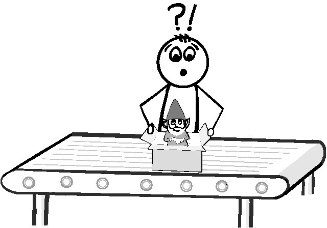
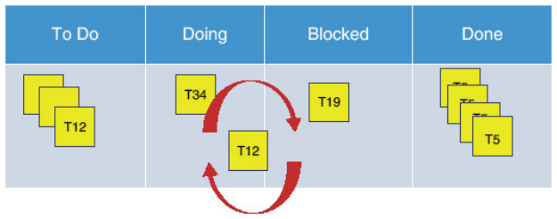

> _Научись видеть. Осознай, что все взаимосвязано._
>
> --- Леонардо Да Винчи

Непредсказуемость рабочей нагрузки --- одна из самых неприятных вещей, с
которыми сталкиваются сервисные команды. Сбои в обслуживании часто возникают из
ниоткуда, заставляя членов команды бросать все, чтобы отреагировать. Это может
привести к появлению новых проблем, которые неизбежно приведут к еще большему
количеству незапланированных работ, и все они должны быть расставлены по
приоритетам в сравнении с текущими обязательствами. Любая работа, которая в
результате задерживается, предсказуемо приводит к разочарованию заказчика и
разочарованию команды исполнителей. Кто бы не стал стесняться обязательств,
столкнувшись с этим?

ИТ-команды с ответными обязательствами по предоставлению услуг поступают так,
как в таких обстоятельствах поступил бы любой здравомыслящий человек: берут на
себя как можно меньше жестких обязательств, оставляют достаточно слабины, чтобы
учесть непредвиденные обстоятельства, и делают запросы на изменения как можно
более простыми. Обычно это приводит к такому поведению, как сокращение сроков
выполнения проектных обязательств и использование процессов управления для
минимизации частоты и масштабов любых изменений, особенно тех, которые могут
привести к сбоям в обслуживании, что может экспоненциально увеличить объем
незапланированной работы. 

К сожалению, в условиях растущих требований клиентов, которые заставляют
разработчиков выпускать изменения в сервисах все быстрее, эти стратегии больше
не работают. Вместо этого командам необходимо найти лучшие способы понять
основные причины, которые приводят к запросам на изменения и незапланированной
работе. Им также необходимо узнать, где существуют потенциальные опасности и
точки трения, которые могут привести к изменчивости усилий и графика, а также к
переработке. Один из лучших способов сделать это --- посмотреть на сам процесс
работы.

В этой главе мы рассмотрим лучшие способы структурирования рабочего процесса
вашей команды, чтобы лучше понять, какая работа протекает внутри вашей
экосистемы, как и куда она течет, и как лучше структурировать эти процессы,
чтобы ваша команда могла лучше позиционироваться для предоставления
производственных услуг, отвечающих потребностям клиента.

## Рабочий процесс и ситуационная осведомленность

**Рисунок 12.1** Доски рабочих процессов --- это только часть пути к
ситуационной осведомленности.

Рабочий предмет --- это не просто что-то, что кто-то должен выполнить. Он
символизирует предполагаемую потребность, которая должна быть удовлетворена для
достижения одного или нескольких целевых результатов клиента. Понимание того,
как создается и определяется работа, а также маршрута, по которому она движется
в организации, может многое рассказать о возможностях команды организации по
выполнению работы и ее общем состоянии. Это включает в себя каждую из крупных
тем этой книги, таких как:

- Насколько хорошо понятны целевые результаты
- Уровень ситуационной осведомленности для определения всего, начиная от того,
  где существуют какие-либо разрывы между текущими условиями и целевым
  результатом, до уровня и источников риска в любых предлагаемых действиях,
  которые могут их устранить.
- Где возникает проблема при доставке, насколько она актуальна и насколько
  хорошо понятны ее причины.
- Как и насколько хорошо улавливаются и используются любые возможности обучения.

Существует ряд полезных закономерностей, которые могут раскрыть гораздо больше
информации о глубинной динамике каждой из этих тем и о том, как они влияют на
общую динамику команды. Некоторые из наиболее очевидных показателей включают
соотношение проактивной и реактивной работы, количество людей и команд, через
которые должен пройти рабочий элемент, чтобы достичь завершения, и даже то, кто
может объявить элемент <<выполненным>>. Некоторые могут даже исследовать
распространенные формы дисфункции, с которыми сталкиваются команды, такие как
количество циклов доработки, через которые проходит рабочий элемент, количество
и типы незапланированной работы, с которой команда сталкивается в течение
данного цикла, и неточности в оценке работы.

Однако, хотя многие ИТ-организации могут знать о подобных проблемах в своей
экосистеме, лишь немногие из них стремятся провести достаточно глубокое
исследование, чтобы выявить основные причины. Большинство в лучшем случае введут
поверхностные изменения, которые устранят некоторые симптомы.

Одна из причин такого сбоя кроется в том, как большинство ИТ-организаций думают
и подходят к проблеме управления работой. Давайте вкратце рассмотрим две
наиболее распространенные модели, чтобы понять, что происходит и почему.

## Управление работой через процесс

 **Рисунок 12.2**  <<Почему процесс выпуска требует
сбора садовых гномов?>>.

Пожалуй, наиболее распространенным подходом для организаций к управлению
работой, которая поступает в команды, является использование формализованных
процессов. Часто они соответствуют какой-либо официальной методологии управления
проектами или ИТ-услугами (ITSM), которая предоставляет большое количество
вспомогательных материалов для широкого спектра процессов, а также
профессиональные сообщества, которые могут помочь с деталями реализации.

Хотя готовые процессы и вспомогательные материалы этих методологий хороши и
удобны, они имеют ряд ограничений. Например, они, как правило, больше внимания
уделяют процессам и тому, как им следовать, чем тому, насколько хорошо работа,
выполняемая в рамках этих процессов, помогает клиентам достичь целевых
результатов. Я регулярно встречаю команды с детально проработанными процессами
управления изменениями, которые мало что делают для эффективного управления и
отслеживания изменений, или с сильно структурированными процессами управления
инцидентами, которые, кажется, мало что делают для предотвращения будущих
инцидентов или улучшения их обработки. Я вижу, что эти процессы подкреплены
сложными инструментами тикетинга с подробными рабочими процессами, которые
фиксируют и перемещают работу через команду, создавая при этом обширные
управленческие отчеты. И все же каждый раз я обнаруживаю, что практически
невозможно копнуть достаточно глубоко, чтобы увидеть и понять любые полезные
закономерности рабочего процесса и их причины.

Традиционное управление процессами --- не единственное место, которое страдает
от такой ориентации на процесс. Все чаще я вижу Agile-команды, которые проводят
стенд-апы, не координирующие работу, и ретроспективы, на которых ничего не
узнается и не улучшается.

Все это усугубляется тем, что когда возникают реальные проблемы, решением при
подходе, ориентированном на процесс, является более жесткое следование процессу.
Поэтому в результате инцидента, вызванного изменением, обычно больше внимания
уделяется усилению контроля и соблюдению процесса изменения и меньше ---
динамике, лежащей в основе инцидента.

Такой образ мышления согласуется с традиционным предположением, что все
экосистемы являются упорядоченными системами, где причина и следствие всегда
ясны и наблюдаемы. В таком мире любая неудача вызвана не нарушением
осведомленности о ситуации, а плохим исполнением, основанным на недостаточном
соответствии процессу. К сожалению, не все экосистемы являются упорядоченными
системами. Причины этого подробно обсуждаются в главе 5, <<Риск>>.

## Органическое управление работой

**Рисунок 12.3**  <<Я управляю работой так же органично, как эта сервисная
архитектура!>>.

Другой все более распространенной моделью является другая крайность и отказ от
навязывания каких-либо процессов. В этой модели считается, что команда находится
в наилучшем положении, имея опыт из первых рук, чтобы структурировать свою
работу. Если предоставить им возможность самоорганизации любым способом, который
позволит им выполнить работу, они неизбежно найдут наилучшую структуру для
данной ситуации.

Для тех, кто привык к управлению, основанному на методах, такая модель звучит
как страшный рецепт неудачи. Основная проблема такого подхода заключается не в
отсутствии процесса, а в том, что командам очень легко забыть о наличии четкого
механизма обратной связи для обеспечения потока информации и межфункциональной
согласованности.

Те, кто обычно идут по этому пути, начинают в небольшой среде. Процесс часто
может мешать выполнению работы. Поскольку контекст и ситуационная
осведомленность находятся в пределах легкой досягаемости для каждого, этот
подход может работать довольно хорошо для начала, при условии правильных
межличностных отношений.

Однако по мере увеличения размеров и динамичности среды становится все сложнее
отслеживать все аспекты всех действий в экосистеме. В результате ухудшается
контекст и ситуационная осведомленность.

Без активного механизма, обеспечивающего межфункциональное согласование, члены
команды часто начинают формировать взгляд изнутри, сосредоточенный на той части
экосистемы, с которой они наиболее хорошо знакомы. Такая близорукость
фрагментирует контекст и снижает эффективность принятия решений. При меньшем
количестве очевидных возможностей для обмена знаниями начинают формироваться
<<острова знаний>>, а рабочая нагрузка в команде становится неравномерной.

## Тирания тёмной материи

Неправильный фокус при управлении работой --- не единственный способ нарушения
ситуационной осведомленности. На самом деле, некоторые из наиболее
разрушительных способов снижения эффективности принятия решений и выполнения
работы часто возникают из-за тех, казалось бы, безобидных моделей, которые так
часто игнорируются, создавая то, что мне нравится называть <<темной материей>>.

**Рисунок 12.4** По мере роста темной материи растет и ее опасность.

Темная материя возникает из-за двух типов общих условий, которые возникают в
командах, отвечающих за деятельность по техническому обслуживанию. Первое ---
это те задачи, для выполнения которых лишь небольшое количество людей имеет
достаточный контекст и опыт. Эти задачи могут быть относительно простыми и даже
не требовать особых навыков. Однако они могут оказаться невыполнимыми без
достаточного контекста.

Вторая группа условий еще более мерзкая. Это различные виды работ, которые никто
не удосуживается фиксировать и отслеживать. Эти задачи могут быть разовыми
индивидуальными событиями или чем-то неожиданно возникающим во время выполнения
другой, более крупной деятельности. Однако наиболее распространенными являются
те действия, которые кажутся настолько мелкими и бездумными, что их вряд ли
стоит записывать, не говоря уже об отслеживании. К ним относятся такие вещи, как
перезапуск служб, сброс паролей, смена журналов, небольшие изменения
конфигурации, а также различные действия по созданию и очистке кода и среды,
необходимые для поддержания работы. Если заполнение тикета занимает больше
времени, чем выполнение фактической работы, заполнение тикета может показаться
бессмысленным, особенно когда команда занята.

Однако эти малоизвестные или редко фиксируемые задачи привносят слой темной
материи, которая разъедает ситуационную осведомленность. Эта маленькая или
неинтересная задача может быть ключом к разгадке важного проблемного паттерна
или потребности в некотором улучшении, которая еще не до конца понята. Будучи
скрытой, она не дает возможности определить, что вызывает потребность в этой
деятельности, не говоря уже о пользе от ее выполнения. Как таковой, он может
скрывать опасные проблемы и узкие места. При отсутствии записей об источнике или
количестве этих задач качество и доступность информации для расследования
незаметно ухудшается с течением времени.

Темная материя истощает возможности команды. Даже если эти задачи по отдельности
невелики, они требуют времени на выполнение и могут мешать другой, более сложной
работе. Как побочный продукт, эти отвлекающие факторы часто приводят к
переключению задач, что может привести к ошибкам, случайной потере контекста и к
тому, что члены команды попадают в ловушку одновременного выполнения слишком
большого количества дел.

Темная материя неизбежно таится в большинстве сред обслуживания, особенно в тех,
где высок уровень трения при регистрации, например, в организациях с жесткими
процессами или сложными в использовании системами продажи билетов. Чем сложнее
система, тем больше вероятность того, что люди будут работать в обход нее. Это
порождает порочный круг, который способствует созданию все большего количества
темной материи, создавая при этом фасад захвата и контроля.

То же самое справедливо и для команд, в которых задействовано несколько ролей,
например, разработка и эксплуатация. Легко упустить важность фиксации задачи и
ее контекста при жонглировании работой, особенно если это одна задача из
большого ряда, и ее важность может быть неочевидна из-за смещения контекста или
личной точки зрения.

Еще одним потенциальным источником темной материи являются сами инструменты.
Поскольку все большее число задач по доставке и операциям оказывается
погребенным в стопках инструментов, важная информация может быть упущена. Это
особенно верно в тех случаях, когда система инструментов собрана воедино и мало
времени уделяется разработке эффективного способа фиксации и отчетности о том,
что делают инструменты, в значимой контекстной форме.

## Учимся видеть разъединения в действии

Даже если вы убеждены, что вы и ваша команда хорошо контролируете любую проблему
Темной материи, насколько легко вам проверить уровень общей ситуационной
осведомленности в вашем окружении? Изменилось бы что-нибудь, если бы вы вдруг
получили возможность видеть все, что происходит?

Давайте на мгновение попытаемся представить себе, что обычно происходит с
типичной ИТ-командой. Даже если у вас сложные процессы и много уровней
поддержки, в конечном итоге работа попадает в команду примерно так, как показано
на рисунке 12.5.

 

**Рисунок 12.5** Счастливая команда доставки в действии

Когда все хорошо, работа падает непрерывным потоком из облака спроса. Задания
могут поступать в виде назначенного билета, внезапно обнаруженной проблемы,
проходящего мимо запроса или системного оповещения. Как и большинство команд
доставки, они имеют лишь ограниченный охват, чтобы пробиться сквозь облако
спроса, и то только в том случае, если у них есть на это время и одобрение
руководства. Срочность запроса и реальная возможность быть прерванным другим,
более срочным делом побуждают их выполнить задачу как можно быстрее, иногда в
одиночку, а иногда в сотрудничестве с другими.

 

**Рисунок 12.6** Неожиданное прерывание

Неизбежно случаются ситуации, когда что-то выводит из строя одного из членов
команды. У каждого из нас в тот или иной момент случалось нечто подобное. Иногда
это особенно сложная или плохо сформулированная задача. В других случаях это
может быть один из тех <<бумерангов>> доработки, которые перебрасываются от
одного члена команды к другому, или задача, которая намного больше, чем
предполагалось изначально. Независимо от причины, теперь есть рабочий элемент,
который отнимает время и усилия по крайней мере одного человека и который никак
не может исчезнуть. Это похоже на то, как если бы на вас внезапно упал ящик и не
дал вам двигаться.

На складе часто люди спешат вам на помощь. К сожалению, в сфере ИТ подобное
редко бывает так заметно. Даже если кто-то случайно заметит, во многих случаях
попавший в ловушку член команды будет сигнализировать, что с ним все в порядке.
Как ИТ-специалисты, мы склонны говорить, что это просто плохой день, и мы просто
переживем его, как и все остальные. Мы даже обманываем себя, часто ерзая под
ящиком с мыслью: <<Я справлюсь!>>. На рисунке 12.7 показано, как проблемы могут
выйти из-под контроля.

**Рисунок 12.7** Начинается хаос

Проблема такого подхода, как мы все знаем, заключается в том, что работа
продолжает поступать. Если нам особенно не повезет, то она начнет накапливаться
у зажатого члена команды. Иногда это вызвано отсутствием видимости проблемы или
задачами, которые имеет смысл выполнять только этому человеку. Условия
продолжают потихоньку ухудшаться, пока человек остается зажатым.

С точки зрения руководства может показаться, что проблемы нет. Остальные члены
команды могут продолжать выполнять работу достаточно быстро, даже если
значительная часть из них случайно застрянет. Проблема возникает, когда
появляется более заметное ограничение, например, крупный инцидент или релиз,
который полностью занимает полосу пропускания одного или нескольких членов
команды. Если команде особенно не повезло, то событие может быть более
значительным, например, несчастный случай, болезнь, отпуск или даже уход
сотрудника из компании.

Если член команды покидает команду, все нераспространенные знания могут быть
безвозвратно утеряны. Это особенно опасно, если они спокойно выполняли задачи
темной материи, которые не были уловлены или поняты другими. Это может оставить
в команде зияющую дыру, в которой работа будет потеряна или проигнорирована.
Многие часто называют это <<нулевым количеством грузовиков>>.

**Рисунок 12.8** Хаос выходит из-под контроля

Работа все еще продолжает поступать. Работа ныне ушедшего работника давно уже не
выполняется. Когда сроки упущены, зависящие от них виды деятельности начинают
вызывать волнообразные эффекты, которые могут расстроить клиентов настолько, что
они начнут жаловаться. По мере того, как они распространяются по управленческой
цепочке, менеджер может решить оторвать кого-то еще от работы, чтобы ускорить
выполнение просроченной работы. Это, конечно же, еще больше снижает
производительность, вызывая дальнейшие сбои в работе и у оставшихся работников,
которые будут вынуждены метаться, жонглируя задачами, чтобы не отстать.

Работа, которую молча выполнял ушедший сотрудник, начнет накапливаться. Любой,
кто оказывался в подобной ситуации, знает, что в конечном итоге эти работы
пойдут по одному из двух направлений. Если команде повезет, работа окажется тем,
что умеют делать другие, и кто-то тихо попросит другого человека непосредственно
выполнить ее. Другой путь --- это путь, который ведет в черную дыру.

Будучи фактически невидимыми, рабочие элементы, попавшие в черную дыру, будут
гноиться, тихо разрушая операционную службу. Неизбежный сбой или эскалация
приведут к их обнаружению, что приведет к ускорению работы. Те элементы работы,
которые кому-то удается предотвратить от падения в пропасть, перебрасываются на
оставшихся членов команды. Без достаточного понимания объема работы и ее
ценности мало, если вообще возможно, изменить ожидания. Возросшая нагрузка
приводит к еще большему стрессу, длинным ночам, героическим поступкам,
неизбежным ошибкам и разочарованным клиентам. Если спрос не снизится или
мощность не увеличится значительно, моральный дух будет ухудшаться по мере того,
как команда будет постоянно перегружена проблемами.

Хотя графика может быть забавной, реальность не такова. Такие вещи происходят
постоянно, даже при самых обычных обстоятельствах. К сожалению, работа в сфере
ИТ по своей природе редко бывает такой наглядной. Менеджеры и члены команды
редко могут эффективно наблюдать динамику на местах, не говоря уже о том, чтобы
использовать такое понимание для лучшего управления работой, улучшения
расстановки приоритетов или эффективного инвестирования.

## Разрешение разногласий путем создания контекста

**Рисунок 12.9** Люси решает проблему разрыва связи, чтобы прояснить ситуацию.

Если ситуационная осведомленность так важна, как мы можем найти лучшие способы
захвата, визуализации и понимания того, что происходит в нашем рабочем процессе?

Первым шагом является изучение того, как контекстная информация поступает в вашу
организацию. Эффективный поток информации необходим для обеспечения правильного
уровня контекста для поддержания ситуационной осведомленности, необходимой для
принятия точных решений, необходимых для эффективного выполнения работы.

Начать стоит с того, как быстро и точно информация перемещается между людьми и
командами, которые работают и зависят друг от друга на протяжении всего
жизненного цикла поставки. Распространенные способы, при которых потоки
информации замедляются или теряют контекст, включают необходимость привлечения
менеджеров или отдельных людей для общения и согласования команд и работы.
Другой случай возникает, когда команды используют различные средства
коммуникации. Например, особую опасность могут представлять команды,
использующие различные системы тикетинга или принципиально разные потоки
тикетинга, разделяющие связанные виды деятельности на отдельные блоки, которые
не имеют четкой взаимосвязи и не доступны для других команд на протяжении всего
жизненного цикла.

Плохая коммуникация между людьми или командами, которые практически не имеют
регулярного личного неформального взаимодействия, может сделать построение и
поддержание какого-либо общего контекста особенно сложным. Каждый, кто работал
удаленно во время пандемии COVID-19, вероятно, сталкивался с некоторыми из этих
проблем. Большое количество случайного общения, будь то в коридорах или за
обедом, может помочь людям не только обмениваться информацией, но и незаметно
улавливать важный контекст, наблюдая за тем, как другой человек реагирует на
различные ситуации. По мере роста знакомства команды начинают <<запутываться>> и
создавать подробный общий контекст, который позволяет людям эффективно работать
друг с другом при низких коммуникационных затратах.

Методы коммуникации также важны. Они могут принимать различные формы, от
электронных писем и устных бесед до билетов отслеживания вопросов, слайдов,
документов и видео. Функция каждого метода коммуникации заключается в получении
и передаче информации и контекста. У каждого метода есть свои преимущества и
недостатки. Сложность заключается в том, чтобы не только понять плюсы и минусы
каждого из них, но и найти способ улучшить поток информации, отдавая
предпочтение тем методам, недостатки которых можно свести к минимуму.

Например, чтобы избежать эфемерного и не поддающегося отслеживанию характера
телеконференций, команды часто переносят устное общение в чаты, такие как IRC,
Slack или Teams, где не только каждый может уловить, что происходит, но и
общение может быть легко записано и сохранено. Аналогичным образом, электронная
почта страдает от того, что ее легко потерять, неправильно истолковать или
непреднамеренно опустить людей. Такая потеря контекста может привести к путанице
или несогласованности. Более эффективные команды предпочитают использовать
комбинацию взаимосвязанных чатов, вики и тикетов. Даже такие вещи, как
презентации и встречи, можно записывать и выкладывать в интернет для
использования в будущем. 

Существует также ряд способов связывания и перекрестного сопоставления
информации между средствами коммуникации для сохранения контекста. Например,
чат-боты могут собирать и передавать информацию о состоянии сборки, тестирования
и производства, а также собирать и публиковать беседы в вики. Привязка
идентификаторов отслеживания проблем к регистрациям в репозитории кода, сборкам,
тестовым запускам и развертываниям облегчает перекрестное сопоставление любой
активности с соответствующими артефактами и событиями на протяжении всего
жизненного цикла активности.

Потратив время на внедрение правильных методов для обеспечения потока информации
и контекста, можно предотвратить большую путаницу не только между командами, но
и между новыми, удаленными и находящимися в отпуске сотрудниками и их коллегами.

## Визуализация потока

Как уже говорилось ранее, ИТ-индустрия вряд ли одинока в решении проблемы
успешной координации деятельности группы людей в динамично меняющейся среде.
Производители десятилетиями боролись с проблемой согласования людей, сырья,
поставщиков и машин. Они сталкиваются со всеми проблемами, начиная со сломанных
машин, дефектов конструкции, узких мест в ресурсах, проблем с поставщиками и
заканчивая требованиями клиентов к индивидуальным решениям. Управление сверху
вниз через командно-административные процессы в производстве в наши дни может
разрушить бизнес из-за большого количества дефектов и создания большого
количества брака.

Чтобы преодолеть эти трудности, бережливые производители разработали систему
визуальных сигналов в рамках производственного процесса, позволяющую работникам
быстро и без посторонней помощи обмениваться информацией о ситуации. Инструменты
и детали проектируются таким образом, чтобы было понятно, когда их неправильно
собирают, а посты, инструментальные доски, станки и тележки организуются таким
образом, чтобы не только облегчить работнику выполнение работы, но и сделать
очевидным, когда что-то не совсем правильно. Бережливые производители также
придумали очень полезную технику логистического контроля, позволяющую обеспечить
наличие нужного количества деталей в нужном месте в нужное время. Она называется
канбан.

Канбан в переводе с японского означает <<вывеска>>. Подобно карточкам <<заполни
меня>>. которые вы могли видеть на задней стенке витрин в супермаркетах, он
служит сигналом для уведомления вышестоящего поставщика, когда дополнительный
материал или работа готовы быть доставлены, или <<подтянуты>>, к рабочему месту.
Сигналом может быть что угодно --- от физической карточки, которая помещается в
материал, поставляемый на рабочую станцию, до специально окрашенного контейнера.
Он размещается в точке, которая дает поставщику достаточно времени для
пополнения запасов на рабочем месте до того, как все оставшиеся материалы будут
исчерпаны.

Лучший способ представить себе канбан --- это цепочка, которую тянут от конца
линии, как показано на рисунке 12.10. В производстве это обычно то место, где
находится клиент, поскольку именно клиент создает спрос.

**Рисунок 12.10** Простая цепочка рабочего процесса

Карта запускает станцию, расположенную выше по течению, для начала работы. По
мере исчерпания запасов деталей появляется карточка, сигнализирующая о
необходимости пополнения запасов, которая отправляется поставщику выше по
течению для создания и отправки следующей партии деталей, и так далее, как
показано на рисунке 12.11.

**Рисунок 12.11** Продвижение по цепочке

Каждая станция держит в запасе ровно столько ресурсов, чтобы удовлетворить спрос
и дать достаточно времени для реагирования станции, от которой зависит поставка.

Хотя это звучит обманчиво просто, при использовании в сочетании с Andon (сигнал,
используемый для оповещения о том, что на рабочем месте что-то не в порядке) эта
техника обеспечивает довольно сложную форму телеметрии. Это значительно улучшает
поток связи, необходимый для обеспечения достаточно эффективной совместной
ситуационной осведомленности для поддержания устойчивого потока во всем
производственном процессе. При использовании этой техники ни одна станция не
начинает работу до тех пор, пока ее ближайший клиент не предъявит требование.
Карта или сигнальный запрос сообщает поставщику, что именно нужно нижестоящему
<<клиенту>>, и приурочивается к тому моменту, когда это требуется клиенту. Это
означает, что размещение карты в поставке должно позволять определить время
цикла для каждого этапа, указывая не только на пропускную способность, но и на
потенциальные узкие места в цепочке поставок.

Разновидность этой техники была адаптирована для разработки программного
обеспечения Дэвидом Андерсоном. В технике Андерсона используются карточки для
представления элементов работы и простая доска, на которой размещаются карточки
для обозначения состояния каждого элемента работы. Простота и наглядность этого
метода делают его очень эффективным способом увидеть состояние и течение работы
по мере ее продвижения к завершению. Это помогает как работникам, так и
заинтересованным лицам увидеть, что происходит на самом деле. Поскольку на
начальном этапе не требуется вносить значительные изменения в то, как люди
работают, существует меньше потенциальных барьеров, которые могут помешать
внедрению.

Эти качества привели к тому, что организации, работающие в режиме прерывания и
ориентированные на операционную деятельность, все чаще используют доски канбан
для улучшения управления рабочими процессами по выполнению задач и оказанию
услуг. Эта техника доказала свою успешность в самых разных отраслях.

К сожалению, поскольку техника настолько проста, многие пытаются создать
неоправданно сложные потоки и правила, и в процессе теряют представление о ее
реальной визуальной цели. Чтобы помочь вам не оказаться в подобной ситуации, в
следующем разделе приведены некоторые важные основы, которые необходимо
учитывать при использовании доски рабочих процессов в стиле канбан.

## Основы управления рабочими процессами

Самое важное правило для создания успешной доски рабочих процессов в стиле
канбан --- это сохранять все, что касается доски, настолько простым, насколько
это возможно. Сложность, будь то создание сложных колонок состояний и
плавательных дорожек или инвестирование в то, что вы считаете лучшим программным
инструментом рабочего процесса, прежде чем действительно понять, как протекает
работа, только добавит ненужный шум, который мешает установить ситуационную
осведомленность, которую вы пытаетесь достичь.

Для начала необходимо следующее:

- Доска, стена или большой лист белой мясной бумаги, на котором вы нарисуете или
  разметите линии ручкой или цветной лентой для использования в качестве доски
- Карточки или записки Post-it Notes/липкие записки для наклеивания на доску

Размер доски должен быть достаточно большим, чтобы на ней можно было разместить
все карточки так, чтобы все они были видны. Если ваша команда не очень большая
или в каждый момент времени в ней выполняются многие сотни задач, для начала
достаточно будет чего-то размером примерно пару метров в длину и метр в ширину.
Вы можете легко изменить размер по мере необходимости, в этом и заключается
прелесть начала работы с простой физической доски. На рисунке 12.12 показана
простая стартовая доска.

**Рисунок 12.12** Стартовая канбан доска

## Столбцы состояний

Доски рабочего процесса обычно имеют ряд столбцов, как показано на рисунке
12.13. Каждый столбец представляет текущее состояние задачи.

**Рисунок 12.13** Столбцы состояний

Правило для колонок --- начинать с как можно меньшего их количества. Люди
склонны придумывать всевозможные угловые случаи, когда дополнительные колонки
могут быть полезны. Помните, что вначале сложность --- ваш враг. Она может
запутать шаблоны, в результате чего вы потеряете представление о том, что
происходит на самом деле. Дополнительные колонки следует включать только в том
случае, если вы можете показать, что они будут регулярно использоваться
большинством, если не всеми, людьми, использующими доску, и что они
демонстрируют значительную ощутимую ценность по сравнению с дополнительными
затратами на усложнение доски.

Большинство досок начинаются с колонок <<Ожидает>>, <<Выполняется>> и
<<Выполнено>>, расположенных слева направо. Эта простая схема подходит для
подавляющего большинства случаев, с небольшими вариациями. В столбце <<Ожидает>>
находятся элементы, ожидающие своей очереди, в столбце <<Выполняется>> ---
текущая работа, а в столбце <<Выполнено>> --- завершенные элементы.

Доски, включающие полный цикл поставки, работают аналогичным образом. У них есть
колонка Doing, названная для каждой фазы. Основные различия касаются столбцов
<<Готов>> и <<Выполнено>>. В конце есть только один столбец <<Выполнено>>.
Работа, завершенная в середине доски, просто переходит из состояния Doing в
состояние Ready следующей необходимой фазы, например, Dev в Ready for Test.
Рисунок 12.14 демонстрирует эту доску рабочего процесса (где Dev, Test и Deploy
являются столбцами Doing).

**Рисунок 12.14** Доска объявлений с полным циклом поставки

## State Columns for Operations

Операционная работа часто включает в себя несколько этапов, которые
принципиально отличаются от обычной работы по поставке программного обеспечения
и, следовательно, влияют на компоновку доски. Доски, специфичные для
операционной деятельности, иногда нуждаются в паре дополнений. Первое --- это
колонка Prequalified, расположенная в самом левом углу перед Ready. Колонка
Prequalified предназначена для решения многих распространенных проблем с
качеством, связанных с задачами, которые ставят перед командами с операционной
ответственностью. Например, задачи, в которых говорится что-то вроде
<<переместить центр обработки данных>>, слишком велики и непрозрачны, чтобы быть
полезными. Такие пункты должны быть разбиты на более мелкие, более управляемые
фрагменты, прежде чем они попадут в колонку <<Готовность>>. Аналогично, задача с
надписью <<починить сервис>> не говорит вам о том, что именно не так, срочно ли
это, или даже является ли это производственной проблемой. Колонка Prequalified
не только помогает не допускать в Ready мусор, который может повредить потоку,
но и дает возможность разделить работу на разумные по размеру части, собирая при
этом достаточно информации, чтобы понять ее приоритет и что нужно сделать.

Наличие колонки Prequalified также может служить полезным показателем того,
насколько серьезны проблемы с качеством ваших задач. Большое количество
отклоненных задач, которые попадают в этот столбец, или задачи, на решение
которых уходят недели, могут означать, что на самом верху есть проблемы, которые
необходимо изучить. По мере того, как вам удастся устранить их первопричины, вы
можете обнаружить, что со временем сможете вывести эту колонку из употребления.
На рисунке 12.15 показана доска рабочих процессов с колонкой <<Состояние
готовности>>.

**Рисунок 12.15** Доска оперативного управления рабочими процессами

Как показано на рисунке 12.15, вторым потенциальным дополнением является колонка
Scheduled. Он используется для работ, таких как события технического
обслуживания, которые требуют заранее определенной даты начала для координации
ресурсов и согласования с требованиями бизнеса и изменений. Колонка
<<Запланировано>> обычно содержит основной элемент с флагом даты и/или времени,
а также все связанные с ним подзадачи, которые должны быть выполнены в это
время. Хорошим правилом для этого столбца является то, что вся работа была
рассмотрена и находится в достаточной форме для выполнения.

Колонка <<Запланировано>> полезна для планирования ресурсов. Он также может быть
полезен для упреждающего обнаружения больших пиков работы, давая команде
возможность перераспределить работу, чтобы снизить нагрузку.

Если запланированные события происходят редко или включают небольшое количество
задач с небольшим количеством необходимых ресурсов и слабой координацией, можно
обойтись без колонки <<Запланировано>> и вместо этого использовать карточки
задач с цветовой кодировкой (об этом в следующем разделе <<Карточки задач>>) для
обозначения особого характера событий. Такие методы, как автоматизация, темный
запуск и переключение функций, также могут помочь отказаться от столбца
<<Запланировано>>.

## Плавательные дорожки

Другим вариантом конфигурации доски является введение горизонтальных рядов,
иногда называемых <<плавательными дорожками>>, как показано на рис. 12.16.

**Рисунок 12.16** Плавательные дорожки

Полосы для плавания обычно используются для разделения работ на различные классы
обслуживания. Это делается для того, чтобы особые виды работ можно было
визуально отделить от всего остального с помощью выделенной полосы. Лучше всего
воспринимать плавательную дорожку как визуальное представление узких мест в
команде. Каждая <<плавательная дорожка>> снижает как потенциал, так и гибкость
команды, создавая <<островки>> ресурсов, которые не только позволяют
перераспределять работу между членами команды, но и делают это таким образом,
что заслоняют собой всю картину того, что необходимо выполнить. Чем больше
<<плавательных дорожек>>, тем больше <<узких мест>>, и тем больше вероятность
того, что важная работа застрянет за <<узким местом>>.

По этой причине полезно свести количество <<плавательных дорожек>> к абсолютному
минимуму. Большинство команд считают, что они могут обойтись не более чем двумя
дорожками, одна из которых предназначена для обычной работы, а другая --- для
элементов, которые необходимо ускорить. Ускоренная полоса предназначена для
работы, которая настолько важна, что для ее выполнения необходимо отказаться от
всего остального. Такие работы возникают внезапно, без предупреждения, и, если
не принять срочных мер по их устранению, они могут нанести серьезный ущерб
бизнесу. В Expedite следует помещать лишь немногие предметы, а если что-то и
помещается, то не надолго. Полоса Expedite требует больших организационных
затрат и нарушает работу, поэтому ее следует использовать крайне редко.

Ускоренный пункт должен немедленно включать ретроспективный обзор <<кайдзен>>
(или улучшение), который проводится после обработки пункта. Это хороший способ
выяснить причину ускорения и понять, можно ли предотвратить повторение этого в
будущем. Если одно и то же событие происходит более одного раза, проблему
необходимо эскалировать. Эскалация задачи, которая повторяется более одного
раза, не только удерживает других от злоупотребления колонкой для установления
приоритета своей работы над всеми остальными, но и гарантирует, что высшее
руководство знает о проблеме, чтобы помочь поддержать любые меры по исправлению
ситуации, которые необходимо принять. Такая строгость не только помогает найти
решения, устраняющие необходимость в ускорении, но и помогает каждому оценить
влияние, которое оказывает тот или иной пункт на прерывание потока.

Частым искушением для команд является создание большого количества плавательных
дорожек. Одной из самых распространенных причин, почему команды это делают,
является разделение типов работ на отдельные категории. Например разделение
работы веб-сервера и бэкэнда или задач по базам данных и сетевым задачам. Это
особенно привлекательно для специалистов, работающих в узконаправленной области.
Иногда команды создают по одной плавательной дорожке на каждого члена команды.
Создание большого количества таких дорожек должно жестко подавляться, поскольку
они имеют тенденцию создавать эффект бутылочного горлышка и дисфункциональность
при очень небольшой прибыли. 

Рассмотрим следующий пример из реальной жизни, чтобы лучше понять проблему.
Предположим, вам необходимо доставить покупателю новое приложение или сервис,
которому требуются инфраструктурные услуги, такие как сеть, хранение данных и
настройка базы данных для его запуска. Многие будут искушены разделить каждую из
этих задач на доске, которая выглядит как на рисунке 12.17.

**Рисунок 12.17**\
Пример плавательной дорожки

Это расположение может показаться разумным, но есть две очевидные проблемы: 

- **Работа не распределена между колонками:** если каждой колонке привязаны
  отдельные люди, те, кто занят работой с приложением, могут оказаться
  подавленными, в то время как команда хранения данных просто сидит без дела.
  Даже если команда хранения данных поможет команде по приложению, они должны
  оставлять свою работу по приложению, когда что-то появляется в их плавательной
  дорожке?
- **Как вы справляетесь с зависимостями между плавательными дорожками?**Эта
  проблема гораздо сложнее. Например, каждый может зависеть от завершения тикета
  инфраструктуры, прежде чем начать работать. Могут быть еще более сложные
  потоки между приложением, базой данных и хранилищем, где взаимозависимости
  перемещаются туда и обратно между плавательными дорожками. Теряется не только
  все это, но и ясность приоритетов и порядка тикетов в разных дорожках.
  Управление этим становится кошмаром, а ценность доски самой по себе сильно
  ограничивается.

Если категории работ важны для вас, то вам может быть лучше начать с простой
традиционной доски с двумя дорожками и использовать цветные тикеты. Таким
образом, порядок выполнения и взаимозависимости могут быть размещены в той же
дорожке, что снижает путаницу. Кроме того, размещение всех в одной плавательной
дорожке снижает возможность <<мы --- они>> менталитета в команде.

Это не значит, что вам теперь никогда нельзя  добавлять дополнительную дорожку.
Хотя это редко имеет смысл, если вы все же добавляете дополнительную
плавательную дорожку, вы должны быть бдительны в мониторинге общего потока
работы по доске, чтобы увидеть, соответствует ли дорожка вашим целям без
введения дисфункции. Если вы добавляете дополнительную плавательную дорожку,
следует сопроводить это планом действий, направленных на изменение условий,
которые требуют добавления дорожки. Это может включать такие вещи, как
кросс-тренинг, автоматизация или просто устранение работы. Это дает вам гибкость
в будущем для удаления дорожки в случае возникновения проблем.

## Карточки задач

Последний элемент на доске: карточка задачи, обычно представляющая собой
бумажную карточку размером 3x5 или записку-стикер, на которой написана задача.
На карточке должна быть какая-то идентифицирующая информация, дата создания,
которая поможет отслеживать цикл времени, и, возможно, краткое описание задачи.
Цветовое кодирование карточек на основе типа задачи может быть очень полезным.
Категоризация карточек может выполняться по разным критериям, от конкретного
продукта или проекта до типов работы или навыков. Один из удачных вариантов ---
цветовое кодирование по типу задач: <<проекты>>, <<техническое обслуживание>>,
>>, <<производственные изменения>>, и <<запросы>>.

Как упоминалось ранее, задачи должны быть разбиты на логические и разумные
фрагменты. Оптимально, эти отдельные задачи должны быть разбиты на такие,
которые могут быть выполнены не более чем за один день. Почему за один день?
Ритм работы в операционной среде быстрый и постоянно меняется. Задачи, которые
нельзя выполнить за день, часто прерываются и откладываются на более срочные,
что вызывает задержки в работе и оставляет незавершенную работу. Кроме того,
более крупные задачи часто застревают на доске, что уменьшает чувство прогресса,
вызывает фрустрацию и заставляет людей запрашивать статус об остановленных
задачах, что является очень распространенной и неприятной формой прерываний.

Вы вероятно обнаружите, что большинство операционных задач обычно достаточно
малы, чтобы каждый человек мог осуществлять выполнение нескольких задач в день.
Однако, если вы обнаружите, что это не так, то вам следует исследовать, почему.
Иногда вы можете обнаружить, что ваша среда стала настолько сложной и трудной
для работы, что она находится в опасности полностью стать неотзывчивой для
бизнеса. В таких условиях необходимо найти способы уменьшить сложность среды и
задач. Это может включать в себя сопутствующее техническое или организационное
трение, которое необходимо упростить или удалить.

Ещё один важный момент для обдумывания при создании задач --- это обеспечение
возможности извлечения уроков из выполненной работы, для чего необходимо
ответить на следующие вопросы:

- Почему нам нужно было это сделать?
- Есть ли способы улучшить или избавиться от этого? 
- Ясно ли, какая цель стоит за этим? 
- Раскрыла ли выполненная работа какую-то проблему, которую нам необходимо
  дополнительно исследовать.

Вы не должны включать этот тип информации в задачу, если она не представляет
особой ценности. Она предназначена скорее для проведения ревью и улучшения
работы в дальнейшем.

## Предотвращение <<Темной Материи>>

Необходимость создания тикета для мелких задач по-прежнему является проблемой
при работе с доской задач. Большинство команд сталкиваются с слишком высоким
уровнем трения, даже если они каким-то образом преодолевают вызов убедиться в
ценности захвата такого мелкого элемента.

Чтобы уменьшить это трение, стоит рассмотреть создание простых досок учета, где
каждая завершенная (_Done_) задача становится простой отметкой на доске, как
показано на рисунке 12.18. Вы можете иметь одну доску для перезапуска, другую
для сброса паролей, третью для простых работ по уборке и т. д. Доска может быть
настолько простой, насколько обычный лист бумаги на стене рядом с доской задач,
к которому может добавляться каждый. Если вы используете программное
обеспечение, вы можете создать простую веб-страницу с кнопкой, которая мгновенно
создает и закрывает тикет такого конкретного типа задач.

**Рисунок 12.18**\
Примеры досок учёта

В конце недели отметки могут быть собраны и подсчитаны. Числа могут помочь при
дальнейшем исследовании или в составлении инвестиционных предложений. Тенденции
роста могут предоставить раннее предупреждение о грядущих проблемах. Самым
распространенным результатом является то, что команда и руководство поражены
масштабом и частотой, с которыми им приходится иметь дело с мелкими задачами.

> ## Проблемная доска задач
> 
> Я часто встречаюсь с командами, для которых сложности начинаются уже на этапе
> оформления доски задач. Обычно это смесь из нескольких проблем: Обычно это
> вызвано тем же сочетанием проблем, что и при управлении рабочим процессом:
> слишком много колонок, слишком много дорожек для плавания, плохое качество
> задач или неудачное обозначение находящихся в разработке задач (WIP --- Work
> In Progress). Однако одна команда запомнилась мне тем, что собрала все
> перечисленные проблемы.
> 
> Эта команда разработала, протестировала и эксплуатировала внутреннюю систему
> программного обеспечения. Они решили создать доску задач, которая будет
> отображать все действия, выполняемые командой от начала до конца разработки,
> включая дизайн, тестирование, выпуск и поддержку операций. Даже несмотря на
> то, что команда работала в одном офисе, они купили электронное устройство под
> видом того, что это делает работу более эффективной. Мы были приглашены, когда
> менеджеры стали беспокоиться о том, что <<канбан>> уже давно работает, но не
> приносит видимых результатов.
> 
> То, что я обнаружил, было поразительно. Хотя некоторые члены команды работали
> над несколькими задачами, каждый человек, как правило, концентрировался на
> определенном типе задач. Они решили создать доску, на которой у каждого члена
> команды была бы своя полоса для плавания. Затем они создали много-много
> столбцов, в том числе несколько для задач проектирования, один для разработки,
> один для создания, один для каждого типа тестирования и несколько разных для
> различных операционных задач. Задачи выталкивались на доску менеджером в
> какую-нибудь произвольную колонку, где они затем перемещались в различных
> направлениях между разными колонками. Нередко задача несколько раз
> возвращалась в один и тот же столбец или застревала и неделями сидела на одном
> месте без видимого прогресса. Работа перескакивала с одной полосы на другую
> всякий раз, когда задачи нужно было передать другому человеку. Хотя команда
> пыталась установить лимиты WIP по столбцам в каждой плавательной дорожке, в
> большинстве плавательных дорожек было много WIP, разбросанных по нескольким
> столбцам. Хуже всего было то, что все это происходило в темноте, создаваемой
> электронным инструментом.
> 
> Сжечь весь текущий порядок вещей и начать с начала было очень заманчивой
> идеей, но сперва мне нужно было убедиться, что команда поняла, в какой бардак
> попала. Сначала я нашел способ показать им их доску во всей ее красе --- 19
> столбцов и 15 плавательных дорожек. Но эта задачао казалась нетривиальной, и
> программное обеспечение было лишь одной из многих проблем, с которыми мы
> столкнулись.
> 
> Рисунок 12.19 иллюстрирует доску задач, с которой мы познакомились, придя в
> компанию --- она чрезмерно сложна и требует упрощения.
> 
> 
> 
> **Рисунок 12.19**\
> В таком виде мы застали доску задач
> 
> Рисунок 12.20 иллюстрирует доску задач после её упрощения.
> 
> 
> 
> **Рисунок 12.20**\
> Доска задач после упрощения
> 
> Когда эта задача была решена, команда перешла к очень простой физической доске
> с тремя колонками и двумя дорожками для плавания. Каждый раз, когда кто-то
> хотел добавить колонку или дорожку для плавания, он должен был написать
> предложение, в котором подробно описывались преимущества, которые это даст
> всей команде. Преимущества должны были быть четкими и измеримыми. Были введены
> штрафы за любое время, в течение которого работа циклически перемещалась
> туда-сюда между дополнительной колонкой или дорожкой. Это предложение
> ставилось на голосование и должно было получить единогласное одобрение. Затем
> оно рассматривалось и голосовалось ежемесячно.
> 
> Затем был создан более совершенный механизм для создания задач. Мы согласовали
> максимальный рабочий размер, который позволял работе легче проходить через
> совет, не создавая слишком больших накладных расходов. Мы также установили
> правило, согласно которому вся работа должна начинаться с левой стороны доски,
> и никакая задача не может быть перемещена в любой столбец кем-либо, кроме
> того, кому она была поручена.
> 
> Эти изменения дали немедленный результат. Весь объем и виды работы, которая
> ложилась на команду, внезапно стали гораздо более очевидными. Команда стала
> гораздо более ответственно относиться к поставленным перед ней задачам, и
> появилось ощущение потока. Хотя команда время от времени играла с добавлением
> колонок то тут, то там, они сохраняли доску очень простой, что в конечном
> итоге помогло всем.
> 
> ## Использование доски
> 
> Принцип работы доски прост. Каждый член команды берет рабочий элемент,
> находящийся в колонке <<Готов>>, над которым он готов работать, и перемещает
> его в колонку <<Выполняю>>. Затем они выполняют задание. Когда задание
> выполнено, они переносят его в колонку <<Выполнено>>, отмечая на карточке
> задания дату, когда работа была завершена. Затем они берут следующий элемент в
> колонке <<Готов>>.и начинают процесс заново.
> 
> Все очень просто. Бывают случаи, когда поступают задания, которые сразу
> попадают в колонку <<Выполнено>>. Обычно это важные действия, которые либо
> ускоряются, либо, что более вероятно, дополнительный связанный и
> непредвиденный пункт, который человек, выполняющий задачу, заметил и хочет
> быстро записать и позаботиться о нем. Хотя важные дела не должны долго ждать в
> колонке <<Готовность>>. важно, чтобы задачи не подталкивались к выполнению
> кем-то другим, кроме того, кто выполняет задачу. Выдвинутые задачи могут стать
> причиной прерываний и ненужного накопления незавершенной работы.
> 
> Наблюдать за тем, как задачи перемещаются по доске --- удивительно приятно.
> Видеть, как завершенная работа накапливается в колонке <<Выполнено>>. дает
> ощущение того, что работа выполняется, и позволяет команде получить визуальное
> представление об объеме работы, которую они выполняют. Поскольку многие
> оперативные задачи в конечном итоге оказываются небольшими, ожидайте, что это
> будет внушительная куча. Доска также служит отличным инструментом связи с
> общественностью, который помогает другим увидеть, что и в каком объеме
> происходит. Это позволяет команде улучшить восприятие своей отзывчивости по
> отношению к клиентам, а также выявить и разрядить моменты, когда команда
> перегружена. Поскольку большая часть работы в сфере ИТ зачастую незаметна,
> множество элементов, перемещающихся по доске, дают отличное визуальное
> представление о том, что происходит на самом деле.

## Видение проблем

Работа неизбежно застревает в графе <<Выполнение>>. У этого могут быть самые
разные причины. Иногда работу блокирует внешняя зависимость. В других случаях
работа оказывается гораздо сложнее, чем кажется на первый взгляд, и занимает
гораздо больше времени, чем предполагалось. Людей также могут отвлекать другие
рабочие или жизненные дела, в результате чего выполнение задач задерживается.
Иногда мимо пролетает ускоренный пункт, из-за которого работу приходится на
время забросить. Сила доски в том, что все эти события должны создавать видимый
эффект, который может заметить каждый.

Я воспользовался несколькими советами, чтобы справиться с этими непредвиденными
обстоятельствами и сохранить движение доски. Первое --- это отслеживание времени
цикла выполнения задачи. Часто это будет очевидно, когда одна или несколько
карточек застрянут в одном месте. Однако если у вас много работы, вы можете
пометить, когда рабочие элементы попадают в колонку <<Выполнено>>. Отмечая по
времени задачи, когда они перемещаются в колонку <<Выполнение” и когда они
перемещаются в столбец <<Выполнено>>, даже с точностью до даты, вы можете начать
выявлять те задачи, на выполнение которых ушло больше времени, чем обычно. в
рабочем процессе. Это может дать подсказки, которые помогут диагностировать и
решить проблемы, существующие в вашей среде. Вы также можете найти пользу в том,
чтобы отмечать, когда элементы впервые появляются в колонке <<Готовность>>, если
вы подозреваете, что определенные задачи находятся без выполнения слишком долго.

Еще одна распространенная проблема возникает из-за задач, которые блокируются.
Заблокированная работа происходит постоянно в рамках операций. Часто возникают
задачи с внешними зависимостями, включая ожидание сборки нового программного
обеспечения, загрузки данных или поставки оборудования поставщиком.
Заблокированная работа создает едва заметные, но важные сбои в потоке. Понимание
того, когда происходят блокировки, а также их причин, очень важно.
Заблокированную работу можно пометить ярким цветным маркером, например, неоновой
наклейкой "Post-it", прикрепленной сверху для физической доски, или видимым
выделением для электронной доски. Это выделяет завалы, привлекая внимание,
которое может помочь в устранении препятствий.

У некоторых людей может возникнуть соблазн переместить задачу в колонку
<<Заблокировано>>, чтобы освободить колонку <<Выполнение>>. Они часто считают,
что это делает заблокированные задачи более очевидными и доступными для поиска.
Это может быть даже неизбежно при использовании электронного инструмента.

Проблема с дополнительным столбцом заключается в том, что он визуально усложняет
доску. Хотя с его помощью легко увидеть количество заблокированных задач, вы
можете упустить важные детали, касающиеся их состояния. Выполнены ли они
частично или еще не начаты? Заблокированные задачи могут легко оказаться как в
одной, так и в другой ситуации, как в предыдущем примере, касающемся работы с
приложениями, хранилищами и базами данных. Что еще хуже, вы неизбежно увидите,
как заблокированные задачи перемещаются между столбцами. Это нарушает общее
правило доски, согласно которому задачи редко должны перемещаться назад по
доске. Задачи, перемещающиеся вверх и вниз по доске в виде циклов может создать
ложное впечатление, что выполняется больше работы, чем на самом деле. чем на
самом деле. Это также может нарушить непрерывность задач, поскольку они
вписываются в общую картину деятельности. Это может усложнить поиск истинной
природы зависимостей цепочек зависимостей и неправильного расположения работ в
доске. Рисунок 12.21 иллюстрирует этот сценарий.

**Рисунок 12.21**\
Путаница в состоянии заблокированного столбца

Если вы используете инструмент, который в противном случае делает невозможным
добавление тега заблокированного состояния к задаче, столбец удержания должен
быть хорошо виден и тщательно отслеживаться. Это делается для того, чтобы все
были в курсе ситуации, чтобы предотвратить случайную потерю задач или их
приостановку, а также для быстрого получения помощи по устранению любых
препятствий.

## Ограничение незавершенного производства

Занятые команды, страдающие от реактивной работы, часто сталкиваются с большими
объемами частично выполненной работы. Доски рабочего процесса будут фиксировать
эти кучи, делая их видимыми для всех. В кругах бережливого производства это
называется незавершенным производством, или НЗП.

Как многие из нас знают, НЗП может накапливаться по целому ряду причин. Наиболее
распространенной причиной является переключение задач, вызванное поступлением
реактивной или плохо заданной работы. Часто команды прерываются в середине
процесса выполнения работы, в результате чего одна задача заменяется другой. В
других случаях члены команды пытаются работать в режиме многозадачности, когда
рабочие элементы передаются от одной команды к другой или когда они ждут
завершения работы. Если работа определена особенно плохо, кто-то может даже
обнаружить, что он начал выполнение задания, но вынужден отбросить его назад,
чтобы прояснить ситуацию или устранить множество зависимостей, прежде чем снова
взяться за него. 

Небольшие объемы НЗП неизбежны. Именно когда НЗП становится неконтролируемым,
это может нарушить ход работы в команде. Мало того, что работа простаивает
намного дольше, чем должна, сроки завершения НЗП начинают становиться все более
непредсказуемыми. По мере того как куча НЗП становится больше, видеть и
понимать, что происходит, становится все труднее. Все это может заставить
клиентов нервничать, вызывая эскалацию, которая в конечном итоге приводит к еще
большему количеству перерывов в работе, и все это создает ненужный
дополнительный стресс для команды.

Чтобы решить эту проблему, одна из тактик, которую используют многие команды,
заключается в установлении ограничений на объем работы, который может быть в
графе <<Прогресс>> или <<Выполнение>> в любой данный момент времени. Эти
ограничения НЗП используются для уменьшения количества переключений между
задачами и рабочих элементов, которые не выполняются частично. Некоторые команды
заходят так далеко, что ограничивают количество рабочих заданий одним на
человека, полностью исключая возможность многозадачности.

Важно следить за количеством НЗП. Вы даже можете обнаружить, что условия в вашей
среде могут благоприятствовать установлению ограничений как для защиты рабочего
процесса, так и для предотвращения переключения членов команды между несколькими
задачами. Это может помочь оградить команду от необходимости брать на себя
больше работы, чем они могут выполнить.

Однако чрезмерно строгие ограничения по НЗП создают некоторые существенные
опасности, особенно в очень динамичных условиях эксплуатации. Многие оперативные
задачи невелики по своей природе. Нередко кто-то справляется с десятками задач
продолжительностью от 5 до 10 минут, одновременно отслеживая выполнение
длительной задачи, не сталкиваясь при этом с какими-либо проблемами. Введение
строгих ограничений на НЗП без предварительного понимания динамики экосистемы
может привести к еще большему количеству нарушений, которых вы пытаетесь
избежать в первую очередь, будь то отсутствие учета выполняемой работы или
создание еще одного подразделения команды, на которое будут возложены
повседневные задачи. Другие проблемы, которые могут возникнуть при таких жестких
ограничениях НЗП, включают необходимость многократного изменения состояния
работы или разбивки ее на неоправданно мелкие фрагменты, и все это для того,
чтобы обойти ограничение.

Поддержание ситуационной осведомленности в операционной среде гораздо более
ценно, чем ограничение НЗП. Я склонен устанавливать ограничения на НЗП только
после того, как мы заметили развитие проблемных паттернов. Чаще всего я
обнаруживал, что их необходимо навязывать людям, склонным брать на себя гораздо
больше, чем они могут разумно осилить, вместо того чтобы обращаться за помощью
ко всей команде. В таких случаях такие инструменты могут защитить подражателей
супергероев, часто спасая команды и карьеры.

## Ограничения доски рабочих процессов

Доска является очень важным инструментом, однако ее одной недостаточно в быстро
меняющейся, динамичной среде. Для того, чтобы работа была эффективной и не
превращалась в хаос, необходимо использовать дополнительные инструменты,
структуры и механизмы для улучшения коллективного понимания происходящего. Кроме
того, следует обратить внимание на другие вопросы, такие как удержание команды
на протяжении всего жизненного цикла проекта и совершенствование совместной
работы, а также управление различиями между доставкой и операционной работой.
Игнорирование этих факторов приведет лишь к незначительным улучшениям.

## Управление доской

Первоочередной задачей является разработка системы поддержания доски и
обеспечения эффективности рабочего процесса. Хотя доска кажется простой, она все
же требует некоторого контроля, чтобы задачи правильно распределялись в рабочем
процессе и не застревали надолго, были соответствующего размера и ясности. Без
этого доски могут стать беспорядочными или неточно отражать происходящее.

Важно также регулярно просматривать доску целиком, чтобы убедиться, что
контекстная информация и тонкие, но важные модели деятельности фиксируются и
понимаются всей командой. Хотя менеджеры могут помочь в этом, предпочтительнее
передать эту обязанность в команду в качестве ротационной обязанности _Queue
Master_. Queue Master не только может выполнять эти задачи намного эффективнее,
чем менеджер, но и может помочь избежать возвращения рабочего процесса к модели
<<толкания>>, одновременно усиливая управленческую эскалацию для решения
проблем. Глава 13, <<Мастер очереди>>, объясняет эту роль более подробно.

## Управление потоком и совершенствованием

Команде необходима естественная последовательность точек синхронизации для
устранения любых проблем согласования, учиться друг у друга и
совершенствоваться. Сама по себе доска рабочих процессов не делает этого сама по
себе. Она должна быть дополнена регулярным циклом точек синхронизации,
предназначенных для этой цели. Без этого члены команды неизбежно начинают
дрейфовать, что приводит к конфликтам, путанице и переработке.

Другая связанная с этим проблема заключается в том, что доски рабочих процессов
сосредоточены на потоке, поэтому непонятно, как деятельность, связанная с
проектом, может вписаться в повседневный поток. Хотя такие элементы можно внести
в доски, как любой другой набор задач, планирование и управление зависимостями
не совсем просты. Это особенно актуально для больших команд, которые
одновременно работают с несколькими проектами и релизами.

К счастью, есть несколько эффективных способов преодоления каждого из этих
ограничений, которые я отработал за многие годы экспериментов. В первую очередь
мы рассмотрим сам цикл. Затем мы рассмотрим различные роли, которые помогают все
это объединить.

## Резюме

Лучший способ управления работой, протекающей в команде доставки и через нее ---
это оптимизация для совместного понимания ситуации и обучения команды. И лучший
способ сделать это --- использовать визуальные доски рабочих процессов, которые
показывают работу, проходящую через систему. Это позволяет команде увидеть
тенденции, которые могут создать <<узкие места>> или перегрузить команду.
Остерегайтесь методов управления работой, которые сосредоточены на общих
процессах и <<лучшей практике>>, поскольку они имеют тенденцию создавать
отклонения, которые скрывают информацию, ограничивают обучение и вызывают
противоречия в процессе, что побуждает людей работать вне процесса для
достижения своих целей. Мелкие задачи, или <<темная материя>>, также опасны. Это
задачи, выполнение которых требует меньше усилий, чем создание билета для их
отслеживания. Стремление не фиксировать задачу может скрыть проблемы и
требования, которые потребляют ресурсы команды таким образом, что их трудно
исправить.

Методы организации рабочего процесса, такие как канбан, могут помочь улучшить
видимость и осведомленность. Это также отличный способ выявить и устранить
<<узкие места>> и единые точки отказа, а также учиться и совершенствоваться.
