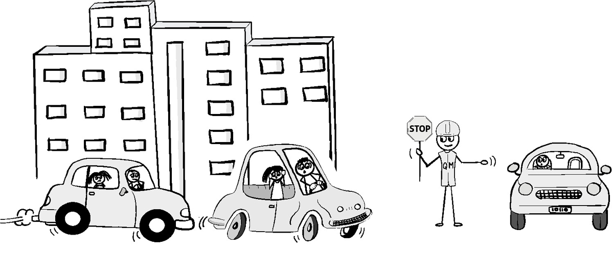
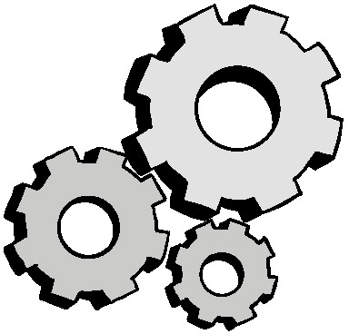
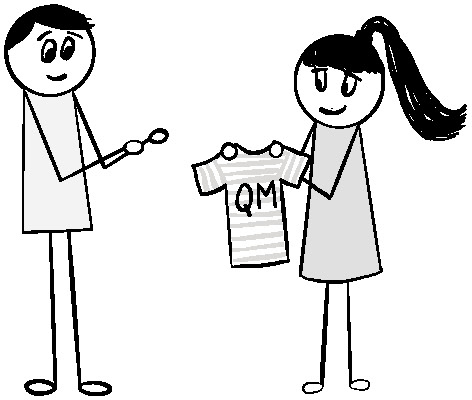
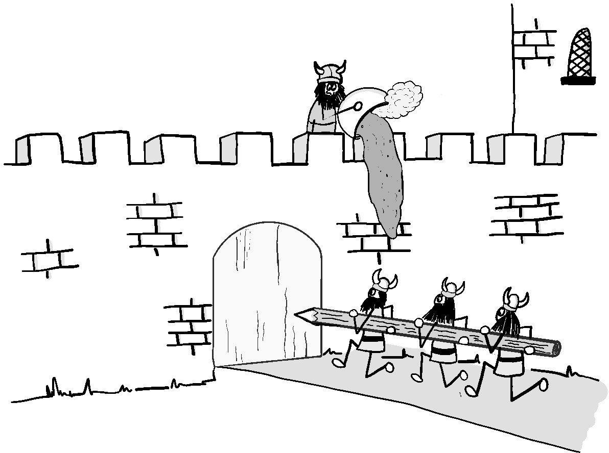
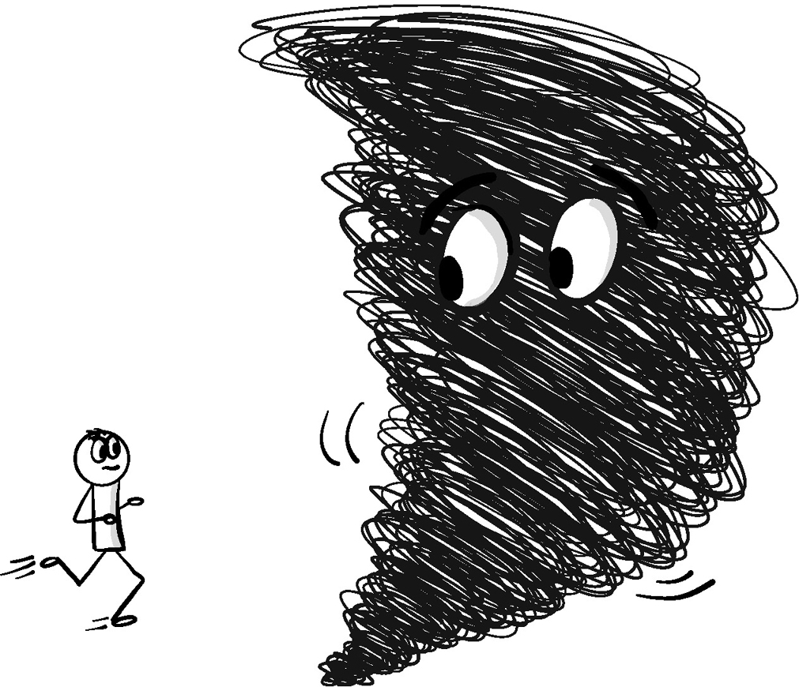

Единственные люди, которые видят общую картину, это те, кто выходит за рамку.
Салман Рушди

Каждый, кто работал в активной технической среде, знает, насколько трудно бывает
оставаться на вершине всего происходящего. Работа поступает с разных сторон,
задачи часто даются или фрагментами, или в не упорядоченном виде, а цели могут
быть неизвестны или неясны. Реактивная природа окружающей среды усиливает всю
эту путаницу, меняя местами в хаотичном порядке все  происходящее во всей
экосистеме. 

Наличие визуального рабочего процесса может помочь. Но если Вы провели какой-то
значительный промежуток времени с доской канбан или другими механизмами рабочего
процесса, вы, вероятно, знаете, что задачи требуют большего, чем просто
занесения на доску задач или в инструмент отслеживания. Они должны быть
добавлены с достаточным контекстом, чтобы помочь команде избежать ошибок,
конфликтов и переделок. 

Некоторые люди могут подумать, что менеджеры являются
наилучшим решением этой проблемы. Однако, как правило, они недостаточно
близки к реальной повседневной работе, чтобы иметь достаточный контекст.
Если это не достаточно сложно, то маршрутизация всей работы проходящая через
них, может опасно ограничить количество времени, которое менеджеры могут
потратить на такие важные виды деятельности, как на такие важные виды
деятельности, как защита интересов команды и налаживание связей с остальной
частью организации. Беспокойство по поводу перегрузки менеджеров может привести
к углублению управленческой иерархии для компенсации, что еще больше увеличивая
количество передач, которые могут повредить или ограничить поток информации.

Гораздо более эффективный подход - поручить кому-то из сотрудников управлять
рабочим процессом точкой входа. Такой подход позволяет преодолеть проблемы
контекста, потока информации, проблемы обучения, с которыми сталкиваются
менеджеры, и ограничивает количество членов команды, которых прерывают. Однако
этот подход должен быть реализован таким образом, чтобы не создавать проблему
контекста и обучения в другом месте. Он также должен обеспечивать непрерывность
работы таким образом, чтобы справляться с непредсказуемыми событиями,
поддерживать приоритеты и выявлять зависимости, которые могут блокировать
прогресс.

К счастью, существует стратегия, позволяющая сделать все это и при этом помочь
каждому сохранить свою практическую ситуационную осведомленность. При хорошем
исполнении она может создать средство для выявления полезных закономерностей и
помочь команде учиться. Реализация этой стратегии требует создания дежурной
(передающейся по очереди) роли под названием "Queue Master".

## Введение в Queue Master

 Рисунок 13.1 <<Часто неправильно понимаемый Queue Master>>

Queue Master - это, пожалуй, одна из самых важных и неправильно понимаемых ролей
для любой динамичной технической среды. Это не функция службы поддержки первого
уровня или роль менеджера по персоналу. Когда он работает хорошо, он может
фактически сократить время цикла между поступлением запроса и его выполнением.
Queue Master возник в различных воплощениях в ранних организациях по
предоставлению услуг, которые пытались найти баланс между необходимостью
поддерживать высокую производительность и быстро реагировать на изменения.
Обеспечение того, чтобы вся поступающая работа была надлежащим образом
отсортирована и расставлена по приоритетам, было огромной проблемой, особенно
когда растущее число задач было реактивным или незапланированным. Большинство
компаний были начинающими предприятиями, которые не могли позволить себе нанять
много сотрудников. Вместо этого им нужен был какой-то способ согласования
приоритетов и выявления скрытых блокирующих факторов, узких мест и зависимостей,
который сминимизировал бы количество прерываний в работе более крупной команды.

Как описано в главе 12, "Рабочий процесс", многие команды доставки увидели, как
работа случайно попавшая в команду, создавала огромное количество проблем.
Обработка дубликатов и столкновений было обычным явлением. Часто члены команды
чувствовали себя настолько перегруженными, что они выгорали и не могли
поделиться тем, что они делали, не говоря уже об упущениях из виду общей картины
происходящего. Со временем это стало негативно сказываться на способности
привлекать и удерживать таланты, а вместе с этим начало страдать и качество
обслуживания.

Даже те организации, которые могли позволить себе персонал, часто обнаруживали,
что традиционные подходы, такие как создание службы поддержки, внедрение
многоуровневой модели поддержки или наличие менеджера-координатора/менеджера
проекта - все это казалось недостаточным. Они всегда пытались быть достаточно
отзывчивыми и при этом минимизировать потерю информации.

Я обнаружил, что плотная и своевременная координация требует такого
непосредственного более глубокого контекста, который может быть достигнут только
тем, кто также регулярно выполняет эту работу. Однако в то же время этот человек
не должен быть настолько настолько поглощенным работой, чтобы не иметь
возможности поддерживать достаточное осознание всей экосистемы услуг. Такое
сочетание было единственным способом, чтобы кто-то мог эффективно
перераспределять приоритеты быстро, по мере необходимости, и плавно
корректировать ожидания, чтобы все шло своим чередом. В конце концов, в
результате постоянных экспериментов команды был создан Queue Master.

## Ролевая механика

 Рисунок 13.2 <<Ролевая механика>>

Существует ряд ролевых механик, которые являются ключевыми для успеха Queue
Master. Вы можете найти некоторые важные дополнения, которые вам необходимы при
некоторых обстоятельствах вашей организации. Однако следует быть осторожным при
внесении любых существенных изменений, отличных от тех, что описаны в этом
разделе. Очень легко такие изменения могут непреднамеренно навредить основному
замыслу поддержания ситуационной осведомленности и потока внутри команды.
Давайте пройдемся по каждой из ролевых механик, чтобы лучше понять их, а также
почему они важны.

## Чередование

 Рисунок 13.3 <<Регулярное чередование роли Queue Master
очень важно.>>

Возможно, самое важное правило для успешной работы Queue Master заключается в
том. что обязанности должны чередоваться между членами команды, выполняющими
работу. Оптимально это делать с периодичностью раз в неделю.

Хотя поначалу многим членам команды может показаться, что выполнение роли
дежурного нарушает их собственную работу, чередование ролей в естественном ритме
рабочей недели имеет ряд неоспоримых преимуществ. Во-первых, это гарантирует,
что Queue Master поддерживает достаточный контекст с работой и командой,
выполняющей ее. Активные члены команды знакомятся с внутренней работой
инфраструктуры, программного обеспечения и сервисов, а также людей, которые ими
управляют. Такое знакомство обеспечивает такой уровень понимания, которого не
хватает менеджерам или кому-либо еще, не погруженному непосредственно в
инфраструктуру.

Ротация с естественной периодичностью также дает каждому возможность отвлечься
от своей повседневной работы и правильно увидеть, что происходит в экосистеме. I
Не могу выразить достаточно убедительно, насколько это может быть полезно для
глаз. Большинство из нас забывают, как легко потерять из виду общую картину,
когда мы погружены в свою работу. Если отвлечься от нее и посмотреть, что
происходит в течение типичного рабочего цикла, это не только помогает нам
увидеть, что происходит, но и помогает команде понять и решить проблемы, которые
снижают эффективность.

Каждый раз, когда я вводил чередование Queue Master, ко мне приходил как минимум
один человек из команды, которая наиболее скептически относилась к этой идее, на
третий или четвертый день их первого чередования, восклицая, как они теперь
понимают, почему эта роль так важна, подробно рассказывая о том, сколько
безумных вещей, о которых они даже не подозревали и которые нужно было
исправить, происходило.

Чередование роли также помогает всем членам команды начать видеть и
по-настоящему ценить знания и усилия, которые вносят другие члены команды. Они
часто видят, как члены команды борются с какой-то проблемой или дисфункцией, с
которой они могут помочь. Они также будут помнить и ценить, когда им помогает
другой член команды, который берет на себя обязанности Queue Master. Вместе,
это укрепляет единство команды и способствует дальнейшему сотрудничеству.

Чередование также повышает ценность самой роли Queue Master. Различные взгляды,
которые каждый человек привносит в эту роль, могут выявить скрытые проблемы и
решения. Ротация также снижает вероятность того, что те, кто выполняет эту роль,
станут привыкать к дисфункциям, которые так часто снижают эффективность работы
команды. Если ничего другого не остается, то смена точки зрения на другую точку
зрения на экосистему скорее всего подтолкнет людей к тому, чтобы подвергнуть
сомнению статус-кво. 

Чередование значительно снижает вероятность того, что специализация Queue Master
укоренится в команде. Последнее, что нужно любой технической команде, это еще
одна специализация, которая снижает гибкость всей команды.

## Управление входом

 Рисунок 13.4 <<Управление входом.>>

Чтобы быть эффективным, Queue Master должен находиться в точке, где вся
неинцидентная работа официально поступает в команду. Это включает в себя всю
работу, от запросов, поступающих из других команд до работы, созданной внутри
команды. Двойная цель управления входом заключается в том, чтобы обеспечить
ясность и приоритетность работы и уловить межорганизационные нюансы, которые в
противном случае могут быть упущены.

Управление вводом достигает ряда целей. Во-первых, оно делает всю работу
отслеживаемой, и устраняет вероятность возникновения каких-либо предположений,
которые могут быть упущены в процессе работы. Это также предотвращает ошибочное
направление заданий любому случайному человеку в команде, тем самым уменьшая
количество прерываний и неправильной расстановки приоритетов в работе.
Еще одно преимущество маршрутизации всего через Queue Master заключается в
том, что он может задействовать быстрый фильтр, который помогает ограничить
попадание ненужного в рабочий процесс. Это снижает вероятность того, что члены
команды получат неполную или неправильную информацию, или того, что неправильно
определенная задача попадет непосредственно в команду.

Это не означает, что маршрутизация должна быть тяжелым процессом, или что это
Queue Master должен сам составлять все задания. Маршрутизация должна быть
очень легкой, когда это возможно. В некоторых случаях, особенно для внутренней
командной работы, маршрутизация может быть простой: кто-то упоминает, что он
добавляет задачу, чтобы помочь прояснить или добавить какой-то важный
недостающий фрагмент работы. Что касается письменных заданий, тот, кто
запрашивает работу, должен написать и представить задание, когда это возможно.
Queue Master может, при необходимости, проследить за выполнением задания,
чтобы добавить недостающую информацию. Это уменьшает потерю информации.

Все это помогает предотвратить засорение рабочего процесса. Большинство людей
могут считать, что их просьба важна и очевидна, даже если это не так. Эта
проверка и сортировка гарантирует, что все попадет в нужное место с достаточным
количеством информации, чтобы не потеряться, не ошибиться в приоритетах или не
привести к ненужной путанице. Критически срочные задачи всегда помещаются в
столбец "Ускорить". Queue Master может и должен обеспечить фон и
некоторую перестройку очереди для всего остального, что может быть важным или
является зависимостью от чего-то, что еще не заслуживает ускорения.

Лучший способ предотвратить ненужное отклонение задач заключается в том, чтобы
команда проактивно создавала и настраивала шаблоны и примеры того, в чем
запрашивающий нуждается минимально и необходимо для включения в заявку, чтобы
она была приемлемой. Это поможет сократить количество разочарований и
переработок. Обучение и информационно-разъяснительная работа должны также
быть доступны для обучения других сотрудников организации. Это поможет
остановить неизбежных нежелательных тикетов, таких как "Сервис сломан.
Пожалуйста, исправьте". "Нужно установить некоторое программное обеспечение" или
любимый всеми "Есть ли резервная копия этой штуки?"

## Сортировка и Выявление зависимостей

Поскольку незапланированная работа, как правило, является регулярным явлением
для команд по предоставлению услуг, велики шансы того, что работа будет
поступать в обход таких людей, как менеджеры, менеджеры проектов/программ и
архитекторы, которые могут выявить любые скрытые зависимости или конфликты
заказов. Чтобы решить эту проблему, Queue Master регулярно
просматривает очереди в поисках таких проблем, чтобы проактивно помочь
команде избежать ненужных блоков или переделок, которые они могут вызвать.

Если этим занимается человек, хорошо знакомый с экосистемой, то это имеет
дополнительным преимуществом для выявления любых конфликтов, которые могли быть
неизвестны или неясными для менеджеров и архитекторов. Иногда это можно сделать
легким способом, например, просто отмечая конфликт, чтобы о нем знали остальные
члены команды. В случае, если конфликт более серьезный, Queue Master может
отправить задание обратно запрашивающему для уточнения или обратиться к
руководству за помощью.

Чтобы справиться со всей этой сортировкой, состояние по умолчанию для любой
работы, поступающей команде, обычно считается неквалифицированной, по крайней
мере, до тех пор, пока Queue Master не получит возможность быстро взглянуть на
нее, чтобы определить, подходит ли она для для работы. В большинстве случаев
Queue Master определяет, что это рабочий элемент и переместит его в колонку
"Готов" на доске. Однако если задание просто неправильное или неверно
направленное, Queue Master может отклонить его и передать обратно запросчику с
объяснением.

Аналогичным образом, если задание неясно, слишком велико или имеет открытый
характер, у Queue Master есть возможность отправить задание обратно заказчику,
чтобы уточнить и улучшить его запрос до того, как он успеет вызвать какие-либо
проблемы в команде. Один из методов сделать это - предупредить подающего заявку,
затем пометить задачу и поместить ее в Очередь уточнений в рабочем процессе.

Я обнаружил, что отслеживание как уточнений, так и отказов может помочь команде
оставаться в курсе происходящего, а также помогает им обнаружить и понять, есть
ли закономерности или источники, вызывающие подобные проблемы, которые
необходимо устранить. Это поможет команде сосредоточиться только на тех видах
шаблонов, обучении и улучшении процессов, которые позволят сократить количество
проблем с течением времени. Это улучшает время цикла, а также снижает
разочарование и нагрузку на подателей заявок и Queue Master. Это помогает
минимизировать любые проблемы или недоразумения, которые каким-то образом
доходят до тех, кто выполняет работу и делает это без излишних процессов без
какой-либо реальной причины.

Улучшенное управление входом со стороны Queue Master также имеет преимущество в
том, что снижает вероятность неравномерного распределения работы между членами
команды. Бережливые практики Lean знают, что неравномерный поток создает отходы.
Обеспечивая возможность поступления заданий только через Queue Master, члены
команды избегают положения, в котором им приходится выбирать между конфликтами с
заказчиками и взятием слишком много работы. Это снижает давление на команду.

## Обработка темной материи

 Рисунок 13.5 <<Взятие под контроль темной материи является
критической ролью QM>>

Одно из важных преимуществ настаивания на том, что вся некритичная работа должна
проходить Queue Master становится единой точкой для приема и обработки всех
запросов <<темной материи>>. Это гарантирует, что они будут фиксироваться и
отслеживаться, чтобы помочь в понимании их источников и возникновения.

Перенаправление <<темной материи>> в одно центральное место может быть поначалу
непростым делом как для организации, так и для команды. Однако это стоит всех
ворчаний и небольших неудобств. Запись задач важна не только для понимания
источника и размера спроса на различные виды деятельности, но и перекладывание
тривиальных задач на одно место уменьшает количество прерываний, которые
в противном случае могли бы помешать работе команды. Это снижает количество
ошибок и помогает улучшить оперативность и поток.

## Поддержание потока

Роль Queue Master не заканчивается с поступлением работы в рабочий процесс.
На на самом деле, многие из наиболее ценных вкладов Queue Master происходят
путем сохранения фокуса на общей картине. Одним из таких вкладов является
поддержание потока работы.

Например, не все задачи, которые достигают столбца "Готово" на доске рабочего
процесса обязательно заслуживают одинакового отношения. В то время как
руководство, владелец продукта или даже отдельные инженеры, часто выполняющие
большую часть работы по расстановке приоритетов, треюуют в некоторых случаях от
Queue Master изменения порядка очередности. Это обычно связано либо с внезапным
изменением приоритетов, либо с необходимостью обеспечить выполнение одного или
нескольких ключевых предпосылок, чтобы избежать блокировки рабочего процесса.
Когда Queue Master делает это, он обычно предупреждает команду о ситуации
либо во время ежедневного совещания или через чат, чтобы убедиться, что все
приоритеты и зависимости стали ясны и понятны.

Если задача требует особого подхода, потому что для ее выполнения требуются либо
особые навыки или специфический контекст, Queue Master может убедиться, что
эти требования к обработке четко обозначены. Это поможет проинформировать
команду когда задание готово к выполнению, и поможет отследить, как оно
перемещается по ходу рабочего процесса. По мере того, как команда становится
зрелой, а роль руководителя сервисной инженерии (рассматривается в Главе 9,
"Зрелость предоставления услуг и лидер сервисной инженерии Lead") становится
более устоявшейся, команда сама часто становится самым большим источником таких
задач. Обычно они связаны с задачами по доставке, созданными и помечены лидером
SE для помощи в отслеживании.

Несмотря на то, что каждый несет ответственность за работу команды, бывают
случаи, когда элементы, которые могут томиться в колонке. Queue Master активно
следит за тем, чтобы заметить их и устранить любые блоки или потенциальные
проблемы, которые могут препятствуют их продвижению. Queue Master также следит
за большими скоплениями незавершенной работы, особенно вызванными неожиданными
проблемами, которые возникают.

Queue Master использует ежедневный стенд-ап, а также ретроспективу команды как
способ поднять вопросы, с которыми сталкиваются члены команды. Queue Master
может расспросить членов команды о деталях, а также помочь в устранении проблем
и восстановлении потока. Queue Master также может работать с командой, чтобы
понять основные причины проблем и найти способы их предотвращения. и найти
способы предотвратить их повторение в будущем. Все вместе это гарантирует, что
работа не будет простаивать без необходимости и что члены команды не перегружены
работой.

## Распознавание образов

 Рисунок 13.6 <<Узоры полезны для быстрого распознавания.>>

Одним из основных преимуществ наличия Queue Master, которому поручено активное
исследование рабочего процесса от точки входа до завершения, является то, что он
начнет видеть закономерности, которые могут помочь команде улучшить работу.

Такие закономерности начинаются с самого поступления заявок. Всегда существует
тонкое, но важное взаимодействие между типами поступающих задач, теми, кто
просит их выполнения, и более крупными событиями, происходящими в рамках
экосистемы. Этот контекст очень важен, особенно в условиях, когда значительный
сегмент спроса нелегко спланировать заранее. Если вы можете понять источник
спроса, его частоту и то, что может его побудить, можно начать прогнозировать,
когда он может возникнуть в будущем. Это также дает представление о схожих
запросах и схожих заказчиках, что помогает вам установить более крупные
закономерности спроса. Это может помочь в планировании ресурсов, а также в
оценке возврата инвестиций от стандартизации и автоматизации задачи или
устранения ее первопричины.

Аналогичным образом, вы также можете начать понимать и отслеживать модели
зависимостей между задачами. Если определенная задача попадает в поток, то вы
знаете, что существует большая вероятность того, что за ней последуют такие же
зависимые задачи. Понимание этих моделей зависимости может помочь упредить
дополнительные запросы и улучшить реакцию команды отзывчивость и понимание. Это
уменьшает шум в рабочем процессе и обеспечивает полезные цели автоматизации и
способствует координации.

Возможность выявления закономерностей спроса также дает полезные подсказки о
том, как именно  запросчик пытается выполнить запрос. Это важно, потому что не
все разделяют или четко представляют себе результат, которого они пытаются
достичь. Не редкость, когда люди делают запросы, которые из-за предвзятости
решения или какого-либо другого недопонимания, не достигают желаемого
результата. Queue Master имеет уникальную возможность заметить такие
несоответствия и отметить их для дальнейшего расследования.

Закономерности существуют и в самом рабочем процессе. Могут быть задачи, которые
занимают гораздо дольше, чем положено, требуют доработки или имеют большое
количество передач. Бывает также, что Queue Master замечает, что определенные
задачи могут быть выполнены только одним человеком или небольшой частью команды,
создавая опасное узкое место, которое указывает на то, что знания и
осведомленность, возможно, распределяются неравномерно по команде.

Каждая из этих закономерностей должна быть отмечена Queue Master и обсуждена с
остальными членами команды с помощью различных средств синхронизации и
улучшения, обсуждаемых в Главе 14, "Циклы и точки синхронизации". Queue Master,
который отлично справляется с подбором шаблонов, может значительно улучшить
работу команды. По мере того, как все больше людей принимают на себя эту роль,
люди начинают делиться и находить закономерности на основе своего опыта. Это
укрепляет коллективный разум, создавая благодатную почву для инновационных
решений сложных проблем.
