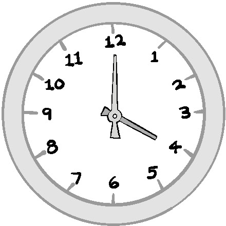

Единственные люди, которые видят общую картину, это те, кто выходит за рамку.
Салман Рушди

Каждый, кто работал в активной технической среде, знает, насколько трудно бывает
оставаться на вершине всего происходящего. Работа поступает с разных сторон,
задачи часто даются или фрагментами, или в не упорядоченном виде, а цели могут
быть неизвестны или неясны. Реактивная природа окружающей среды усиливает всю
эту путаницу, меняя местами в хаотичном порядке все  происходящее во всей
экосистеме. 

Наличие визуального рабочего процесса может помочь. Но если Вы провели какой-то
значительный промежуток времени с доской канбан или другими механизмами рабочего
процесса, вы, вероятно, знаете, что задачи требуют большего, чем просто
занесения на доску задач или в инструмент отслеживания. Они должны быть
добавлены с достаточным контекстом, чтобы помочь команде избежать ошибок,
конфликтов и переделок. 

Некоторые люди могут подумать, что менеджеры являются
наилучшим решением этой проблемы. Однако, как правило, они недостаточно
близки к реальной повседневной работе, чтобы иметь достаточный контекст.
Если это не достаточно сложно, то маршрутизация всей работы проходящая через
них, может опасно ограничить количество времени, которое менеджеры могут
потратить на такие важные виды деятельности, как на такие важные виды
деятельности, как защита интересов команды и налаживание связей с остальной
частью организации. Беспокойство по поводу перегрузки менеджеров может привести
к углублению управленческой иерархии для компенсации, что еще больше увеличивая
количество передач, которые могут повредить или ограничить поток информации.

Гораздо более эффективный подход - поручить кому-то из сотрудников управлять
рабочим процессом точкой входа. Такой подход позволяет преодолеть проблемы
контекста, потока информации, проблемы обучения, с которыми сталкиваются
менеджеры, и ограничивает количество членов команды, которых прерывают. Однако
этот подход должен быть реализован таким образом, чтобы не создавать проблему
контекста и обучения в другом месте. Он также должен обеспечивать непрерывность
работы таким образом, чтобы справляться с непредсказуемыми событиями,
поддерживать приоритеты и выявлять зависимости, которые могут блокировать
прогресс.

К счастью, существует стратегия, позволяющая сделать все это и при этом помочь
каждому сохранить свою практическую ситуационную осведомленность. При хорошем
исполнении она может создать средство для выявления полезных закономерностей и
помочь команде учиться. Реализация этой стратегии требует создания дежурной
(передающейся по очереди) роли под названием "Queue Master".

## Введение в Queue Master

 Рисунок 13.1 <<Часто неправильно понимаемый Queue Master>>

Queue Master - это, пожалуй, одна из самых важных и неправильно понимаемых ролей
для любой динамичной технической среды. Это не функция службы поддержки первого
уровня или роль менеджера по персоналу. Когда он работает хорошо, он может
фактически сократить время цикла между поступлением запроса и его выполнением.
Queue Master возник в различных воплощениях в ранних организациях по
предоставлению услуг, которые пытались найти баланс между необходимостью
поддерживать высокую производительность и быстро реагировать на изменения.
Обеспечение того, чтобы вся поступающая работа была надлежащим образом
отсортирована и расставлена по приоритетам, было огромной проблемой, особенно
когда растущее число задач было реактивным или незапланированным. Большинство
компаний были начинающими предприятиями, которые не могли позволить себе нанять
много сотрудников. Вместо этого им нужен был какой-то способ согласования
приоритетов и выявления скрытых блокирующих факторов, узких мест и зависимостей,
который сминимизировал бы количество прерываний в работе более крупной команды.

Как описано в главе 12, "Рабочий процесс", многие команды доставки увидели, как
работа случайно попавшая в команду, создавала огромное количество проблем.
Обработка дубликатов и столкновений было обычным явлением. Часто члены команды
чувствовали себя настолько перегруженными, что они выгорали и не могли
поделиться тем, что они делали, не говоря уже об упущениях из виду общей картины
происходящего. Со временем это стало негативно сказываться на способности
привлекать и удерживать таланты, а вместе с этим начало страдать и качество
обслуживания.

Даже те организации, которые могли позволить себе персонал, часто обнаруживали,
что традиционные подходы, такие как создание службы поддержки, внедрение
многоуровневой модели поддержки или наличие менеджера-координатора/менеджера
проекта - все это казалось недостаточным. Они всегда пытались быть достаточно
отзывчивыми и при этом минимизировать потерю информации.

Я обнаружил, что плотная и своевременная координация требует такого
непосредственного более глубокого контекста, который может быть достигнут только
тем, кто также регулярно выполняет эту работу. Однако в то же время этот человек
не должен быть настолько настолько поглощенным работой, чтобы не иметь
возможности поддерживать достаточное осознание всей экосистемы услуг. Такое
сочетание было единственным способом, чтобы кто-то мог эффективно
перераспределять приоритеты быстро, по мере необходимости, и плавно
корректировать ожидания, чтобы все шло своим чередом. В конце концов, в
результате постоянных экспериментов команды был создан Queue Master.

## Ролевая механика

 Рисунок 13.2 <<Ролевая механика>>

Существует ряд ролевых механик, которые являются ключевыми для успеха Queue
Master. Вы можете найти некоторые важные дополнения, которые вам необходимы при
некоторых обстоятельствах вашей организации. Однако следует быть осторожным при
внесении любых существенных изменений, отличных от тех, что описаны в этом
разделе. Очень легко такие изменения могут непреднамеренно навредить основному
замыслу поддержания ситуационной осведомленности и потока внутри команды.
Давайте пройдемся по каждой из ролевых механик, чтобы лучше понять их, а также
почему они важны.

## Чередование

 Рисунок 13.3 <<Регулярное чередование роли Queue Master
очень важно.>>

Возможно, самое важное правило для успешной работы Queue Master заключается в
том. что обязанности должны чередоваться между членами команды, выполняющими
работу. Оптимально это делать с периодичностью раз в неделю.

Хотя поначалу многим членам команды может показаться, что выполнение роли
дежурного нарушает их собственную работу, чередование ролей в естественном ритме
рабочей недели имеет ряд неоспоримых преимуществ. Во-первых, это гарантирует,
что Queue Master поддерживает достаточный контекст с работой и командой,
выполняющей ее. Активные члены команды знакомятся с внутренней работой
инфраструктуры, программного обеспечения и сервисов, а также людей, которые ими
управляют. Такое знакомство обеспечивает такой уровень понимания, которого не
хватает менеджерам или кому-либо еще, не погруженному непосредственно в
инфраструктуру.

Ротация с естественной периодичностью также дает каждому возможность отвлечься
от своей повседневной работы и правильно увидеть, что происходит в экосистеме. I
Не могу выразить достаточно убедительно, насколько это может быть полезно для
глаз. Большинство из нас забывают, как легко потерять из виду общую картину,
когда мы погружены в свою работу. Если отвлечься от нее и посмотреть, что
происходит в течение типичного рабочего цикла, это не только помогает нам
увидеть, что происходит, но и помогает команде понять и решить проблемы, которые
снижают эффективность.

Каждый раз, когда я вводил чередование Queue Master, ко мне приходил как минимум
один человек из команды, которая наиболее скептически относилась к этой идее, на
третий или четвертый день их первого чередования, восклицая, как они теперь
понимают, почему эта роль так важна, подробно рассказывая о том, сколько
безумных вещей, о которых они даже не подозревали и которые нужно было
исправить, происходило.

Чередование роли также помогает всем членам команды начать видеть и
по-настоящему ценить знания и усилия, которые вносят другие члены команды. Они
часто видят, как члены команды борются с какой-то проблемой или дисфункцией, с
которой они могут помочь. Они также будут помнить и ценить, когда им помогает
другой член команды, который берет на себя обязанности Queue Master. Вместе,
это укрепляет единство команды и способствует дальнейшему сотрудничеству.

Чередование также повышает ценность самой роли Queue Master. Различные взгляды,
которые каждый человек привносит в эту роль, могут выявить скрытые проблемы и
решения. Ротация также снижает вероятность того, что те, кто выполняет эту роль,
станут привыкать к дисфункциям, которые так часто снижают эффективность работы
команды. Если ничего другого не остается, то смена точки зрения на другую точку
зрения на экосистему скорее всего подтолкнет людей к тому, чтобы подвергнуть
сомнению статус-кво. 

Чередование значительно снижает вероятность того, что специализация Queue Master
укоренится в команде. Последнее, что нужно любой технической команде, это еще
одна специализация, которая снижает гибкость всей команды.

## Управление входом

 Рисунок 13.4 <<Управление входом.>>

Чтобы быть эффективным, Queue Master должен находиться в точке, где вся
неинцидентная работа официально поступает в команду. Это включает в себя всю
работу, от запросов, поступающих из других команд до работы, созданной внутри
команды. Двойная цель управления входом заключается в том, чтобы обеспечить
ясность и приоритетность работы и уловить межорганизационные нюансы, которые в
противном случае могут быть упущены.

Управление вводом достигает ряда целей. Во-первых, оно делает всю работу
отслеживаемой, и устраняет вероятность возникновения каких-либо предположений,
которые могут быть упущены в процессе работы. Это также предотвращает ошибочное
направление заданий любому случайному человеку в команде, тем самым уменьшая
количество прерываний и неправильной расстановки приоритетов в работе.
Еще одно преимущество маршрутизации всего через Queue Master заключается в
том, что он может задействовать быстрый фильтр, который помогает ограничить
попадание ненужного в рабочий процесс. Это снижает вероятность того, что члены
команды получат неполную или неправильную информацию, или того, что неправильно
определенная задача попадет непосредственно в команду.

Это не означает, что маршрутизация должна быть тяжелым процессом, или что это
Queue Master должен сам составлять все задания. Маршрутизация должна быть
очень легкой, когда это возможно. В некоторых случаях, особенно для внутренней
командной работы, маршрутизация может быть простой: кто-то упоминает, что он
добавляет задачу, чтобы помочь прояснить или добавить какой-то важный
недостающий фрагмент работы. Что касается письменных заданий, тот, кто
запрашивает работу, должен написать и представить задание, когда это возможно.
Queue Master может, при необходимости, проследить за выполнением задания,
чтобы добавить недостающую информацию. Это уменьшает потерю информации.

Все это помогает предотвратить засорение рабочего процесса. Большинство людей
могут считать, что их просьба важна и очевидна, даже если это не так. Эта
проверка и сортировка гарантирует, что все попадет в нужное место с достаточным
количеством информации, чтобы не потеряться, не ошибиться в приоритетах или не
привести к ненужной путанице. Критически срочные задачи всегда помещаются в
столбец "Ускорить". Queue Master может и должен обеспечить фон и
некоторую перестройку очереди для всего остального, что может быть важным или
является зависимостью от чего-то, что еще не заслуживает ускорения.

Лучший способ предотвратить ненужное отклонение задач заключается в том, чтобы
команда проактивно создавала и настраивала шаблоны и примеры того, в чем
запрашивающий нуждается минимально и необходимо для включения в заявку, чтобы
она была приемлемой. Это поможет сократить количество разочарований и
переработок. Обучение и информационно-разъяснительная работа должны также
быть доступны для обучения других сотрудников организации. Это поможет
остановить неизбежных нежелательных тикетов, таких как "Сервис сломан.
Пожалуйста, исправьте". "Нужно установить некоторое программное обеспечение" или
любимый всеми "Есть ли резервная копия этой штуки?"

## Сортировка и Выявление зависимостей

Поскольку незапланированная работа, как правило, является регулярным явлением
для команд по предоставлению услуг, велики шансы того, что работа будет
поступать в обход таких людей, как менеджеры, менеджеры проектов/программ и
архитекторы, которые могут выявить любые скрытые зависимости или конфликты
заказов. Чтобы решить эту проблему, Queue Master регулярно
просматривает очереди в поисках таких проблем, чтобы проактивно помочь
команде избежать ненужных блоков или переделок, которые они могут вызвать.

Если этим занимается человек, хорошо знакомый с экосистемой, то это имеет
дополнительным преимуществом для выявления любых конфликтов, которые могли быть
неизвестны или неясными для менеджеров и архитекторов. Иногда это можно сделать
легким способом, например, просто отмечая конфликт, чтобы о нем знали остальные
члены команды. В случае, если конфликт более серьезный, Queue Master может
отправить задание обратно запрашивающему для уточнения или обратиться к
руководству за помощью.

Чтобы справиться со всей этой сортировкой, состояние по умолчанию для любой
работы, поступающей команде, обычно считается неквалифицированной, по крайней
мере, до тех пор, пока Queue Master не получит возможность быстро взглянуть на
нее, чтобы определить, подходит ли она для для работы. В большинстве случаев
Queue Master определяет, что это рабочий элемент и переместит его в колонку
"Готов" на доске. Однако если задание просто неправильное или неверно
направленное, Queue Master может отклонить его и передать обратно запросчику с
объяснением.

Аналогичным образом, если задание неясно, слишком велико или имеет открытый
характер, у Queue Master есть возможность отправить задание обратно заказчику,
чтобы уточнить и улучшить его запрос до того, как он успеет вызвать какие-либо
проблемы в команде. Один из методов сделать это - предупредить подающего заявку,
затем пометить задачу и поместить ее в Очередь уточнений в рабочем процессе.

Я обнаружил, что отслеживание как уточнений, так и отказов может помочь команде
оставаться в курсе происходящего, а также помогает им обнаружить и понять, есть
ли закономерности или источники, вызывающие подобные проблемы, которые
необходимо устранить. Это поможет команде сосредоточиться только на тех видах
шаблонов, обучении и улучшении процессов, которые позволят сократить количество
проблем с течением времени. Это улучшает время цикла, а также снижает
разочарование и нагрузку на подателей заявок и Queue Master. Это помогает
минимизировать любые проблемы или недоразумения, которые каким-то образом
доходят до тех, кто выполняет работу и делает это без излишних процессов без
какой-либо реальной причины.

Улучшенное управление входом со стороны Queue Master также имеет преимущество в
том, что снижает вероятность неравномерного распределения работы между членами
команды. Бережливые практики Lean знают, что неравномерный поток создает отходы.
Обеспечивая возможность поступления заданий только через Queue Master, члены
команды избегают положения, в котором им приходится выбирать между конфликтами с
заказчиками и взятием слишком много работы. Это снижает давление на команду.

## Обработка темной материи

 Рисунок 13.5 <<Взятие под контроль темной материи является
критической ролью QM>>

Одно из важных преимуществ настаивания на том, что вся некритичная работа должна
проходить Queue Master становится единой точкой для приема и обработки всех
запросов <<темной материи>>. Это гарантирует, что они будут фиксироваться и
отслеживаться, чтобы помочь в понимании их источников и возникновения.

Перенаправление <<темной материи>> в одно центральное место может быть поначалу
непростым делом как для организации, так и для команды. Однако это стоит всех
ворчаний и небольших неудобств. Запись задач важна не только для понимания
источника и размера спроса на различные виды деятельности, но и перекладывание
тривиальных задач на одно место уменьшает количество прерываний, которые
в противном случае могли бы помешать работе команды. Это снижает количество
ошибок и помогает улучшить оперативность и поток.

## Поддержание потока

Роль Queue Master не заканчивается с поступлением работы в рабочий процесс.
На на самом деле, многие из наиболее ценных вкладов Queue Master происходят
путем сохранения фокуса на общей картине. Одним из таких вкладов является
поддержание потока работы.

Например, не все задачи, которые достигают столбца "Готово" на доске рабочего
процесса обязательно заслуживают одинакового отношения. В то время как
руководство, владелец продукта или даже отдельные инженеры, часто выполняющие
большую часть работы по расстановке приоритетов, треюуют в некоторых случаях от
Queue Master изменения порядка очередности. Это обычно связано либо с внезапным
изменением приоритетов, либо с необходимостью обеспечить выполнение одного или
нескольких ключевых предпосылок, чтобы избежать блокировки рабочего процесса.
Когда Queue Master делает это, он обычно предупреждает команду о ситуации
либо во время ежедневного совещания или через чат, чтобы убедиться, что все
приоритеты и зависимости стали ясны и понятны.

Если задача требует особого подхода, потому что для ее выполнения требуются либо
особые навыки или специфический контекст, Queue Master может убедиться, что
эти требования к обработке четко обозначены. Это поможет проинформировать
команду когда задание готово к выполнению, и поможет отследить, как оно
перемещается по ходу рабочего процесса. По мере того, как команда становится
зрелой, а роль руководителя сервисной инженерии (рассматривается в Главе 9,
"Зрелость предоставления услуг и лидер сервисной инженерии Lead") становится
более устоявшейся, команда сама часто становится самым большим источником таких
задач. Обычно они связаны с задачами по доставке, созданными и помечены лидером
SE для помощи в отслеживании.

Несмотря на то, что каждый несет ответственность за работу команды, бывают
случаи, когда элементы, которые могут томиться в колонке. Queue Master активно
следит за тем, чтобы заметить их и устранить любые блоки или потенциальные
проблемы, которые могут препятствуют их продвижению. Queue Master также следит
за большими скоплениями незавершенной работы, особенно вызванными неожиданными
проблемами, которые возникают.

Queue Master использует ежедневный стенд-ап, а также ретроспективу команды как
способ поднять вопросы, с которыми сталкиваются члены команды. Queue Master
может расспросить членов команды о деталях, а также помочь в устранении проблем
и восстановлении потока. Queue Master также может работать с командой, чтобы
понять основные причины проблем и найти способы их предотвращения. и найти
способы предотвратить их повторение в будущем. Все вместе это гарантирует, что
работа не будет простаивать без необходимости и что члены команды не перегружены
работой.

## Распознавание образов

 Рисунок 13.6 <<Узоры полезны для быстрого распознавания.>>

Одним из основных преимуществ наличия Queue Master, которому поручено активное
исследование рабочего процесса от точки входа до завершения, является то, что он
начнет видеть закономерности, которые могут помочь команде улучшить работу.

Такие закономерности начинаются с самого поступления заявок. Всегда существует
тонкое, но важное взаимодействие между типами поступающих задач, теми, кто
просит их выполнения, и более крупными событиями, происходящими в рамках
экосистемы. Этот контекст очень важен, особенно в условиях, когда значительный
сегмент спроса нелегко спланировать заранее. Если вы можете понять источник
спроса, его частоту и то, что может его побудить, можно начать прогнозировать,
когда он может возникнуть в будущем. Это также дает представление о схожих
запросах и схожих заказчиках, что помогает вам установить более крупные
закономерности спроса. Это может помочь в планировании ресурсов, а также в
оценке возврата инвестиций от стандартизации и автоматизации задачи или
устранения ее первопричины.

Аналогичным образом, вы также можете начать понимать и отслеживать модели
зависимостей между задачами. Если определенная задача попадает в поток, то вы
знаете, что существует большая вероятность того, что за ней последуют такие же
зависимые задачи. Понимание этих моделей зависимости может помочь упредить
дополнительные запросы и улучшить реакцию команды отзывчивость и понимание. Это
уменьшает шум в рабочем процессе и обеспечивает полезные цели автоматизации и
способствует координации.

Возможность выявления закономерностей спроса также дает полезные подсказки о
том, как именно  запросчик пытается выполнить запрос. Это важно, потому что не
все разделяют или четко представляют себе результат, которого они пытаются
достичь. Не редкость, когда люди делают запросы, которые из-за предвзятости
решения или какого-либо другого недопонимания, не достигают желаемого
результата. Queue Master имеет уникальную возможность заметить такие
несоответствия и отметить их для дальнейшего расследования.

Закономерности существуют и в самом рабочем процессе. Могут быть задачи, которые
занимают гораздо дольше, чем положено, требуют доработки или имеют большое
количество передач. Бывает также, что Queue Master замечает, что определенные
задачи могут быть выполнены только одним человеком или небольшой частью команды,
создавая опасное узкое место, которое указывает на то, что знания и
осведомленность, возможно, распределяются неравномерно по команде.

Каждая из этих закономерностей должна быть отмечена Queue Master и обсуждена с
остальными членами команды с помощью различных средств синхронизации и
улучшения, обсуждаемых в Главе 14, "Циклы и точки синхронизации". Queue Master,
который отлично справляется с подбором шаблонов, может значительно улучшить
работу команды. По мере того, как все больше людей принимают на себя эту роль,
люди начинают делиться и находить закономерности на основе своего опыта. Это
укрепляет коллективный разум, создавая благодатную почву для инновационных
решений сложных проблем.

### Рабочее время

**Рисунок 13.7**\
Роль Queue Master должна быть доступна ежедневно в моменты пикового спроса. 

Важно отметить, что Queue Master, как правило, не является тем человеком, работа
которого должна быть доступна в течение всего рабочего дня. Ни одна из его 
обязанностей  не является настолько срочной и важной, чтобы всегда быть доступной.
Даже если возникающие в нерабочее вопросы настолько критичны, что требуют 
немедленного внимания, их можно легко переадресовать дежурному.

По этой причине стоит понимать, что Queue Master будет рядом и доступен только в
определенное время в течение рабочего дня. Обычно работа Queue Master-а начинается
после ежедневного совещания и заканчивается в разумное установленное время, 
которое соответствует <<затишью>> запросов оп решению задач в конце рабочего дня.

Помимо предотвращения выгорания, установление рабочих часов также помогает 
определить, когда работа наваливается на команду в неурочное время. Это не 
означает, что не должно быть некоторого механизма установки дополнительных часов
работы в случае чрезвычайно важных задач. На самом деле, если поступает что-то 
настолько срочное, что решение данного вопроса не может подождать до следующего
дня, то такая ситуация должна рассматриваться как производственный инцидент. 
Это обеспечивает несколько вещей: во-первых, гарантирует, что на подобную 
ситуацию  сразу же обратят внимание, во-вторых, обеспечивает уверенность в том, 
что запрос будет впоследствии рассмотрен на предмет наличия реальной потребности,
которая требует изменения или даже нового инструмента для ее удовлетворения.

Наконец, и это самое главное, рассмотрение запроса в нерабочее время в качестве
инцидента может помочь оценить срочность того или иного запроса. При таком 
подходе проблемы действительно учитываются и решаются более рациональными 
способами.

##  <<Следуй за солнцем>> Queue Mastering

**Рисунок 13.8**\
В распределенных организациях QM может потребоваться перемещение между офисами в
течение дня. 

Единственная проблема, связанная с офисными часами, возникает в случае, если в 
вашей организации есть технические команды с большой разницей в часовых поясах. 
Оптимальное решение в данном случае --- разделить обязанности по обслуживанию
на самостоятельные части, которые можно выполнять локально. Однако есть
некоторые случаи, когда такой подход невозможен, или координация  и
осведомленность между командами настолько важны, что необходимо ежедневно 
обеспечивать согласованность действий.

В таких случаях вам, возможно, придется рассмотреть возможность установки 
очереди решения проблем <<по солнцу>>. В этой модели будет, в лучшем случае, два, 
но не более трех Queue Masters, каждый из которых разделен по крайней мере 
шестью часовыми поясами, чтобы решать вопросы и задачи в основные часы работы.

Модель <<Следуй за солнцем>> является достаточно сложной, хотя я успешно 
использовал ее в нескольких организациях. Необходимо обмениваться большим 
количеством информации между каждым региональным Queue Master для поддержания 
согласованности. Я обнаружил, что этого можно добиться, если команда 
попытается сделать следующее:

- Тщательно продумайте, как организована работа в группе по поставке программного
  обеспечения. Часто вы можете держать тесно связанные виды работ вместе в 
  течение определенного цикла. Это уменьшает количество передачи информации, а 
  значит, и контекстные накладные расходы, необходимые для поддержания 
  согласованности и минимизации переделок. Я все еще рекомендую чередовать эти
  кластеры <<типов>> время от времени, чтобы избежать создания <<узких>> мест, 
  но делать это следует в естественной точке прерывания цикла.

- Обеспечьте как можно больше общения через общий чат. 

- Пусть один из Queue Master цикла займет ведущую позицию, чтобы помочь с 
  координацией. Постарайтесь чередовать этот процесс между ними, чтобы все 
  чувствовали себя вовлеченными в работу.

- Queue Masters должны синхронизироваться ежедневно по голосовому/видеочату
  друг с другом. Они также должны обмениваться заметками в общем документе. Это
  особенно важно, если у вас три Queue Master. Даже если они имеют большой разрыв 
  в часовом поясе, вам, скорее всего, придется собрать их всех вместе по крайней 
  мере дважды (обычно в начале и в конце), чтобы синхронизироваться и избежать 
  слишком большого регионального дрейфа.

## Управление пунктами синхронизации

Поддержание ситуационной осведомленности, обучение и совершенствование --- 
все это требует определенного согласования действий команды. Существует
множество механизмов которые вы можете использовать для этого, от вики 
и хранилищ документов до чатов, стендапов, парных встреч, демонстраций,
собраний и просто работы в одном и том же месте. Каждый из них имеет 
свои преимущества и недостатки, которым я посвятил целую главу (Глава 
14, <<Циклы и точки синхронизации>>) обсуждению моделей, которые
хорошо зарекомендовали себя в организациях, в которых я работал. В них 
я обнаружил одну общую черту --- лучше всего это иметь человека, 
который следит за тем, что происходит. Для этого подходит Queue Master 
специалист.

Queue Master будет находиться в вечном хаосе, что означает, что
они должны быть в наилучшем положении, чтобы видеть проблемы, с 
которыми живут другие, но они находятся настолько близко к ним, 
что не замечают. Отвечая за временные показатели, Queue Master может
помочь выявить более глубокие проблемы. Он помогает людям лучше 
увидеть перспективу и понять, что происходит, помогает повысить 
ситуационную осведомленность, улучшить взаимодействие в команде и 
даже помочь тем, кто находится в центре ситуации, сделать шаг назад 
и взглянуть на ситуацию более объективно.

## Другая работа во время выполнения служебных обязанностей

Одна из проблем с циклом занятости Queue Master заключается в том, 
что он может дать человеку,  недостаточно времени для выполнения 
своих обычных повседневных и проектных обязанности. Обязанности Queue 
Master имеют приоритет над всем остальным. Это означает, что любая 
другая деятельность, которой занимается этот человек, должна быть 
либо делегирована кому-то другому во время цикла, либо подождать,
пока этот человек не освободится.

Поначалу такой подход может показаться чрезвычайно разрушительным.
Однако по мере того, как Queue Master начинает делать достаточно 
заметные вещи, чтобы над ними можно было работать и улучшать,
большинство может найти хороший баланс между своей ротацией и 
существующей работой.

Важно помнить, что одна из способностей Queue Master --- это 
уменьшать <<шум>>, который в противном случае может прервать
работу команды. Это означает, что члены команды могут завершить 
свою работу не прерываясь, что повышает общую пропускную 
способность потока команд. Члены команды также с большей 
вероятностью будут делиться подробностями о работе, которую 
они выполняют, если время от времени им может понадобиться 
помощь других людей. Это еще больше повышает ситуационную
осведомленность и гибкость команды.

Циклическая ротация роли Queue Master означает, что этот 
период является временным и что можно планировать работу в 
обход него. Со временем, когда рабочий процесс начнет 
налаживаться, даже это нарушение будет значительно меньше.

> ### Обычный день из жизни Queue Master
> 
> Давайте рассмотрим типичный день из жизни Queue Master,
> чтобы лучше понять, что включает в себя эта работа и как 
> он должен взаимодействовать с командой.
>
> Это была неделя Эда, когда ему предстояло взять на 
> себя роль Queue Master. Он был рад, что на предыдущей 
> неделе Саймон был в ротации. Саймон был хорош в том, 
> чтобы убедиться, что вся работа на неделю была достаточно я
> сной для всех, и что не было никаких неприятных проблем с 
> WIP, с которыми нужно было разбираться. Саймон также был лучшим 
> в том, чтобы держать доску от гигантских и плохо сформулированных 
> задач типа <<Масштабировать сервис>>, которые которые иногда поступали
>  от команды по продукту. Саймон отлично справлялся с выяснением что 
>  лежит в основе проблем, чтобы команда могла эффективно реагировать.
>
> День Эда начался с того, что он внимательно осмотрел рабочую доску, 
> чтобы выяснить, нет ли проблем, возникших за вечер. Он увидел, что 
> Дэйв все еще испытывает трудности с парой частей проектной работы. 
> Стоило спросить об этом на совещании. Также была высокоприоритетная, 
> чувствительная к времени задача, которая, по словам команды 
> бизнес-аналитиков, понадобится им в ближайшее время, о чем команда 
> должна знать.
>
> Просканировав доску, Эд проверил стенограмму чата команды, чтобы 
> узнать, нет ли было ли что-нибудь интересное до начала стендапа. 
> Заседание всегда проводилась в 9:45 утра, чтобы помочь команде 
> cобраться, организоваться и выпить кофе перед тем как начать 
> рабочий день. Помимо обычной болтовни, была небольшая проблема с одной 
> из служб подачи материла. Салли уже успела передать ему записку о том,
>  что ей и Саймону, возможно, придется провести некоторую работу 
>  по очистке, которую она обязательно расскажет во время выступления.
>
> Затем Дэйв подошел к нам, чтобы быстро рассказать о своем проекте.
>  Он отметил, что собирается заполнить доску еще несколькими элементами, 
>  некоторые из которых ему нужно было выполнить, а несколько других, 
>  которые могут сделать другие члены команды, если они сначала согласуют 
>  с ним, чтобы убедиться в отсутствии конфликтов. Они договорились, что 
>  Дэйв будет отмечать их большой оранжевой буквой D.

## Queue Master Rollout Challenges

While the value of the Queue Master becomes increasingly obvious over time,
it often seems like a struggle to get it established. The challenges always seem
to follow a familiar pattern. This section describes some of the main challenges
along with some strategies to work through them.

## Team Members Don’t See the Value

The first pushback most teams see is that most team members at first simply do
not see the value of the Queue Master. Everyone is already extremely busy, so
the idea of messing around with the way that work is handled sounds like
another set of useless and cumbersome steps that will further strain the team.

The main intent of the Queue Master role is to build a better understanding of
the patterns of work hitting the team so that the team can find faster, easier, and
ultimately more effective ways of delivering the outcomes that matter. Team
members often think that they already know what is going on and simply need
more resources. Yet their awareness naturally narrows to their own work and
the parts of the ecosystem that directly impact it.

This narrowing, along with not consistently having enough time to assemble
enough of the right compelling evidence to convince others to invest and try
out new things, can slow the speed of improvements. This can become
increasingly frustrating and demoralizing.

Team members will often give the role a chance if they can be shown and
convinced that the Queue Master is a faster and more effective way to capture
and articulate the problems the team faces in a way that can help them get the
support they need for improvements. Fortunately, it does not usually take too
many cycles to open everyone’s eyes to all sorts of ways the role can facilitate
huge improvement gains.

## Более традиционно настроенные менеджеры препятствуют внедрению программы

Иногда команда рада попробовать что-то другое, но есть сопротивление этому со 
стороны более традиционно мыслящего менеджера, который чувствует, что что он теряет 
контроль над ситуацией. Они могут чувствовать себя некомфортно, если делегируют 
многие обязанности, которые, по их мнению, входят в их компетенции. Эти менеджеры 
могут быть особенно обеспокоены тем, чтобы некоторые из их более младших членов
команды справлялись с этой ролью.

Для этих менеджеров позиционирование должно быть повернуто таким образом, чтобы 
показать, что Мастер очереди и рабочий процесс существуют для того, чтобы облегчить 
им жизнь. Если только рабочая экосистема находится в сфере очевидного (как это 
подробно обсуждается в Главе 5 <<Риск>>), весьма вероятно, что они уже чувствуют,
что их мир в некоторой степени не поддается контролю. Рабочий процесс и Мастер
очередей дают задание указать, что происходит, в руки людей, которые, скорее всего,
знают об этом. Поскольку рабочий процесс предназначен для команды, он и Мастер очередей
могут помочь менеджеру увидеть, где могут возникнуть проблемы, требующие решения, и 
помочь им построить кейсы для изменения направления деятельности или выделения
дополнительных ресурсов со стороны бизнеса. По мере того, как команда становится 
более успешной, менеджер может быть более ориентирован на внешнюю среду, помогая 
тем самым команде и собственной карьере.

Один из способов преодолеть это препятствие --- не пытаться внедрять роль Мастера очереди
со всеми участниками ротации сразу. Вместо этого начните с некоторых более опытных
членов команды, возможно, с помощью опытного тренера, чтобы облегчить введение этой роли.
Это не только поможет всем, включая менеджеров, получить максимальную отдачу от рабочего
процесса и его механизмов обучения и обратной связи, но и даст им возможность лучше понять
роль, почему она внедряется и что каждый может сделать для ее улучшения. 

Аналогичная ситуация и с менеджерами проектов. Они являются одним из ключевых звеньев, 
обеспечивающих убеждение в том, что координация между командами происходит и что
выполняемая работа продвигает организацию к целевым результатам проекта или программы, 
которой они руководят. Мастер очереди помогает им выявлять потенциальные конфликты, 
проблемную двусмысленность, а также ограничения ресурсов и общие проблемы до того, 
как они взорвут проект.

## Бесцеремонные Мастера очереди

Я видел случаи, когда Мастера очереди считали себя своего рода <<начальниками на неделю>>.
Когда это происходит, они пытаются переложить работу на членов команды и проталкивают ее 
через рабочий процесс. Это идет явно вразрез с намерением как роли и механизма рабочего
процесса. Работа должна проходить через рабочий процесс. Роль мастера очереди заключается в
том, чтобы помочь убедиться, что приоритеты, порядок и потребности рабочих элементов ясны.
Они могут указывать на проблемы и помогать разблокировывать работу, но помимо того, чтобы
держать людей в рамках правил рабочего процесса, они не должны указывать людям, что и как делать.

## Младшие члены команды в качестве Мастеров очереди

Большинство людей испытывают, по крайней мере, небольшой дискомфорт от роли Мастера очереди
сначала. Это новая для них роль, и им еще предстоит познакомиться с ее внутренними и внешними
особенностями и аутсайдерами. Особенно это касается менее опытных младших членов команды. Они
будут поставлены в ситуацию, когда им нужно будет квалифицировать входящую работу, вести 
синхронизацию и просить совета у старших сотрудников. Эта роль может быть трудной и гораздо 
более склонной к ошибкам. Иногда младшим членам команды может показаться, что на них обрушивается
поток работы, похожий на пожарный шланг, который, кажется, невозможно преодолеть.

По этой причине более опытные люди в команде должны инициировать роль Мастера очереди в первую
очередь. По мере того, как все лучше освоятся с этой ролью, младшие сотрудники могут стать тенью 
мастера очереди, а затем перевернуть ее и попросить более опытного человека стать тенью младшего, 
когда он будет выполнять свою роль. После успешной ротации младший сотрудник включается в ротацию. 
Система приятелей (независимо от уровня стажа) также полезна, чтобы помочь разобраться с вопросами. 
В конце концов, каждый должен быть включен в работу и помогать всем остальным.

> ### Робкий Мастер очереди
> 
> Поначалу команде было трудно справиться с ролью мастера очереди. Они уже долгое время боролись с 
> постоянным дождем работы, которая вываливалась на их пути. Им потребовалось некоторое время, чтобы 
> перестать позволять людям хватать любого оперативного сотрудника, оказавшегося поблизости. Это было 
> непросто, и многие разработчики и бизнесмены жаловались на то, что им приходится постоянно обращаться
> к Мастеру очереди. Но со временем настойчивость победила. Постоянное сокращение прерываний, 
> безусловно, помогло команде быстрее справляться с работой. Это также уменьшило количество ошибок, 
> которые они совершали.
>
> Некоторые члены команды изначально скептически относились к ценности фиксации всей поступающей 
> работы. Многие считали, что маленькие задачи возникают только из-за маленьких проблем. Обстановка 
> была настолько неспокойной, что было мало шансов поймать потенциальную проблему до того, как она 
> станет большой и взрывоопасной. Но Мастеру очереди уже удалось поймать пару проблемных элементов.
> Один из них был связан с новой службой, которую все чаще приходилось перезапускать. На сайте
> Мастер очереди обнаружил, что существует ошибка, из-за которой служба останавливается
> при большой нагрузке. Если бы ошибка не была обнаружена, она привела бы к краху основной
> производственной службы, когда стартовала новая маркетинговая кампания.
>
> It had been a bit rough for those who had taken on the QM hat. They had
> smartly started by rotating the role across some of the more senior members
> of the team. Eliza, who had been at the company for years, felt
> overwhelmed at first by the sheer number of tasks coming in. It took her a
> couple of days to realize that she wasn’t expected to handle them all herself.
> She just had to make sure that they were clear, reasonably sized, prioritized
> correctly, and didn’t conflict with anything else on the board before
> entering the workflow. This took almost no time now as everyone figured
> out how to use the new task template. Any problems were either kicked
> back to the requestor or sorted by the team and Sally, the manager. This
> allowed Eliza to spend most of her rotation handling Dark Matter tasks and
> looking out for interesting patterns.
>
> Eventually, the team got into the rhythm and started to widen the rotation
> out to the more junior members. One of these was Matt, who had originally
> been brought in for his great Unix knowledge. Even though he was
> comfortable enough to crack jokes and be the life of the party in the team
> chat room, he was extremely shy and quiet in person. He struggled to look
> anyone in the eye, and was known to hide behind boxes in the hallway to
> avoid face-to-face conversation with anyone.
>
> When it became Matt’s turn for Queue Master, everyone was concerned.
> Could he handle the constant barrage of tasks? Would he hide under his
> desk to avoid the inevitable person coming by to ask for a service restart?
> Was his limited familiarity with the web frontend going to cause problems
> with the workflow?
>
> The team never left anyone to sink or swim all alone. They knew letting
> one person fail could crush the rest of the team. Rashmi, one of the other
> senior team members with whom Matt had frequently played video games,
> offered to help Matt out. She shadowed him at first, and let him know she
> was always there to answer any questions if he got stuck. Sally reminded
> Matt that she was always just a few steps away in case he needed help
> pushing back on a misprioritized or unclear task.
>
> The cycle came, and Matt took on the role. He was terrified at first, but
> Rashmi and the team helped him through the rough patches. He spotted an
> interesting pattern of requests to change a particular server configuration
> that he was able to incorporate in the new operating system builds. He also
> learned a lot more about the web frontend. In the end, while the weeks he
> was made Queue Master were by far his least favorite, he knew it helped
> the team. It also gave him a new appreciation for way that things worked
> around him. He even learned a few neat things as well.

## Queue Masters Who Struggle to Lead Sync Points

Some people are shy, introverted, or just generally uncomfortable with bringing
attention to themselves. Some simply do not want to be put in a position where
they feel responsible for the success of the team. That is certainly
understandable. Yet, it is important for everyone to have their turn at the Queue
Master role, both to take part in helping the team and to get a chance to take a
step back and see firsthand the dynamics across the service ecosystem. It is also
critical that someone act as the lead to help bring the rest of the team together
for the various sync points that occur during the Queue Master cycle, and the
Queue Master is the best placed to do so.

As with junior team members, it is worthwhile for the team to help those
uncomfortable Queue Mastering to build confidence. There are a number of
ways to help the uncomfortable run sync points. There can be some shadowing
by a senior member, much like Rashmi did with Matt in the sidebar story. The
team can construct some simple templates for running the various meetings.
There are some details in Chapter 7, “Cycles and Sync Points,” that can help
here. The team can also provide some constructive feedback and
encouragement along the way. As the team should be participating in all the
sync points, this should be fairly easy to do.

Above all, it should never be forgotten that the team is only successful if
everyone is able to pitch in and give their best.

## Summary

Like the Service Engineering Lead, the Queue Master is a critical role for
helping improve situational awareness across the delivery organization, and
everyone in the team should rotate through the role. It ensures that the
workflow works well, and helps the team learn and improve.

