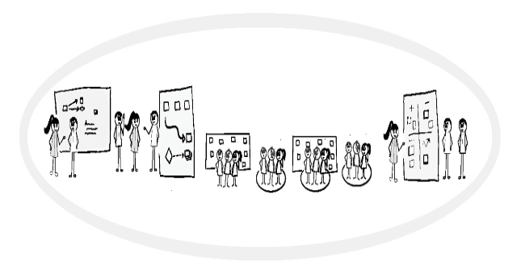
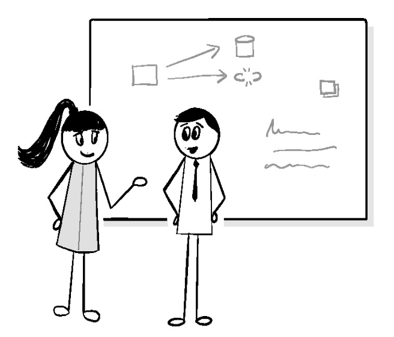
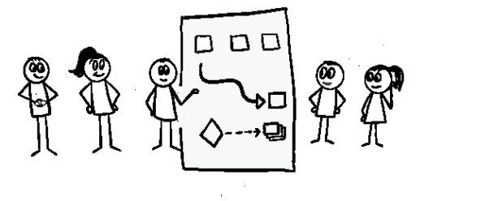

> _Если мы не будем висеть вместе, нас обязательно повесят по отдельности._
>
> --- Томас Пэйн.

Те из нас, кто предоставляет услуги и управляет ими во все более сложных и
динамичных экосистемах, вероятно, обнаружили, что условия могут меняться без
предупреждения, быстро делая наши самые лучшие планы устаревшими. Плохо, когда
это происходит с одним человеком. Это может стать катастрофой, когда это влияет
на осведомленность и согласованность действий всей команды.

Наличие визуального рабочего процесса, а также мастера очереди и руководителя
службы технической поддержки действительно помогает выявить возникающие
изменения и события. Однако без определенных механизмов, гарантирующих, что все
узнают об изменении условий, чтобы они могли скорректировать, отразить и
улучшить ситуацию, неизбежно кто-то будет упущен и останется позади.

Лучший способ установить общую осведомленность --- это набор коммуникационных
механизмов, которые объединяют всех. Чтобы минимизировать сбои, эти механизмы
должны соответствовать ритмам жизни. Следование этим естественным потокам и
циклам позволяет превратить их в естественные привычки, которые снижают уровень
прерывания и рассогласования, вызываемый более традиционными механизмами.

В этой главе мы рассмотрим механизмы, которые, по моим наблюдениям, хорошо
работают в сфере предоставления услуг. Они не только дополняют те механизмы,
которые мы уже рассмотрели, но и обеспечивают пространство для исследования и
обучения, необходимое для внедрения и совершенствования механизмов
инструментации, автоматизации и управления, о которых пойдет речь в последующих
главах.

## Информировать, Cогласовывать, Отражать и Улучшать

Если только ваша экосистема не полна поджигателей, стремящихся к славе через
беспорядок, есть вероятность, что вы и ваша команда хотите знать две вещи:

- Принимаете ли вы правильные решения для достижения целевых результатов?
- Как вы можете улучшить свои решения и действия, чтобы сделать их более
  эффективными?

Принимать эффективные решения может быть удивительно сложно. Недостаточно просто
знать что-то. Чтобы направить действия к желаемому результату, необходимо иметь
достаточно контекста о динамике текущей ситуации (ваше осознанное понимание
ситуации), чтобы сопоставить его с соответствующими знаниями, либо в форме
опыта, либо в форме легкодоступных ресурсов знаний.

Улучшение способности принимать решения требует следующего шага, который
включает в себя анализ конечного результата любого принятого вами решения и
сравнение его с тем, что ожидалось. Если они не совпадают, необходимо выяснить
(или поразмышлять), что стало причиной рассогласования.

Любой ряд событий может вызвать рассогласование, которое может ухудшить принятие
решений, в том числе:

- наличие существенных недостатков в вашем понимании вашего опыта
- устаревшее или неверное понимание ситуации на момент принятия решения
- отсутствие своевременного доступа к соответствующим ресурсам знаний
- Отсутствие достаточно подходящих ресурсов для исполнения
- использование процессов или механизмов исполнения, которые содержат слишком
  много трения (в виде скорости, изменчивости или надежности).

Избежать этих проблем становится сложнее при наличии других участников
экосистемы. Независимо от того, зависите ли вы от их действий или просто
подвержены их влиянию, любой недостаток общей осведомленности или
согласованности может привести к столкновениям или затуманить понимание
фактических последствий и точности ваших решений.

Чтобы противостоять таким тенденциям и поддерживать согласованность, организации
испробовали ряд различных стратегий. Они варьируются от попыток контролировать
согласование с помощью процесса <<сверху вниз>> до предоставления команде
возможности самоорганизоваться и выяснить это самостоятельно. Каждая из них
имеет некоторые ограничения, которые стоит быстро изучить.

## Подход к управлению выравниванием сверху вниз

Наиболее часто используется подход, основанный на управлении <<сверху вниз>>. Он
основан на прямой организации работы, которую выполняет персонал, используя
сочетание методов планирования, а также контроля процессов и методов, которыми
управляет какой-либо руководитель проекта, программы или персонала.

Люди полагаются на подход управления <<сверху вниз>>, потому что он прост,
обеспечивает манящее чувство контроля и соответствует традиционному
управленческому мышлению. Он также может работать в упорядоченной среде, как
определено в главе 5 <<Риск>>. Однако контроль сверху вниз настолько сильно
зависит как от надежно предсказуемой динамики между причиной и следствием
действий, так и от способности человека, управляющего работой, поддерживать
четкий и точный уровень ситуационной осведомленности во всей экосистеме, что
любой промах может привести к каскадному сбою. Если бы это было недостаточно
плохо, такой подход также рассчитывает на то, что менеджер будет находить и
исправлять любые ошибки и стимулировать улучшения в команде. Любое из этих
действий затруднено, когда ваша осведомленность снижается. Также не помогает и
то, что такие неудачи также ведут к снижению доверия между руководством и
командой.

## Выравнивание с помощью итеративных подходов

В другом спектре находятся итеративные подходы в стиле Agile, будь то
циклические подходы, такие как Scrum, или потоковые подходы, такие как Kanban.
Вместо того чтобы пытаться контролировать все централизованно, итеративные
подходы признают, что не все в экосистеме будет ясно, и полагаются на то, что
те, кто выполняет работу, скорее всего, будут иметь самую свежую контекстную
информацию в той области, в которой они находятся. Эти подходы используют
методы, которые пытаются оптимизировать поток этой контекстной информации в
команде доставки, чтобы позволить команде самоорганизоваться, принимать
обоснованные решения и самостоятельно вносить улучшения для более эффективной
доставки.

### Модель спринта Scrum

Стандартная модель Scrum использует частые циклические механизмы для
согласования работы команды с целями заказчика, позволяя при этом координировать
работу более тактически на ежедневных стендапах. Эти циклические механизмы затем
поддерживаются как показом и рассказом в конце спринта, чтобы получить обратную
связь от клиента о том, насколько работа соответствует его ожиданиям, так и
ретроспективой, которая позволяет команде осмыслить собственные проблемы, внести
коррективы и научиться.

Все это позволяет гораздо лучше информировать и согласовывать работу друг с
другом и приоритетами заинтересованных сторон. Это также достаточно хорошая
работа по стимулированию команды к размышлению и совершенствованию. 

К сожалению, слабость этой модели заключается в том, что она не очень хорошо
справляется с незапланированной реактивной оперативной работой, которая является
основой DevOps. Для того чтобы выстроить надежный итерационный ритм и регулярно
получать полезную обратную связь от заказчика, эта модель рассчитывает на то,
что работа будет спланирована и приоритезирована заранее, а затем останется
статичной на протяжении всего спринта.

Когда на команду обрушивается слишком много незапланированной работы, возникает
риск того, что все это сломается. Наиболее сильно это ощущается в механизмах
циклического выравнивания. Большинство действий по согласованию, как правило,
происходит на этапе планирования спринта, когда владелец продукта может работать
с командой, чтобы определить зависимости и области, в которых члены команды
должны координировать друг с другом. Хотя отличный Scrum-мастер или владелец
продукта могут в некоторой степени помочь распутать беспорядок, вызванный
незапланированной работой во время спринта, им часто мешает отсутствие
достаточно глубокого уровня видимости и ситуационной осведомленности в
экосистеме, чтобы действительно помочь.

### Kanban

В отличие от Scrum, канбан процветает, когда задачи непредсказуемы. Именно
поэтому многие его элементы составляют важные части рабочего процесса,
описанного в главе 12, <<Рабочий процесс>>. Ориентируясь на поток задач и объем
незавершенной работы, он позволяет в любое время изменять порядок задач и
вставлять новые. Есть даже средство ускорения срочной работы.

Однако одна из самых больших проблем с командами, использующими канбан,
заключается в том, что многие из них упускают из виду необходимость
синхронизации, согласования и улучшения работы между командами. Это не потому,
что при создании канбан эта необходимость была проигнорирована. Канбан, как
описал его Дэвид Андерсон, предусматривает ежедневные стендапы, как в Scrum, где
каждый <<ходит по доске>>, а кто-то выступает в роли фасилитатора. Эти
ежедневные стендапы, а также встречи после них позволяют команде находить и
устранять блокирующие факторы, а также поддерживать синхронизацию. Существуют
также собрания по пополнению очереди, которые похожи на планирование спринта в
Scrum, поскольку они обеспечивают согласованное понимание приоритетов и целей, а
также планирование релиза и даже сессии обзора и улучшения.

Проблемы начинаются с того, что большинство команд не понимают, что стоит за
этими механизмами. Вместо того чтобы думать о целевых результатах, о том, как
поддерживать согласованность в команде, о постоянном обучении и
совершенствовании, большинство сосредотачивается на доске и количестве задач,
которые они выполняют. Результатами и приоритетами часто пренебрегают или
забывают о них, если не происходит эскалации. Анализ и совершенствование, как
правило, вообще игнорируются.

Даже когда циклические механизмы выполняются, большинство из них не достигают
своей основной цели. Ежедневные совещания, как правило, сводятся к тому, кто
кого блокирует, а не к тому, что каждый смотрит на весь совет директоров, чтобы
понять, что происходит.

Потеря значения этих точек синхронизации или их полное исчезновение ---
настолько распространенное явление, что опытному глазу не требуется больших
усилий, чтобы просканировать плату и увидеть, что это происходит. Это оставляет
четкую тень фрагментации, которая снижает согласованность и эффективность работы
команды, использующей эту систему.

## Синхронизация и совершенствование сервисных операций

Теперь, когда мы знаем, где обычные методы выравнивания обычно не работают, что
можно сделать, чтобы преодолеть эти проблемы?

Вместо того чтобы начинать с нуля, мы используем положительный опыт итеративных
подходов. Начнем с kanban-подобного рабочего процесса, как описано в главе 12.
Затем мы добавляем элементы, основанные на циклах и точках синхронизации как
Scrum, так и kanban, но с парой важных поворотов.

Первое --- это введение Мастера очереди и Лидера сервисной инженерии. Как вы
увидите в этой главе, оба они играют важную роль в преодолении многих проблем,
связанных с поддержанием ситуационной осведомленности и согласованности всей
команды.

Второе более интересно. Постоянно реагируя на незапланированную работу, команды
начинают все больше ориентироваться на тактику. Эта тенденция может отразиться
на механизмах согласования и совершенствования, заставляя команды мыслить более
краткосрочно, что неоптимизирует улучшения и обучение, которых они могут
достичь.

По этой причине я пришел к выводу, что разумнее разделить эти циклы на два.
Первый --- это более короткий тактический цикл, большая часть которого имеет
элементы, знакомые по итерационным циклам Agile. Второй --- это более длительный
стратегический цикл, который направлен на более глубокое решение проблем и
совершенствование, чтобы помочь команде более эффективно достигать целевых
результатов. 

Давайте пройдемся по каждому из них, чтобы лучше их понять.

## Тактический цикл

Тактический цикл в основном направлен на информирование и согласование команды
на ежедневной основе. Многие его аспекты схожи со спринтом Scrum. Он
сосредоточен на рабочем процессе и возглавляется мастером очереди. Как следует
из названия, цикл содержит механизмы, призванные помочь в тактической
расстановке приоритетов, распределении ресурсов, планировании мероприятий и
разрешении конфликтов. Рефлексия и совершенствование также являются важными
элементами, но, как правило, они жестко привязаны либо к насущным потребностям,
либо к целевым результатам, установленным в рамках стратегического цикла.

**Рисунок 14.1**\
Тактический цикл.

Продолжительность цикла обычно составляет одну неделю, чтобы улучшить
возможности адаптации к результатам, полученным в ходе реактивной работы.

Если разработка ведется отдельной командой, полезно, по возможности, согласовать
начало тактического цикла с началом спринта разработки. Это позволяет
руководителям SE быстро оценить и согласовать ресурсы и расписание работ в
разных командах. Если по каким-то причинам согласование невозможно,
руководителям SE необходимо тесно сотрудничать с командой доставки до начала
цикла, чтобы попытаться определить, что может потребоваться. Даже несколько
неточное представление может помочь мастеру очереди и команде ограничить
потенциально опасные сюрпризы.

Мастер очереди обычно сменяется в каждом цикле. Это полезно по двум причинам.
Во-первых, это позволяет регулярно смотреть свежим взглядом на то, что
происходит в экосистеме. Во-вторых, работа, которую должен проделать новый
мастер очереди, чтобы войти в курс дела, дает новому и предыдущему мастерам
очереди возможность сравнить заметки и получить свежий взгляд на все, начиная с
текущего состояния рабочего процесса и заканчивая любыми невыполненными
действиями предыдущего цикла, а также любыми известными блокировщиками или
известными поступающими работами. Такой брифинг мастера очереди за несколько
часов до начала нового тактического цикла может помочь предотвратить опасное
самоуспокоение как мастера очереди, так и всей команды. Ничто так быстро не
побуждает людей оттачивать свое понимание ситуации, как возможность неосознанно
получить в руки бушующий пожар в мусорной корзине.

После инструктажа нового мастера очереди на цикл этот цикл начинается с запуска
цикла. Также проводятся ежедневные стендапы, а завершается цикл ретроспективой.
Хотя сходство с аналогами Agile полезно, как отмечалось ранее, есть ряд важных
различий.

### Краткое описание мастера очереди

**Рисунок 14.2**\
Краткое изложение между текущей и последующей QM является важным первым шагом.

Хотя тактический цикл является непрерывным, человек, выполняющий роль мастера
очереди, не всегда один и тот же. По этой причине мастеру очереди необходимо
пройти ряд шагов, чтобы подготовиться к плавной передаче.

Этот процесс начинается за несколько часов до начала совещания по запуску цикла
и занимает обычно длится столько, сколько нужно. Он начинается с того, что
текущий мастер очереди просматривает доску рабочих процессов вместе с новым
мастером очереди. Это обычно короткий процесс, и в основном он направлен на
обеспечение дополнительного контекста для тех действий, которые могут быть
слишком длинными или не подходить для обсуждения с остальными членами команды во
время ретроспективного или стартового совещания.

После этого новый мастер очереди обычно получает от всех руководителей сервисной
инженерии краткую информацию о предстоящих важных событиях или запланированных
работах. Цель здесь двоякая. Первая --- убедиться, что ведущие инженеры по
обслуживанию раскрыли все предстоящие работы, которые, возможно, не попали на
рассмотрение совета директоров. Другая цель --- выявить любые потенциальные
потребности в ресурсах и зависимости, которые не могут быть решены только силами
команды и требуют помощи руководства. Это поможет свести к минимуму конфликты
ресурсов, которые могут внезапно сорвать стартовую встречу.

После этого новый мастер очереди должен связаться с руководством и/или ключевыми
бизнес-контактами. Это необходимо для того, чтобы узнать о любых изменениях в
приоритетах, предстоящих разработках или деловых мероприятиях, которые могут
обеспечить полезный контекст или выявить потенциальный операционный риск или
ограничения в течение предстоящего цикла. В случае необходимости, следует
сообщать о конфликтах, связанных с ресурсами и расписанием. Иногда имеет смысл
организовать присутствие кого-либо из руководства на старте, чтобы ответить на
вопросы и дать указания.

К тому времени, когда мастер очереди закончит работу, у него должен быть
приличный план, который поможет сконцентрировать внимание на стартовой встрече.

### Начало цикла

**Рисунок 14.3**\
Начало цикла.

Цикл всегда начинается со старта. Цель стартового мероприятия --- собрать
команду вместе, чтобы согласовать приоритеты и тему цикла. Это делается для
того, чтобы помочь сплотить команду, а также создать форум для выявления
потенциальных потребностей в ресурсах и навыках на предстоящий цикл. Поскольку
мастер очереди должен обеспечить поток работы в течение цикла, он лучше всего
подходит для проведения стартового совещания.

Когда проводится стартовое совещание, сначала следует определить тему цикла,
если таковая имеется, а также ранжировать приоритеты команды. Затем следует
быстрый обзор препятствий в разработке, бизнесе и операционной деятельности,
чтобы все были в курсе. Затем каждый SE Lead переходит к предстоящим событиям в
своих проектах, наряду с любыми деталями, контекстом и ресурсами, необходимыми
для предстоящей работы, которая должна быть запланирована и выполнена. После
этого мастер очереди проходит через весь рабочий процесс, задавая любые вопросы
и убеждаясь, что члены команды знают о любых проблемах, которые могут помешать
выполнению запланированной или важной работы, или о том, что может помешать или
замедлить темп работы. Согласованные элементы улучшения подбираются и помещаются
в очередь готовности вместе с другими готовыми известными работами. Как только
все придут в порядок, совещание заканчивается.

## Важные различия между стартовым и спринт-планированием

Для некоторых людей старт может выглядеть как несколько урезанное планирование
спринта или собрание по пополнению очереди канбан. Сходства достаточно, чтобы
можно было наложить эти два понятия на команды, которые занимаются как
разработкой, так и эксплуатацией. Однако прежде чем это сделать, необходимо
знать о некоторых очень важных различиях.

Первое заключается в том, что непредсказуемый характер оперативной работы
означает, что глупо загружать цикл до отказа заранее запланированной работой и
ожидать, что все будет сделано. Невозможно предугадать, будут ли мощности сильно
ограничены в результате оперативной катастрофы, высокоприоритетных аварийных
работ или какого-либо другого события. Это затрудняет планирование и
координацию.

Лучший способ борьбы с этой непредсказуемостью --- ограничить количество
сотрудников, которые подвержены ее прерыванию. Создание роли мастера очереди
может значительно помочь в этом. Еще один полезный способ борьбы с
непредсказуемостью --- ограничить размер и неравномерное распределение рабочих
элементов. Это включает в себя минимизацию количества задач, требующих плохо
распределенных специализированных навыков. Это повышает гибкость команды, делая
ущерб, наносимый неожиданными прерываниями, которые все же проскальзывают,
гораздо менее серьезным.

Сам рабочий процесс также полезен для того, чтобы дать вам разумное
представление не только о вероятной слабине в возможностях команды для
прерываний, но и о том, какое влияние могут оказать определенные типы
прерываний. Это полезно для формирования ожиданий и снижения рисков.

Еще одно важное отличие заключается в том, что, в отличие от Scrum, редко бывает
стабильный набор приоритетных рабочих элементов, поступающих от одной
заинтересованной стороны. Непредсказуемость требований клиентов, инфраструктуры,
безопасности и даже организации означает, что вновь поступающая работа может
легко вытеснить другие высокоприоритетные задачи в середине цикла. Мастер
очереди и руководители SE должны помочь значительно уменьшить эту
непредсказуемость, хотя вряд ли она исчезнет полностью.

На боковой панели приведен пример совещания по началу цикла, который поможет вам
понять его типичную динамику.

> #### Начало
> Настала очередь Эда быть мастером очереди. Недели <<мастера очереди>> всегда
> немного мешали работе, но Эд очень ценил то, что они давали возможность
> увидеть картину в целом. Они также помогали ему почувствовать, что он вносит
> реальный вклад в работу команды.
> 
> Он знал, что ему нужно подготовиться к стартовой встрече в тот же день,
> поэтому он взял ручку и блокнот и подошел к доске рабочих процессов, чтобы
> взглянуть на нее. Он уже был хорошо знаком с ее текущим состоянием, но знал,
> что всегда есть вероятность того, что он чего-то не заметил, пока занимался
> своей работой. Сделав несколько быстрых заметок, он мог потом спросить о
> чем-нибудь, что, по его мнению, могло ему понадобиться.
> 
> Совет был занят, как никогда. За последнюю неделю команда справилась со
> многими задачами, хотя кое-что можно было сделать и получше. Например,
> дежурная смена Кэти была гораздо более загруженной, чем обычно, что означало,
> что у нее остался значительный объем работы по изучению новейших технологий
> облачного кэширования. Были также некоторые задачи из группы, в которой Бет
> была руководителем SE, которые она передала Саймону, пока была мастером
> очереди, и которые пошли не совсем по плану. Эд был уверен, что этот вопрос
> будет поднят на ретроспективе. Всем нужно было знать, были ли проблемы с
> коммуникацией или передачей, или даже если эта раздражающая проблема доверия
> <<это не наш руководитель>> снова всплыла в командах доставки, когда работу
> взяли на себя другие.
> 
> Эд видел, что Эмили уже заполнила колонку <<Готовность>> кучей работ, которые
> необходимо было выполнить для подготовки к предстоящему релизу команды Feeds.
> Она всегда была самым инициативным SE Lead в команде. Эд всегда поражался
> тому, как тщательно она все контролирует. В то же время он заметил, что она
> внесла пару пунктов, которые, похоже, могли касаться некоторых сервисов, над
> которыми работала команда, в которой Бет была ведущей. Он сделал пометку
> спросить, согласованы ли они по этому вопросу.
> 
> После просмотра доски пришло время посетить мастера очереди текущей недели.
> Бет была занята тем, что собирала свои записи за неделю и завершала некоторые
> из оставшихся пунктов <<Темной материи>>.
> 
> <<Привет, Бет, как проходит неделя?>>
> 
> <<В основном нормально>>, --- ответила Бет. <<Мне пришлось разрядить очередную
> ситуацию <<о боже, ты должен сделать эту вещь, о которой я забыла тебе сказать
> уже две недели>> от Продукта. Они совершенно забыли, что им нужна бета-версия
> нового механизма отчетности и достаточно данных для ее заполнения для торговой
> выставки на следующей неделе. Если бы мы не интегрировали инструменты
> управления окружением Danela в процесс сборки, им бы совсем не повезло>>.
> 
> <<По крайней мере, об этом позаботились>>, --- размышляет Эд.
> 
> <<Да, определенно. В любом случае, рабочий процесс находится в приличной
> форме. Мне нужно закончить некоторые задачи по архивированию Темной материи,
> и, наверное, мне стоит поговорить с Саймоном перед ретро>>.
> 
> <<О, я заметил, что некоторые работы Эмили затрагивают ваш проект>>.
> 
> <<Я заметил. Спасибо, что напомнили!>> --- ответила Бет. <<Я подниму этот
> вопрос на старте, если Саймон не знает об этом>>. Эд заглянул в офис Билли,
> чтобы узнать, нет ли чего-нибудь важного на следующей неделе. Он также зашел к
> Джанет, чтобы убедиться, что для торговой выставки все более или менее готово.
> Затем он быстро встретился с каждым из ведущих специалистов перед самым
> началом ретроспективы.
> 
> Команда решила, что наиболее целесообразно проводить начало новой недели в
> пятницу после обеда, сразу после ретроспективы. Некоторым членам команды это
> показалось немного неудобным. Большинство из них к концу недели сильно
> уставали, и, хотя совет директоров и Мастера очереди обычно все улавливали к
> понедельнику, они могли забыть некоторый контекст того, что обсуждалось. Кроме
> того, существовала проблема, связанная с тем, что некоторые крупные релизы,
> влияющие на клиентов, как правило, выходили в выходные дни, чтобы
> минимизировать их влияние на клиентов. В результате иногда оставались
> последствия, которые нужно было устранять в следующий понедельник. Понедельник
> всегда был занят, поэтому было трудно выделить время для начала работы.
> Проведение стартапа рядом с ретроспективой также было очень полезным, так как
> это позволяло сразу же внедрить опыт предыдущей недели в следующую итерацию.
> Бывало и так, что начало работы непосредственно перед выходными было полезным,
> хотя бы для того, чтобы дать людям возможность подготовиться к следующей
> неделе.
> 
> Чтобы справиться с <<проблемой забывания>>, они договорились, что в
> понедельник непосредственно перед стенд-апом мастер очереди будет делать
> 5-минутный обзор.
> 
> Когда началась встреча, стало ясно, что две главные темы предстоящей недели -
> это подготовка к релизу, над которым работала Эмили, и помощь Кэти с ее
> проектом. С помощью Бет Эд быстро охватил масштаб торговой выставки. Несмотря
> на то, что в проекте участвовала Джанет, а код все еще был бета-версией,
> большая часть того, что будет демонстрироваться на выставке, была довольно
> статичной и поэтому не вызывала особых проблем.
> 
> Затем Эмили начала перечислять пункты, которые ей предстояло сделать. <<Итак,
> ребята, у меня есть шесть задач, которые я планирую выполнить на следующей
> неделе. Два первых пункта --- это то, с чем я определенно хочу справиться.
> Третий пункт дает довольно хороший обзор того, о чем будет релиз, поэтому его
> должен сделать кто-то другой, кроме меня. Четвертый пункт должен быть выполнен
> до двух последних, поэтому я пометила его как зависимый>>.
> 
> Бет указала на последнюю и сказала: <<Похоже, она затрагивает службу передачи
> данных, над которой работают люди из моей команды>>.
> 
> <<Да, это так>>, --- ответила Эмили. <<Возможно, вы захотите заняться этим
> вопросом. Давайте встретимся после этого и поговорим. Я бы хотела убедиться,
> что мы не создаем проблем>>.
> 
> <<Конечно>>, --- ответила Бет.
> 
> После этого Кэти перешла к рассмотрению пунктов своего проекта по кэшированию.
> Сэм предложил попробовать забрать некоторые из них, чтобы помочь.
> 
> Затем Бет перечислила три пункта, которые были у нее, и сказала, что, скорее
> всего, появятся еще несколько, но поскольку команда еще не проработала детали
> следующего спринта, не имеет смысла размещать еще несколько.
> 
> Когда все закончили, настала очередь Данелы. Данела была инженером по
> инструментам и автоматизации в команде. Она бралась за создание всего, на что
> у других не хватало времени или навыков. Большая часть ее работы возникала из
> проблем, обсуждавшихся на ретроспективе, которые, по мнению команды, нуждались
> в помощи автоматизации для решения. Затем команда определяла их приоритетность
> на старте. Ей нечасто приходилось реагировать на что-то в течение итерации,
> поэтому она обычно могла взять на себя обязательства по стабильному набору
> рабочих элементов.
> 
> На этой итерации Данела собиралась продолжить работу над некоторыми функциями
> протоколирования и аудита для инструментария автоматического развертывания. Во
> многом это было связано с необходимостью авторитетного отчета о конфигурациях
> экземпляров и сервисов на определенные даты, а также списка того, кто и какие
> изменения установил на них в какие даты. Поскольку других неотложных дел не
> было, команда задала несколько вопросов о ее подходе и планах по его
> реализации, но в основном оставила ее наедине с собой.
> 
> Эд чувствовал себя довольно хорошо в отношении итерации, когда они завершили
> встречу. Все казалось гораздо более контролируемым и видимым, чем до того, как
> они начали проводить итерации. Даже с предсказуемым незапланированным спросом
> со стороны продукта теперь было гораздо легче справиться.

## Ежедневный стендап

**Рисунок 14.4**\
Ежедневный стендап.

Второй из механизмов итерации --- это ежедневный стендап. Ежедневный стендап
проводится для повышения осведомленности всей команды. Как и его аналог,
связанный с разработкой, он проводится ежедневно и намеренно короткий. Он
предназначен для повышения способности команды обнаружить и разобраться с любыми
возникающими проблемами, конфликтами или возможностями координации, которые в
противном случае могут быть упущены или произойти позже, чем это было бы
оптимально. Как и в случае с разработкой, ежедневный стенд-ап не является
совещанием по статусу и никогда не должен становиться тяжеловесным. Главное -
упоминать только то, о чем другие должны знать. В структуре стенд-апа сервисных
операций есть несколько незначительных отличий, о которых стоит упомянуть.
Первое заключается в том, что роль фасилитатора Scrum-мастер выполняет мастер
очереди. Цели мастера очереди во многом схожи: стенд-ап должен быть коротким
(желательно не более 15 минут) и сосредоточен на синхронизации членов команды, а
также на помощи людям с блокировками и конфликтами. Различия заключаются в том,
что мастер очереди использует рабочий процесс как инструмент для информирования
и выявления конфликтов.

Стендап начинается с краткого отчета того, кто был дежурным во время любых
производственных инцидентов, о которых стоит упомянуть. Это действительно
краткое предупреждение о проблемных зонах, о том, продолжается ли проблема, кто,
если кто-то, все еще занимается ею, и есть ли отчет об инциденте, который люди
могут посмотреть. Главное --- оставаться кратким. При необходимости более
глубокое обсуждение можно провести после.

Затем ведущим становится мастер очереди. Он упоминает основные моменты рабочего
процесса, в том числе любую интересную, важную или высокоприоритетную работу, о
которой люди должны знать в очереди, заметили ли они потенциальную проблему в
одной или нескольких задачах, на которую нужно обратить внимание людей, и есть
ли какие-либо зависимости или блокирующие факторы, о которых люди должны знать.

После мастера очереди возможность высказаться предоставляется всей команде. Для
команд, занимающихся разработкой и эксплуатацией с двойной нагрузкой, это может
быть как обычное собрание. Для специализированных операционных команд это часто
может быть намного быстрее, чем обычное совещание. При наличии всей работы на
доске, каждому члену команды достаточно упомянуть конкретные пункты, о которых,
по его мнению, люди должны знать, как о проделанной работе, так и о предстоящей.
Они также могут поднимать вопросы или проблемы, связанные с конкретным делом,
которые затем должны быть рассмотрены после окончания собрания.

> #### Стендап
>
> Был вторник, и неделя работы Эда в качестве мастера очереди проходила пока
> довольно хорошо. Конечно, все еще были обычные неясные запросы типа <<Можешь
> ли ты сделать эту штуку с сервером?>>, которые каждый QM должен был
> отбрасывать назад для уточнения. Но в основном поток задач через рабочий
> процесс проходил довольно гладко.
> 
> На этой неделе Саймон был дежурным, поэтому Эд попросил Саймона начать.
> 
> <<Прошлой ночью была пара сбоев в планировщике>>, --- ворчал довольно хмурый
> Саймон. <<Ничего серьезного. Я знаю, что Бет занимается этим, так что я дам ей
> знать, если найду что-нибудь интересное>>.
> 
> Следующей была очередь Эда. Обычно мастер очереди начинает с того, что
> обращает внимание на все эскалированные или ускоренные работы, затем
> спрашивает о любых заблокированных или проблемных работах в рабочем процессе.
> Сегодня единственными пунктами, которые следовало отметить, были некоторые
> важные части работы, поставленные в очередь для развертывания, которое вели
> Бет и Эмили. Он упомянул о них, но затем предоставил этим двум заполнить все
> детали.
> 
> Следующим был Сэм. <<Я могу сегодня взять необходимое задание из команды
> Эмили, если все будет в порядке и не возникнет других серьезных проблем. Я
> синхронизирую с Эмили после этого>>.
> 
> <<Хорошо, конечно>>, --- ответила Эмили.
>
> Эмили была следующей. Она выполнила первый пункт, но появилось еще несколько
> пунктов, которые нужно было загрузить в очередь.
> 
> <<Мы планируем развертывание на следующей неделе>>, --- заявила Эмили. <<В
> отличие от Бет, здесь не так много важных изменений. Я уже обновила вики
> <<Арсенала>> и укажу на некоторые интересные моменты на ретроспективе>>.
> 
> Затем выступил Томас. Он отметил, что у него два задания в процессе
> выполнения, потому что он по неосторожности взял одно задание, которое было
> необходимым условием второго. Он отметил, что хотел бы обсудить, как
> предотвратить это на ретроспективе в конце недели.
> 
> Следующей была Бет. <<Ну, время сбоя планировщика было довольно удобным. Майк
> глубоко залез в этот код>>. Затем она протянула руку и переместила две задачи
> из колонки <<Готовность>>. <<Нам нужно повременить с этими двумя задачами,
> пока Саймон, Майк и я не разберемся в том, что произошло. Остальные все еще в
> силе. Возможно, я добавлю еще парочку сегодня позже. Как всегда, дайте мне
> знать, если у вас возникнут вопросы по любому из этих заданий>>.
> 
> Данела была последней. <<Я готовлюсь к обновлению Депо и Мистера Криминалиста
> сегодня позже. Пока что изменения незначительны. Как всегда, было бы хорошо
> получить любую обратную связь. Сначала я планирую обновить сторону постановки.
> Если все будет в порядке, я разверну его в производстве. Я обязательно зайду и
> поговорю с Эмили и Бет, прежде чем что-то делать. Дайте мне знать, если
> кому-то из вас интересно узнать больше>>.
> 
> Эд завершил разговор, и все начали свой день.