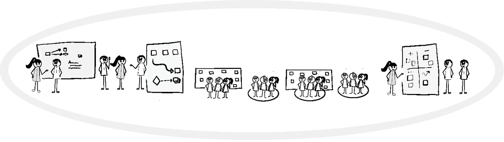
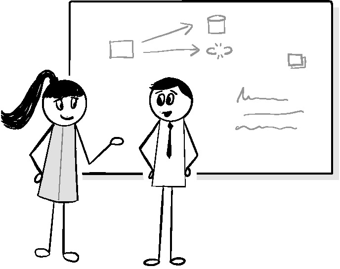
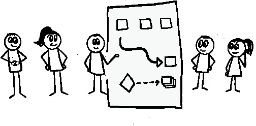
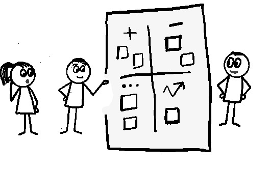
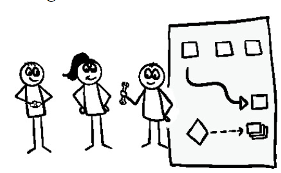
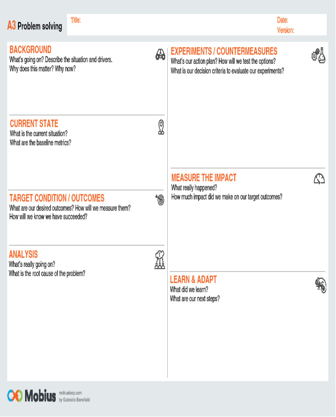

> _Если мы не будем держаться вместе, мы обязательно будем висеть по
> отдельности._
>
> --- Томас Пейн

Те из нас, кто предоставляет услуги и управляет ими во все более сложных и
динамичных экосистемах, вероятно, обнаружили, что условия могут меняться без
предупреждения, быстро приводя к устареванию наших наилучших планов. Это
достаточно плохо, когда это происходит с одним человеком. Это может привести к
катастрофическим последствиям, когда это влияет на осведомленность и
согласованность всей команды.

Наличие визуального рабочего процесса, а также Мастера Очереди (Queue Master) и
ведущего специалиста по сервисному инжинирингу (Service Engineering Lead)
действительно помогает выявлять возникающие изменения и события. Однако без
наличия определенных механизмов, позволяющих всем быть в курсе изменившихся
условий, чтобы они могли корректировать, размышлять и улучшать, неизбежно кто-то
что-то упустит и останется за бортом.

Лучший способ добиться такой общей осведомленности - это использовать набор
коммуникационных механизмов, которые объединяют всех. Чтобы свести к минимуму
негативные последствия, эти механизмы должны соответствовать ритмам жизни.
Следование этим естественным потокам и циклам во многом способствует превращению
их в естественные привычки, которые снижают уровень прерываний и
рассогласований, вызываемых более традиционными механизмами.

В этой главе мы рассмотрим механизмы, которые, по моему мнению, хорошо работают
в сфере предоставления услуг. Они не только дополняют те механизмы, которые мы
уже рассмотрели, но и предоставляют пространство для исследований и обучения,
необходимое для внедрения и совершенствования инструментария, автоматизации и
механизмов управления, описанных в последующих главах.

## Информируйте, согласовывайте, размышляйте и улучшайте

Если ваша экосистема не полна поджигателей, стремящихся к славе с помощью
беспорядка, скорее всего, вы и ваша команда хотите знать две вещи:

* Принимаете ли вы правильные решения для достижения целевых результатов?

* Как вы можете совершенствоваться, чтобы сделать процесс принятия решений и
  действия более эффективными?

Принимать эффективные решения бывает на удивление сложно. Недостаточно просто
что-то знать. Чтобы направлять действия к желаемому результату, вам необходимо
иметь достаточное представление о динамике текущей ситуации (ваша осознанная
ситуационная осведомленность), чтобы соответствовать соответствующим знаниям,
будь то в виде опыта или легкодоступных информационных ресурсов.

Улучшение ваших способностей к принятию решений требует дальнейшего шага,
который включает в себя анализ конечного результата любого принятого вами
решения и сравнение его с ожидаемым. Если результаты не совпадают, вам
необходимо выяснить (или поразмыслить), что вызвало несоответствие.

Любое количество событий может привести к несогласованности, которая может
ухудшить процесс принятия решений, в том числе:

* Наличие существенных недостатков в вашем понимании вашего опыта

* Устаревшая или неправильная ситуационная осведомленность на момент принятия
  решения

* Отсутствие своевременного доступа к соответствующим информационным ресурсам

* Отсутствие достаточного количества подходящих ресурсов для выполнения

* Использование процессов или механизмов выполнения, которые вызывают слишком
  много разногласий (в виде скорости, изменчивости или надежности)

При взаимодействии с другими участниками экосистемы избежать этих проблем
становится сложнее. Независимо от того, зависите ли вы от их действий или просто
находитесь под их влиянием, любой недостаток общей осведомленности или
согласованности может привести к конфликтам или затруднить понимание фактических
последствий и точности ваших решений.

Чтобы противостоять таким тенденциям и поддерживать согласованность, организации
испробовали ряд различных стратегий. Они варьируются от попыток контролировать
согласование с помощью нисходящего процесса до предоставления команде
возможности самоорганизоваться и разобраться с этим самостоятельно. У каждой из
них есть некоторые ограничения, которые стоит быстро изучить.

## Подход к управлению выравниванием сверху вниз

Наиболее часто используется нисходящий подход к управлению. Он основан на прямой
координации работы, выполняемой персоналом, с использованием различных методов
планирования, а также контроля процессов и методов, которыми управляет
какой-либо проект, программа или менеджер по персоналу.

Люди полагаются на подход к управлению <<сверху вниз>>, потому что он прост,
дает привлекательное ощущение контроля и соответствует традиционному
управленческому мышлению. Он также может работать в упорядоченных средах, как
описано в главе 5 <<Риск>>. Однако нисходящее управление настолько сильно
зависит как от надежно предсказуемой динамики между причиной и следствием
действий, так и от способности человека, управляющего работой, поддерживать
четкий и безошибочный уровень ситуационной осведомленности во всей экосистеме,
что любое отклонение от них может привести к каскадному сбою. Если этого
недостаточно, то такой подход также предполагает, что менеджер сможет найти и
исправить любые ошибки и провести улучшения в команде. И то, и другое сложно,
когда ваша осведомленность снижается. Также не помогает тот факт, что такие
сбои, как правило, снижают доверие между руководством и командой.

## Согласование с помощью итеративных Подходов

Все большее распространение получают итеративные подходы в стиле Agile, будь то
более циклические подходы, такие как Scrum, или подходы, основанные на потоках,
такие как Kanban. Вместо того чтобы пытаться контролировать все централизованно,
итеративные подходы допускают, что не все в экосистеме будет четко, и вместо
этого полагаются на тот факт, что те, кто выполняет работу, скорее всего, будут
располагать самой актуальной контекстуальной информацией в той области, в
которой они находятся. В этих подходах используются методы, направленные на
оптимизацию потока контекстуальной информации в группе доставки, что позволяет
команде самоорганизовываться, принимать обоснованные решения и самостоятельно
вносить улучшения для повышения эффективности доставки.

### Модель Scrum-спринтов

Стандартная модель Scrum использует частые циклические механизмы для приведения
командной работы в соответствие с целями заказчика, а также позволяет более
тактично координировать работу на ежедневных встречах. Эти циклические механизмы
затем поддерживаются как демонстрацией и рассказом в конце спринта, чтобы
получить обратную связь от заказчика о том, насколько работа соответствует его
ожиданиям, так и ретроспективой, которая позволяет команде проанализировать свои
собственные проблемы, внести коррективы и извлечь уроки..

Все это гораздо эффективнее помогает всем быть в курсе событий и согласовывать
свои действия друг с другом и с приоритетами заинтересованных сторон. Это также
достаточно эффективно стимулирует команду к размышлениям и совершенствованию.

К сожалению, слабость этой модели заключается в том, что она не особенно хорошо
справляется с незапланированной оперативной работой, которая является основой
DevOps. Чтобы создать надежный итеративный ритм и регулярно получать полезную
обратную связь от заказчика, эта модель предполагает предварительное
планирование работы и определение приоритетов, а затем сохранение статичности в
течение всего спринта.

Когда на команду обрушивается слишком много незапланированной работы, возникает
риск того, что все это выйдет из строя. Наиболее сильно это ощущается в
механизмах циклического согласования. Большая часть действий по согласованию,
как правило, выполняется при планировании спринта, когда владелец продукта может
работать с командой, чтобы определить зависимости и области, в которых члены
команды должны координировать свои действия друг с другом. Хотя отличный
Scrum-мастер или владелец продукта могли бы в какой-то мере помочь распутать
путаницу, вызванную незапланированной работой во время спринта, им часто мешает
отсутствие достаточно глубокого понимания ситуации в экосистеме, чтобы
действительно помочь.

### Kanban

В отличие от Scrum, канбан эффективен, когда задачи непредсказуемы. Именно
поэтому многие элементы ИТ являются важными составляющими рабочего процесса,
описанного в главе 12 <<Рабочий процесс>>. Ориентируясь на поток задач и объем
выполняемой работы, он позволяет изменять порядок выполнения задач и добавлять
новые в любое время. Существует даже средство для ускорения срочной работы.

Однако одна из самых больших проблем команд, использующих канбан, заключается в
том, что многие из них склонны упускать из виду необходимость межкомандной
синхронизации, согласования и улучшения. Это не потому, что эта необходимость
была проигнорирована при создании канбана. В Канбане, по описанию Дэвида
Андерсона, ежедневные стендапы очень похожи на Scrum, где каждый <<ходит по
доске>>, а кто-то выступает в роли фасилитатора. Эти ежедневные стендапы, а
также встречи после них, позволяют команде находить и устранять препятствия, а
также поддерживать синхронность. Существуют также совещания по пополнению
очереди, которые похожи на планирование спринта в Scrum в том смысле, что они
обеспечивают согласованное понимание приоритетов и целей, а также планирование
выпуска и даже сеансы проверки и улучшения.

Проблемы начинаются с того, что большинство команд упускают из виду цель,
стоящую за этими механизмами. Вместо того чтобы думать о целевых результатах, о
том, как поддерживать согласованность в команде, а также о постоянном обучении и
совершенствовании, большинство из них сосредотачиваются на доске и количестве
задач, которые они выполняют. Результатами и приоритетами часто пренебрегают или
о них забывают, если только не происходит эскалация. Анализ и улучшение, как
правило, полностью игнорируются.

Даже когда задействованы циклические механизмы, большинство из них не достигают
своей основной цели. Ежедневные стэндапы, как правило, сводятся к тому, кто кого
блокирует, а не к тому, чтобы все смотрели на доску целиком, чтобы понять, что
происходит.

Потеря значения этих точек синхронизации или их полное отключение настолько
распространены, что опытному наблюдателю не требуется особых усилий, чтобы
просканировать доску и увидеть, что это происходит. Это оставляет явную тень
фрагментации, которая снижает согласованность и эффективность работы команды,
использующей ее.

## Синхронизация и улучшение сервисных операций

Теперь, когда мы знаем, где обычные методы выравнивания, как правило, не
работают, что можно сделать, чтобы преодолеть эти проблемы?

Вместо того, чтобы начинать с нуля, мы основываемся на результатах итеративных
подходов. Все начинается с рабочего процесса, подобного канбану, как описано в
главе 12. Затем мы добавляем элементы, основанные на циклах и точках
синхронизации как Scrum, так и kanban, но с несколькими важными изменениями.

Во-первых, вводятся должности начальника очереди и специалиста по техническому
обслуживанию. Как вы увидите в этой главе, оба они играют важную роль в
преодолении многих проблем, связанных с ситуационной осведомленностью и
согласованностью действий всей команды.

Второй вариант более интересен. Вынужденные постоянно реагировать на
незапланированную работу, команды начинают все больше ориентироваться на
тактику. Эта тенденция может сказаться на механизмах согласования и улучшения,
заставляя команды мыслить гораздо более краткосрочно, что не позволяет
оптимизировать возможные улучшения и обучение.

По этой причине я пришел к выводу, что разумнее разделить эти циклы на два.
Первый - это более короткий тактический цикл, большая часть которого содержит
элементы, характерные для итеративных циклов Agile. Второй - гораздо более
длительный стратегический цикл, который направлен на более глубокое решение
проблем и совершенствование, чтобы помочь команде более эффективно достигать
поставленных целей.

Давайте рассмотрим каждый из них, чтобы лучше понять.

### Тактический цикл

Тактический цикл в первую очередь направлен на информирование команды и
согласование действий на ежедневной основе. Во многом он похож на Scrum-спринт.
Он сосредоточен на рабочем процессе и управляется руководителем очереди. Как
следует из названия, цикл содержит механизмы, призванные помочь в тактической
расстановке приоритетов, распределении ресурсов, планировании мероприятий и
разрешении конфликтов. Осмысление и совершенствование также являются важными
элементами, но, как правило, они тесно связаны либо с насущными потребностями,
либо с целевыми результатами, изложенными в рамках стратегического цикла.
 

**Рисунок 14.1**\
Тактический цикл

Продолжительность цикла обычно составляет одну неделю, чтобы расширить
возможности для адаптации к результатам реактивной работы.

Если разработка ведется отдельной командой, по возможности полезно согласовать
начало тактического цикла с началом спринта разработки. Это позволяет ведущему
специалисту по сервисному инжинирингу (SE Lead) быстро оценить и согласовать
ресурсы и планирование работ в разных командах. Если по какой-либо причине
согласование невозможно, SE руководителям необходимо будет тесно сотрудничать со
своей командой до начала цикла, чтобы попытаться определить, что может
потребоваться. Даже несколько неточное представление может помочь Queue Master и
команде ограничить количество потенциально опасных сюрпризов.

Queue Master обычно меняется с каждым циклом. Это полезно по двум причинам.
Во-первых, это позволяет по-новому взглянуть на то, что происходит в экосистеме.
Во-вторых, работа, которую необходимо выполнить новому Queue Master, чтобы войти
в курс дела, дает как новому, так и предыдущему Queue Master возможность
сравнить свои наблюдения и по-новому взглянуть на все - от текущего состояния
рабочего процесса до любых невыполненных действий из предыдущего цикла и любых
известных блокировщиков или поступающая известная работа. Этот инструктаж для
руководителей очередей за несколько часов до начала нового тактического цикла
может помочь предотвратить опасное самоуспокоение как самого руководителя
очередей, так и всей команды в целом. Ничто так быстро не побуждает людей
обострять свою ситуационную осведомленность, как возможность неосознанно
оказаться в зоне бушующего пожара в мусорном контейнере.

После того, как новый Queue Master для цикла будет проинструктирован, этот цикл
начнется с запуска цикла. Существуют также ежедневные ожидания, и цикл
заканчивается ретроспективой. Хотя сходство с аналогами Agile полезно, как
отмечалось ранее, есть ряд важных отличий.

#### Краткое описание главной очереди

 

**Рисунок 14.2**\
Важным первым шагом является согласование текущего и последующих этапов контроля
качества.

Хотя тактический цикл является непрерывным, человек, выполняющий роль Queue
Master, не всегда один и тот же. По этой причине Queue Master необходимо
выполнить ряд шагов, чтобы подготовиться к плавной передаче функций.

Процесс начинается за несколько часов до собрания, посвященного началу цикла, и,
как правило, длится ровно столько, сколько необходимо. Он начинается с того, что
текущий Queue Master просматривает таблицу документооборота вместе с новым Queue
Master. Как правило, это короткое выступление, и основное внимание уделяется
тому, чтобы обеспечить дополнительный контекст для проведения мероприятий по
всем направлениям, которые могут быть просто слишком длительными для освещения
или иным образом неподходящими для обсуждения с остальной командой во время
ретроспективных или стартовых совещаний.

Новый Queue Master обычно следует этому примеру, получая краткую информацию от
руководителей служб технической поддержки о любых крупных предстоящих событиях
или запланированных работах. Это двоякое намерение. Один из них заключается в
том, чтобы убедиться, что руководители SE раскрывают любую предстоящую работу,
которая, возможно, еще не была представлена совету директоров. Другой способ
заключается в выявлении любых потенциальных потребностей в ресурсах и
зависимостей, которые не могут быть решены командой в одиночку и для решения
которых требуется помощь руководства. Это помогает свести к минимуму конфликты
ресурсов, которые могут привести к внезапному срыву стартового совещания.

После этого новый Queue Master должен связаться с руководством и/или ключевыми
деловыми контактами. Это необходимо для того, чтобы узнать о любых меняющихся
приоритетах, предстоящем развитии или бизнес-мероприятиях, которые могут
обеспечить полезный контекст или выявить потенциальные операционные риски или
ограничения в течение предстоящего цикла. При необходимости, следует
предусмотреть возможность возникновения конфликтов между ресурсами и
расписанием. Иногда имеет смысл пригласить кого-то из руководства на стартовую
встречу, чтобы ответить на вопросы и дать рекомендации.

К тому времени, как составители очереди закончат, у них должен быть достойный
план, чтобы сосредоточить внимание на стартовом совещании.

#### Начало цикла

 

**Рисунок 14.3**\
Начало цикла

Цикл всегда начинается со старта. Цель старта - собрать команду вместе для
согласования приоритетов и темы цикла. Это делается для того, чтобы помочь
сплочению команды, а также обеспечить форум для обсуждения потенциальных
потребностей в ресурсах и наборе навыков для предстоящего цикла. Поскольку
руководитель очереди должен обеспечивать поток работы в течение цикла, он лучше
всего подходит для проведения стартового совещания.

На стартовом совещании сначала должна быть определена тема цикла, если таковая
имеется, а также определены приоритеты для команды. Далее следует краткое
изложение проблем, препятствующих развитию, ведению бизнеса и операционной
деятельности, о которых должны знать все. Затем каждый руководитель SE
знакомится с предстоящими событиями в своих проектах, а также с любыми деталями,
контекстом и ресурсами, необходимыми для предстоящей работы, которую необходимо
запланировать и выполнить. После этого начальник очереди просматривает рабочий
процесс, задавая любые вопросы и следя за тем, чтобы члены команды знали о любых
проблемах, которые могут помешать выполнению запланированной или важной работы,
или о чем-либо, что может помешать или замедлить темп текущей работы.
Согласованные элементы улучшения подбираются и помещаются в очередь готовности
вместе с любыми другими известными готовыми работами. Как только все будут
приведены в порядок, совещание заканчивается.

## Важные различия между планированием старта и спринта

Для некоторых людей начало может выглядеть как несколько упрощенное планирование
спринта или совещание по пополнению очереди по канбану. Между ними достаточно
общего, чтобы их можно было использовать в командах, которые занимаются как
разработкой, так и эксплуатацией. Однако, прежде чем сделать это, есть несколько
очень важных отличий, о которых вы должны знать.

Во-первых, непредсказуемый характер оперативной работы означает, что неразумно
загружать цикл до отказа заранее запланированной работой и ожидать, что все это
будет выполнено. Просто нет способа узнать, будут ли производственные мощности
серьезно ограничены в результате сбоя в работе, проведения первоочередных
аварийных работ или какого-либо другого события. Это затрудняет планирование и
координацию.

Лучший способ противостоять этой непредсказуемости - ограничить количество
перерывов в работе команды. Установление роли начальника очереди может
значительно помочь. Еще один полезный способ противостоять непредсказуемости -
ограничить размер и неравномерное распределение рабочих заданий. Это включает в
себя сведение к минимуму количества задач, требующих плохо распределенных
специализированных навыков. Это повышает гибкость работы команды, уменьшая
ущерб, наносимый любыми непредвиденными перерывами в работе, которые все же
случаются.

Сам рабочий процесс также полезен для того, чтобы дать вам разумное
представление не только о возможном снижении производительности команды в случае
прерываний, но и о том, какое влияние могут оказать определенные типы
прерываний. Это полезно для определения ожиданий и снижения рисков.

Еще одно важное отличие заключается в том, что, в отличие от Scrum, здесь редко
существует стабильный набор приоритетных заданий, поступающих от одной
заинтересованной стороны. Непредсказуемый характер требований клиентов,
инфраструктуры, безопасности и даже организации означает, что новая работа может
легко вытеснить другие высокоприоритетные задачи в середине цикла. Руководители
Queue Master и SE должны помочь значительно снизить эту непредсказуемость, хотя
вряд ли она исчезнет полностью.

На прилагаемой боковой панели приведен пример совещания, посвященного началу
цикла, который поможет вам понять его типичную динамику.

Начало

Настала очередь Эда быть начальником очереди. Недели работы в очереди всегда
были немного напряженными, но Эд действительно научился ценить более широкую
картину, которую они давали. Они также помогли ему почувствовать, что он
действительно вносит свой вклад в работу команды.

Он знал, что ему нужно подготовиться к стартовому совещанию 
позже в тот же день,
поэтому взял ручку и блокнот и подошел к панели управления документооборотом,
чтобы взглянуть на нее. Он уже был хорошо знаком с его текущим состоянием, но
знал, что всегда есть вероятность чего-то, чего он не заметил, выполняя свою
работу. Сделав несколько быстрых заметок, он мог затем спросить обо всем, что,
по его мнению, могло ему понадобиться в деталях.

Совет директоров был занят, как всегда. За последнюю неделю команде удалось
выполнить множество задач, хотя некоторые из них могли бы быть выполнены лучше.
Например, первая рабочая смена Кэти была намного более загруженной, чем обычно,
а это означало, что у нее оставалось еще много работы по изучению новейших
технологий облачного кэширования. Также были некоторые задания от группы,
которую Бет возглавляла, и которые она передала Саймону, когда была начальником
очереди, но которые прошли не совсем так, как планировалось. Эд был уверен, что
это всплывет в ретроспективе. Всем нужно было знать, не возникали ли проблемы 
со связью или передачей данных, или даже не возникала ли снова эта раздражающая
проблема с доверием <<это не наш заказчик>> в командах доставки, когда работу
брали на себя другие.

Эд видел, что Эмили уже загружает колонку <<Готово>> кучей работы, которую
необходимо было выполнить для подготовки к предстоящему выпуску Feeds. Она
всегда была самым активным руководителем SE в команде. 
Эд всегда поражался тому, насколько тщательно она справлялась со всем. 
Сказав это, он заметил, что было
несколько пунктов, которые она опубликовала, и, похоже, они могли касаться
некоторых услуг, над которыми работала команда, которой руководила Бет. Он
сделал пометку спросить, согласны ли они с этим.

После ознакомления с таблицей пришло время навестить распорядителя очереди на
текущую неделю. Бет была занята тем, что собирала свои заметки за неделю и
завершала некоторые из оставшихся работ по Темной материи.

<<Привет, Бет, как проходит неделя?>>

<<В основном все в порядке>>, - ответила Бет. <<Мне пришлось решить еще одну
проблему, связанную с тем, что <<о боже, ты должен сделать то, о чем я забыла
тебе рассказать, вот уже две недели, как>>. Они совершенно забыли, что им нужна
бета-версия нового механизма создания отчетов и достаточное количество данных,
чтобы заполнить ее для выставки на следующей неделе. Если бы мы заранее не
интегрировали инструменты управления средой Danela в процесс сборки, им бы
совсем не повезло.>>

<<По крайней мере, об этом позаботились>>, - задумчиво произнес Эд.

<<Да, определенно. В любом случае, рабочий процесс в хорошем состоянии. Мне
нужно закончить кое-какие архивные работы с Темной материей, и, вероятно, мне
стоит поговорить с Саймоном перед ретроспективой>>.

<<О, я заметил, что некоторые работы Эмили имеют отношение к вашему проекту>>.

<<Я заметила. Спасибо, что напомнила мне!>> - ответила Бет. <<Я расскажу об 
этом в начале игры, если Саймон еще не знает об этом>>.

Эд заехал в офис Билли, чтобы узнать, не намечается ли что-нибудь важное на
следующей неделе. Он также зашел к Джанет, чтобы убедиться, что все более или
менее подготовлено к выставке. Затем он быстро встретился с каждым из ведущих
перед самым началом ретроспективы.

Команда решила, что было бы разумнее начать новую неделю в пятницу после обеда,
сразу после ретроспективы. Некоторым членам команды это показалось немного
неудобным. К концу недели большинство из них сильно уставали, и хотя к
понедельнику правление и распорядитель очереди обычно успевали все уладить, они
могли забыть часть контекста того, что обсуждалось. 
Проблема заключалась также в том, 
что некоторые важные для клиентов релизы, как правило, выходили в выходные,
чтобы свести к минимуму влияние на клиентов. Иногда из-за этого возникали
проблемы, которые нужно было устранять в следующий понедельник. 
По понедельникам всегда было много работы, 
из-за чего было трудно выделить время для начала.
Проведение презентации сразу после ретроспективы было также очень полезно,
поскольку это позволяло сразу же включить знания, полученные на предыдущей
неделе, в следующую итерацию. Бывали случаи, когда полезно было начать прямо
перед выходными, хотя бы для того, чтобы люди могли подготовиться к следующей
неделе.

Чтобы справиться с <<проблемой забывания>>, 
они договорились, что в понедельник,
непосредственно перед выступлением, начальник очереди проведет 5-минутный 
обзор.

Когда началась презентация, стало ясно, что двумя главными темами предстоящей
недели будут подготовка к выпуску, над которым работала Эмили, и привлечение
людей, которые могли бы помочь Кэти с ее проектом. С помощью Бет Эд быстро
рассказал о тематике выставки. Несмотря на то, что Джанет участвовала в
разработке, а код все еще находился на стадии бета-тестирования, большая часть
того, что предполагалось продемонстрировать на выставке, была довольно 
статичной
и поэтому вряд ли могла вызвать серьезные проблемы.

Затем Эмили начала перечислять пункты, которые ей предстояло выполнить. <<Итак,
ребята, у меня есть шесть задач, которые я планирую выполнить на следующей
неделе. Две главные из них - это те, с которыми я определенно хочу справиться.
Этот третий пункт дает довольно хороший обзор того, о чем идет речь в релизе,
поэтому им должен заниматься кто-то другой, кроме меня. Этот четвертый пункт
должен быть выполнен до двух предыдущих, поэтому я пометил его как зависимый.>>

Бет указала на последний из них и сказала: <<Похоже, это касается службы
трансфера, над которой работают люди из моей команды>>.

<<Да, это так>>, - ответила Эмили. <<Возможно, вы захотите заняться этим
вопросом. Давайте встретимся после этого и поговорим. Я бы хотела убедиться, 
что
мы не создаем проблем>>.

<<Конечно>>, - ответила Бет.

После этого Кэти просмотрела все элементы своего проекта. Сэм предложил
попробовать собрать некоторые из них, чтобы помочь.

Затем Бет перечислила три пункта, которые у нее были, и сказала, что, вероятно,
появятся еще несколько, но, поскольку команда еще не проработала детали своего
следующего спринта, не было смысла добавлять что-либо еще.

Когда все закончили, настала очередь Данелы. Данела была инженером по
инструментам и автоматизации в команде. Она бралась за создание всего, на что у
других не было времени или навыков. Большая часть ее работы была связана с
проблемами, которые обсуждались в ретроспективе и для решения которых, по 
мнению
команды, требовалась помощь автоматизации. Затем команда определяла их
приоритетность на начальном этапе. Ей не очень часто приходилось реагировать на
что-либо во время итерации, поэтому обычно она могла придерживаться стабильного
набора рабочих элементов.

На этой итерации Данела собирался продолжить работу над некоторыми функциями
ведения журнала и аудита для инструментов автоматизированного развертывания. Во
многом это было вызвано необходимостью достоверно сообщать о конфигурациях
экземпляров и служб на определенные даты, а также указывать, кто устанавливал,
какие изменения присутствовали в них на какие даты. Поскольку других неотложных
дел не было, команда задала несколько вопросов о ее подходе и планах по его
реализации, но в основном оставила ее в покое.

Когда они завершили совещание, Эд был в восторге от итерации. Казалось, что все
стало гораздо более контролируемым и наглядным, чем до того, как они начали
проводить итерации. Даже с предсказуемым незапланированным спросом на продукт
теперь было гораздо легче справляться.

### Daily Standup 

 

**Рисунок 14.4**\
Daily Standup

Второй из механизмов итерации - это Daily Standup (ежедневное совещание,
планёрка). Daily Standup проводится для повышения осведомленности всей команды.
Как и его аналог для разработчиков, он проводится ежедневно и намеренно
короткий. Это призвано повысить способность команды выявлять и устранять любые
возникающие проблемы, конфликты или возможности для координации, которые в
противном случае могли бы быть упущены или произойти позже оптимального срока.

Как и его аналог в области развития, Daily Standup не является статусной
встречей и никогда не должен становиться тяжеловесным. Главное - упоминать
только то, о чем другие должны знать.

В структуре управления сервисными операциями есть несколько незначительных
отличий, о которых стоит упомянуть. Во-первых, роль координатора Scrum Master
выполняет Queue Master. Задачи Queue Master во многом схожи: они заключаются в
том, чтобы сократить время стендапа (предпочтительно не более 15 минут) и
сосредоточить внимание на синхронизации действий членов команды, а также на
оказании помощи людям в преодолении препятствий и конфликтов. Различия
заключаются в том, что Queue Master использует рабочий процесс как инструмент
для информирования и выявления конфликтов.

Стендапы начинаются с краткого отчета от тех, кто был на связи во время любых
производственных инцидентов, заслуживающих упоминания. Это действительно
короткие обзорные сообщения о проблемных областях, о том, продолжается ли
проблема или нет, кто, если кто-то еще занимается этим, и есть ли какие-либо
отчеты об инцидентах, с которыми люди могут ознакомиться. Главное - быть
кратким. Более подробное обсуждение может быть проведено позже, если это
необходимо.

Затем Queue Master берет инициативу в свои руки. В них упоминаются основные
моменты рабочего процесса, включая любую интересную, важную или
высокоприоритетную работу, о которой люди должны знать в очереди, выявлена ли
потенциальная проблема в одной или нескольких задачах, на которые необходимо
обратить внимание, и есть ли какие-либо зависимости или блокирующие факторы,
которые могут повлиять на их выполнение. люди должны быть в курсе.

После Queue Master возможность высказаться предоставляется всей команде. Для
групп разработки и эксплуатации, которые работают одновременно, это может быть
как обычный стендап. Для специализированных операционных групп это часто
происходит намного быстрее, чем обычный стендап. При выполнении всей работы на
доске каждому члену команды нужно только упомянуть конкретные пункты, о которых,
по его мнению, люди должны знать, касающиеся того, что уже сделано или что еще
предстоит сделать. Они также могут задать вопросы или проблемы по конкретному
вопросу, которые затем следует обсудить после выступления.

Противостояние

Был вторник, и неделя, проведенная Эдом в качестве Queue Master, пока проходила
довольно успешно. Конечно, все еще оставались обычные неопределенные запросы
типа <<Вы можете сделать это с сервером?>>, которые каждый QM-менеджер должен
был переадресовывать для уточнения. Но по большей части выполнение задач в
рамках рабочего процесса шло довольно гладко.

На этой неделе Саймон был единственным, кто звонил, поэтому Эд поручил Саймону
начать.

<<Прошлой ночью произошла пара сбоев в работе планировщика>>, - проворчал
довольно вялый Саймон. <<Ничего серьезного. Я знаю, что релиз, над которым
работает Бет, затрагивает эту тему, поэтому я дам ей знать, если найду
что-нибудь интересное>>.

Следующей была очередь Эда. Обычно руководитель очереди сначала обращает
внимание на любую увеличенную или ускоренную работу, а затем спрашивает о любой
заблокированной или проблемной работе в рабочем процессе. Сегодня можно было
отметить только несколько важных этапов работы, которые были поставлены в
очередь на развертывание, которым руководили Бет и Эмили. Он упомянул о них, но
затем позволил этим двоим дополнить детали.

Следующим был Сэм. <<Я, возможно, передам предварительное задание от команды
Эмили сегодня, если все будет в порядке и больше ничего серьезного не возникнет.
После этого я свяжусь с Эмили>>.

<<Хорошо, конечно>>, - ответила Эмили.

Эмили была следующей. Она выполнила первый пункт, который ей нужно было
выполнить, но появилась пара других пунктов, которые ей все еще нужно было
загрузить в очередь.

<<Мы планируем приступить к работе на следующей неделе>>, - заявила Эмили. <<В
отличие от <<Бет>>, здесь не так много важных изменений. Я уже обновил
вики-страницу <<Арсенала>> и расскажу о некоторых интересных моментах на
ретроспективе>>.

Затем выступил Томас. Он отметил, что у него было две незавершенные задачи,
потому что он случайно взял одну, которая была обязательным условием для
выполнения второй. Он отметил, что хотел бы обсудить, как предотвратить это, в
конце недели.

Следующей была Бет. <<Что ж, время сбоя планировщика было выбрано довольно
удачно. Майк глубоко погрузился в этот код>>. Затем она протянула руку и убрала
две задачи из столбца <<Готово>>. - Нам нужно отложить выполнение этих двух
заданий до тех пор, пока у Саймона, Майка и меня не появится возможность
разобраться в том, что произошло. С остальными мы еще работаем. Возможно, я
добавлю еще парочку позже сегодня. Как всегда, дайте мне знать, если у вас
возникнут какие-либо вопросы по любой из этих задач.

Данела была последней. <<Я собираюсь обновить Depot и Mister Forensics позже
сегодня. Изменения пока незначительны. Как всегда, было бы неплохо получить
любые отзывы. Сначала я планирую обновить раздел подготовки. Если все будет в
порядке, я запущу его в производство. Я обязательно загляну и поговорю с Эмили и
Бет, прежде чем что-то предпринимать. Дайте мне знать, если кому-то из вас будет
интересно узнать больше>>.

Затем Эд закончил, и все начали свой рабочий день.

### Ретроспективный взгляд

 

**Рисунок 14.5**\
Ретроспективный взгляд

Ретроспектива проводится в самом конце итерации. Это возможность для команды
проанализировать результаты предыдущей недели, обсудить, что произошло, и
поискать улучшения, которые можно было бы внедрить:

* Были ли расставлены неправильные приоритеты или отсутствовала важная
  информация, которая неожиданно обнаружилась в течение недели?

* Были ли цели и объем работы, которые, по мнению команды, они должны были
  выполнить, чрезмерно амбициозными, или задачи решались неожиданно быстро, что
  позволяло команде выполнять дополнительную работу?

* Были ли задачи, которые случайно выполнялись в неправильном порядке, или были
  случаи, когда задачи требовали значительных переделок, которых можно было
  избежать?

* Были ли случаи, когда выполнялось слишком много работы, и если да, то почему?

* Есть ли какие-то предстоящие события, о которых команде нужно знать больше или
  к которым нужно приспособиться?

* Есть ли какие-то открытия или разработки, которые могли бы помочь команде?

В совокупности ретроспектива создает формальный механизм, позволяющий членам
команды извлекать уроки как из событий, так и друг из друга и совершенствоваться
для следующей итерации. Она также может служить естественной точкой обзора и
потенциальным средством устранения неполадок, позволяющим выявлять проблемы и
дисфункции ближе к моменту их возникновения. Это обеспечивает лучший контекст
для выявления проблем, а также позволяет решать их таким образом, чтобы
уменьшить потенциальный ущерб, который они могли бы нанести в противном случае.
Это также может помочь команде лучше сформулировать ситуации, в которых может
потребоваться помощь и поддержка руководства. Это может быть получение
дополнительных рекомендаций, помощь в устранении препятствий или привлечение
ресурсов для улучшения, требующего инвестиций. В случае инвестиций ретроспектива
может помочь собрать доказательства, которые будут представлены руководству для
рассмотрения.

Ретроспектива также знаменует окончание семестра для Мастера очереди на текущую
неделю. Преимущество этого заключается в том, что это ожидаемый перерыв для
команды. Это позволяет текущему мастеру очереди убедиться, что все важные
элементы мастера очереди обработаны должным образом и не потеряны.

### Структура Общего собрания

Продолжительность ретроспективы в значительной степени определяется количеством
вопросов, которые, по мнению команды, необходимо обсудить и согласовать
дальнейшие шаги. Как правило, вы должны стремиться к тому, чтобы она заняла час,
но с небольшими перерывами, чтобы при необходимости можно было продлить ее на
второй час. Краткость работы помогает всем оставаться сосредоточенными и
вовлеченными. Более длительная работа, как правило, приносит меньше пользы, и
большинству членов команды, как правило, нравится, когда в их расписании
появляется свободное время.

На ретроспективу должны быть приглашены все желающие, хотя активное участие
требуется для выполнения следующих функций, которые каждый из них обязан
выполнять:

* Руководитель очереди на текущей неделе

* Руководитель очереди на следующей неделе

* Руководитель службы технической поддержки (если такая роль существует)

* Любые подробности инцидента (или важные оперативные выводы)

* Ключевые сотрудники, которые в ходе итерации затронули важные вопросы, которые
  могут потребовать обсуждения. Эти люди могут привлекаться по мере
  необходимости, и им не обязательно оставаться на все совещание.

Важно, чтобы во время ретроспективы делались пометки, чтобы то, что обсуждалось,
было зафиксировано и впоследствии могло быть отслежено. Чтобы быть уверенным в
том, что руководитель очереди на следующей неделе будет работать в полную силу,
обычно рекомендуется назначать этого человека ответственным за подготовку
заметок к собранию для последующей публикации. Эти заметки должны, по крайней
мере, включать список потенциальных тем для обсуждения, подробную информацию о
тех, которые обсуждались, а также любые решения и дальнейшие шаги с назначенными
владельцами. Эти заметки следует опубликовать на вики-ресурсе со ссылками на
любые рабочие элементы, на которые есть ссылки. Эти заметки дают полезную
информацию о структуре проблем, истории их возникновения и ходе выполнения,
которая может быть использована для дальнейшего обсуждения в рамках
стратегического обзора.

Руководитель очереди на текущей неделе начинает совещание с краткого изложения
ключевых деталей рабочего процесса за последнюю неделю, а также с проверки того,
была ли тема недели актуальной. Это резюме должно быть кратким, с уделением
основного внимания любым аномалиям, которые заслуживают дальнейшего обсуждения
или дальнейшего расследования, а не повторению всего, что произошло за всю
неделю. Распорядитель очереди должен разместить каждый элемент на доске
объявлений или прикрепить к нему заметку с 30-секундным кратким описанием того,
почему он заслуживает внимания (это может быть что угодно: повышение
осведомленности людей о ситуации, области, которую следует улучшить, неудаче или
конфликте, требующем дальнейшего рассмотрения исследованный элемент темной
материи, который, по-видимому, является частью более серьезной проблемы, и
т.д.). Команда может добавить что-либо в список. После этого команда проголосует
за три-пять наиболее важных вопросов для обсуждения.

Следующим шагом для руководителей сервисных служб является обобщение деталей их
взаимодействия с проектом поставки или эксплуатации. Основное внимание уделяется
новым разработкам, обучению или вопросам, которые могут представлять интерес для
остальной команды. Они могут указывать на любую новую документацию, любые
демонстрации или обзоры, а также на любые предстоящие работы по установке,
настройке или эксплуатации, которые могут потребоваться для включения в рабочий
процесс.

Желательно, чтобы обновления SE Lead были как можно более краткими. Любая
необходимость в более глубоком погружении в детали может и должна быть
рассмотрена отдельно.

Руководителю SE вместе с начальником очереди и остальной командой следует искать
и указывать другим на любые возможности для получения информации, которые могут
помочь команде ускорить выполнение задания. Если команда считает, что в ней
развивается какая-то одна проблема, на это следует указать здесь, чтобы можно
было обсудить пути ее устранения.

После того, как с руководителями SE будет покончено, всем, кто занимался
какими-либо производственными инцидентами или участвовал в ротации по вызову,
будет предоставлена возможность упомянуть о любых вопросах, которые заслуживают
внимания команды. Опять же, как и в случае с руководителем очереди, это не
должно быть повторением темы недели. Вместо этого он должен быть нацелен на
такие вещи, как проблемные области с производственными службами, которые могут
потребовать дополнительной осведомленности, обсуждения или расследования, а
также на потенциальные области для улучшения самого oncall. Цель состоит в том,
чтобы улучшить качество обслуживания, одновременно повысив эффективность
управления инцидентами и снизив сложность ротации сотрудников по вызову для
всех.

Инженеры по инструментам и автоматизации следят за разделом <<Производственные
инциденты и управление>>, публикуя любые обновления или отзывы, которые, по их
мнению, стоит предоставить остальной команде. Иногда это может быть упоминание о
новых инструментах или возможностях, доступных команде, а также указание времени
для их обсуждения с членами команды. В других случаях это может быть связано с
тем, чтобы задать вопросы или предоставить обратную связь команде по конкретным
проблемным областям, которые могут потребовать дальнейшего обсуждения.

И последнее, о чем мы расскажем перед тем, как перейти к трем-пяти основным
темам для обсуждения, - это краткий обзор результатов подсчета количества
объектов, связанных с темной материей, от Мастера очереди. Главная цель здесь -
увидеть, увеличивается или уменьшается количество объектов, и не появилось ли
чего-нибудь нового. Поскольку Dark Matter часто является целевой средой для
автоматизации самообслуживания, команда может использовать это время, чтобы
обсудить, следует ли создавать элементы списка невыполненных работ для
разработки инструментов и автоматизации, и следует ли им уделять больше или
меньше внимания другой работе.

Как только это будет сделано, команда вернется к основным вопросам обсуждения.
Если что-то, что поднималось в других частях совещания, становится более
актуальным для дальнейшего обсуждения, команда может проголосовать за включение
этого.

## Обсуждение вопросов обучения и совершенствования

Когда команда переходит к главным вопросам обсуждения, у нее часто возникает
склонность тратить время на жалобы. Хотя это может быть полезным, это не самый
лучший способ использовать время для ретроспективного анализа. Вместо этого
команде следует посвятить эту часть ретроспективы формулированию проблемы и
определению следующих шагов для ее решения.

Структура обсуждения каждого пункта должна быть следующей:

* Первоначальная формулировка проблемы.

* Насколько ощутимо проблема влияет на способность команды продвигаться к
  достижению результатов.

* Способы дальнейшего изучения проблемы (в тех случаях, когда первопричина не
  ясна); или, как в случае с проблемой планировщика, описанной в следующей
  врезке, более глубокое объяснение может быть дано в ходе ретроспективного
  анализа.

* Если проблема связана с тактическими изменениями, определите, какие контрмеры
  могут быть приняты или уже были приняты для минимизации или устранения
  проблемы. Это определение должно включать информацию о том, кем, какой ценой
  (временем, деньгами, ресурсами) и в какие сроки. В нем также должно быть
  указано, как будет оцениваться эффективность контрмер, кем и когда эти меры
  будут пересмотрены.

* Если проблема требует более серьезных стратегических изменений, определите,
  следует ли вынести этот вопрос на следующее совещание по стратегическому
  обзору. Если да, то какие доказательства необходимо собрать и кем, чтобы
  помочь?

Обсуждение должно быть ограничено по времени, как правило, в согласованное время
в команде, и модерироваться, чтобы все были в курсе темы. Модератором может быть
начальник очереди на следующей неделе (при условии, что он не является тем, кто
активно продвигает тему), руководитель команды или, в тех случаях, когда это
оживленная тема, нейтральная третья сторона.

После того, как команда ознакомится со структурой, следует провести голосование,
чтобы выяснить, все ли удовлетворены результатом. Если нет, то вопрос может быть
вынесен на отдельное согласованное совещание с соответствующими сторонами или
передан по цепочке управления для решения.

Эд и ретроспектива

Наконец-то итерация для Эда подошла к концу. Неделя была долгой и немного
напряженной. Он с нетерпением ждал возможности передать управление очередью
Сэму, который уже начал собирать информацию, необходимую для стартового
совещания.

Команда собралась вокруг доски управления рабочим процессом. Саймон и Бет
пригласили Мэри на ретроспективу, чтобы рассказать о некоторых проблемах,
связанных с планировщиком, а также ответить на любые вопросы команды, связанные
с ним и их предстоящим релизом. Обычно Мэри приглашали, когда поднималась тема
планирования, но Мэри решила, что было бы интересно присутствовать на всем
совещании, чтобы посмотреть, что происходит в операционной в целом.

Билли тоже решила заглянуть на встречу. Команда привыкла к ее появлению. Обычно
она не участвовала, хотя ее присутствие было полезно, когда возникали важные
вопросы, которые нужно было доводить до ее сведения.

Как только все члены команды собрались, Эд приступил к работе.

<<На этой неделе было не так много шума, как на прошлой. С точки зрения рабочего
процесса мы, похоже, добились значительного прогресса в двух темах. Эмили
удалось выполнить все свои рабочие задания, а проект Кэти восполнил большую
часть отставания с прошлой недели.>>

<<Я слышал, что скоро может начаться новый проект, которому потребуется лидер. Я
думаю, Сэм будет следующим, кто его получит. Мы пока не получали заявки, но
просто знайте, что она скоро поступит.>>

<<На этой неделе я заметил несколько странных вещей. На этой неделе у Томаса
было большое количество НЗП. Я знаю, что одна из них была вызвана пропущенной
зависимостью, но в колонке <<Выполнение>> все еще есть несколько пунктов. Было
бы неплохо узнать, есть ли более серьезная проблема, на которую нам нужно
обратить внимание.>>

<<Также возникла проблема, когда разработчики из команды, которую возглавляет
Beth, продолжали пытаться втиснуть работу в рабочий процесс, минуя Beth. Я знаю,
что с этими ребятами были небольшие проблемы. Было бы неплохо обсудить это,
чтобы понять, является ли проблема специфичной для них или требует более
широкого рассмотрения.>>

<<Проблема с планировщиком, с которой мы столкнулись на этой неделе, вероятно,
также является еще одной полезной темой для обсуждения, тем более что Мэри
здесь.>>

<<Из-за сбоя в работе планировщика у нас был один ускоренный элемент. В столбце
<<Готово>> также есть пара элементов, которые задерживались на протяжении всей
итерации. Было бы неплохо узнать, нужно ли нам делать что-то конкретное, чтобы
добиться их выполнения, а также нужно ли нам внести какие-либо изменения в то,
как мы ведем работу, чтобы этого не произошло.>>

<<Наконец, поступил поток заявок на разблокировку учетных записей. Было бы
неплохо знать, является ли это потенциальной ошибкой, которую необходимо
устранить разработчикам, или началом чего-то, вокруг чего мы должны создать
инструмент самообслуживания>>.

Эд развесил стикеры: один о НЗП, один о проблемах с работой руководителя, один о
невыполненных задачах и один о разблокировках. <<У кого-нибудь есть еще
предложения, прежде чем мы проголосуем?>>

Бет подняла руку. - <<У меня есть одна, тем более что Билли здесь. Что мы
делаем, когда две команды сразу после друг друга вносят изменения в один и тот
же компонент? Я не уверен, что мы сможем решить это сами, но мы с Эмили
неожиданно столкнулись с этой проблемой>>.

<<Хорошо, отлично! Давайте добавим это>>, - ответил Эд. <<Теперь все голосуют.
Каждый может проголосовать за троих из них>>.

После того, как все проголосовали, стало ясно, что тремя победителями стали
проблемы с работой руководителя, планировщиком и проблема с дублированием Бет.
Саймон отдал все свои голоса за пункт <<Планировщик>>, поскольку все еще
опасался, что он может снова выйти из строя, и хотел, чтобы команда узнала об
этом больше.

Заговорила Эмили. <<Позволь мне начать первой. Возможно, мне придется уйти
пораньше, чтобы уладить кое-какие дела по запуску, которые сейчас идут полным
ходом>>.

<<Конечно>>, - ответил Эд.

<<Спасибо. Как вы, ребята, знаете, мы начинаем в эти выходные. Я думаю,
большинство из вас ознакомились с основными изменениями, которые я сделал в
среду. К счастью, их немного. Я буду рядом все выходные на случай, если что-то
пойдет не так. Мы с Томасом договорились встретиться после стартового собрания,
а затем в 9 часов вечера в субботу и воскресенье. Если кто-то из вас жаждет
найти повод, чтобы пойти на рабочую встречу в выходные, дайте мне знать.>>

Бет пробормотала: <<Вообще-то, я могла бы заскочить в субботу, просто чтобы
проверить, как обстоят дела с дублированием материалов между нашими выпусками. В
противном случае я, вероятно, буду думать об этом все выходные>>.

<<Хорошо, я пришлю тебе детали встречи>>, - ответила Эмили.

Затем заговорила Бет: <<Вероятно, мне следует выступить следующей. Как вы все
знаете, моя команда тоже готовится к релизу. Изначально мы надеялись на
следующую неделю. Однако из-за совпадений в моем и Эмили релизах, а также из-за
проблемы с планировщиком, которая возникла у нас на этой неделе, похоже, что это
может быть перенесено. Я дам всем вам знать, когда у нас появится идея
получше.>>

Бет продолжила: <<Я оставлю тему планировщика для обсуждения позже. Я знаю, что
позже мы также поговорим о проблемах, с которыми я столкнулась со своей
командой, но я подумала, что стоит сказать пару вещей сейчас. Моя команда все
еще не может определиться с выбором ведущего. Я знаю, что Кэти, которая,
вероятно, лучшая из наших ведущих, была их ведущей в прошлый раз>>.

<<Да, они доставляют нам массу хлопот>>, - ответила Кэти. <<Они все еще что-то
забывают и у них проблемы с планированием?>>.

<<Да, отчасти это так>>, - заявила Бет. <<Их работа также затрагивает множество
услуг, которые, я думаю, не все по достоинству оценивают. В любом случае, было
бы здорово, если бы мы смогли найти какие-то способы помочь им помочь всем
нам>>.

Затем Кэти поблагодарила всех за то, что помогли ей выиграть немного времени в
ее проекте по кэшированию. <<Скоро мы запустим несколько пробных версий. Дайте
мне знать, если у вас возникнут какие-либо вопросы или вы захотите узнать больше
о том, чем мы занимаемся. До каких-либо реальных действий еще около месяца или
около того>>.

Теперь настала очередь Саймона дежурить по вызову. <<Позже мы расскажем о
планировщике, который на этой неделе был посвящен альбатросу>>.

Когда Саймон закончил, Данела проинформировала команду об инструментах и
автоматизации. <<Итак, обновления Depot и Mister Forensics прошли успешно, как
вы все знаете. Теперь у нас гораздо больше информации о предстоящих изменениях.
Я создал небольшой виджет, который может пригодиться некоторым из вас для
отображения изменений в настройках за определенный промежуток времени. Я также
обновил чат-бота, чтобы он лучше комментировал все, что мы публикуем в Arsenal.
Кроме того, он стал более удобным в использовании. Дайте мне знать, если у вас,
ребята, будут какие-либо отзывы.>>

<<Что касается разблокировки учетной записи, было бы неплохо узнать немного
больше о том, что вызывает проблему. Мы не должны создавать инструмент, который
просто устраняет симптомы. После этого я поговорю с Эдом и, возможно, предложу
провести расследование для меня на следующей неделе>>.

<<Отлично, спасибо!>> - ответил Эд. <<Хорошо, вот данные по Dark Matter. Как вы
можете видеть, количество блокировок аккаунтов резко возросло. Перезапуски
по-прежнему не выполняются, и это хорошо. Теперь, когда появились инструменты
Danela, позволяющие разработчикам перестраивать и восстанавливать большинство
вещей <<на лету>>, большинство запросов, которые мы получаем, касаются более
непонятных вещей, требующих дополнительных разрешений. Возможно, нам захочется
изучить эту область подробнее, чтобы понять, сможем ли мы автоматизировать и эту
цепочку. В остальном все было в порядке.>>

Эд продолжил: <<Хорошо, пришло время обсудить наши темы для обсуждения.
Поскольку основные вопросы набрали наибольшее количество голосов, давайте начнем
с них.>>

<<Проблема в том, что команды недостаточно эффективно работают с потенциальными
заказчиками. Существует проблема с неизвестной или неквалифицированной работой,
которая попадает к Главному администратору очереди без ведома ведущего. Это,
конечно, обычно создает гораздо больше работы для Главного администратора
очереди. Но более серьезная проблема заключается в том, почему Лидер остается в
стороне. Не вся работа должна проходить через Лидера. Но в случае с командой
Zephyr, они, похоже, обычно не взаимодействуют со своим лидером. В результате мы
не можем помочь в выявлении таких проблем, как проблема с дублированием релизов,
или эффективно управлять таргетингом на "ility", или даже гарантировать, что
выпуск пройдет гладко>>.

Затем выступила Кэти. <<Я заметила, что одной из проблем было то, что сотрудники
Zephyr немного воинственны. Они, кажется, думают, что знают все, и не хотят
слушать наши комментарии. Они, кажется, думают, что мы просто не разбираемся в
технике, уборщики или что-то в этом роде. Это очень странно.>>

<<Я знаю, что я определенно пыталась>>, - ответила Бет. <<Еще одна проблема,
которая, на мой взгляд, более актуальна для решения проблемы неквалифицированных
задач, выполняемых руководителями, заключается в том, что некоторым командам, и
Zephyr в частности, нравится подходить к планированию спринта как к
обязательству <<все или ничего>>. На меня продолжают давить, требуя полностью
посвятить себя спринту, и мне говорят, что только я могу выполнять задачи, и
никто другой. Другая проблема заключается в том, что, вопреки моему пониманию
Scrum, они считают, что могут решать, что я делаю и как я это делаю. Это большая
проблема, особенно когда то, чего они требуют, не может быть выполнено>>.

Бет продолжила: <<Вот два примера с этой недели. Один из них касался размещения
производственных данных в среде разработки, хотя они включали PII (личную
информацию, позволяющую установить личность), которую мы просто не можем
предоставить таким образом. Другим было требование о доступе администратора к
серверам, на которых размещен планировщик. Команда Zephyr отказывалась верить,
что даже мы пытаемся свести к минимуму доступ к нашей собственной оболочке для
производства!>>

Эд ответил: <<Я видел, как поступали заявки. Какие контрмеры мы можем
предпринять, чтобы помочь?>>

Поскольку она работала в команде Zephyr, Мэри решила высказаться. <<Я знаю, что
в нашей команде есть несколько сильных личностей, которые иногда могут
доставлять нам немало хлопот. Было бы полезно ‘перестроить’ нас. Таким образом,
каждый может узнать о том, что должно произойти>>.

<<Еще одна вещь, которую мы могли бы рассмотреть, - это введение своего рода
рейтинга зрелости SE для команд>>, - ответила Эмили. <<У нас действительно было
что-то подобное, когда мы только начинали, когда мы давали определенные
преимущества командам, достигающим определенных целей. Возможно, мы сможем
использовать что-то подобное, чтобы подтолкнуть Zephyr в правильном направлении.
Нам просто нужна поддержка руководства>>

<<Возможно, я смогу помочь с этим>>, - сказала Билли. <<Подготовьте предложение,
и мы сможем его рассмотреть. Я думаю, что наличие некоторых видов показателей
зрелости в целом может быть полезным, если они хорошо проработаны>>.

Эмили ответила: <<Я могу начать что-нибудь придумывать. Возможно, мне
понадобится помощь Кэти, Бет и всех остальных, кто захочет принять участие.
Затем мы можем обсудить это с Билли, получить ее одобрение и приступить к
работе>>.

<<Рассчитывайте и на меня>>, - сказал Саймон.

Эд улыбнулся. <<По-моему, это хороший план. Все согласны с этим предложением?>>

Все согласились.

Затем Эд перешел к проблеме с планировщиком. С помощью Саймона Мэри рассказала о
проблеме, о том, как определить, когда произошел инцидент, и что нужно сделать,
чтобы его устранить. Затем она рассказала о том, что они делали, чтобы найти
более надежное решение. Это означало, что их предстоящий релиз будет отложен,
но, учитывая некоторые другие проблемы, это, вероятно, произойдет в любом
случае. Мэри согласилась, что представит обновленную информацию в следующей
ретроспективе.

Наконец, команда столкнулась с проблемой дублирования. По общему мнению,
проблема заключалась в недостаточной видимости кода, над которым ведется работа,
а также в недостаточном обмене информацией между командами разработчиков. Они
согласились обеспечить прозрачность репозитория в процессе разработки, которой
занималась Эмили. Билли также согласилась поговорить со старшими инженерами
каждой команды.

На этом команда закрыла совещание.

## Стратегический цикл

Оперативно-ориентированная работа по своей природе имеет тенденцию быть
одновременно постоянной и сильно тактически сфокусированной. В такой реактивной 
атмосфере люди могут неосознанно привыкнуть к постоянному тушению пожаров. Это
может привести к тому, что люди не только не смогут сделать шаг назад, чтобы
понять и устранить основные проблемы, но и упустят из виду целевые результаты, 
которых пытаются достичь ключевые заинтересованные стороны.

Многие из нас видели различные проявления этой недальновидности в нашей
профессиональной и личной жизни. Это мог быть перегруженный работой клерк, 
отклоняющий клиента для оформления каких-то документов, услуги, которые
случайно прерывают и закрывают важные сеансы клиентов, в результате чего 
они теряют работу, или команда, намеренно оставляющая важный сервер в работе,
который превратился в невоспроизводимую снежинку, потому что ни у кого нет
времени придумать, как его восстановить.

Хотя ретроспективы действительно помогают командам размышлять и 
совершенствоваться, команде слишком легко настолько сосредоточиться на решении
неотложных тактических проблем (например, ускорить заполнение документов), 
что они упускают из виду более крупные закономерности того, что происходит 
вокруг них (например, необходимость заполнения документации вообще или ее 
завершение настолько срочно, что это влияет на взаимодействие с клиентами и 
продажи).

Стратегический цикл пытается сломать эту модель. Это делается двумя способами.
Один из них заключается в явном выделении некоторой части пропускной
способности команды, чтобы дать ей возможность отойти от повседневной
тактической деятельности и более критично оценить, существуют ли более
эффективные способы достижения желаемых результатов. Это время позволяет более
глубоко изучить системные проблемы и поэкспериментировать с более масштабными
или более радикальными усилиями по улучшению, которые могут разорвать цикл 
ограниченных полумер, которые так часто мешают необходимым изменениям.

Другой способ, с помощью которого стратегический цикл пытается сломать эту
закономерность, --- дать команде возможность улучшить себя и собственную 
эффективность. Этот тонкий, но важный сдвиг в перспективе переносит
ответственность за улучшение ситуации с руководства на тех, кто с большей 
вероятностью осуществит эффективные и долгосрочные изменения. Это также 
помогает отдельным людям и командам чувствовать себя более уполномоченными 
инициировать изменения, а также испытывать гордость за любые улучшения, 
которые они внедряют. Предоставление командам возможностей и ответственности
за улучшение не означает, что улучшение --- это дезорганизованное занятие, 
доступное всем. Стратегический цикл опирается на три механизма, помогающих 
привлекать и поддерживать фокус на протяжении всего процесса.

Первый из этих механизмов --- это ката совершенствования и решения проблем,
как описано в главе 7 <<Обучение>>. Ката улучшения используются членами команды
для организации и изучения улучшений для достижения согласованного целевого 
состояния. Работа, создаваемая в рамках ката, интегрируется в рабочий процесс,
как и любой командный проект, так что ее можно отслеживать, а члены команды 
избегают излишней перегрузки.

Членам команды, работающим над элементами стратегического цикла, иногда может
потребоваться помощь и руководство, чтобы не сбиться с пути и прогрессировать.
Именно здесь вступает в действие второй механизм --- практика коучинга. 
Практика коучинга, также описанная в главе 7, --- это способ для тренеров, 
менеджеров и руководителей команд помочь членам команды формировать и 
продвигать свои усилия по совершенствованию ката. Иногда помощь оказывается в
форме анализа проблемы. В других случаях это может быть помощь команде в 
формировании инвестиционных проектов, предоставление ресурсов для поддержки их
усилий или перенаправление тактической работы, чтобы дать им возможность 
двигаться вперед.

То, что объединяет весь стратегический цикл и обеспечивает целевые условия,
которые заложены в эти ката улучшения, определяется стратегическим обзором. 
Стратегический обзор, подробно описанный в следующем разделе, является основным
формальным событием стратегического цикла, которым он начинается и
заканчивается. Это механизм, в котором участвует вся команда, где они 
анализируют и корректируют целевые результаты, размышляют над более крупными 
или более упрямыми темами ретроспективных дискуссий, проводят военные игры или
проводят хакатон, чтобынабросать потенциальные новые решения общей проблемы,
а также улучшить взаимодействие между командами.

В совокупности эти мероприятия создают атмосферу, необходимую для содействия
такому обучению и профессиональному росту, которые помогают отдельным людям и 
команде добиться успеха.

Стратегический цикл намеренно длиннее, чем тактические циклы, на которые он
накладывается, причем оптимальная продолжительность — месяц. Это не только
помогает отдохнуть от повседневного давления, которое мешает объективно 
взглянуть на экосистему, но также дает команде шанс получить поддержку для 
решения более серьезных проблем, которые ее сдерживают.

Для загруженных команд использование двойного цикла стратегического цикла может
оказаться целесообразным вариантом. В таких ситуациях существует основной цикл
решения крупных проблем и значительных трансформационных усилий, который 
выполняется ежеквартально, и второстепенные циклы, которые решают либо более
мелкие стратегические задачи, либо, для распределенных команд, локальные
аспекты более крупного элемента цикла. Эта модель далека от идеала и 
рекомендуется только в том случае, если обычный подход просто не работает.

Давайте посмотрим на механизм стратегического обзора и различные формы, которые
он может принимать, чтобы понять, как он определяет весь стратегический цикл.

## Стратегический обзор

 

**Рисунок 14.6**\
Стратегический обзор

Целью стратегического обзора является определение фокуса стратегического цикла
путем определения одного или нескольких целевых условий, которых необходимо
достичь. Тема или тема, лежащая в основе этих условий, обычно выбирается 
командой примерно за одну или две недели до проведения сессии либо путем 
точечного голосования (когда каждому члену команды выделяется от трех до пяти
голосов, которые он может отдать по одному или нескольким пунктам) выбрав тему,
набравшую наибольшее количество голосов) или выбрав самую срочную или важную
тему в списке. Предварительный выбор темы максимально увеличивает количество
времени в обзоре, которое можно посвятить решению проблемы. Это также позволяет
команде подготовиться, собрав доказательства, материалы и/или людей, которые 
могут оказаться полезными для сеанса.

Есть три типичных источника тем. Наиболее распространенным источником являются
ретроспективы тактических циклов. Часто возникают более крупные или сложные
задачи, на решение которых требуется больше времени, чем можно уделить
тактическому циклу. Другой возможный источник --- серьезные изменения в
предложениях услуг или организационных структурах. Такой сдвиг часто имеет 
весьма реальные последствия для команды, которые необходимо изучить и понять,
чтобы можно было внести соответствующие коррективы.

Третий источник --- это темы прошлого стратегического цикла, которые необходимо
проанализировать, чтобы определить, нужно ли их изучать дальше или необходимо
установить новые целевые условия. Как правило, размер темы должен
соответствовать условиям, которых можно достичь за один-два стратегических 
цикла. Тема, требующая более одного цикла, должна быть рассмотрена при
следующем стратегическом обзоре, чтобы увидеть, идет ли она по графику или 
требует корректировок. Если его не удается завершить к концу второго цикла,
либо целевое условие было неправильно определено, либо тем, кто над ним работал,
не была оказана достаточная помощь для его завершения. В последнем случае
стратегический обзор должен быть посвящен поиску новых способов обеспечения
достаточной помощи в будущем.

Один очень важный момент заключается в том, что проверка не является механизмом,
с помощью которого руководство запускает какую-то бизнес-инициативу, которая
имеет мало общего с обучением и самосовершенствованием команды. Обзор для
команды. Это важный момент, особенно если учесть, что человек, ведущий или 
модерирующий собрание, часто является лидером или менеджером команды. По этой 
причине, особенно в первые дни формирования/штурма, когда имеется много проблем
и недостаточно понимания или согласованности в том, как лучше всего
использовать собрание для их решения таким образом, чтобы команда могла учиться
и совершенствоваться, используя внешнего координатора или сбалансированный
подход. Сторона, хорошо разбирающаяся в подобных отзывах, помогает модерировать
--- это хорошая идея.

Обзор, пожалуй, одно из самых важных событий для команды. Это не только 
помогает улучшить сплоченность команды и взаимодействие между командами, но
также дает возможность собрать всех вместе, оторвавшись от своих повседневных
ролей, чтобы учиться и освобождаться от потенциально ошибочных ментальных
моделей, используя при этом знания других о операционной экосистеме. По этой 
причине важно пригласить всех членов команды.

Многим командам чрезвычайно сложно проводить такие регулярные стратегические
обзоры, особенно когда команды только начинают свой путь DevOps. Встречи, 
которые могут быть долгими и отвлекать вас от повседневных дел, всегда кажутся
болезненным отвлечением, независимо от того, насколько полезными они в конечном
итоге оказываются. Существует также проблема вовлечения всех. Команды нередко
бывают большими, занятыми и географически разделенными с плохими 
телекоммуникационными возможностями.

Те команды, которые действительно разделены географически (например, США-Индия,
США-Европа, США/ЕС-Азия) и имеют значительную численность с обеих сторон,
сталкиваются с гораздо более серьезной проблемой. Некоторые могут обойтись 
перекрестно скоординированными местными стратегическими обзорами, когда каждое
местоположение фокусируется на определенных областях, а затем делится ими с 
другими. Даже в этом случае проведение хотя бы ежеквартальных совместных 
обзоров имеет большую ценность. Этого можно добиться, чередуя хостинг между
локациями и дополняя его некоторые поездки ключевых сотрудников из удаленных
мест для помощи в перекрестном опылении. Это все еще не идеально и все еще
может противоречить культурным различиям, но это гораздо более эффективно, чем
не делать этого вообще.

## Общая структура обзора

Типичный стратегический обзор разбит на три части. Первый --- это очень быстрый
обзор прогресса в реализации мер, ставших результатом последнего обзора. Обычно
любые обновления регулярно публикуются для просмотра всей командой, чтобы любые
существенные проблемы можно было отметить для обсуждения позже в обзоре. Цель 
первой части --- предоставить краткое и целенаправленное обновление, чтобы
добавить необходимую дополнительную окраску темы от тех, кто над ней работает.
Обычно это ограничивается временем, не превышающим 5 минут каждое.

Вторая часть обзора сама по себе является основной темой. Это начинается с 
первоначального изложения темы или темы, а также с некоторых объяснений, 
почему важно освещать занятие. Это не обязательно должно быть особенно долго,
достаточно, чтобы подготовить почву для остальной части встречи.

Следует иметь в виду, что обзор не обязательно должен быть основан
исключительно на проблеме. Иногда оно может быть посвящено изучению новой
технологии, глубокому погружению в среду или подсистему или встрече с клиентом.
В каждом из этих случаев должна быть четкая и измеримая цель, согласованная 
в начале, которая должна быть достигнута к завершению цикла. Обычно это одно из
следующих:

* Информация для повышения осведомленности команды о ситуации с помощь
  следующих шагов, которые изменят подход и методы работы команды.

* Новые технологии, инструменты или подходы к процессам, которые необходимо
  принять или расширить, чтобы помочь команде улучшить ситуационную
  осведомленность или эффективность принятия решений и доставки для достижения
  целевых результатов.

Если темой является проблема, обсуждение должно иметь структуру, похожую на
структуру ретроспективы, включая первоначальную формулировку проблемы и то,
как она заметно снижает способность команды продвигаться к целевым результатам.
Продолжительность обсуждения не должна превышать 15 минут.

Как только команда соглашается с утверждением, она переходит к третьей части
обзора, которая заключается в том, чтобы углубиться в проблему и найти путь ее
решения. При этом следует использовать безупречные инструменты решения проблем,
чтобы определить коренные причины проблемы и изучить потенциальные
работоспособные решения для достижения цели. Иногда основная причина не может
быть полностью очевидна, и в этом случае следует провести эксперименты, чтобы
узнать больше. Как и любые инициативы по улучшению, они должны быть разработаны
с четкими целевыми условиями, которые можно включить в учебные ката.

В зависимости от проблемы, которую вы пытаетесь решить, существует ряд 
инструментов решения проблем, которые могут хорошо помочь. Например, 
картирование потока создания ценности хорошо подходит для анализа проблем 
потока и передачи управления.

Возможно, одним из наиболее универсальных инструментов для структурирования
общей дискуссии по решению проблем является формат А3.

## A3 Решение проблем для стратегического обзора

Часто анализ первопричин требует большего, чем просто обсуждение темы, чтобы 
объективно рассмотреть ее различные элементы. Иногда, чтобы добраться до 
основной причины и помочь в разработке контрмер для улучшения ситуации, вам
нужен инструмент или руководство. Здесь может помочь ряд инструментов 
бережливого производства.

Решение задач формата А3 --- один из таких инструментов, помогающих
структурировать тему обзора. A3 --- это простой шаблон, который традиционно 
размещается на листе бумаги формата A3 или примерно эквиваленте листа 
американской бумаги формата Legal. Размер полезен тем, что он портативен и 
позволяет команде сосредоточиться и кратко, отмечая только то, что важно и 
актуально. Некоторые команды прибегают к включению диаграмм и изображений на
свои листы формата А3, чтобы более компактно передать более обширную информацию.
A3 также может с большим успехом использоваться при еженедельных ретроспективах,
обычном решении повседневных проблем и даже при вскрытии инцидентов. Формат А3
можно использовать во время стратегического обзора для решения более крупных
структурных и стратегических вопросов, хотя он также может быть полезен, чтобы
помочь организовать ваше мышление вокруг деятельности по решению проблем любого
масштаба.

На рис. 14.7 показан пример формата А3. Я включил в приложение более
удобочитаемую версию формата А3.

 

**Рисунок 14.7**\
Пример A3

Название А3 обычно является целевой темой. Тема не должна быть решением,
например <<Нам нужно больше автоматизации>> или <<Нам нужен инструмент XYZ>>,
а должна быть скорее проблемой, которую вы пытаетесь решить (например,
<<Установка программного обеспечения требует слишком много времени и людей>>
или <<Устранение неполадок XYZ затруднено>>).

Отсюда А3 разбит на следующие разделы:

- **Предыстория:** Почему эта тема важна и каково ее экономическое обоснование?
  Он должен соответствовать целям организации, а также быть кратким, чтобы
  донести ценность попыток решения этой проблемы. Если есть и другие побочные
  преимущества работы над этой темой, например, обучение, их также можно
  перечислить. По сути, этот раздел должен быть достаточно ясным не только для
  того, чтобы команда могла его заинтересовать, но и для того, чтобы начать
  обосновывать необходимость вложения времени и/или денег в решение проблемы.

- **Текущие условия:** Что происходит в настоящее время и какова реальная
  ситуация, в чем проблема в текущей ситуации? Это должно быть основано на 
  фактах, ясно и, по возможности, количественно выражено с помощью базовых 
  показателей. Графики и другие визуальные индикаторы могут помочь.

- **Цель или целевое состояние:** Каковы измеримые или идентифицируемые целевые
  результаты, которых вы стремитесь достичь? Будьте конкретны и убедитесь, что
  это связано с экономическим обоснованием и показателями, отраженными в ваших
  текущих условиях. Также полезно указать, как будет измеряться или оцениваться
  результат. 

- **Анализ первопричин:** Здесь команда тратит время, чтобы разобраться в сути
  проблемы. Некоторые люди сходят с ума и используют различные инструменты 
  решения проблем, чтобы помочь. Важна не техника, а то, что вы понимаете, 
  почему возникает проблема и какова ее первопричина. Часто, особенно в отделе
  эксплуатации, проблема является симптомом еще более глубокой проблемы.

- **Предложение или контрмера:** Если команда проделала эффективную работу по 
  выявлению основной причины, теперь вы можете работать вместе, чтобы
  разработать одну или несколько предлагаемых контрмер для решения проблемы или
  улучшения текущей ситуации. Контрмеры должны быть направлены на один или
  несколько аспектов основной причины. Они должны сопровождаться измеримыми или
  наблюдаемыми критериями для проверки их воздействия и определения того,
  предотвратят ли действия повторение проблемы.

- **План:** Кто и за что отвечает и к какому сроку? Ответы на эти вопросы 
  должны быть ясными и согласованными. Кроме того, порядок реализации является
  однозначным и разумным.

- **Подтверждение результатов:** Здесь подробно описываются результаты контрмер,
  чтобы определить, соответствует ли их эффективность ожидаемым целям, а меры
  улучшены в соответствии с формулировкой цели. Если меры не улучшились,
  подробно описываются причины. Этот раздел заполняется в согласованную дату в
  будущем, обычно во время последующей проверки.

- **Последующие действия:** Что мы узнали о ситуации и в свете этого нового
  знания, что нам делать? Что необходимо, чтобы не допустить повторения
  проблемы? Что еще предстоит сделать? Требуется ли какое-либо сообщение, и 
  если да, то кому и в какой форме(ах)?

Тема, а также некоторая исходная и доступная вспомогательная информация
относительно текущего состояния часто согласовываются и собираются до
проведения обзора. Это позволяет команде быстро просмотреть информацию и
согласовать разумную цель, а затем сосредоточить большую часть времени на
анализе первопричин, разработке предлагаемых контрмер и создании согласованного
плана дальнейшего движения.

В ходе анализа первопричин команда должна воспользоваться возможностью изучить
соответствующие части среды, чтобы лучше понять ситуацию и дать лучший контекст
любым данным. Это может включать в себя прогулки в гемба, непосредственное
общение с клиентом или другие области бизнеса, которые могут помочь представить
ситуацию со стороны.

> **Замечание**

> Прогулки по Гембе состоят из прогулок по соответствующим частям экосистемы.
> Это может быть что угодно: от рассмотрения конкретных деталей процесса на 
> проработанном примере, рассмотрения процесса разработки и лежащих в нем
> условий, анализа построения/создания/гигиены среды сборки или развертывания
> для понимания ситуации и любых потенциальных проблем, которые могут 
> возникнуть, изучение журналирования или мониторинга шума, исследование 
> проблем развертывания с целью поиска и устранения их причин, понимание того,
> как клиенты взаимодействуют с услугами, чтобы улучшить их способность
> достигать целевых результатов и тому подобное.

Если это вообще возможно, эти обсуждения должны быть структурированы и 
ограничены по времени, чтобы гарантировать, что команда сможет прийти к
согласию относительно основной причины, а затем иметь достаточно времени для
разработки и согласования контрмер и плана действий до окончания проверки.

Результаты могут быть рассмотрены либо в ходе последующего стратегического
обзора, либо в какой-либо другой согласованный момент времени. Я предпочитаю,
когда это возможно, провести обзор при следующем стратегическом обзоре, потому
что это помогает сохранить динамику и позволяет найти удобное время для
обсуждения и планирования любых последующих действий.

Вот пример формата А3:

Название: Настройка среды требует слишком много времени и усилий

Справочная информация:

* Каждый запрос серьезно влияет на возможности команды, что приводит к
  накоплению и задержке выполнения других работ.

* Разработчики, клиенты и бизнес жалуются на длительные сроки, необходимые для
  изменения окружающей среды.

Нынешнее состояние:

*  [Карта потока создания ценности текущего процесса]

Цель:

* Время настройки среды сокращено до одного дня или меньше.

* Снижение объема доработок, вызванных ошибками при настройке, на 80 %.

* Интенсивность работы оперативной группы снижена на 75 %.

Анализ причин:

* [Это может быть какая-нибудь интеллектуальная карта, диаграмма <<рыбья
  кость>> или что-то еще, что вы найдете полезным]

Контрмеры:

* Автоматизация установки операционной системы.
 
* Сокращение времени выполнения работ до менее 2 часов.
 
* Сокращение объема доработок при установке операционной системы на 90 %.

* Облачная виртуализация с библиотекой изображений.

* Цель сокращения времени выполнения работ для часто используемых
  предустановленных конфигураций к менее чем 2 часам.

* Стандартизированная упаковка всего программного обеспечения.

* Сокращение переделок установки на 90%.

* Автоматизация развертывания программного обеспечения.

* Снижение загруженности людей

План

* [План действий высокого уровня с последующими шагами]

По мере того, как типичные уровни проблем начинают уменьшаться, команда должна
начать обнаруживать, что у них немного больше возможностей для решения все
более крупных и сложных задач в рамках стратегического анализа.

## Итог

Создание естественного ритма мероприятий по синхронизации и улучшению ---
отличный способ превратить согласованность, размышления и обучение в постоянную
привычку, которую разделяет вся команда. События более короткого тактического
цикла помогают команде планировать, балансировать рабочую нагрузку,
поддерживать общую осведомленность и вносить тактические улучшения, в то время
как более длинный стратегический цикл помогает выделить время для постоянного
обучения и совершенствования. Вместе они объединяют все элементы, чтобы помочь
команде добиться успеха.

